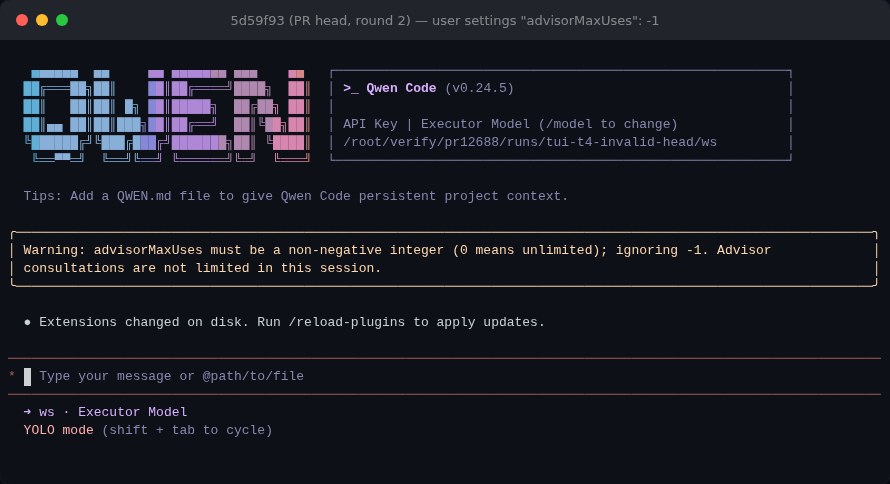
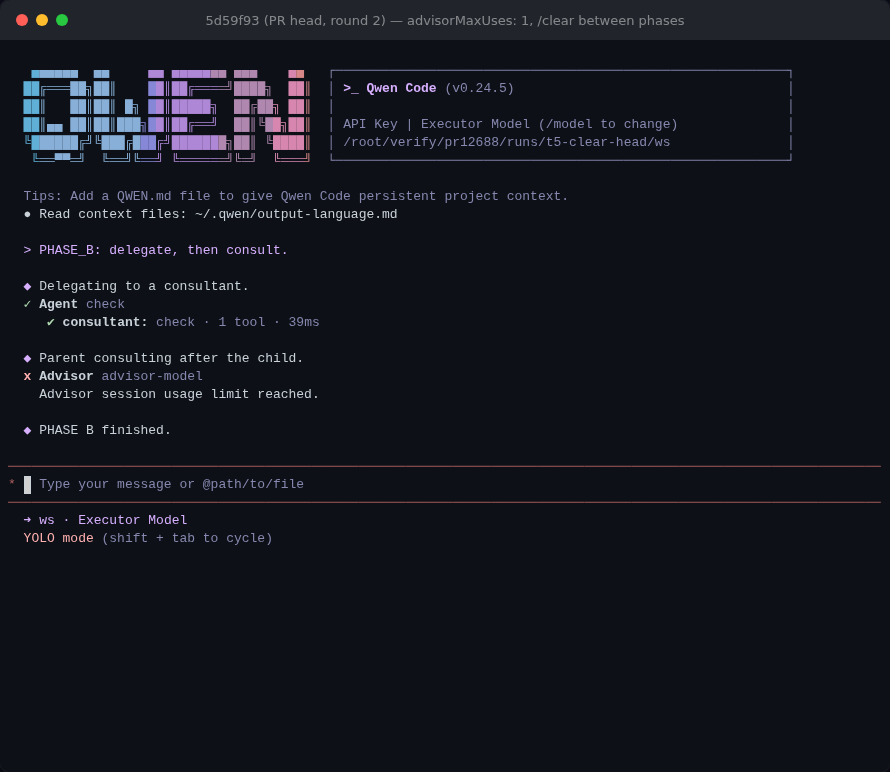

## Maintainer verification — round 2 at `5d59f93` (delta only)

**Verdict: mergeable.** The round-1 blocker is fixed, and I re-verified it on a fresh full build. Neither new commit introduces a regression. Round 1: [comment](https://github.com/QwenLM/qwen-code/pull/12688#issuecomment-5835014344).

### What changed since round 1 (`e3add752` → `5d59f93`)

- `62ff1afc` fixes F1. Its changed lines are identical to the patch I posted in round 1 (91/91).
- `5d59f93` covers triage note 2: `advisorUsage` is now `readonly` and is reset in place inside the existing `isSessionTransition` block. Between the old and new reset positions there are only `unregisterSessionModel` / `publishModelEnv` / `sessionData`, all under the same condition, so the normal path behaves the same.
- Reminder, tool, UI, docs and integration tests are unchanged since `3b49c69`, apart from the `e3add752` constant. The round-1 real-model results (§4) and observations (§6) therefore still apply; I did not re-run them.

### Re-verified on `5d59f93`

Fresh `pnpm install` + `npm run build` + `npm run bundle`, all exit 0; the bundle contains the new warning string.

| check | result |
| --- | --- |
| F1 startup matrix: user/system `-1`, `1.5`, `"5"`, and `-1` with Advisor off | all start and print `Warning: advisorMaxUses must be a non-negative integer …`. `null` and valid values start without the warning. The workspace value is still ignored with its own warning. Base is unchanged. |
| `qwen serve`, user `-1`, `POST /session` | **200** (round-1 head: 500 `agent channel closed during initialize`) |
| round-1 §2 runtime A/B (12 headless scenarios plus the `qwen serve` path) | identical to round 1 |
| **new:** real Ink TUI, cap 1, `/clear` between two phases | phase A: first consult ok, second refused. After `/clear`, the subagent's consult is allowed and the parent's next one is refused (a single shared, reset budget). 2 Advisor requests in total. Same on the old reset (`3b49c69` + patch) and the new in-place reset. |
| PR targeted unit tests | core 1360/1360, cli 487/487 |
| `integration-tests/cli/advisor-tool.test.ts` | 6/6 |
| PR CI on `5d59f93` | green; `web-shell E2E Smoke` was still running when I posted |

| `5d59f93`, user `"advisorMaxUses": -1` | `5d59f93`, `/clear` then subagent + parent consult |
| --- | --- |
|  |  |

### Mutation on the two new commits: 5/7 killed

| mutant | result |
| --- | --- |
| R2-M01 reassign the counter in `tryConsumeAdvisorUse` | killed by the derived-config test, **and rejected by `tsc` (`TS2540 … read-only`)**, so `readonly` is now enforced by the compiler |
| R2-M02 drop the in-place reset | killed (`resets the Advisor count when a new session starts`) |
| R2-M04 skip validation / R2-M05 accept negatives | killed (`falls back to unlimited …`) |
| R2-M06 never emit the settings warning | killed (`warns that an invalid advisorMaxUses …`) |
| R2-M03 reset outside the transition guard, so resuming the *current* session also resets the budget | **survives**; one assertion that `config.startNewSession(config.getSessionId())` keeps the count would pin it (optional) |
| R2-M07 also warn on an explicit `null` | survives (cosmetic) |

### Still open from round 1 (not blockers)

1. **`advisor-tool.test.ts` is still not in PR CI.** It passes 6/6 under the no-AK lane's own flags (`--poolOptions.forks.maxForks 2`), so this is a one-line change to `test:integration:no-ak:sandbox:none` ([diff](data/noak-suggestion.diff)): add `./cli/advisor-tool.test.ts` after `./cli/_prompt-latency-policy.test.ts`. It would put M03/M10/M16/M25 from round 1 under CI. Worth folding into this PR.
2. **No real-model run consulted before work (0/5).** That bears on whether #9036 can be closed later, not on this PR, which does not close it.
3. The per-turn reminder cost (319 tokens per turn) and the budget missing from interactive `/advisor`: I'm fine tracking these in the follow-up issue the scope ledger offers.

Evidence: [`pr-12688-round2/`](.)
