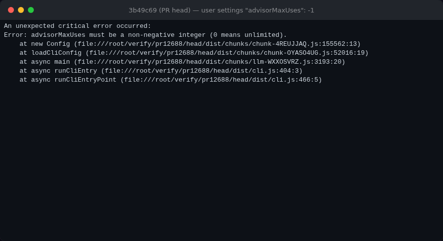
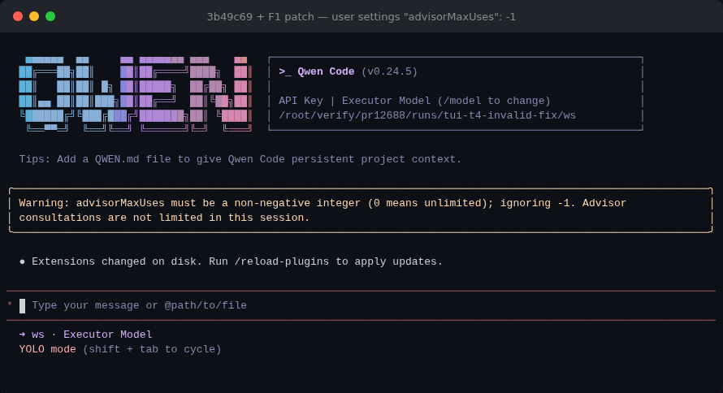
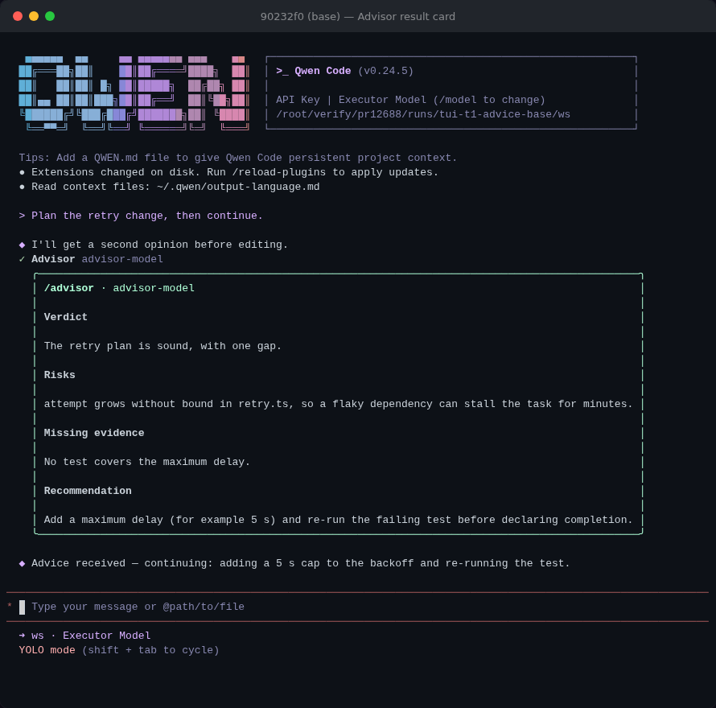
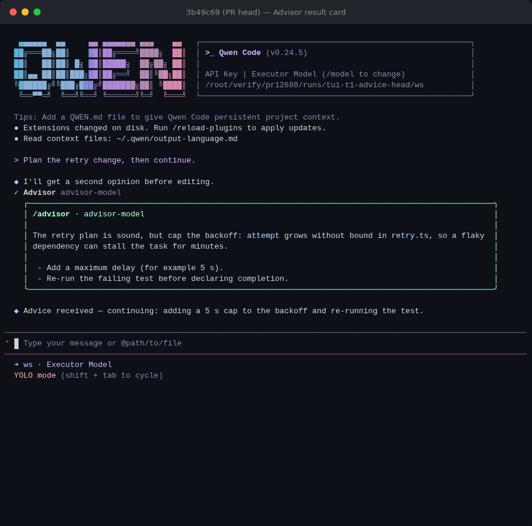
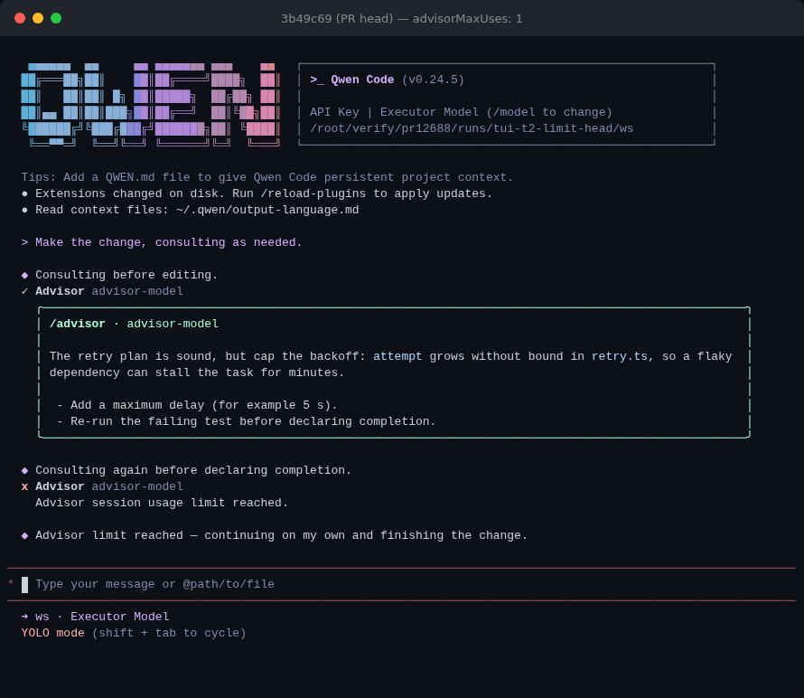

## Maintainer verification — PR #12688 at `3b49c69` (re-checked at `e3add752`)

The head moved to `e3add752` while I was verifying. It only swaps the `'advisor'` literal for `ToolNames.ADVISOR` in `client.ts`, which is behaviour-identical and resolves triage note 3. I rebuilt the new head and re-ran the startup matrix, the runtime scenarios in §2, the PR's integration test (6/6) and the core advisor/config tests (849/849): identical results. The patch below applies cleanly to `e3add752`.

**Verdict: mergeable after one small fix.** Triage finding 1 is real and worse than described. A hand-edited `advisorMaxUses` stops the CLI from starting even when Advisor is off. Under `qwen serve`, the same value makes every `POST /session` fail with an opaque 500. A verified +80/−11 patch is attached. Everything else I exercised behaves as the PR describes, against a real build, on both arms. That covers the shared cap across executor and subagent, synchronous reservation under parallel calls, the workspace restriction, subagent tool gating, the daemon path, free-text rendering, and exhaustion continuing the task. Two things for merge judgement: the PR's six CLI integration scenarios do not run in PR CI. And on real models the new reminder produced completion checks in 3/5 head runs, but no pre-work consultation in any of them (0/5).

### Setup

- **Arms.** Base `90232f0` (the #9636 merge, this PR's merge-base) and head `3b49c69`. Each got a fresh worktree, `pnpm install --frozen-lockfile`, a full `npm run build`, and `npm run bundle`, all exit 0. Linux x86_64, Node 22.22.2. The macOS/Windows/Linux table in the PR says Linux was not run locally; this report covers it.
- **Deterministic cases.** The real bundled `dist/cli.js` runs with an isolated `HOME`, a separate workspace directory, and the repo's `integration-tests/fake-openai-server.ts`. Both arms get the same scripted provider. In the TUI and daemon comparisons the fake Advisor answers through base's forced structured-output function, so base is not failed artificially. In the headless cap scenarios it answers in free text, so base shows `invalid structured output`; that does not affect the cap comparison.
- **TUI.** Real Ink sessions captured with the repo's `TerminalCapture` (node-pty → headless Chromium xterm.js).
- **Real models.** DashScope `qwen3.8-flash` / `qwen3.8-max`. The same task and prompt run on both arms, and the prompt never mentions Advisor.

### 1. Needs a fix — invalid `advisorMaxUses` stops the CLI, and under `qwen serve` every session

Same settings file on all three arms: `advisorModel` set, plus the value in the given scope. One-shot `-p` run:

| settings | base | head | head + patch |
| --- | --- | --- | --- |
| user `advisorMaxUses: 2` | ✅ runs | ✅ runs | ✅ runs |
| user `-1` / `1.5` / `"5"` | ✅ runs (key unknown) | ❌ **exit 1, 0 model requests** | ✅ runs + warning |
| system `-1` | ✅ | ❌ exit 1 | ✅ + warning |
| user `-1` with `advisorModel: "off"` | ✅ | ❌ **exit 1 — Advisor off still crashes** | ✅ + warning |
| workspace `-1` | ✅ | ✅ (already ignored + warned) | ✅ |
| user `null` | ✅ | ✅ | ✅ |
| control: `visionBridgeTimeoutMs: -1` | ✅ | ✅ (degrades) | ✅ |

Head prints `An unexpected critical error occurred: Error: advisorMaxUses must be a non-negative integer (0 means unlimited).` plus a stack from `new Config` ← `loadCliConfig`. The interactive TUI dies the same way (left). Under `qwen serve` the daemon boots, but `POST /session` returns **`500 {"error":"agent channel closed during initialize"}`**, which gives a Web Shell user no hint about which setting is wrong. With the patch it returns `200` with a session id.

| head `3b49c69` | head + patch |
| --- | --- |
|  |  |

**Patch** ([`f1-fix.patch`](f1-fix.patch), +80/−11, 4 files):

- Core falls back to `0` (unlimited) for an invalid value through an exported `isValidAdvisorMaxUses`, like the neighbouring `visionBridgeTimeoutMs`. So `tryConsumeAdvisorUse` still never sees a fractional or negative cap.
- `getSettingsWarnings` adds `Warning: advisorMaxUses must be a non-negative integer (0 means unlimited); ignoring -1. Advisor consultations are not limited in this session.` The user asked for a limit, so the fail-open is announced rather than silent.
- The PR's `rejects invalid Advisor limit` test becomes `falls back to unlimited for invalid Advisor limit` (now also covering `'5'`), and a settings-warning test is added.
- Two pinning tests cover the mutation gaps in §5: `0` means unlimited, and a new session resets the count.

Checks on the patch: core config Advisor tests 13/13, cli `settings.test.ts` 213/213, core and cli `tsc --noEmit` clean, eslint `--max-warnings 0` and prettier clean on the four files, and the startup matrix and serve probe above. Clamping to `0` follows triage's suggestion. If you would rather not fail open on a cost guard, keep the warning and pick a different fallback; the startup crash is the part that has to go.

### 2. Runtime A/B (same scripted provider on both arms)

| scenario | base `90232f0` | head `3b49c69` |
| --- | --- | --- |
| cap 1: executor consults, then a `tools: advisor` subagent consults | child: `Tool "advisor" not found` | child: `Advisor session usage limit reached.`, **1** Advisor request total, parent finishes |
| cap 2: same flow | child cannot consult | 2 requests; the child's request carries `CHILD_TASK` and **not** `PARENT_TASK`; 0 tools on the Advisor request |
| cap 1: two `advisor` calls in **one** model response | 2 requests, both `invalid structured output` (fake answers in free text) | **1** request; second result `usage limit reached` (reserved before the await) |
| user cap 1 + workspace `advisorMaxUses: 0` | no cap | 1 request, 2nd refused, workspace-ignored warning |
| workspace-only `advisorMaxUses: 1` | no cap (2 requests) | ignored: 2 requests allowed, warning |
| subagent `tools: read_file` tries `advisor` | not found | not found; no reminder; 0 requests |
| subagent with default tools | not found | advisor declared, reminder on first turn, 1 request |
| `permissions.deny: ["advisor"]` / `tools.disabled: ["advisor"]` | — | reminder suppressed (0 copies) |
| `-p "/advisor"` | `The command "/advisor" is not supported in this mode.` exit 1 | `Advisor: advisor-model` / `Session calls: 0 / 3` …, exit 0, 0 model requests |
| `qwen serve` session, cap 1, two prompts | two structured reviews, no cap | prompt 1 advice uses the session chat (does not fail closed); prompt 2 `usage limit reached`; 1 request |
| `qwen serve`, two `sessionScope: "thread"` sessions, cap 1 each | — | each session consults once: per-session, as documented |

The PR's own `integration-tests/cli/advisor-tool.test.ts` passes 6/6 locally on head. Its targeted unit files pass: core 1357/1357, cli 484/484, web-shell 85/85.

### 3. Terminal UI (real Ink)

The same advice goes through both arms. Base renders the mandatory four-field card; head renders the free text and the executor continues:

| base `90232f0` | head `3b49c69` |
| --- | --- |
|  |  |

Head, `advisorMaxUses: 1`: the second consultation fails without a request, keeps its `Advisor advisor-model` subtitle, and the executor finishes:

I could not reproduce the original header defect on base, in either the default or the `ui.useTerminalBuffer` render mode. With the Advisor request held open, both arms show `Executor Model` (`t3-header-*.png`). The header change therefore rests on the author's capture and `AppHeader.test.tsx`, which does kill a revert (M21). It is harmless either way.

### 4. Real-model sample — does the reminder change behaviour?

Task: a `duration.js` with 5/9 failing `node --test` cases and a `SPEC.md` contract. Prompt: *"Make the tests in this directory pass according to SPEC.md. Run `node --test` to check your work."* Advisor is on by default (base: declared directly; head: deferred, with the reminder). Every run's output was re-run independently (9/9), and the test file and spec were unchanged.

| executor / Advisor | base: consultations per run | head: consultations per run |
| --- | --- | --- |
| qwen3.8-flash / qwen3.8-max | 0, 0, 0 | 0, **1 (after the last edit, before the answer)**, 0 |
| qwen3.8-max / qwen3.8-max | 0, 0 | **1, 1 (both after the last edit, before the answer)** |

Across the 5 head runs the completion consultation happened 3 times (Max 2/2, Flash 1/3), each through `tool_search select:advisor` → `tool_call advisor`. The pre-work consultation the reminder asks for (*"consult before substantive work: writing or editing …"*) happened **0/5** times: every head run read the three files, ran the tests and edited before consulting. Base never consulted (0/5), although Advisor is declared directly there, so the reminder is what produces the completion check.

This is narrower than the author's final-head samples, where Max consulted before writing, and complements rather than contradicts them. On this task neither pairing consulted before its first edit, and the cheap-executor/strong-Advisor pairing (arguably the common one) consulted in only 1 of 3 runs. That is consistent with the design doc's "no guarantee that every model follows each checkpoint". Still, it is worth weighing before calling #9036's timing criterion met: in my runs the pre-work checkpoint was not reliable.

### 5. How much the tests actually pin

I ran 27 single-line mutants over the production changes, scored by the PR's own targeted unit tests (the ones CI runs): **19/27 killed**. Eight survive. Four of those are caught only by `integration-tests/cli/advisor-tool.test.ts`; I rebuilt the bundle for each:

| mutant | unit tests | CLI integration test |
| --- | --- | --- |
| M03 `0` no longer means unlimited (every default user's first call refused) | survives | killed (3 cases) |
| M10 Advisor not deferred | survives | killed |
| M16 executor never receives the reminder | survives | killed |
| M25 `advisorMaxUses` not threaded into Config | survives | killed |
| M02 no counter reset on a new session | survives | survives, killed by the patch's new test |
| M08 pre-aborted signal no longer throws; M13 subagent reminder on every turn; M14 subagent reminder ignores the allowlist | survive | not tested |

That file is not in PR CI. `Integration Tests (CLI, No Sandbox)` is merge-queue-only and shows `skipped` on this PR (the merge queue is off), and `test:integration:no-ak:sandbox:none` does not list `./cli/advisor-tool.test.ts`. The file needs no credentials, so adding it to that list would put M03/M10/M16/M25 under CI. Details: [`data/mutation-notes.md`](data/mutation-notes.md).

### 6. Non-blocking observations

- **Per-turn reminder cost.** The Advisor reminder is 1,762 chars, which the Qwen tokenizer on the real endpoint counts as **319 prompt tokens**. It is prepended to every UserQuery/Cron turn and stays in history, so after 6 user turns the 6th request carries 6 copies. A long session pays this linearly until compaction, and a consultation on turn 3 forwarded all 3 copies to the Advisor as part of the transcript. The design doc's tradeoff table doesn't mention it. Consider injecting once per enablement (as `lastInjectedDate` does for the date reminder), or at least list the cost as a deliberate difference.
- **Interactive `/advisor` shows no budget.** In the TUI a bare `/advisor` opens the model picker (`t2-picker-head.png`), which shows neither the count nor the limit. `Session calls: n / m` appears only in non-interactive and ACP modes.
- I agree with triage note 2 (`readonly` counter, reset inside the existing transition block); note 3 is fixed in `e3add752`.

Evidence (harness, raw JSON, patch, all screenshots): [`pr-12688/`](.)
