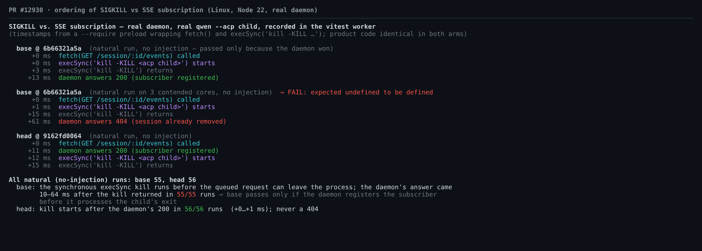
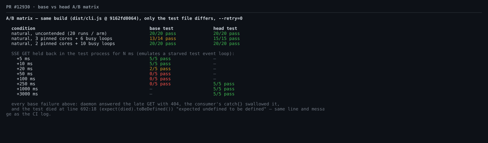
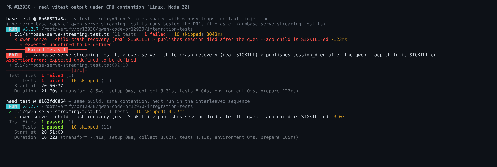
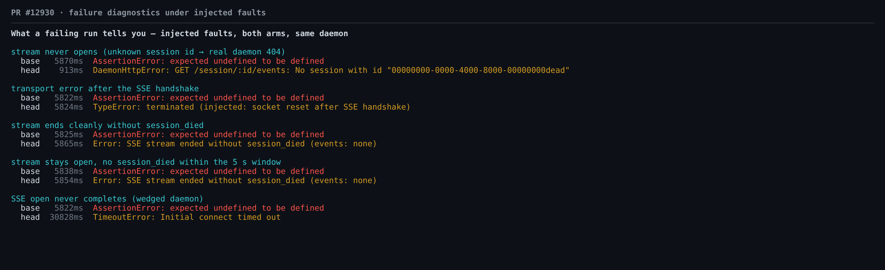

## 维护者验证:PR #12930 @ `9162fd0064`(第 1 轮)

**结论:可以合入。** 本 PR 只改测试,且做到了它声称的事:现在要等 daemon 接受 SSE 订阅之后才发送 SIGKILL。我在 base 测试上用两种方式复现了与 #12925 完全相同的失败形态,一种是自然复现(CPU 争用,无任何注入),一种是确定性复现。同样条件下 head 测试每次都通过。在 `main` 的 CI 历史中,336 个 macOS job 里该测试的第一次尝试失败了 24 次,几乎全被重试掩盖;时间特征与这个竞态吻合。另有一个可选的文案小建议(见下)。

### 测试方法

- 在 `9162fd0064` 新建 worktree(合并基为 `6b66321a5a`):`pnpm install --frozen-lockfile`、`npm run build`、`npm run bundle` 均 exit 0。Linux x64,Node 22.22.2。
- 真实 `qwen serve`(`dist/cli.js`)、真实 `qwen --acp` 子进程、真实 `kill -KILL`;模型侧使用该测试文件自带的 fake OpenAI server。
- **同一构建、两个测试臂。** head 是 PR 中的文件;base 是 `git show 6b66321a5a:integration-tests/cli/qwen-serve-streaming.test.ts`,另存在旁边,名为 `cli/armbase-serve-streaming.test.ts`。PR 的 diff 只有这一个文件,所以两臂下被测的 daemon、SDK、CLI 逐字节相同。CI 失败的提交 `1b46d63fb7a0` 上的整个测试文件也与合并基逐字节相同。
- **零改动插桩。** 通过 `NODE_OPTIONS=--require` 加载的预加载模块只在 vitest 的 fork worker 中生效,在 daemon 和 ACP 子进程中不做任何事。它为 `fetch(GET /session/:id/events)` 的调用、其响应以及 `execSync('kill -KILL …')` 打时间戳,也可按需注入故障。没有修改任何测试或产品文件。
- 所有 A/B 运行都用 `--retry=0`,除 5 次整文件运行外还都加了 `-t SIGKILL`。套件配置默认 `retry: 2`,CI 日志里的 `retry x2` 就是这么来的。

### 1. 竞态真实存在,并能精确复现 CI 失败



- **时序。** 在 base 里,kill 并不是在和请求赛跑,它总是先发生。`fetch()` 只是把 GET 排进队列,同步的 `execSync('kill -KILL …')` 在请求离开测试进程之前就已执行;一个独立探针(`harness/sync-write-probe.cjs`)证实,即使复用 keep-alive 连接也是如此。全部 55 次 base 自然运行中,daemon 的应答都在 kill 返回之后 10–64 ms 才到达。base 能通过,只是因为 daemon 先注册了订阅者、后处理子进程退出。全部 71 次 head 运行(56 次自然,15 次人为延迟 GET)中,kill 都在 `200` 之后 0–1 ms 才开始,daemon 从未返回 404。
- **自然复现,无注入。** 在 3 个绑定核心上与 6 个忙循环争用时,base 14 次中失败 1 次,head 15/15 通过。daemon 对迟到的 GET 返回 `404`,空的 `catch {}` 把它吞掉,vitest 在 `:692:18` 报 `AssertionError: expected undefined to be defined`。这与 run 36407829658 的 macOS 日志(job 108886128942:3 次尝试全败,25246 ms)是同一行、同一消息、同一条 `expect(died)` 语句。无争用时,以及在更重的 2 核/10 忙循环负载下,base 都是 20/20 通过,说明竞态窗口很窄。
- **确定性复现。** 在测试进程里人为延后 SSE GET:base 在 +5 ms 和 +10 ms 时 5/5 通过,+20 ms 时 2/5,+50、+100、+250 ms 时 0/5;head 在 +250、+1000、+3000 ms 时 15/15 通过。全部 19 次 base 失败(18 次延迟、1 次自然)走的都是同一条路径:daemon 返回 `404`,随后测试在 `:692:18` 失败。

关于归因的说明:任何收不到 `session_died` 的路径,base 都会打印同样的失败形态(见 §3),而 CI 日志里没有 daemon 侧的信息。所以 CI 上那次失败与这个竞态*吻合*,但不能*证明*就是它。





### 2. 它在 main 上出现得有多频繁

我扫描了 2026-09-15 → 2026-10-01 期间推送到 `main` 的全部 614 个运行中的 E2E job 日志(macOS 分片和 Linux `sandbox:none`),共 998 份,全部扫到。docker 腿没有计入,因为该套件在那里会自行跳过。

| 腿 | SIGKILL 测试运行次数 | 一次通过 | 重试后才通过 | 3 次全败 |
| :-- | --: | --: | --: | --: |
| macOS | 336 | 312 | 23(22 次 `retry x1`,1 次 `retry x2`) | 1(即 #12925 那次) |
| Linux `sandbox:none` | 318 | 318 | 0 | 0 |

macOS 上 336 个 job 中有 24 个(~7.1%)第一次尝试失败,几乎都被 `retry: 2` 吸收了。reporter 不会打印被重试那次尝试的错误。这些重试 job 的总耗时为 11.9–19.2 s,符合"一次 5 s `session_died` 轮询超时(`retry x2` 的那个 job 是两次)+ 一次正常尝试";macOS 一次通过的 p50 为 4.4 s、p90 为 6.9 s。如果失败出在 `pgrep` 或后面的断言,就不会有这 5 s 的等待。不过,轮询超时同样符合"daemon 处理退出超过 5 s"的情形,而本 PR 并不解决那种情况。如果这些重试确实是这个竞态,合入后它们应该消失;若仍有残留,现在会报出真实原因(§3)。

### 3. 失败诊断(D2-1 / R7-1 的后续)



| 注入故障 | base | head |
| :-- | :-- | :-- |
| 流从未打开(未知 session id → 真实 daemon 404) | 5.9 s,`expected undefined to be defined` | **0.9 s**,`DaemonHttpError: … No session with id "…"` |
| 握手后传输出错 | 5.8 s,同上 | `TypeError: terminated (…)`,给出真实原因 |
| 正常 EOF 但没有 `session_died` | 5.8 s,同上 | `SSE stream ended without session_died (events: none)` |
| 流保持打开但 5 s 内无事件 | 5.8 s,同上 | `SSE stream ended without session_died (events: none)`(见小建议) |
| SSE 建连始终不完成(daemon 卡死) | 5.8 s,同上(照样杀了子进程) | 30.8 s,`TimeoutError: Initial connect timed out`,未杀子进程 |

最后一行对 PR 的风险说明做一点小修正:建连卡死时,会在 SDK 的 30 s 建连超时(`DEFAULT_FETCH_TIMEOUT_MS`,由 `DaemonClient.subscribeEvents` 作为 `connectTimeoutMs` 传入)处以具名错误失败,不会一直等到 60 s 的测试超时。

### 4. 回归与门禁

- 整个文件(11 个测试):head 3 次运行全部通过,base 2 次全部通过。PR 自带的审查命令(`cd integration-tests && QWEN_SANDBOX=false npx vitest run cli/qwen-serve-streaming.test.ts`,默认 retry)11/11 通过,exit 0。
- 对该文件运行 `eslint --max-warnings 0` 和 `prettier --check` 均无问题;`tsc -p integration-tests/tsconfig.json --noEmit` exit 0。
- PR CI 只在 Linux 的 `Integration Tests (no-AK, No Sandbox)` 中跑了该文件,SIGKILL 测试 1430 ms 通过。PR 上根本不跑 macOS E2E,因为 `e2e.yml` 没有 `pull_request` 触发器;PR 上唯一的 macOS 检查(`Test (macos-latest, …)`)只跑单元测试,而且在本 PR 上被跳过了。所以这个改动要等合入后才会在 `main` 上首次跑 macOS,PR 描述里的 "macOS covered by CI" 只在合入后才成立。
- 保证的另一半同样成立:路由在 `flushHeaders()` 之前同步注册订阅者,所以 `onSseStreamAccepted` 被调用就意味着已注册。`EventBus.close()` 默认会 drain(调用 `queue.close()` 时没有 `drain: false`)。因此在 kill 之前注册的订阅者能收到 `session_died`,即使 `handleChannelExit` 在发布后立刻关闭了 bus。这与 head 71/71 的结果一致。

### 可选小建议(不阻塞)

`integration-tests/cli/qwen-serve-streaming.test.ts`:有两种情况会走到兜底错误。正常 EOF 时,"SSE stream ended" 是准确的。流保持打开但一直没有事件时就不准确了:此时 daemon 迟迟没有处理退出,是测试自己在 5 s 后 abort 了流(上表"5 s 内无事件"一行)。代码注释里已经写了 "ended (or stayed silent)"。下面的文案可以同时覆盖两种情况:

```ts
new Error(`no session_died on the SSE stream within 5s of SIGKILL (events: ${events})`)
```

若想保留两者的区别,可以记录 `consumer` 是否在 `ac.abort()` 之前就已结束,据此写 "ended" 或 "stayed open"。另外,当 consumer 已经结束(传输出错或正常 EOF)时,轮询仍会等满 5 s。让轮询与 `consumer` 竞速可以省掉这段时间,不过这只影响失败的运行要多久才结束。

### 未验证

- 本地 macOS(手边没有 Mac)。修复与平台无关。
- 在 Linux 上自然复现的概率很低:base 在争用条件下 34 次中失败 1 次。真正把机制钉死的是确定性的延迟扫描。

证据:本目录下的 `harness/`(脚本,见 `harness/README.md`)和 `data/`(逐次原始结果、时间线、CI 扫描)。
