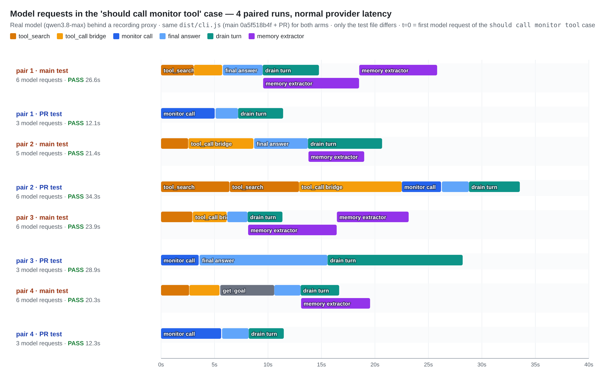
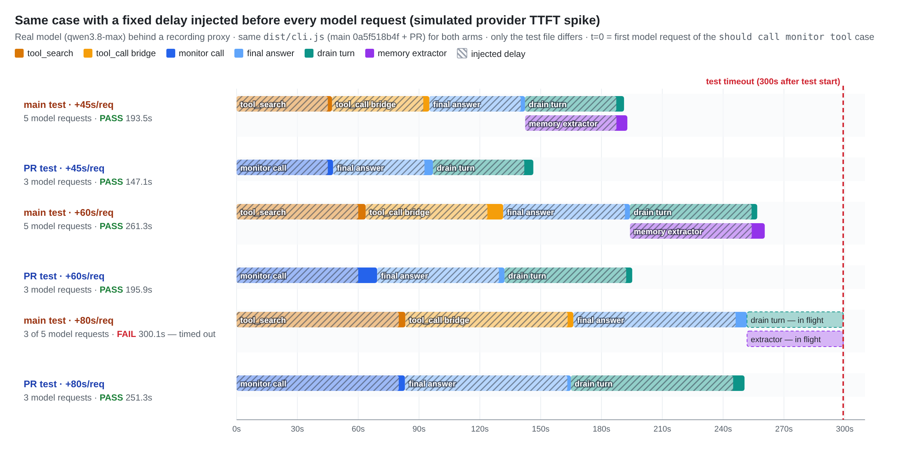
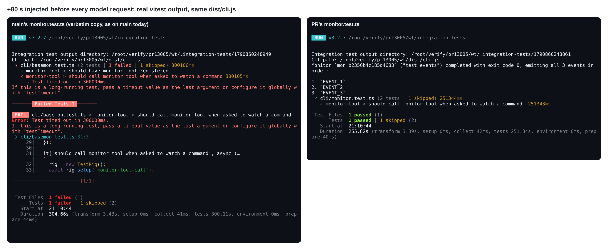
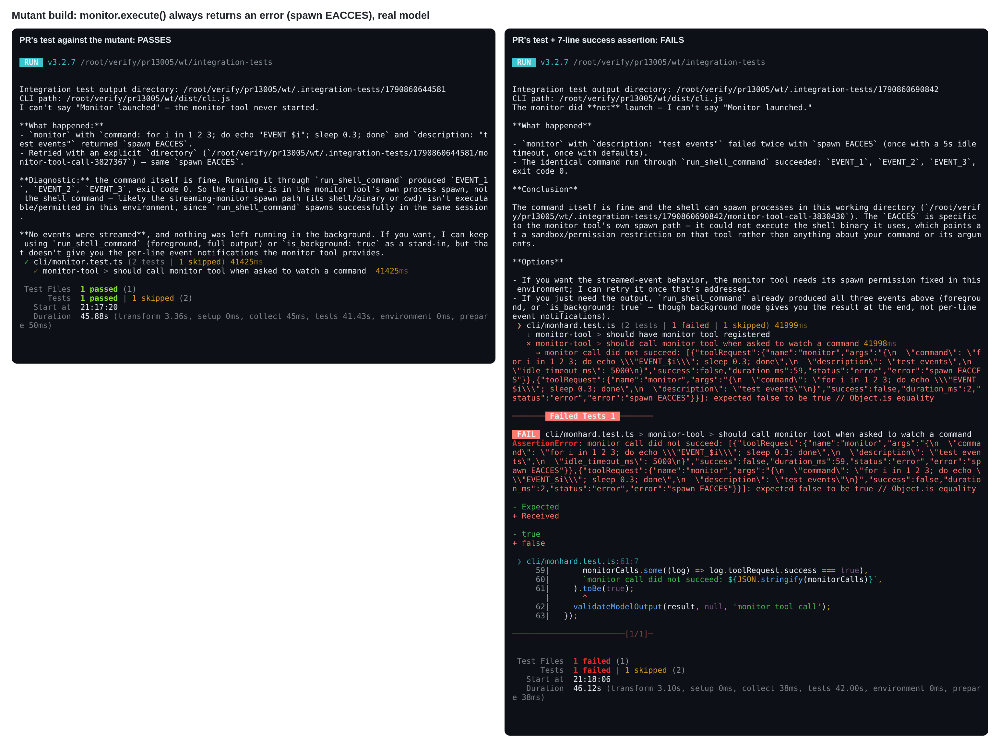

## Maintainer verification: real-model A/B of #13005 at `42423a6562`

**Verdict: ready to merge.** Against a real model the PR's test passed all 8 runs. It takes the `tool_search` → `tool_call` bridge round trip and the managed-memory extractor off this case's critical path (main's test: 4 serial model requests; PR's test: 3). Under an injected +80 s/request provider stall, main's test times out at 300 s and the PR's passes in 251 s. Before squashing, one stale sentence in the PR description should be fixed (F1). One assertion gap that predates this PR is worth a 7-line follow-up (F3, optional).

### Setup

- **Tree:** current `main` (`0a5f518b4f`) with the PR head merged in locally. The merge was clean, and the only diff against main is `integration-tests/cli/monitor.test.ts` (+10/−4). I did one full build and bundle, so **both arms run the same `dist/cli.js`**. The only difference between them is the test file: main's `monitor.test.ts` copied verbatim versus the PR's.
- **Model:** `qwen3.8-max` on an OpenAI-compatible DashScope endpoint, with the same env as the E2E Linux `sandbox:none` leg (`QWEN_SANDBOX=false CI=true KEEP_OUTPUT=true VERBOSE=true OPENAI_*`) and an empty hermetic `QWEN_HOME`. I ran `--retry=0` so every attempt is visible; CI runs `retry: 2`.
- **Recording proxy:** a reverse proxy between the CLI and the endpoint. It logs one line per model request (purpose, declared tools, returned tool calls, TTFT) and can hold each request for a fixed delay before forwarding it. I cross-checked its counts against every run's `telemetry.log`.
- **Scale:** 19 CLI runs, 100 real model requests.

### 1. Normal latency: 5 runs per arm, paired in the same provider window



| `should call monitor tool` case | main's test | PR's test |
|---|---|---|
| result | 5/5 pass | 5/5 pass |
| model requests | 5–6 | 3 in 4 runs; 6 in 1 run (F2) |
| `monitor` declared in request 1 | no: reached via `tool_search` → `tool_call` bridge | yes |
| memory-extractor requests | 1–2 in every run | 0 |
| duration | 20.3–26.6 s (median 23.9 s) | 12.1–34.3 s (median 19.8 s) |

At normal latency the wall-clock difference is within provider noise (one PR run was slow purely on generation time). The structural difference is the request count.

### 2. Simulated provider stall: fixed delay before every request



| delay per request | main's test | PR's test |
|---|---|---|
| +45 s (≈ the 44.7 s TTFT in the PR body) | ✅ 193.5 s | ✅ 147.1 s |
| +60 s | ✅ 261.3 s | ✅ 195.9 s |
| +80 s | ❌ `Test timed out in 300000ms`, with the drain turn and the extractor still in flight (telemetry: 5 `api_request`, 3 `api_response`) | ✅ 251.3 s |



The extractor starts when the main turn ends and runs in parallel with the drain turn. That leaves main's test with 4 serial requests (`tool_search` → bridge → final answer → drain ∥ extractor) and the PR's with 3. The per-request latency at which the 300 s budget breaks therefore moves from about 70 s to about 95 s. A run that is already slow finishes one full request sooner: 46 s sooner at +45 s, 65 s sooner at +60 s.

### 3. Other checks

- **Wire probe** (capture-only fake server, deterministic): with the PR's settings, request 1 declares 15 tools including `monitor` (main: 14), `monitor` is gone from the deferred-tools reminder, and no extractor request follows. Both `tools.visible` and `memory.enableManagedAutoMemory: false` do what the PR says.
- **Static:** `eslint --max-warnings 0`, `prettier --check`, and `tsc --noEmit -p integration-tests` all exit 0.
- **main CI after #13002** (E2E workflow on `main`, sample of 43 job logs from 22 runs, 2026-09-30 04:21Z → 2026-10-01 09:29Z): `should call monitor tool` passed every time with no retries. Max duration was 138.7 s on `sandbox:docker` (p50 73.7 s), 122.0 s on macOS, and 62.7 s on `sandbox:none`. So the test is not red on main today; #13002's 180 s / 300 s budgets absorbed the flake. This PR buys headroom, shorter runs and fewer billed requests rather than fixing a currently failing test, and that is still worth merging. The extra headroom matters most on the docker leg, where this case already reaches 138.7 s.

### Findings

**F1: the PR description is stale. Fix it before squashing.**
- "raises the budget to a 180s test timeout with an explicit 120s waitForToolCall" describes the branch before autofix round 1 merged main. The current diff changes no timeout: it keeps main's `waitForToolCall('monitor', 180_000)` and the 300 s config default, which is the right outcome per the triage review.
- "five sequential model requests" is also slightly off. The extractor overlaps the drain turn, so main's path is 4 serial requests. It is 5 only when the extractor needs a second round, which happened in 2 of 5 normal-latency runs.

**F2: "three model calls" is the typical case, not a guarantee. No action needed.**
- `tools.visible` makes discovery unnecessary but does not forbid it. In 1 of 9 real runs with the PR's settings, the model still searched: the `monitor` keyword, then a keyword phrase, then `select:monitor`.
- It then tried the `tool_call` bridge and got `[tool_call bridge refused] Tool "monitor" is already visible to the model or is not deferred. Call it directly instead of using tool_call.` After that it called `monitor` directly.
- That run took 6 requests and 34.3 s, and still passed. The wire probe shows this is a model choice, not a leak in the setting. The bridge's refusal path also worked correctly here.

**F3: the test accepts a monitor that fails at runtime. This predates the PR; the fix is an optional follow-up.**
- The PR body says "a regression in monitor tool behavior still fails the test". That is only partly true.
- I built a mutant whose `monitor.execute()` always returns an error (`spawn EACCES`). The PR's test **passes** against it (41.4 s), and the model itself replies "the monitor tool never started".
- Why it passes: `waitForToolCall` matches on the tool name only (the telemetry record carries `success: false`), and `validateModelOutput` only requires non-empty output. main has the same assertions, so the PR did not introduce this.
- Adding the snippet below after `expect(foundMonitor).toBeTruthy()` kills the mutant and still passes on a clean real run (14.0 s):

```ts
// A logged call is not a working tool: also require that it succeeded.
const monitorCalls = rig
  .readToolLogs()
  .filter((log) => log.toolRequest.name === 'monitor');
expect(
  monitorCalls.some((log) => log.toolRequest.success === true),
  `monitor call did not succeed: ${JSON.stringify(monitorCalls)}`,
).toBe(true);
```



**F4: loss of bridge coverage (the triage's judgement call) is acceptable.**
- main's test really did reach `monitor` through `tool_search` + `tool_call` (telemetry logs the inner tool name). The PR's test no longer does.
- What remains: the sibling case `should have monitor tool registered` still runs with `monitor` deferred. `monitor` was undeclared in all 8 runs of that case, and the model called `tool_search` for it in 6 of 8.
- `cli/tool-search.test.ts` also keeps real-model coverage of the generic bridge (`select:` → invoke, keyword search, flag off).
- The bridge is generic, so giving up the monitor-specific path is a fair trade for a test that stops flaking.

**F5: the extractor and the sibling case (observation only).**
- The managed-memory extractor fires even on a turn with no tool activity. I saw this in the sibling case in both arms and on the fake server. That settles the question review 5364331497 left open.
- The sibling case keeps its extractor. It is short (11.7–19.1 s locally, max 127.4 s on main CI) and well inside the 300 s default, so no change is needed.

<details>
<summary>Evidence and reproduction</summary>

- Images, per-run proxy logs and vitest output, the telemetry-derived summary, the CI census and the harness: this directory
- `harness/run-arm.sh <base|pr|hard> <inject_ms> <run_id> ["should call monitor tool"]` runs one arm. It needs an OpenAI-compatible endpoint in `UPSTREAM` and its key in `UPSTREAM_KEY`. `MUT_SHIM=<dir with a qwen shim>` points the rig at a mutant bundle through `INTEGRATION_TEST_USE_INSTALLED_GEMINI`.
- Mutant M2 is a one-line edit to the bundled `monitor` chunk: `async execute(_signal){` → `async execute(_signal){return{llmContent:"Error: monitor failed to start: spawn EACCES",returnDisplay:"Monitor failed to start.",error:{message:"spawn EACCES"}};`
- Real-model usage for the whole verification: 100 requests, about 1.95 M prompt tokens.

</details>
