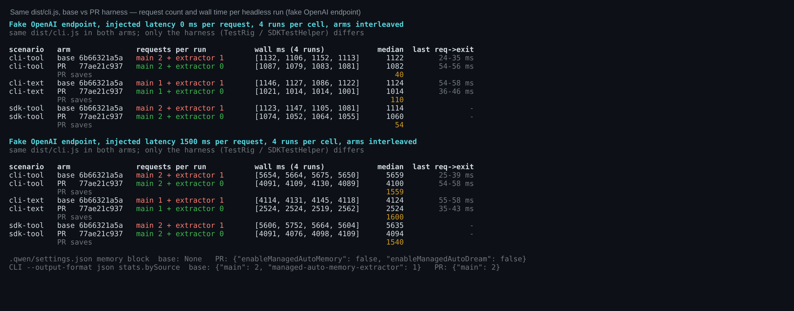
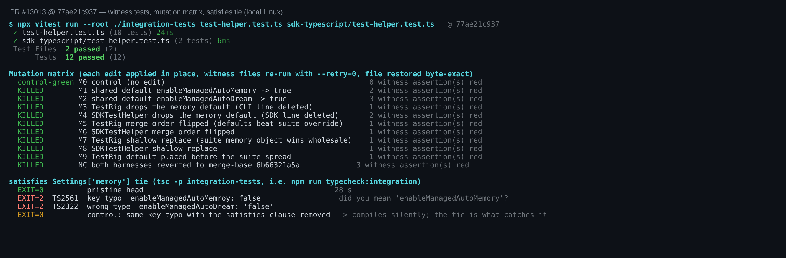
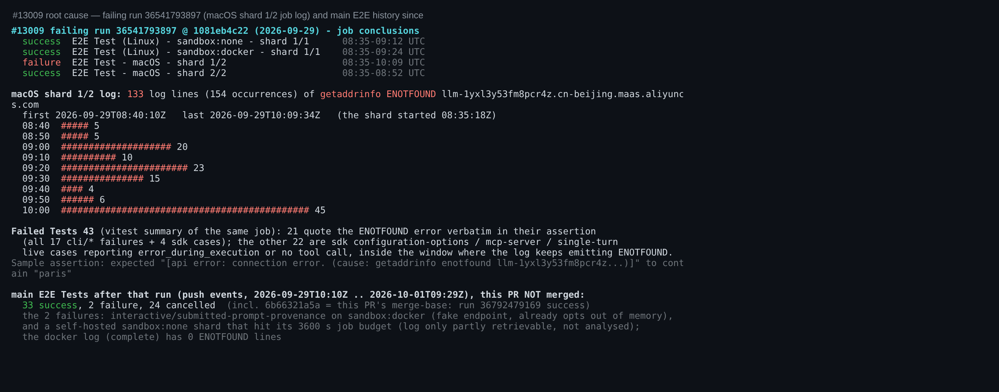
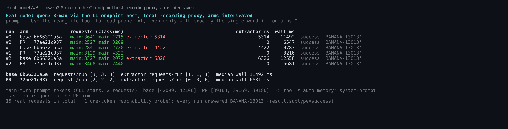
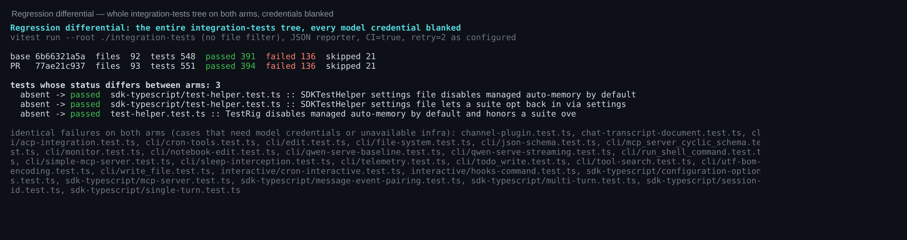
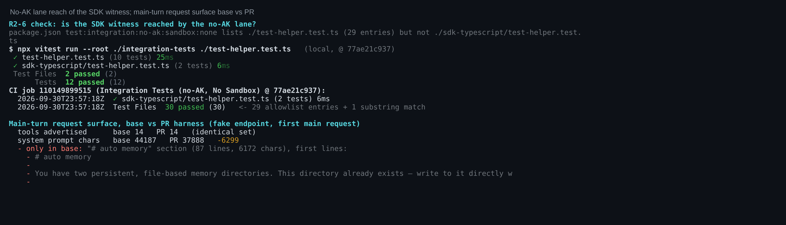

## Maintainer verification: PR #13013 @ `77ae21c937`

**Verdict: the harness change is correct and does what it says. It is mergeable as a test-infrastructure improvement once `Fixes #13009` becomes `Refs #13009`.** Every behavioural claim in the PR body reproduced on a fresh local build, including the "~5 s per run" figure, which I re-measured against the real model. The failure the PR says it fixes (#13009) was a DNS outage on one macOS runner, and this change cannot affect DNS. Merging as-is would auto-close that tracker on the wrong root cause. That is the standing R1-1, which I have now re-derived from the raw job log.

**Environment.** Linux 6.12 x86_64, Node 22.22.2, pnpm 11.24.0. Fresh `pnpm install --frozen-lockfile`, `npm run build` and `npm run bundle` at `77ae21c937` (all exit 0, 334 s). Two arms share that one build through hard links:
- **PR**: the head.
- **base**: the merge-base `6b66321a5a`, i.e. the main commit last merged into the head. It is a real git worktree, and its only diff from the PR arm is the five `integration-tests/` files this PR touches.

So every difference below comes from the harness change alone. The CLI binary is byte-identical in both arms.

| # | Check | Result |
|---|---|---|
| 1 | New witness tests at head | ✅ 12/12 across both files |
| 2 | Mutation matrix: 9 mutants of the two harnesses and the shared constant, plus a negative control (both harnesses reverted to base) | ✅ 10/10 killed, control green, files restored byte-exact |
| 3 | `satisfies Settings['memory']` tie (`tsc -p integration-tests`) | ✅ a key typo fails with TS2561 and a wrong value type with TS2322. Control: with `satisfies` removed, the same typo compiles silently (exit 0) |
| 4 | Request count: real `dist/cli.js` against a fake endpoint, base vs PR harness | ✅ CLI tool turn 3 → 2, CLI text turn 2 → 1, SDK tool turn 3 → 2. The one request removed is `managed-auto-memory-extractor`, which also drops out of `stats.bySource` |
| 5 | Is the extractor on the exit path? 1500 ms injected latency, 4 interleaved runs per cell | ✅ yes. The PR saves 1540–1600 ms on all three paths, which is one round trip. In base the extractor is the last request, and the process exits 25–58 ms after it returns |
| 6 | Real model (`qwen3.8-max` on the CI endpoint host, recording proxy), 3 interleaved runs per arm | ✅ base makes 3 requests per run (extractor 4.4–6.3 s), PR makes 2. Median wall time 11.5 s → 6.7 s, so the PR's "~5 s" claim holds |
| 7 | Regression differential: the whole `integration-tests` tree on both arms, all credentials blanked | ✅ the only difference is the 3 new witness tests (absent → passed). The 136 failures are the same set on both arms, all cases that need model credentials or infrastructure this box lacks |
| 8 | Does the no-AK lane reach the SDK witness? (R2-6) | ✅ yes: `./test-helper.test.ts` is a substring filter. CI job 110149899515 ran `sdk-typescript/test-helper.test.ts (2 tests)`, and the same happens locally |
| 9 | Does this fix #13009? (R1-1) | ❌ no: a DNS `ENOTFOUND` outage on one macOS shard. See finding 1 |

### Findings

**1. Change `Fixes #13009` to `Refs #13009` before merging (PR metadata).** I re-derived this from the raw job log rather than from the issue thread.
- The only failing job in run 36541793897 is macOS shard 1/2.
- Its log has 154 `getaddrinfo ENOTFOUND llm-1yxl3y53fm8pcr4z.cn-beijing.maas.aliyuncs.com` occurrences. The first is at 08:40:10Z, five minutes after the shard started; the last is at 10:09:34Z, when the shard ended.
- 21 of the 43 failing tests quote that error verbatim in their assertion. The other 22 are live SDK cases in the same window that ended in `error_during_execution` or never made the expected tool call.
- The same commit passed Linux none, Linux docker and macOS shard 2/2 with the extractor fully on.
- Since then, main's `E2E Tests` went green 33 times without this change, including at this PR's merge-base `6b66321a5a` (run 36792479169).

Nothing in this diff touches name resolution, so `Fixes` would close #13009 on a cause it never had. The latency rationale holds without #13009 (rows 5–6). Suggested edits:
- Use `Refs #13009` in both the English "Linked Issues" section and the Chinese "关联 Issue" section.
- Turn the "the failing run was the first to pay it in full" paragraph into a statement of motivation.

The `(#13009)` suffix in the title does not trigger auto-close.

**2. A coverage trade-off is missing from Risk & Scope (non-blocking).** Turning managed memory off removes more than the background request. The whole `# auto memory` system-prompt section disappears from every main turn: 87 lines, 6,172 chars, about 2.9k real prompt tokens per main request (42.1k → 39.2k). The tool list does not change (14 tools in both arms). As a result, after this PR no live E2E main turn runs against the production-default system prompt. That is probably the right trade for E2E stability, but the PR should say so. It is also an argument for keeping at least one live smoke run on defaults, since the opt-in path has no users today.

**3. R2-6 does not hold.** The SDK witness does run at PR time, because vitest file filters match substrings (CI evidence and a local repro are in figure 6). Optional hardening: list `./sdk-typescript/test-helper.test.ts` explicitly so coverage doesn't depend on substring matching.

**4. Deferred review items, checked.**
- (a) The user-tier `memory` block in `interactive/workflow-completion.test.ts`: workspace precedence makes it redundant. It sets the same `false`/`false`, so behaviour is unchanged, and the suite passes 6/6 on both arms.
- (b) The new defaults only reach `TestRig` and `SDKTestHelper`. `cli/_daemon-harness.ts`, `qwen-live-harness.ts` and `helpers/hosted-harness-process.ts` write their own settings and still start with managed memory on. That is a reasonable follow-up, not a blocker.
- (c) `SDKTestHelper` with `createQwenConfig: false` writes no settings file, so it gets no default. No suite uses that option today.

### Figures

1. Request count and wall time per headless run, base vs PR harness (fake endpoint)

2. Witness tests, mutation matrix, the <code>satisfies</code> tie

3. #13009 root cause from the job log, and main E2E history since then

4. Real-model A/B (qwen3.8-max on the CI endpoint host)

5. Regression differential over the whole integration-tests tree

6. No-AK lane reach of the SDK witness; main-turn request surface

**Not verified:** macOS, Windows, the `sandbox:docker` leg, and the daemon, qwen-live and hosted harness paths.

**Measurement note:** in one fake-endpoint round I ran the arms back to back while the machine's load average was around 10, and the PR arm looked about 1.4 s *slower*. Re-running with the arms interleaved at load 2–4 made that gap disappear, and figure 1 uses only interleaved data. If you re-measure, interleave the arms.

Harnesses, raw data (JSONL/TSV) and the report as Markdown: this directory
