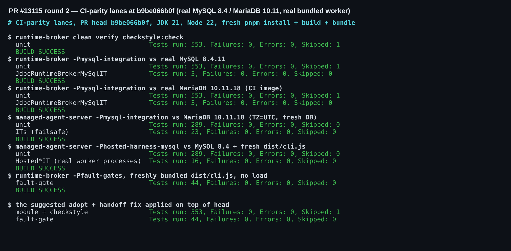
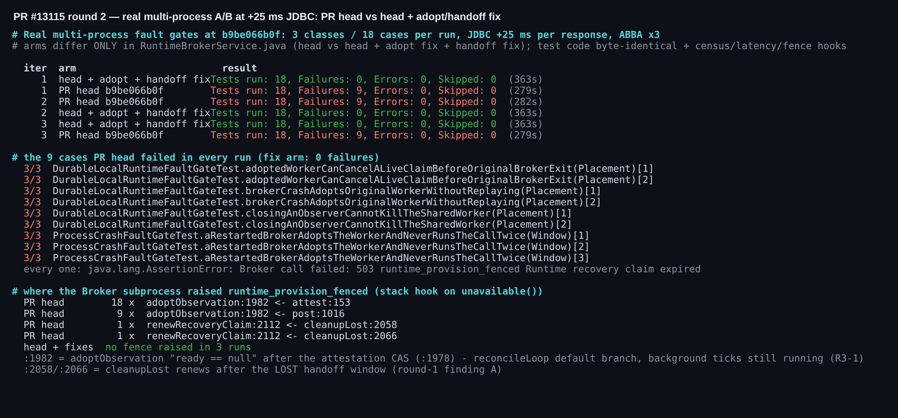
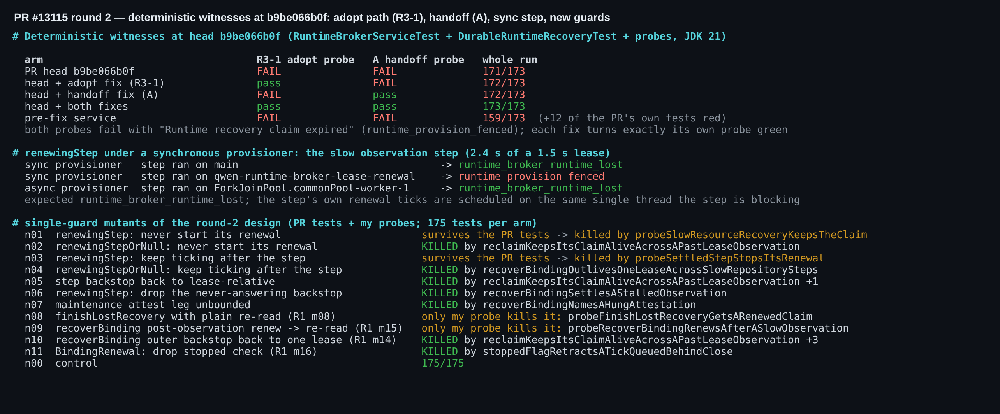

## 维护者验证第二轮 —— PR #13115 @ `b9be066b0f`（相对第一轮 5920689267 的增量）

**结论：只要正文还写着 `Fixes #13017`，就先别合入；补约 15 行即可合入。**

reclaim 路径的工作扎实，`renewingStep` 重构也关闭了我第一轮的 B。但 adopt 路径（`/review` 与 triage stage 3 提出的 R3-1，在本 head 上仍无回应）才是慢 JDBC 下失败的那条路径。在 +25 ms 的真实多进程 rig 中：
- 本 head **每一轮**都在 18 个 fault-gate 用例中失败**同样的 9 个**。3 轮共 27 次失败全部是 `503 runtime_provision_fenced`，抛出点都是 `adoptObservation` 的 attestation CAS（`RuntimeBrokerService.java:1982`）。
- 加上 adopt 路径修复和我第一轮的发现 A 后，同一 rig **每轮 18/18 通过，且一次 fence 都没有**。

这 9 个用例里包括 `closingAnObserverCannotKillTheSharedWorker`，也就是 #13017 最近一次被记录的 CI 失败所在的 gate。因此按现状合入会关闭 #13017，而它最近一次发生的那条路径仍然开着。要么并入下面已验证过的补丁（模块 553 + checkstyle、fault gates 44/44），要么去掉关闭关键字。

### 自第一轮以来的变化（均在本 head 上验证）
- **第一轮 B / R1-2 在 provisioner 步骤上已关闭。** 每个步骤现在都在自己的 `BindingRenewal` 下运行，永不应答的兜底为 2× lease（生产 60 s），容得下被调用方 30 s 的等待。维护路径的 attestation 段仍是按 lease 计算的 20 s 上限，作者已在 5924867667 中记录。
- **第一轮的 m14、m16 现在已被 PR 自带测试钉住**（`recoverBindingOutlivesOneLease…`、`stoppedFlagRetractsATickQueuedBehindClose`）。
- **CI 同款通道全部通过**（新打包的 `dist/cli.js`，图 3）。CI 在本 head 上也是全绿。

### 1. R3-1 已确认：慢 JDBC 下的 flake 就是 adopt 路径（对 `Fixes #13017` 构成阻塞）

`reconcileLoop` 的 `default:` 分支（`:1903`）在调用 `adoptObservation` 时，循环的后台续约仍在跑。`adoptObservation` 随后先 `findById`（`:1970`），再做 attestation CAS（`:1978`），中间没有内联续约。一次 tick 落在两者之间就会改掉记录的版本或 lease，CAS 返回 null，调用方收到 `runtime_provision_fenced`。LOST 分支已经用 `renewal.close()` + 内联续约规避了完全相同的问题。

- **确定性见证。** [`probeAdoptCasSurvivesARenewalTickInItsWindow`](./harness/probes-adopt-and-handoff-DurableRuntimeRecoveryTest.diff) 让 attestation CAS 等待，直到一次**真实的**续约线程 tick 落入（3 s lease 下最多等 1.5 s）。已停止的续约不会到来，所以这个探针只在 tick 仍存活时失败。它在 head 上以 `Runtime recovery claim expired` 失败，加修复后通过（图 1）。
- **真实 rig。** 在每个 JDBC 响应 +25 ms 下对全部 18 个用例做了 3 轮 ABBA（图 2）：
  - head：54 个中失败 27 个，每次都是同样的 9 个，全部在 `:1982`；
  - head + 修复：0/54 失败，0 次 fence。

  第一轮我把这些接管类 gate 的失败归到"第二种机制"；fence 位置钩子现在表明，它们就是这个 CAS。
- **修复**（[`suggested-fix-adopt-and-handoff.diff`](./harness/suggested-fix-adopt-and-handoff.diff)，+15/−2）：
  - 把循环的 `BindingRenewal` 传进 `adoptObservation`；
  - attestation 返回后调用 `close()`（它是 `synchronized`，会等待正在执行的 tick 结束）；
  - 然后 `renewRecoveryClaim`，在续约后的快照上做 CAS。

  attestation 本身仍在 tick 保护下运行，慢 attest 不会让 claim 过期。`recoverBinding` 这个调用方传 `null`：它没有需要停止的循环续约，CAS 前多出的一次内联续约对它无害。

### 2. 第一轮的发现 A 仍未修复（同一补丁，一行）

LOST 分支在 `:1882` 续约一次，这一次续约随后要撑过写证据的 CAS（`:1884`）、`reclaimLostBindingNow` 的 `claimOperation`（`:2022`，同 owner 时为空操作、不延长 lease），以及 `cleanupLost` 的首个 `recoverLost`（`:2043-2044`，仍使用未续约的 `claimed`）。真实 rig 在本 head 上再次捕获到它（图 2 中的 `cleanupLost:2058/:2066`）。移植后的探针在 head 上红，在 `:2044` 改用 `renewRecoveryClaim(claimed)` 后绿。每个修复只让它自己的探针变绿，两处一起修复后 173/173（图 1）。

### 3. 对重构的非阻塞建议

- **新 SPI 承诺依赖调用线程。** `RuntimeProvisioner.java:56` 现在写着 broker 会"在调用期间持续续约 recovery claim"。但 `renewingStep` 的 tick 跑在单线程的 `qwen-runtime-broker-lease-renewal` 调度器上（`:3305`），而 `reconcileLoop` 的重试也被调度到这个线程（`:1846`）。所以，如果一个**同步**实现的 provisioner 的慢步骤是从重试迭代进入的，它会阻塞自己的续约。
  - 探针：同样是 1.5 s lease 上耗时 2.4 s 的观测，在调用方线程上或用异步 provisioner 时得到 `runtime_lost`，在续约线程上却得到 **`runtime_provision_fenced`**（图 1；[补丁](./harness/probes-sync-step-on-renewal-scheduler.diff)）。
  - 内置 provisioner 不受影响：LocalProcess 是异步的，`WorkspaceRuntimeProvisioner.recoverResources` 是短暂的同步 JDBC 事务。
  - 建议要么给 javadoc 加限定（"实现不得阻塞调用线程"），要么把步骤调度到调度器之外执行。与 R3-4 相关。
- **重构引入的两个守卫没有被钉住。** 有两个变异能通过 PR 全部 171 个测试：
  - n01：`renewingStep` 从不启动续约（`recoverResources` 段与 `recoverBinding` 的 reconcile 段）；
  - n03：步骤结束后续约继续 tick。

  `probeSlowResourceRecoveryKeepsTheClaim` 与 `probeSettledStepStopsItsRenewal` 各自只杀死其中一个，在 head 上都是绿的。第一轮的 m08、m15 仍然只能被我第一轮的探针（已移植）杀死（[补丁](./harness/probes-guards-RuntimeBrokerServiceTest.diff)）。
- **C、D 未变。**
  - 重试谓词仍会在 reclaim 类 gate 上吸收 `runtime_provision_fenced`。
  - 这 9 个 adopt 路径失败走的是 `requireOk()`，不带任何 broker 日志。有 16 处会抛出 `runtime_provision_fenced`，其中 11 处消息完全相同。`:1982` 是靠我的 fence 位置调用栈钩子定位出来的。

### 未验证
- macOS / Windows。
- 真实负载下的生产 lease（30 s）。A/B 用的是 rig 的 2 s lease 加注入的 JDBC 延迟。
- adopt 修复能否同时消除 #13017 中报告的纯 CPU 负载 flake。第一轮在本机上单纯的 CPU 争用复现不了这些 flake。

证据（截图、探针/修复补丁、普查与 fence 位置 TSV、变异矩阵）：[`wenshao/qwen-code@asserts/pr-13115-round2`](./)
