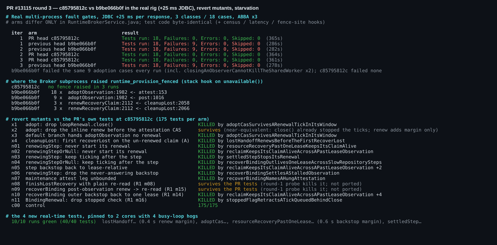
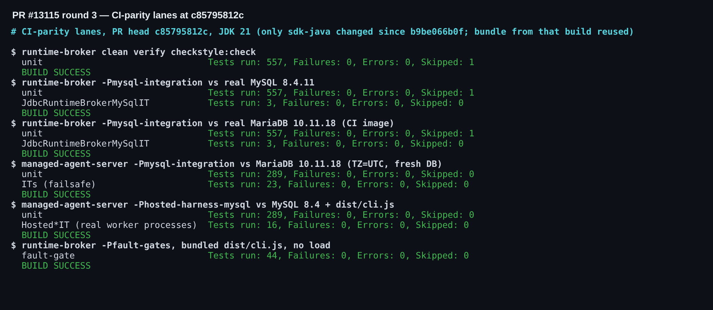

## 维护者验证第三轮 —— PR #13115 @ `c85795812c`（相对第二轮 5926436515 的增量）

**结论：可以合入。** 第二轮的阻塞项已按建议原样修复：本 head 的 `RuntimeBrokerService.java` 与我上一轮验证过的修复臂逐字节一致。修复在真实 rig 中也成立。在 JDBC +25 ms、对全部 18 个 fault-gate 用例做的 3 轮 ABBA 中：
- **本 head 54/54 通过，调用栈钩子一次 fence 都没有捕获到**；
- 上一版 `b9be066b0f` 再次失败 27/54，每轮都是同样的 9 个接管类用例，全部失败在 `adoptObservation:1982`。

`Fixes #13017` 现在覆盖了我能复现的两条路径：reclaim 交接和 adopt CAS。

### 本 head 上执行了什么

| 检查项 | 结果 |
|---|---|
| CI 同款通道（自 `b9be066b0f` 以来只改了 sdk-java，复用那次构建的 bundle） | ✅ 模块 557 + checkstyle · MySQL 8.4 与 MariaDB 10.11 上 `JdbcRuntimeBrokerMySqlIT` 各 3/3 · MAS 289 + 23 IT · hosted harness 289 + 16 Hosted IT · fault gates 44/44 |
| 真实 rig A/B，JDBC +25 ms，18 个用例 × 3 轮 ABBA | ✅ head 54/54、零 fence · `b9be066b0f` 27/54（adopt CAS ×27、交接 ×3 次 fence） |
| 用 PR 自带测试做回退变异 | ✅ adopt 修复（x1 删 `close()`、x3 不传入续约）、交接修复（x4）、n01、n03：各自都被对应的新测试杀死 |
| 4 个新增真实时间测试，2 核 + 4 个忙循环抢占，×10 | ✅ 40/40 |
| 本 head 的 CI | ✅ 所有 Java 作业通过，含 `Hosted process fault gates`；只有与本 PR 无关的 web-shell E2E 仍在 pending |

### 剩余说明（均不阻塞，合入前无需处理）
- **x2 存活**（保留 `close()`，只删掉 attestation CAS 前的内联续约）。它在结果上近似等价：`close()` 停掉 tick 后，普通 `findById` 快照就是最新的；claim 若已过期，CAS 同样失败。这次续约只增加余量，保持现状即可。
- **第一轮的 m08/m15 仍然只能被我第一轮的探针杀死**：`finishLostRecovery` 和 `recoverBinding` 用普通重读代替续约。是否移植这两个探针由你决定。
- **有两个新测试的余量偏紧**，而且这两个都是我设计的（抱歉）：`lostHandoff…` 续约时距 lease 到期约 0.4 s，`resourceRecoveryPastOneLease…` 的 2.4 s 步骤距 3 s 兜底约 0.6 s。在饥饿条件下 10/10 都撑住了。如果以后在 CI 上出现抖动，请放宽 lease，而不是放宽断言。
- **PR 描述已过时。** "What this PR does" 仍写着 *"Each provisioner call in the chain is bounded to one renewal tick below a full lease…"*，这是第一轮的设计；现在每个步骤在自己的续约下运行，兜底为 2× lease。描述里也完全没有提到 `Fixes #13017` 现在所依赖的 adopt 路径修复。各补一句，记录才准确。
- **javadoc 小问题。** "不得阻塞调用线程"的约定只写在 `reconcile` 上；`recoverResources` 只引用了"同样的兜底"，没有带上线程约定。仓库内的 `WorkspaceRuntimeProvisioner.recoverResources` 本身就是一个短暂的同步 JDBC 事务，所以写成"不得长时间阻塞"既能表达本意，也不与内置实现矛盾。
- **C/D（重试吸收、fence 位置可诊断性）** 已按约定推迟为后续跟进。

### 未验证
- macOS / Windows。
- 真实负载下的生产 lease（30 s）。A/B 用的是 rig 的 2 s lease 加注入的 JDBC 延迟。

证据（截图、A/B 普查与 fence 位置 TSV、变异日志）：[`wenshao/qwen-code@asserts/pr-13115-round3`](./)
