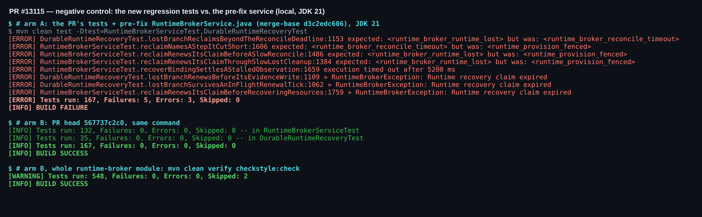
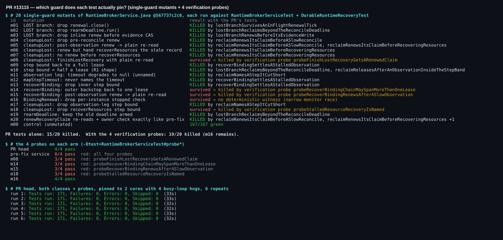
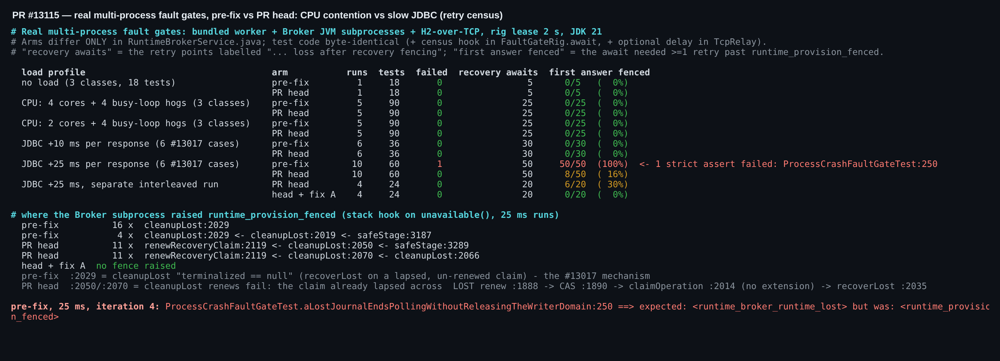
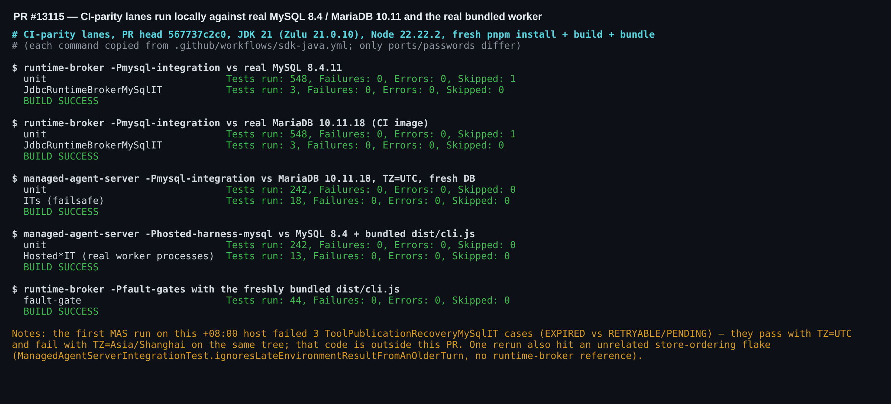

## 维护者验证 —— PR #13115 @ `567737c2c0`（本地真实环境）

**结论：可以合入。** 修复是真实有效的：
- 在修复前的 service 上，PR 新增测试复现出与 #13017 完全一致的失败签名。
- 在 JDBC 变慢的真实多进程 fault-gate rig 中，修复前代码在 **50/50** 个恢复 fencing 等待点上首答即被 fence，还有一次严格断言以 CI 同款签名失败；PR head 为 **8/50**，没有任何失败。
- 本地所有 CI 同款通道都通过，新增的真实时间测试在 CPU 饥饿下也保持全绿。

我在 flaky gate 所走的同一条路径上发现一处残留的未续约窗口（A）：已用确定性测试和真实 rig 两种方式复现，一行修复即可关闭。我建议顺手并入本 PR，但它不构成阻塞：head 相对 main 已经是严格改进。B–D 都不阻塞。

本轮在既有几轮的基础上进行：我第一次的验证评论（5913393343）、triage 门禁（5367981013）、`/review` R1（R1-1…R1-10），以及 `567737c2c0` 中的逐条回复（5919302020）。它们已覆盖的内容不再重复。以下全部在 head `567737c2c0` 上实际执行。

### 执行了什么

| 检查项 | 结果 |
|---|---|
| runtime-broker 模块 `clean verify checkstyle:check`，JDK 21 | ✅ 548/548（2 个按需跳过）+ checkstyle |
| **负对照**：PR 测试 + 修复前的 `RuntimeBrokerService.java` | ✅ 10 个新测试中 8 个失败，签名与 #13017 一致（`expected: <runtime_broker_runtime_lost> but was: <runtime_provision_fenced>` / `Runtime recovery claim expired`）。其余 2 个按设计在修复前后都通过（`reclaimStillFences…`、`…InsideTheStepBand`） |
| **变异测试**：对 service 做 20 个单守卫变异 | PR 自带测试杀死 15/20，且每个都死在其对应的钉住测试上；5 个存活者中 4 个被我的验证探针杀死（第 2 节）；m16 是一个窄的 monitor 竞态 |
| 新增真实时间测试在 CPU 饥饿下（2 核 + 4 个忙循环抢占进程，×6） | ✅ 每轮 171/171（PR 的 167 + 我的 4 个探针） |
| `-Pmysql-integration` 对真实 **MySQL 8.4.11** 与 **MariaDB 10.11.18**（CI 镜像） | ✅ 两个库都是 548 单测 + `JdbcRuntimeBrokerMySqlIT` 3/3 |
| managed-agent-server `-Pmysql-integration`（MariaDB，与 CI 一样 TZ=UTC） | ✅ 242 单测 + 18 IT + checkstyle |
| managed-agent-server `-Phosted-harness-mysql` 对 MySQL 8.4 + 新鲜 `dist/cli.js` | ✅ 242 单测 + 13 个 Hosted*IT |
| `-Pfault-gates` + 新打包的 CLI（CI 同款命令） | ✅ 44/44 |
| **真实多进程 A/B 普查**（真实打包 worker、Broker JVM 子进程、H2-over-TCP、rig lease 2 s） | 本机单纯 CPU 争用触发不了；JDBC 变慢可以触发。首答被 fence：修复前 50/50 → head 8/50 → 加 A 后 0/20（第 3 节） |
| 在 head 上叠加建议修复 A | ✅ 模块 548 + checkstyle，fault gates 44/44，两个 service 测试类 168/168 |
| CI 在当前合并提交 `f0e1985`（head + main `57e720bc97`）上 | ✅ 全部 SDK Java 作业通过，含 `Hosted process fault gates`（Hosted 16 IT，fault gates 44/44） |

### 1. 负对照



### 2. 每个测试到底钉住了哪个守卫？

每个变异只删除或削弱 PR 新增的一个守卫。PR 自带测试杀死 15/20。5 个存活者：

- **m08**：`finishLostRecovery` 拿到的是普通重读，而不是续约后的记录。
- **m14**：`recoverBinding` 的外层兜底退回 1 个 lease。5919302020 描述了放宽到 4 倍，但没有测试钉住。
- **m15**：`recoverBinding` 观测后的续约变成普通重读。
- **m18**：删掉 `recoverResources` 的步长上限。
- **m16**：删掉 R1-3 修复引入的实例级 `stopped` 标志。

我写了 4 个探针测试。每个都在 head 上绿、在修复前的 service 上红、并且只在其目标变异上红，合起来关闭了 m08/m14/m15/m18。补丁见 [`harness/probes-RuntimeBrokerServiceTest.diff`](./harness/probes-RuntimeBrokerServiceTest.diff)。m16 需要让一个续约 tick 停在 `renew()` 的 monitor 上、同时 `close()` 持有该 monitor；不加生产代码钩子的话，我没找到确定性的构造办法。



### 3. 真实多进程 fault gate 加压 A/B

两臂**只有** `RuntimeBrokerService.java` 不同。测试代码逐字节相同，外加两个仅用于本次验证的钩子：
- `FaultGateRig.await` 里的普查，记录每一个被重试谓词吞掉的回复；
- rig 自带 `TcpRelay` 上的可选延迟，让每个 Broker 子进程的 JDBC 响应晚 N ms 到达，用来模拟高负载 runner 上的慢恢复事务。

各轮按 ABBA 交替执行。



普查结果：

- **本机上单纯 CPU 争用触发不了这个 bug。** 4 核 + 4 抢占、2 核 + 4 抢占各跑 5 轮，两臂首答被 fence 的次数都是 0。JDBC +10 ms 时结果相同：两臂都是 0/30。
- **JDBC 变慢可以触发。** 每个响应 +25 ms 时，修复前的 service 在 **50/50** 个恢复 fencing 等待点上首答即被 fence；head 为 8/50。
  - 这些 gate 几乎全部仍然通过，因为 `await` 谓词会对 `runtime_provision_fenced` 重试（C）。
  - 唯一的例外出现在修复前一臂：`ProcessCrashFaultGateTest.aLostJournalEndsPollingWithoutReleasingTheWriterDomain:250` 是带重试的 `acquire` 之后那次不带重试的 `second.warm(HARNESS)`，它以 CI 同款签名失败。这就是 #13017 的 flaky 形态在真实 rig 中的复现。
- **head 残留的 fence 全部来自同一处**，即发现 A。我在 Broker 子进程内给 `unavailable("runtime_provision_fenced")` 加了调用栈钩子，捕获到的 11 次全部走 `reconcileLoop:1900 → reclaimLostBindingNow:2022 → cleanupLost:2034 → renewRecoveryClaim`（`:2050` 和 `:2070`）。修复前一臂的 fence 全部在 `cleanupLost:2029`，即 `recoverLost` 跑在一个已过期、从未续约的 claim 上——这正是 #13017 的机制本身。
- **加上 A 之后不再有 fence。** 同一轮交替运行中，首答被 fence 为 0/20（未打补丁的 head 为 6/20），钩子也没有捕获到任何一次 fence。

### 4. CI 同款通道



### 发现

**A. reconcile → reclaim 交接处残留的未续约窗口（建议修复，仅一行）。**

LOST 分支在 `RuntimeBrokerService.java:1888` 续约一次，这一份 lease 随后要撑过三个 JDBC 事务，才等到下一次续约（`:2050`）：
- `:1890` 写证据的 CAS；
- `reclaimLostBindingNow` 在 `:2014` 的 `claimOperation`；
- `cleanupLost` 在 `:2035` 的首个 `recoverLost`。

对同一 owner 且仍存活的 claim，`claimOperation` 会原样返回、**不延长 lease**（`InMemoryRuntimeBindingRepository.java:263-265`、`JdbcRuntimeBindingRepository.java:443-445`）。第 3 节的 fence 位置取证表明，head 在慢 JDBC 下残留的 fence 正是出在这里。

确定性见证：[`probeLostHandoffRenewsBeforeTheFirstRecoverLost`](./harness/probe-handoff-DurableRuntimeRecoveryTest.diff) 在 2 s lease 上让这三步各耗 0.8 s。它在 head 上以 `Runtime recovery claim expired` 失败，在修复前代码上同样失败。

修法是在 cleanup 的第一个事务之前先续约（[`suggested-fix-handoff-renew.diff`](./harness/suggested-fix-handoff-renew.diff)），这一处同时覆盖三个入口：reconcile 交接、`ensureBinding` 快捷路径、`recoverBinding`。加上修复后：
- 见证测试通过；
- 模块 548 + checkstyle，fault gates 44/44，两个 service 测试类 168/168；
- 真实 rig 在 25 ms 下首答被 fence 为 0/20（对照 6/20）。

```java
RuntimeBindingRecord recovered = bindingRepository.recoverLost(
        sessionRepository, executionRepository, renewRecoveryClaim(claimed));
```

**B. R1-2 只是收窄，并未关闭（不阻塞；改措辞或改常量即可）。**

在生产 lease（`EmbeddedRuntimeBroker.LEASE = 30s`）下，`cleanupStepTimeoutMillis()` = 30 000 − 10 000 = **20 000 ms**。内置的 `LocalProcessRuntimeProvisioner.observe()` 仍会调用 `attest(...)`，最多等待 `READY_TIMEOUT = 30s`（`LocalProcessRuntimeProvisioner.java:36/596/645`；`HttpRuntimeTransport.REQUEST_TIMEOUT` 也是 30 s）。

所以新 javadoc 的约定（"provisioner 的内部等待必须落在上限之内"）内置 provisioner 本身并不满足：20–30 s 才返回的 attestation 现在会被当作可重试的 `runtime_broker_reconcile_timeout` 丢弃，而修复前是被接纳的。它是 fail-safe 的：超时有名字、可重试，binding 保持 LOST。建议要么在 Risk 章节写明这组数字，要么把 `observe()` 里的 attest 限制在步长预算以内。

**C. fault gate 已无法发现本修复的回归（请维护者决定）。**

第 3 节中，修复前的 service 在 50/50 个等待点上首答即被 fence，但只有一个 gate 失败——而且是那唯一一次不带重试的 `warm`；带重试的点把 fence 全部吸收了。`await` 谓词会对 `runtime_provision_fenced` 重试：这来自 #12946，本 PR 还把它放宽到了 `runtime_broker_reconcile_timeout`。因此本 PR 之后，#13017 的回归实际上只能靠确定性单测来守，这正是 triage bot 在 5367981013 中的担忧。

如果并入 A，25 ms 下 head 首答被 fence 为 0/20。这支持两种做法：收紧谓词，或者至少在吞掉超过一次 fenced 回复时判失败。具体怎么选留给 gate 的负责人。

**D. 新增的诊断信息并不能定位调用点（不阻塞）。**

PR 描述说新增的 `message + rig.logs()` 能让"下次失败指出调用点"。在上面那次真实失败中，这个 supplier 确实执行了，但报告里只有 `Runtime recovery claim expired`，后面是**空的** `--- broker <pid> ---` 段（[失败报告](./data/L25-target/reports-base-4/com.alibaba.qwen.code.runtimebroker.ProcessCrashFaultGateTest.txt)）。原因是 Broker 子进程不记录失败回复，而 `RuntimeBrokerService.java` 在 16 处用同一条消息抛出 `runtime_provision_fenced`。

给每处加一个区分后缀，或让 `FaultGateBroker` 在错误回复时把异常打到 stderr（`rig.logs()` 本来就会截取它的尾部），就能让下一次 CI 失败自带定位信息。我用的调用栈钩子（[`harness/fence-site-instrumentation.diff`](./harness/fence-site-instrumentation.diff)）说明拿到这些信息的成本很低。

**范围之外、顺带发现（既有问题，与本 PR 无关）：**
- 在 +08:00 时区的主机上，`ToolPublicationRecoveryMySqlIT` 3/3 失败（`expected: "EXPIRED" but was: "RETRYABLE"/"PENDING"`）。同一份代码 `TZ=UTC` 下通过、`TZ=Asia/Shanghai` 下失败，说明 managed-agent-server 存在 JVM 时区与数据库时钟的依赖。
- `ManagedAgentServerIntegrationTest.ignoresLateEnvironmentResultFromAnOlderTurn` 三次中失败一次。它是 store 层事件排序测试，没有引用 runtime-broker。
- 在 +25 ms JDBC 延迟下对全部 18 个用例做的单轮冒烟中，接管路径的 gate 在两臂上以相同方式失败：9 个用例，分布在 `aRestartedBrokerAdoptsTheWorker…`、`adoptedWorkerCanCancel…`、`brokerCrashAdopts…`、`closingAnObserver…`。这与我第一条评论提到的第二种机制一致，所在路径本 PR 没有触及。

### 未验证
- macOS / Windows。gate 需要 POSIX 信号；CI 上 macOS/Windows 的 Java 21 单测作业是绿的。
- m16（`stopped` 标志）：没有确定性见证。
- 真实负载下的生产级 lease（30 s）。我的 A/B 用的是 rig 的 2 s lease 加注入延迟，是对高负载 runner 的建模，而不是实测。

证据（截图、原始普查 TSV、探针/修复补丁、变异与加压脚本）：[`wenshao/qwen-code@asserts/pr-13115`](./)
