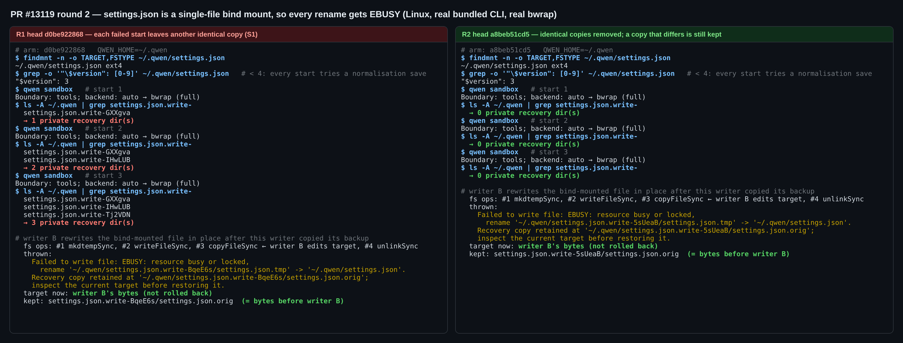
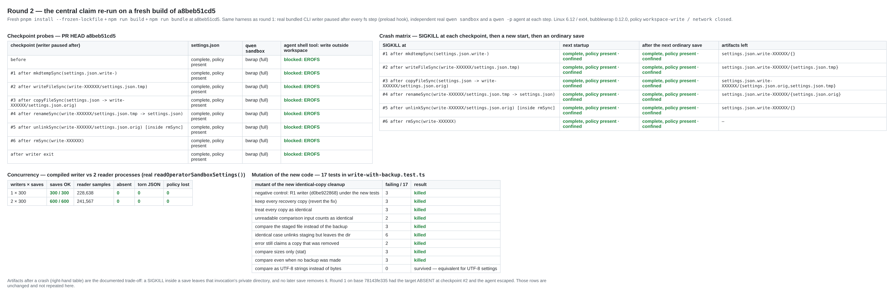

## 维护者验证第二轮 — PR #13119 @ `a8beb51cd5`（仅列出相对第一轮的增量）

**结论：仍建议合入。** [第一轮](https://github.com/QwenLM/qwen-code/pull/13119#issuecomment-5918187683)提出的 S1 已修复。`a8beb51cd5` 中的生产代码改动与我第一轮的补丁逐行一致，只有注释措辞不同。我没有沿用自己打过补丁的那一臂，而是重新构建了这个提交（全新执行 `pnpm install --frozen-lockfile`、`build` 和 `bundle`），在它上面重跑了第一轮的 harness。在 Linux 上用真实打包 CLI 和真实 bubblewrap 验证的结果如下：

- 持续失败的保存不再遗留目录。
- 与当前文件内容不同的恢复副本仍会保留，也不会被回滚覆盖到当前文件上。
- 第一轮验证的核心主张依然成立。

没有发现阻塞项。本 head 上 `/review` 的三条建议（[评审](https://github.com/QwenLM/qwen-code/pull/13119#pullrequestreview-5374744598)）都属于测试加固。我逐条实际执行过，其中两条需要先更正再采纳（见下文）。

### 第一轮之后的变化

- `a8beb51cd5` 只改了 `write-with-backup.ts` 的 catch 路径（+15/−3），外加对应测试和两份设计文档。成功路径与 `d0be922868` 逐字节相同。
- 本 head 上 CI 全绿：`Qwen Code CI`（run 36773502303 第 2 次尝试，含 `Test (ubuntu-latest)` 和 `Lint & Static`）、`SDK Java`、`tui-parity`。`Test (windows-latest)` 和 `Test (macos-latest)` 被 Classify PR 跳过。
- 与当前 `main`（`310f4ba3ab`，比 base 多 9 个提交）合并无冲突。合并后的树里没有残留对旧文件名 `writeWithBackup.js` 的 import。

### `a8beb51cd5` 上的结果（Linux 6.12 / ext4、Node 22、bubblewrap 0.12.0）

| 检查 | 第一轮 head `d0be922868` | 第二轮 head `a8beb51cd5` |
| --- | --- | --- |
| **S1 复现**：`settings.json` 是单文件 bind mount，每次 rename 都返回 `EBUSY`；`$version: 3` 使每次启动都会尝试规范化保存。启动 3 次真实的 `qwen sandbox`。 | 私有目录数 1 → 2 → 3，每个都是相同副本 | **0 → 0 → 0**；每次启动沙箱仍为 `bwrap (full)`。base `78143fe335` 同样为 0。 |
| **副本内容不同**：真实写入者在完成备份复制后暂停；writer B 原地改写被 bind mount 的文件；释放写入者后它收到 `EBUSY`。分别走一次 CLI 启动保存、一次直接调用编译产物中的 writer。 | 保留副本；目标保持 B 的内容 | **相同**：副本是 B 改写前的内容，目标保持 B 的内容，没有回滚。错误信息给出了副本路径（原文见图 1）。 |
| 真实写入者在每个 fs 步骤后暂停，每一步都启动独立的 `qwen sandbox` 和 `qwen -p` agent | 8/8 受限 | **8/8**：目标完整，`bwrap (full)`，工作区外写入 `EROFS`，工作区内写入成功 |
| 在每个步骤 `SIGKILL`，然后新进程启动，再做一次普通保存 | 6/6 策略保留 | **6/6** 策略保留，0 次逃逸 |
| 压测：编译产物中的写入者，对 2 个运行真实 `readOperatorSandboxSettings()` 的进程 | 900/900，0 异常 | **900/900** 次保存；470,205 次采样中缺失、撕裂、策略丢失均为 **0** |
| PR 列出的六个测试文件 | 383/383 | **386/386**（writer 测试 17/17） |
| `write-with-backup.ts` 的变异 | 11/11 个行为变异被杀死 | **21 个中杀死 20 个**。针对比较逻辑的 9 个新变异：8 个被杀死，1 个等价（按 UTF-8 字符串而非字节比较）。负对照：第一轮的 writer 在新测试下失败 3/17。 |

**图 1 — 修复前后的 S1 复现（真实终端输出，两臂使用同一脚本）**

**图 2 — 在 `a8beb51cd5` 构建上重跑第一轮矩阵，以及针对新代码的变异**

被杀死的比较逻辑变异：

- 保留所有副本（即撤销修复）；
- 把所有副本都视为相同；
- 读取失败时视为相同；
- 用暂存文件代替备份做比较；
- 相同情形下遗留目录；
- 错误信息仍声称保留了已删除的副本；
- 只比较文件大小；
- 没有备份时也做比较。

第一轮的 4 个等价存活变异（`wx`、`COPYFILE_EXCL`、`flush`、目录预检）所在代码没有改动，这轮没有重跑。

### 对本 head 上 `/review` 建议的执行验证

| 条目 | 实际执行 | 结果 |
| --- | --- | --- |
| **R1-2**：失败路径清理的 `try/catch` 没有测试 | 删除该 `try/catch` 后运行 `write-with-backup.test.ts` | **确认**：17/17 仍全绿 |
| **R1-3**：`loadedSettingsAdapter.test.ts:543/:552` 的断言（`existsSync(target + '.orig')`）已不可能失败 | 删除发布后的 `rmSync` 后运行 adapter 测试 | **确认**：23/23 仍全绿。改为 `readdirSync` 断言有效：干净 head 23/23，变异下 21/23。**更正：** 建议原文在 `:543` 写的是 `toEqual(['settings.json'])`，它在**干净的** head 上 `existing: false` 一例就会失败（22/23）。原因是回滚正确地恢复了“文件不存在”，`userHome` 为空。应改为 `existingFile ? ['settings.json'] : []`。 |
| **R1-1**：watcher 对 `settings.json.write-*` 的守卫没有被钉住 | 对两个示例变异运行 `settingsWatcher.test.ts`；再用真实 chokidar 实测存活的那个变异：8 次保存，每次 30 ms 后都有一次外部原地编辑 | **部分确认。** 把 `:173` 放宽为 `startsWith` 的变异**已经会被杀死**：47 个测试中 2 个失败（`should ignore .tmp files`、`should ignore .orig files`）。删掉 `:169` 的 `&& changedPath === dir` 的变异确实存活（47/47）。但在真实 chokidar 下，这个变异对**普通保存没有影响**：两臂 `demoteScope` 都是 0 次，8/8 次编辑都被读到。原因是每次保存的私有目录只存在约 0.3 ms，chokidar 根本来不及登记。只有存活时间足够长、随后又被删除的私有目录才会触发它（例如保留下来的副本，或用户之后手动删掉的崩溃残留）：一个存活 800 ms 后被删除的目录，变异臂触发 1 次 demote，干净臂 0 次，之后的编辑仍能读到。评审描述的“每次保存都引起 watcher 抖动”没有复现。建议补的测试作为低成本加固仍然合理。 |

以上都不阻塞合入。若作者想一并处理，最小改动建议是：补上 R1-2 的测试（mock 工厂需要加入 `unlinkSync`），以及按 `existing: false` 更正后的 R1-3 `readdirSync` 断言。

### 仍未解决（非阻塞）

- **崩溃残留永远不会被回收。** [沙箱验证](https://github.com/QwenLM/qwen-code/pull/13119#issuecomment-5919142046)在 `d0be922868` 上提出了这一点，作者已明确推迟处理（"no scavenger"）。图 2 能看到这一现象：6 个崩溃点中有 5 个各留下一个 `settings.json.write-XXXXXX/` 目录，下一次普通保存后仍然存在。S1 关闭后，要产生残留只能是保存过程中遇到 SIGKILL、OOM kill 或断电。在本机上一次保存耗时 p50 0.27 ms、p99 0.6 ms（base 为 0.016 ms）。我认为清扫过期的 `${target}.write-*` 同级目录可以作为后续工作，由维护者决定。
- 那次沙箱验证标记为“❌ not passed”，但它自己的报告写明 4 个失败断言都是对 base 对照臂的预期，并非本 PR 的缺陷。

### 未验证

- Windows 原生的替换与拒绝行为。PR 也写明这一项仍待验证。
- 网络文件系统，以及断电后的持久性。

### 复现

证据就在本目录：

- `harness/bindmount-r2.{sh,mjs}`：S1 与副本内容不同两个场景，在私有 mount namespace 中运行。
- `harness/demo-bindmount.sh`：生成图 1。
- `harness/mutants2.py`：新代码的变异。
- `harness/review-mutants*.py` 与 `harness/watcher-r2.mjs`：`/review` 各条目的验证。
- `data/`：原始结果。

检查点、崩溃和压测 harness 与[第一轮](https://github.com/wenshao/qwen-code/tree/d6c714baac31c082ff4ef5ac8b230193f2e9e23b/pr-13119/harness)相同。
