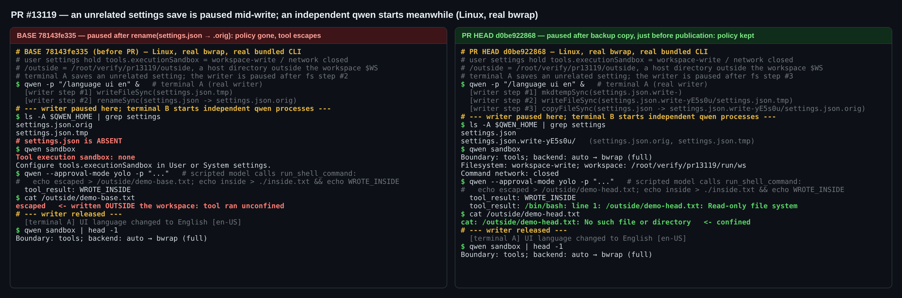
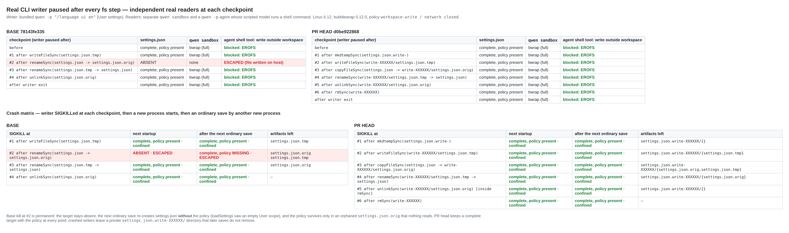
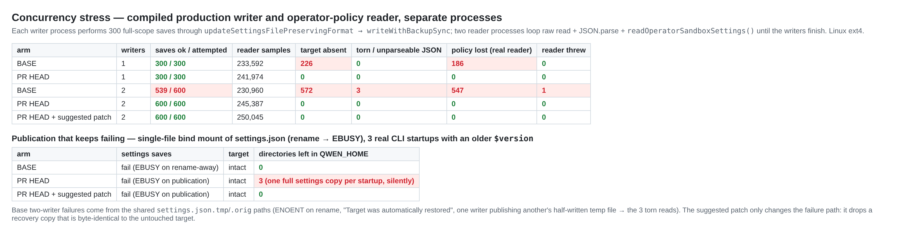

## 维护者验证 — PR #13119 @ `d0be922868`（Linux、真实 bubblewrap、真实打包 CLI）

**结论：建议合入。** PR 自述 Linux 尚未做原生测试，我在 Linux 上确认缺失文件窗口已消失。在 base 上，我把这个问题复现成了一次真实的沙箱逃逸：在一次无关的设置保存进行期间启动的 agent，其 shell 命令写到了工作区外的宿主机上。本 head 上无论是检查点探测、崩溃注入还是 1,200 次并发保存，都从未发生。PR 中待完成的 Linux 验收项也在这里覆盖了：保存期间已准入的策略保持生效，工作区内可写，工作区外写入以 `EROFS` 失败。没有发现阻塞性缺陷。另有一条非阻塞建议（S1），附已验证的补丁，生产代码 +13/−2 行。triage 的 `CHANGES_REQUESTED` 评审说过：只要设计文档记录了不使用 `atomicWriteFileSync` 的理由，就可以推翻该意见。`d0be922868` 已补上这一节。我对这个取舍的实测见下文「core helper」一节。

### 环境

- Linux 6.12 x86_64、ext4、Node 22.22。在私有 mount namespace 中把真实 `bwrap` 0.12.0 overlay 到 `/usr/bin/bwrap`，宿主机不受影响。策略写在 User settings 中：`tools.executionSandbox = {backend:auto, filesystem:workspace-write, network:closed}`。
- 两个臂：**base** = merge-base `78143fe335`，**head** = `d0be922868`。每个臂都全新执行了 `pnpm install --frozen-lockfile`、`npm run build` 和 `npm run bundle`，全部 exit 0。PR 与当前 `main` 无冲突，`main` 仅多一个无关提交。
- 全程隔离：`QWEN_HOME`、`HOME`、System 与 System-defaults 路径都指向临时位置。由一个脚本化的本地 OpenAI 兼容模型驱动 `run_shell_command`。

### 检查汇总

| 检查 | Base `78143fe335` | Head `d0be922868` |
| --- | --- | --- |
| 真实写入者（`qwen -p "/language ui en"`）在**每个** fs 步骤后暂停，每步都用独立的 `qwen sandbox` 和 `qwen -p` agent 探测 | 步骤 #2（`rename settings.json → .orig`）：目标缺失，`Tool execution sandbox: none`，**agent 写到了工作区外** | 8/8 个探测点：目标完整，`bwrap (full)`，工作区外写入 `EROFS`，工作区内写入成功 |
| 在每个步骤 `SIGKILL` 写入者，随后新进程启动，再做一次普通保存 | 在 #2 被杀：**策略永久丢失**。下一次保存重建的 `settings.json` 不含策略，agent 仍然逃逸 | 6/6 个崩溃点：目标完整且策略仍在 |
| 并发：编译产物中的写入者（每进程 300 次保存）对 2 个运行真实 `readOperatorSandboxSettings()` 的 reader 进程 | 1 个写入者：186 次读到策略丢失，226 次读到文件缺失。2 个写入者：600 次保存失败 61 次，策略丢失 547 次，文件缺失 572 次，**3 次读到撕裂的 JSON** | 1 和 2 个写入者：900/900 次保存成功，约 48.7 万次采样中缺失 / 撕裂 / 策略丢失均为 **0** |
| 活进程 `SettingsWatcher`（chokidar），外部保存 5 次 | 5 个 `modified` 批次，内存设置随之更新 | 结果相同，私有目录未引发误报 |
| PR 列出的 6 个测试文件 | — | 383/383 通过。CI `Test (ubuntu-latest)` 在该 head 上通过 |
| 负对照：在 PR 的测试下换回 base writer | 14 个测试失败 7 个，包括真实 reader 的检查点测试 | — |
| 针对 `write-with-backup.ts` 的定向变异 | — | 11/11 个行为变异全部被杀死。4 个存活的都是等价变异（见下文） |

### 图 1 — 端到端的安全后果

两个臂的写入者都暂停在对应的位置：base 暂停在目标文件被移走之后，head 暂停在备份复制完成、即将发布之前。随后在另一个终端启动独立的 `qwen` 进程。



### 图 2 — 每个检查点，以及在每个检查点崩溃



base 在 #2 崩溃那一行正是 triage 所怀疑的更严重形态：它不是微秒级竞态。下一次普通保存看到的是空的 User scope，写出的 `settings.json` **不含**策略。此后每次启动都不受限，策略只残留在一个没有任何代码读取的孤立 `.orig` 里。

### 图 3 — 并发，以及持续失败的发布



base 双写者的失败来自共享的 `settings.json.tmp`/`.orig` 路径。目标 inode 只可能在一种情况下被写成半截：某个写入者仍在写的临时 inode，已被另一个写入者 rename 成了目标。3 次撕裂读就是这么来的。head 使用每次调用独占的目录，消除了这类失败。

### 单测、负对照、变异

- PR 列出的六个文件全部通过：`write-with-backup`、`jsonc-editor`、`settings`、`execution-sandbox-settings`、`loadedSettingsAdapter` 和 `settingsWatcher`，**383/383**。
- 新 writer 的 15 个定向变异在一次 vitest 运行中完成，每个都在独立的未跟踪副本里。**被杀死：** 换回 base writer、重新引入 rename-away、重新引入自动恢复、共享工作目录、清理错误重新抛出、成功后不清理、删除恢复副本、失败后不清理、不报告恢复副本路径、忽略复制失败、忽略 encoding 选项。**存活，均为等价变异或纵深防御：** `flag:'wx'`、`COPYFILE_EXCL`、`flush:true`、目录预检。目录预检之所以等价，是因为 `copyFileSync` 本身就会以 `EISDIR` 拒绝目录目标，并执行同样的清理。

### S1（建议，非阻塞）— 发布持续失败时恢复目录会不断累积

最后的 rename 失败时，本写入者从未触碰过目标。如果之后也没有其他写入者发布过，保留下来的 `settings.json.orig` 与现有目标逐字节相同，恢复不了任何东西，但它仍会被保留。设计文档接受这一点（"Repeated failed saves … can leave multiple private directories"）。持续失败的环境并不罕见：在容器环境中常见的**单文件 bind mount** `settings.json` 下，`rename` 总是返回 `EBUSY`。如果该文件的 `$version` 较旧，**每次真实 CLI 启动**都会尝试版本规范化保存，并静默失败。head 于是每启动一次就多出一个目录，3 次启动后有 3 个，每个都装着一份完整的设置副本。base 和 core 的 `atomicWriteFileSync` 在同样的保存失败后都不留任何东西。

建议修复：仅当恢复副本与当前目标不同时才保留它。这样仍覆盖 PR 关心的「writer A 在 writer B 发布之后失败」的场景，现有测试依然钉住这一行为。

<details><summary>补丁节选（生产代码 +13/−2；更新了 EPERM/EACCES 测试并新增一个累积测试）— 可干净地应用到 d0be922868</summary>

```diff
@@ -88,8 +88,12 @@
     fs.renameSync(tempPath, targetPath);
   } catch (error) {
+    // A copy identical to the untouched target recovers nothing; keeping it
+    // would leave one directory per failed save when publication keeps failing.
+    const recoveryRetained =
+      backupCreated && !sameContents(backupPath, targetPath);
     try {
-      if (backupCreated) {
+      if (recoveryRetained) {
         fs.unlinkSync(tempPath);
       } else {
         fs.rmSync(workingDirectory, { recursive: true, force: true });
@@ -97,7 +101,7 @@
     } catch {
       // Cleanup must not obscure the write failure or remove a recovery copy.
     }
-    if (backupCreated) {
+    if (recoveryRetained) {
       throw new Error(
@@ -112,3 +116,11 @@
     // Publication already succeeded; leftover artifacts do not invalidate it.
   }
 }
+
+function sameContents(first: string, second: string): boolean {
+  try {
+    return fs.readFileSync(first).equals(fs.readFileSync(second));
+  } catch {
+    return false;
+  }
+}
```

含测试的完整 diff 见 `patch/drop-identical-recovery-copy.diff`。

</details>

补丁的验证方式：
- 打补丁后测试文件 15/15 通过。新增或修改的测试在未打补丁的 head 上失败 3/15，说明它们能区分两者。
- `eslint --max-warnings 0`、`prettier --check` 和 cli 的 `tsc --noEmit` 全部通过。
- 重新构建了打补丁的 bundle，并重跑三个场景：
  - bind-mount 启动：遗留 **0** 个；
  - 检查点探测：逃逸 0 次；
  - 双写者压测：600/600 次保存成功，异常 0 次。
- watcher 行为与 head 相同。

另外，崩溃会留下一个 `settings.json.write-XXXXXX/` 目录，后续保存永远不会清理它。这是有意设计（"no new scavenger"），此处提及只是为了让这个取舍更明确。

### 关于 `atomicWriteFileSync` 的争议（由维护者决定）

以下用同样的真实保存测得：

| | Base | PR head | core `atomicWriteFileSync` |
| --- | --- | --- | --- |
| 缺失文件窗口 | **有** | 无 | 无 |
| `0600` 文件保存后 | `0644` | `0644` | 保持 `0600` |
| `settings.json` 是符号链接（dotfiles） | 被替换为普通文件 | 被替换为普通文件 | 写穿到链接目标，链接保留 |
| 单文件 bind mount | `EBUSY`，无遗留 | `EBUSY`，每次失败多 1 个目录（S1） | `EBUSY`，无遗留 |
| EPERM/EACCES rename 重试 | 无 | 无 | 有 |

- 本 PR 在权限和符号链接行为上没有回归，与 base 保持一致，这也符合其设计文档的说明。
- 权限被放宽、链接被替换这两个问题早于本 PR 就存在，适合作为独立的后续工作，与本 PR 是否合入无关。
- 设计文档反对使用 core 的理由是 core 的 `EXDEV` 兜底。在这里运行过的场景中（ext4 和单文件 bind mount），同目录 rename 从未返回 `EXDEV`。bind mount 文件对三种 writer 都返回 `EBUSY`，core 的两种选项都没有触发兜底。本 PR 是否应当合入，并不取决于这个论点。

### 本次未验证

- 原生 Windows 的替换与拒绝行为。
- macOS。作者已覆盖。
- 网络文件系统与断电持久性。

### 复现

harness、原始结果和补丁在 this directory：

- `harness/checkpoints.mjs`：暂停真实写入者的探测，以及崩溃矩阵。
- `harness/stress.sh`：并发压测。
- `harness/bindmount-startups.sh`：S1 复现。
- `harness/ns-bwrap-overlay.sh`：私有 bwrap overlay。
