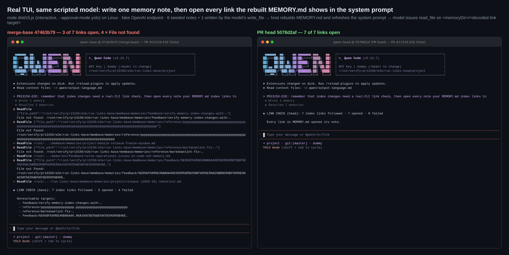
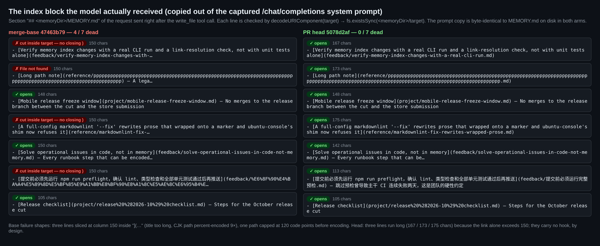
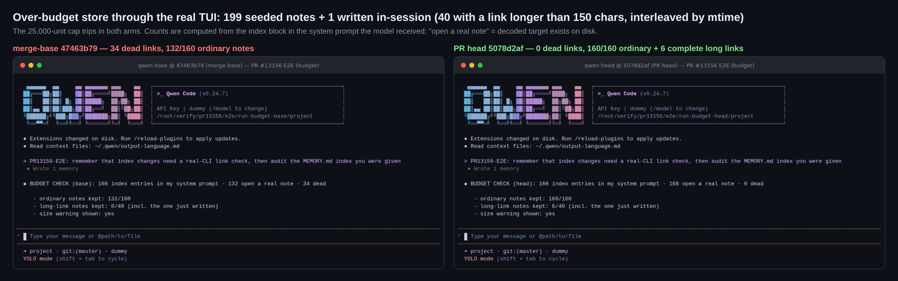

## Maintainer verification: real CLI on Linux at `5078d2af` ✅

**Verdict: ready to merge.** I built three trees from clean worktrees: the PR head, its merge-base, and the head merged into current `main`. Then I drove the real interactive CLI against a scripted OpenAI-compatible endpoint.

Earlier rounds left two gaps. The author verified on macOS, and the sandboxed verifier called the compiled builders directly. This round exercises the host's own loop on Linux (the model writes a note, the host rebuilds `MEMORY.md`, then refreshes the system prompt) and reads the index from the request the model actually receives.

| Check | merge-base `47463b79` | PR head `5078d2af` | head merged into `main` `1a4de748` |
|---|---|---|---|
| E2E A: index links in the system prompt that open with `read_file` | **3 / 7**, 4 × `File not found` | **7 / 7** | 7 / 7 |
| E2E B (200 notes, size cap trips): dead links in the system prompt | **34 / 166** | **0 / 166** | 0 / 166 |
| E2E B: ordinary notes kept · long-link notes kept | 132 / 160 · 0 / 40 | **160 / 160 · 6 / 40** | 160 / 160 · 6 / 40 |
| `packages/core` `src/memory` vitest | 1003 passed · 0 failed | 1020 passed · 0 failed | 1020 passed · 0 failed |

### What I ran

1. **Builds.** Each arm ran `pnpm install --frozen-lockfile`, `npm run build` and `npm run bundle`, and all exited 0. The head bundle contains the new `PATH_TARGET_RAW_NON_ASCII` class and the base bundle does not, which confirms the arms really differ. The merge with `main` (35 commits ahead of the merge-base) is clean.
2. **E2E A: follow every link.** I started `node dist/cli.js --approval-mode yolo` in a pty, with the user store at `QWEN_CODE_MEMORY_BASE_DIR` and default settings, so recall stayed in `legacy` mode and the index was part of the system prompt.
   - **Setup:** six notes on disk plus a stale one-line `MEMORY.md`.
   - **Turn 1:** the scripted model calls `write_file` to add a seventh note, which has a 104-character title. The host's `refreshMemoryAfterManagedWrite` rebuilds the index and refreshes the system prompt before the continuation request is sent: the captured requests show the index growing from the 1 stale line to 7 lines.
   - **Turn 2:** the model takes each `](target)` out of the `## <memoryDir>/MEMORY.md` block of the prompt it received, decodes it, and issues `read_file <memoryDir>/<target>`.
   - **Base, 4 failures:**
     - Three targets are sliced at column 150 inside `](…`. The causes are a long title on the model-written note, the PR's markdownlint note, and a CJK filename that base percent-encodes 9× per character.
     - One 140-character filename is capped at 120 code points before encoding.
   - **Head:** all 7 open.
     - Three lines run long (167 / 173 / 175 chars) with no hook, as designed.
     - The CJK path stays raw.
     - A path with spaces and parentheses stays percent-encoded and opens in both arms.
   - **Cross-check with the PR description:** the PR's own four evidence notes are in this set, and they give exactly the PR's Before/After (2/4 → 0/4, `can be encoded…` → `can be…`).
   - **Disk vs prompt:** in every arm, the prompt copy of the index is byte-identical to `MEMORY.md` on disk.
3. **E2E B: over-budget store, same loop.** I seeded 199 notes and the model wrote 1. Every 5th note has a link longer than 150 characters, and long and ordinary notes are interleaved by mtime, so a prefix cut hits both kinds. The 25,000-code-unit cap trips in both arms.
   - Base fills its budget with 34 lines whose targets are sliced, and drops 28 ordinary notes.
   - Head keeps every ordinary note, then spends the leftover on 6 complete long links. That includes the note written in this session.
4. **Unit tests.**
   - `indexer.test.ts` passes 32/32 at head.
   - **Negative control:** the PR's test file run against base's `indexer.ts` gives **14 failed / 18 passed**. The failures cover the cut-inside-target case, the path cap, sibling handling, budget priority, surrogates and invisible-character encoding, so the new tests pin the fix rather than just passing alongside it.
   - The whole `src/memory` suite has 0 failures on all three arms. The +17 test delta is exactly `indexer.test.ts` going from 15 to 32 tests.
5. **Static checks.** `eslint --max-warnings 0` and `prettier --check` are clean on the three changed files. PR CI is green for Test (ubuntu), Lint & Static, Integration (no-AK) and web-shell E2E.
6. **A real store on this machine.** I rebuilt a copy of `~/.qwen/memories` (7 real notes, all short) with each arm's compiled indexer.
   - The links are identical in both arms, with 0 broken.
   - Only two hooks differ: head ends them on a word boundary.
   - So the change causes no regression on real data, but this store has no long entries and cannot demonstrate the fix.

### Evidence

### Non-blocking notes

- **Reader-side re-truncation (pre-existing, belongs in #13178).** In E2E B, the writer's body plus its own `> WARNING` line exceeds 25,000. `truncateManagedAutoMemoryIndex` therefore cuts again, but only at the separator before the writer's warning. All 166 entries on disk reached the prompt in both arms, which confirms through the real CLI that generated content never hits the reader's mid-line fallback. The warning the model sees is the reader's (`MEMORY.md is 24.5 KB (limit: 24.4 KB) … Only part of it was loaded`), so the writer's wording never reaches the model. Both arms behave the same way.
- **Still open from earlier rounds, not re-measured here:**
  - Two mutants survive, so the `MIN_INDEX_HOOK_CHARS` guard and the budget loop's first-fit `continue` are unpinned (sandboxed verification report).
  - `docs/design/auto-memory/memory-system.md` still says "25,000 字节" (bytes) on the line next to the one this PR rewrites (#13178).
  - The three suggestions deferred to #13251.

  None of these is a correctness defect in the shipped behaviour.

### Not covered

- **Windows and macOS.** The CI Test jobs for those platforms were skipped, and the author covered macOS.
- **Team index with git sync.** The author covered the team-index rebuild at startup.
- **Real models.** I used scripted model turns only.

Harness, per-arm JSON (every captured request, the index text in the prompt, the index on disk and each link's resolution) and logs are in [`harness/`](harness/) and [`data/`](data/). `tc.mts` is `integration-tests/terminal-capture/terminal-capture.ts` with a node-pty ESM interop shim.
