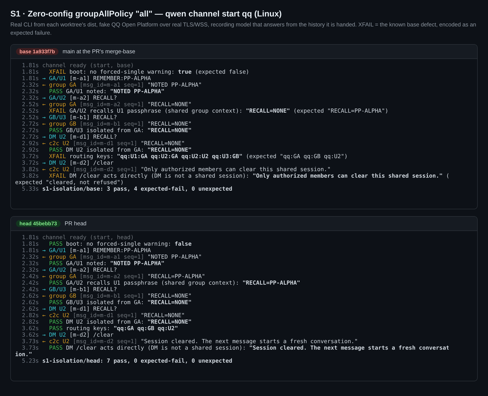
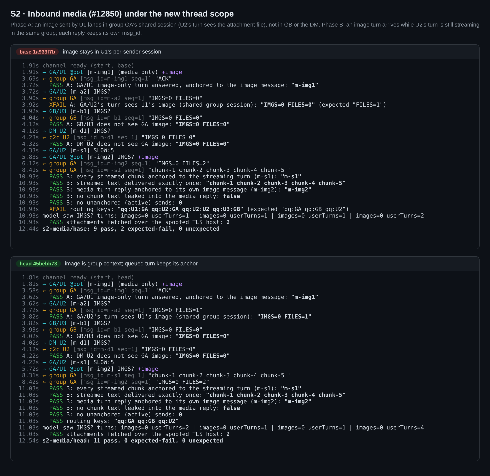
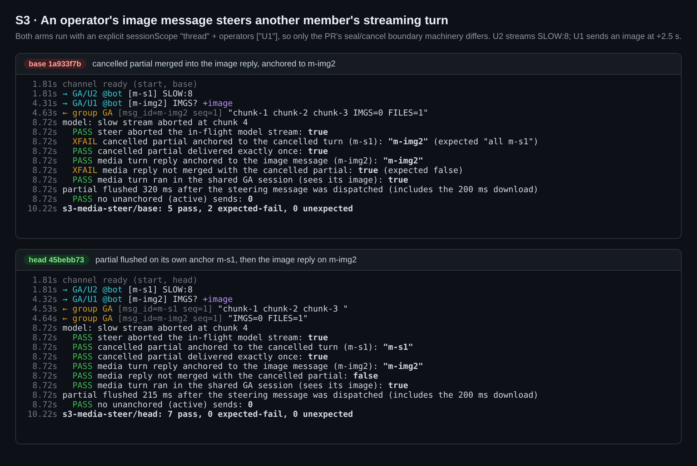
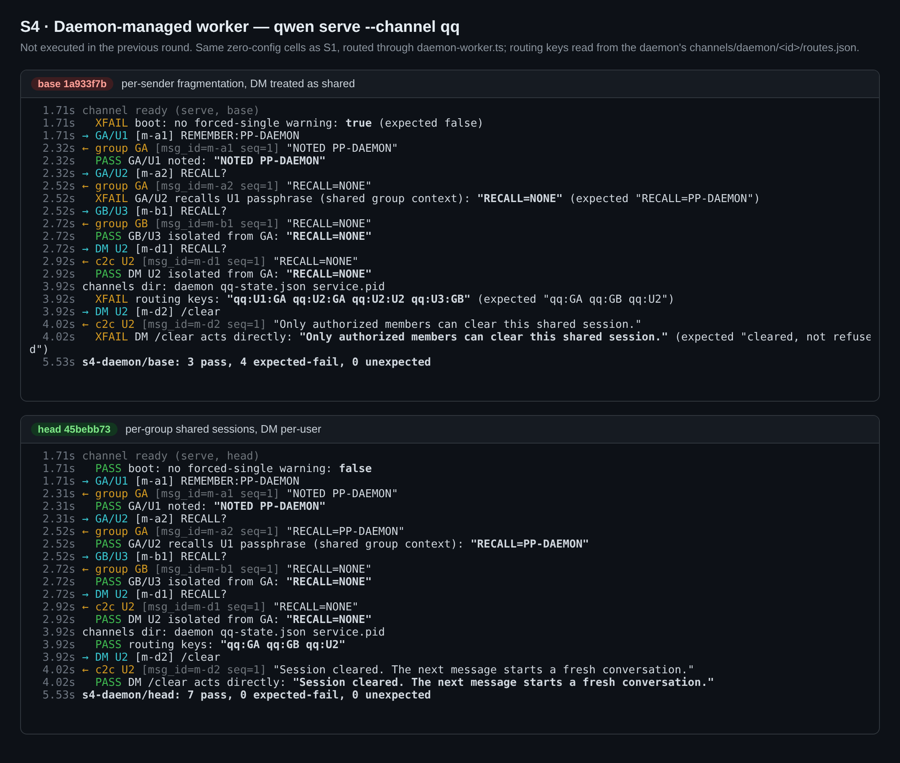
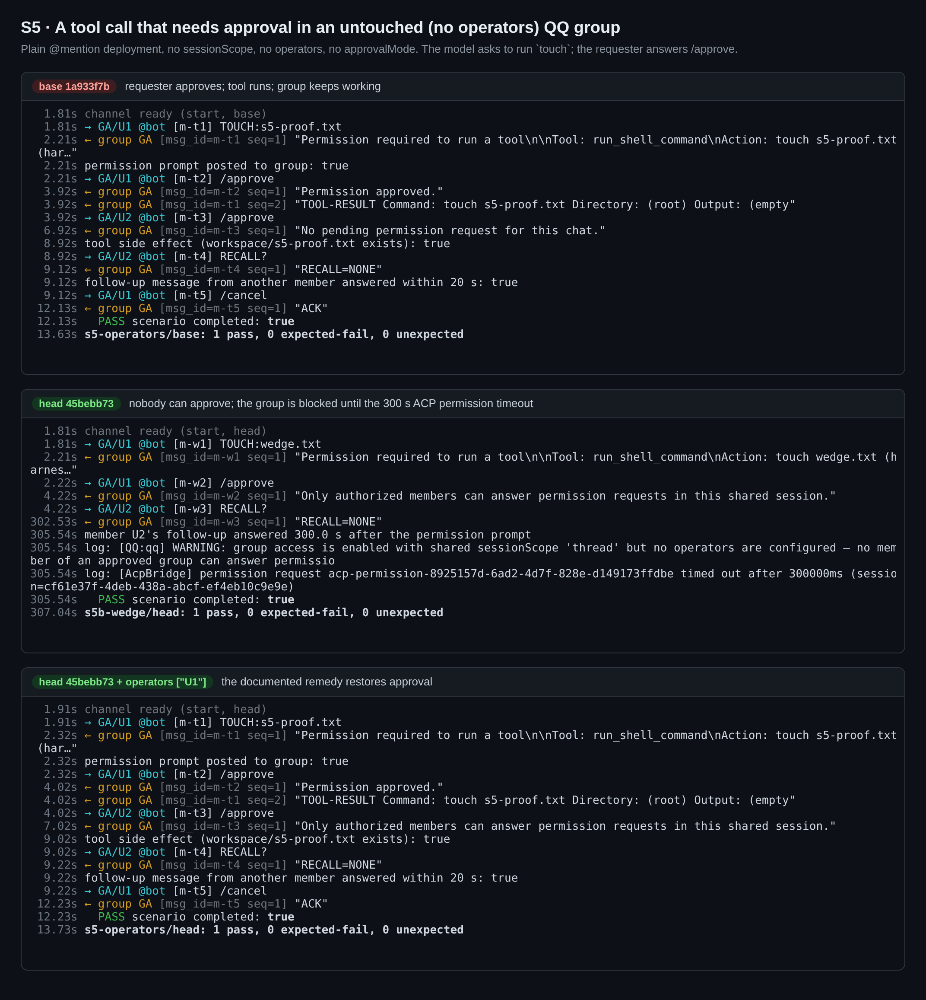
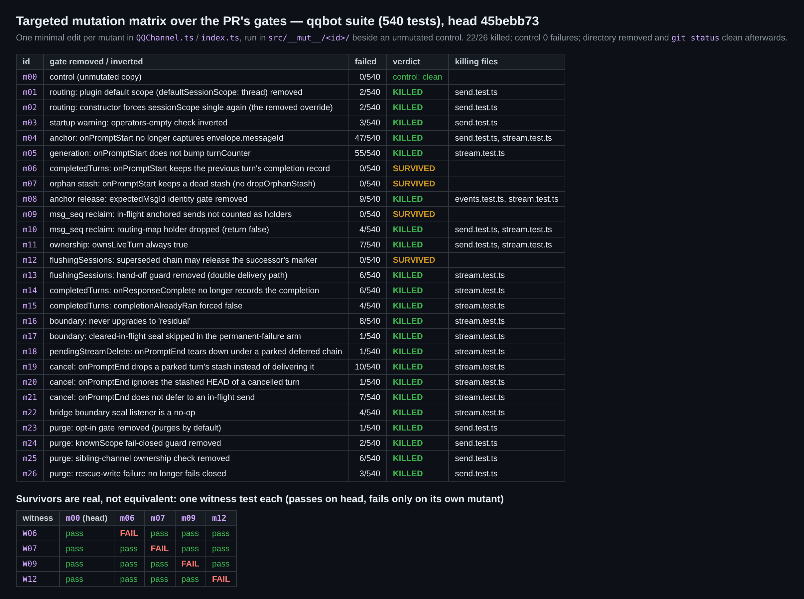

## Maintainer verification (round 3) — Linux, real stack, delta over the #8241 rounds

**Verdict: the code does what it claims and is merge-ready on correctness. Two things need a maintainer action before merging:**

1. **The branch conflicts with `main` again, in docs only.** The conflict is in `overview.md`, against the `email` row that #12939 added. I resolved it locally and the suites stayed green.
2. **The `operators` default needs an explicit decision.** I measured what an untouched QQ group sees after upgrading. It is worse than "nobody can answer the prompt": one tool call blocks the whole group for 5 minutes.

Everything else re-measured clean on Linux. That includes daemon mode and the inbound-media path that landed on `main` after round 2. Four flush-chain guards are not pinned by any test; witnesses are attached (non-blocking).

Verified head `45bebb73966c8d3a76a7e8931e846670ad31abcf` against base `1a933f7b5e` (its merge-base, the `main` it was merged with). Linux 6.12, Node 22.22. Earlier rounds on #8241: [round 1](https://github.com/QwenLM/qwen-code/pull/8241#issuecomment-5270862724) and [round 2](https://github.com/QwenLM/qwen-code/pull/8241#issuecomment-5963800765), both on macOS. This comment covers only what those rounds did not, plus a Linux re-run of the central claim.

**The merge into this PR carried no product change.** `git diff 05f4fd89 a7c79f5f` (round 2's PR patch) and `git diff 1a933f7b 45bebb73` (this PR's patch) are identical except for two context lines: an `import` neighbour, and the `events.test.ts` stub kept from #12850. Round 2's results therefore transfer. The new surface is how this code meets `main`'s newer code.

### Results — same harness and fake platform on both arms

| | Cell | base `1a933f7b` | head `45bebb73` |
|---|---|---|---|
| S1 | Central claim, re-run on Linux: `qwen channel start qq`, zero-config `groupAllPolicy:"all"` | keys `qq:U1:GA qq:U2:GA qq:U2:U2 qq:U3:GB`; cross-member recall `NONE`; DM `/clear` refused as a shared session; forced-`single` warning at boot | keys `qq:GA qq:GB qq:U2`; recall `PP-ALPHA`; GB and the DM stay isolated; DM `/clear` clears. **7/7** |
| S2 | **New:** inbound image (#12850) under the thread scope | the image stays in the sender's own session (U2's turn sees `FILES=0`) | the image becomes GA's group context (U2 sees `FILES=1`) and does not reach GB or the DM. An image turn that arrives mid-stream is queued and keeps its own `msg_id`. **11/11** |
| S3 | **New:** an operator's image message steers another member's stream. Both arms use `sessionScope:"thread"`, so only the seal/cancel machinery differs | the cancelled partial `chunk-1 chunk-2 chunk-3` is merged into the image reply and anchored to the image message | the partial is flushed alone on the cancelled turn's `msg_id`, 215 ms after the steer (including a 200 ms download), and the image reply goes out separately. **7/7** |
| S4 | **New:** daemon worker, `qwen serve --channel qq` (round 2 only reasoned this by construction) | same split brain as S1 (`routes.json` `qq:U1:GA …`; DM `/clear` refused) | same as S1: `routes.json` `qq:GA qq:GB qq:U2`. **7/7** |
| S5 | **New:** tool approval in an untouched group (no `operators`, no `approvalMode`) | the requester's `/approve` gets "Permission approved." and the tool runs | see Finding 1 |

The base arm passed S1 3, S2 9, S3 5 and S4 3 checks; its expected failures (S1 4, S2 2, S3 2, S4 4) are the known base defects, encoded as such. Neither arm had an unexpected failure. I ran S2 and S3 twice; the results were identical.

### Finding 1 — with the new default, one tool call blocks an untouched group for 5 minutes (decision needed, not a code defect)

I measured this on a plain @mention deployment with no `sessionScope`, `operators` or `approvalMode` set, which is what an existing zero-config deployment becomes after the upgrade.

1. The model asks to run `touch wedge.txt`, and the permission prompt is posted to the group.
2. The requester answers `/approve` and gets "Only authorized members can answer permission requests in this shared session." Every other member gets the same reply.
3. The tool does not run, and the requester never gets a closing message for that turn. **Every other member's message queues behind it.** U2's question was answered **300.0 s** later, exactly when `AcpBridge` timed out the permission request (`ACP_PERMISSION_RESPONSE_TIMEOUT_MS`). `/cancel` does not help, because it is queued too (`steer denied … queuing instead`).
4. With `operators: ["U1"]`, U1 can approve and the group keeps working. U2 is still refused, as documented.

On base, the requester approves their own prompt and the tool runs. The startup WARNING does fire, but only to stderr. So the concern triage raised is real and larger than stated: one approval-gated tool call silences the whole group for 5 minutes, and no one in the chat is told why. The options I can see are:

- (a) Accept this, with a release note saying that `operators` is required for groups.
- (b) When `operators` is empty, let the requester answer their own prompt. That is what base effectively allows, and it grants no group-wide control. It would be a `ChannelBase` change.
- (c) Keep this PR's routing fix, but don't flip the plugin default to `thread` until (b) or an equivalent lands.

### Finding 2 — four flush-chain guards are not pinned by any test (non-blocking)

Triage asked whether the flush chain's ownership gates are actually covered, which a green 540 cannot answer. I ran 26 single-edit mutants over the routing, anchor, generation, completion, boundary, cancel and purge gates, each in `src/__mut__/<id>/` beside an unmutated control, all in one vitest run. **22 were killed**, and the control had 0 failures.

The 4 survivors are not equivalent mutants. Each has a witness test that passes on head and fails only on its own mutant:

| Guard removed by the mutant | What the witness shows without it |
|---|---|
| `onPromptStart` drops a dead orphan stash | A stash left behind a turn-counter reset is prepended to the next turn's reply: `"STALE-HEAD fresh answer"`. |
| `isMsgSeqStillInUse` counts in-flight anchored sends | A cancelled turn's stash send, suspended in a token refresh, loses its counter when the successor turn starts and goes out as `msg_seq 1` again. QQ dedupes on `msg_id` + `msg_seq`, so it is silently dropped. |
| The flush chain's `.finally` releases `flushingSessions` only for its own state | After `onSessionDied`, the superseded chain's settle clears the successor's in-flight flush marker. |
| `onPromptStart` clears `completedTurns` | A completion record kept across a teardown aliases onto the restarted turn, so the turn's sealed head goes out early as its own message instead of waiting for the reply. |

The `msg_seq` and `flushingSessions` witnesses use only real method calls. The other two seed one map entry, to a state the code's own comments describe as reachable: a teardown keeps `completedTurns` while a flush marker is live, and `deleteTurnGenerationIfOwned` resets the counter without touching the stash. The witnesses are in the assets directory (`harness/witness/`), and adding them to `stream.test.ts` would pin these guards. This does not block the merge: the code is correct, but the suite does not prove it for these four guards.

### Finding 3 — needs a `main` merge (docs only)

`main` has moved to `612a5529` (#12939, the email channel). `git merge-tree` reports one conflict, in `docs/users/features/channels/overview.md`: this PR re-wraps the options table, and `main` adds `email` to the `type` row. The resolution is to keep the PR's table and add `email`. On that merged tree, qqbot passes 540/540 and channel-base 1463/1463. The same `main` commit adds a `canStartInboundTurn()` hook to `ChannelBase` (default `true`), which QQ does not override.

When the author pushes that merge, it is also the natural batch for the comment-label cleanup triage asked for (`R9-1`, `R12-*`, `R21 acceptance`). The harness below makes re-checking the new head cheap.

### Gates (head)

| Gate | Result |
|---|---|
| `npx vitest run` in `packages/channels/qqbot` | 8 files, **540 passed** |
| `config-utils.test.ts` in `packages/cli` | **120 passed** |
| `tsc --noEmit` (qqbot) | clean |
| `eslint --max-warnings 0` on the changed `.ts` files | clean |
| `prettier --check` on all 9 changed files | clean |
| Tree merged with `main` `612a5529`, conflict resolved | qqbot 540, channel-base 1463 |

### Not covered

- Real QQ credentials and the production platform. No macOS or Windows run this round (round 2 ran on macOS).
- Gateway RESUME/reconnect, cron flows and video attachments (I only tested images). The purge upgrade path: round 2 measured it end to end; this round covered only its four gates, by mutation.
- Image parts reaching the model. The fake model is text-only, so attachments reach it as file paths (`FILES=`) rather than image parts. The file reference is enough to show which session the media lands in.
- Natural orderings that produce the two seeded witness preconditions.

### Methodology

I built two worktrees, head and base, each installed with pnpm and fully built; each arm runs its own `packages/cli/dist/index.js`.

The fake QQ Open Platform serves the token endpoint, `/gateway`, and a WSS gateway (HELLO/IDENTIFY/READY/HEARTBEAT/DISPATCH). It also records `/v2/{groups,users}/:id/messages` and serves attachment downloads from `multimedia.nt.qq.com.cn`. All of it runs on real TLS with a harness CA (`NODE_EXTRA_CA_CERTS`), with real SNI and hostname checks.

`qwen channel start` reaches the fake platform through a `--require` DNS preload. `qwen serve` scrubs `NODE_OPTIONS` from its workers, so the daemon runs used temporary `/etc/hosts` entries instead, which were removed afterwards.

The model is a recording OpenAI-compatible server whose answer depends only on the history it receives (`RECALL=`, `FILES=`, `SLOW:n`, and a `touch` tool call). Harness, witnesses, ledgers, channel logs and per-run results: [`pr-13250/`](./).
