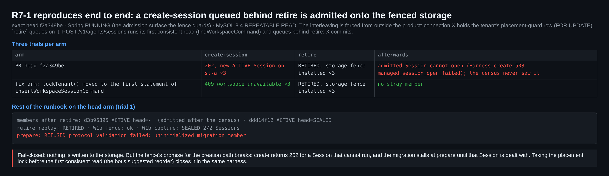

## Maintainer real-environment verification — round 3 @ `f2a349be` (delta)

**Verdict: one fix before merge, otherwise everything I tested holds.**

- **Fix before merge:** the review bot's new Critical [R7-1](https://github.com/QwenLM/qwen-code/pull/13260#discussion_r4190497344) reproduces end to end on the packaged stack, 3 of 3 trials. A public create-session that queues behind `retire` is admitted (`202`) onto the storage whose fence has just committed. The bot's one-line reorder closes it in the same harness, 3 of 3 (section 5).
- **Holds on a real x86_64 Linux host:** the production items the PR body still lists as unverified at `f2a349be`:
  - the full packaged process flow at the exact head;
  - power loss at every flush point of prepare → promote;
  - concurrent promote / abort / W1a restore-original;
  - pre-migration Runtime status / cancel / release after promotion.
- **Non-blocking:** two diagnostics items. N1 from round 1 still reproduces, and N8 is new on this thread.

This round covers only what [round 1 @ `c5dde7d5`](https://github.com/QwenLM/qwen-code/pull/13260#issuecomment-5994861788) and [round 2 @ `3bba3d879`](https://github.com/QwenLM/qwen-code/pull/13260#issuecomment-5998168167) did not.

**Merge state:** the head is unchanged since my run and already contains current main (`69d5db2ff2`).
- `scripts/check-flyway-migrations.js` reports 47 unique versions, and a fresh MySQL 8.4 database applies 47/47.
- In the hand-resolved conflicts of `f2a349be`, `WorkspaceMigrationAdmission.lockTenant` and main's `WorkspaceStorageKindGuard.lockDomain` take the same `lockPlacementDomain` lock. Keeping only main's call preserves fence/admission serialization, and both index additions survive.

| | |
| :-- | :-- |
| Host | Debian 13 KVM guest, kernel 6.12.63 **x86_64**, 16 vCPU / 29 GiB. Source and target are separate loop-backed ext4 volumes; history and state live on the root ext4. |
| Stack | MySQL 8.4.11 · Zulu OpenJDK 21.0.10 · Node 22.22.2. The packaged Spring jar (embedded Broker, durable local workers), the bundled `dist/cli.js` as Hosted Harness/worker, and the workspace-bundle / workspace-migration jars are all built from `f2a349be`. Every product process runs as a non-root service user. A fake OpenAI model drives real `write_file` / `read_file` calls. |
| Evidence | this directory: 5 cards, `harness/` (all scripts, the dm-log-writes replayer, both negative-control diffs, the R7-1 witness and fix-arm diff), `results/` (console logs, JSON, every maintenance command's stdout/stderr, artifact SHA-256s) |

### 1. Exact-head process flow on x86_64

- **Setup:** st-a holds 5 Files Sessions: 2 ACTIVE, 1 ARCHIVED, 1 CLOSED and 1 DELETED, all through the public API. One of them carries a pre-migration undo receipt. An unrelated st-b has its own live worker.
- **retire:** it stops the two live st-a workers and releases all 5 bindings. The st-b worker survives.
- **capture → copy → prepare → promote:** I copied the source with `cp -a` to another ext4 volume. Revision goes 1 → 2 exactly once, replays return identical receipts, and the fence is cleared. 4 of 45 snapshot tables change; the source and history trees do not.
- **After restart** with the new mapping and the same `QWEN_HOME`: cold loads return 200, new writes land only on the target, and undo works for both new and pre-migration prompts.
- **Suites on this host:**
  - Runtime Broker full suite: 719 tests, 4 skipped.
  - Managed Agent server full unit suite: 963 tests.
  - MySQL ITs: 24.
  - CLI (the PR's four test files): 127/127.
  - Server package checkstyle: passes.
  - No failures in any of them.

This is the first Linux process run at `f2a349be`, i.e. with main's #13289 (CSI runtime, durable worker ACK) merged in.

### 2. Pre-migration Runtime calls after promotion

After the restart, I called the Broker directly with the IDs of the 11 Runtime Sessions and 10 executions recorded under the old root:

| Call | Result |
| :-- | :-- |
| `:release` (11 Runtime Sessions) | `200 released=true` ×11 |
| execution status (10) | `200`, `settled`, with the original result |
| `:cancel` (10) | `200`, `settled`, `cancelRequested=false` |

- The pre-migration rows are byte-identical afterwards, and no worker starts at the source.
- An unknown id, the old id under another Harness Session, and a wrong Runtime id are all still refused.

**Negative control:** I repeated the run with `persistedSession()` reverted to the merge-base lookup.
- Release then returns `404 runtime_session_not_found` ×7 and `409 workspace_unavailable` ×4.
- Runtime scope keys include the canonical cwd, so after promotion only the PR's historical tenant/Harness/Runtime lookup finds the old rows.
- Status and cancel do not use that path and behave the same in both arms.

### 3. Concurrent operator commands

I ran 13 cycles on one storage, each a fresh operation from the storage's current root. Two kinds of interleaving:
- **Deterministic:** pause the promote JVM with SIGSTOP the moment its marker temporary appears in the target, run the competing command to completion, then resume.
- **Random:** start abort at 5–110 % of the measured promote time.

Results:
- Abort while promote is paused → ABORTED, and the resumed promote is refused (`migration_conflict`).
- A second promote while the first is paused → COMPLETED once, and the first is refused.
- W1a restore-original during PREPARED or during a paused promote → refused, and promote then completes.
- Abort at random offsets: abort won 4×, promote won 2×.
- promote ‖ promote ×3: exactly one wins each time.

After every cycle:
- The final state is COMPLETED or ABORTED, and the storage fence is cleared.
- COMPLETED means revision +1 exactly once; ABORTED leaves the revision unchanged.
- The target marker matches SQL, no temporary file is left, and the source marker is unchanged.

The storage ends at revision 14 and still serves a cold load and a write.

My earlier, unposted aarch64 run at `3bba3d87` used InnoDB lock-queue ordering instead of SIGSTOP, and its results agree: [evidence](https://github.com/wenshao/qwen-code/tree/64449eb2b19bde3019f1e3efdbb61ca64a5d2a5b/pr13260/r2).

### 4. Power loss at every flush point of prepare → promote

**Method:**
- The target ext4 sat on dm-log-writes, which records every write together with its FLUSH/FUA flags.
- A crash state is the log replayed up to one entry onto a zero image.
- I mounted each state through a dm-linear device with the same major:minor, so `st_dev` (part of the identity) does not change. Mounting replays the ext4 journal, as a reboot would.
- At each flush point I restored the SQL and bundle snapshot from that moment and ran plain `promote` with the shipped jar.
- Self-check: replaying the whole log reproduces the recorded device byte for byte.

**Results with the shipped jar:**
- **On-disk state:** 25 crash states lie between prepared and end. In every one, the marker is neither torn nor missing, the temporary file is absent or complete (never partial), and `e2fsck` is clean.
- **Durability:** at the last flush before the SQL commit returned, the new marker is already on disk.
- **Retry:** all 10 retries converge to COMPLETED rev 2 with the new marker and no temporary file.
- **Full stack:** after three representative cuts, Spring plus a fresh Harness cold-loads, writes, and undoes a pre-migration prompt, and W1a inspect matches.

**Negative control:** the four `force()` calls removed from `publishMigrationMarker`.
- No write reaches the device before the SQL commit.
- A cut right after the commit leaves SQL READY at rev 2, but the old marker on the target.
- The retry only replays the receipt. Turns fail (`hosted_turn_failed`), undo returns 409, and W1a inspect reports `marker=mismatch`.

So the harness detects the failure that those fsyncs prevent, and the shipped ordering prevents it.

### 5. R7-1 confirmed end to end, and the suggested fix verified

**Setup:** Spring stays running, since it is the admission surface the fence guards, and MySQL 8.4 runs at REPEATABLE READ. I forced the interleaving from outside the product:
1. Connection X holds the tenant's placement-guard row (`FOR UPDATE`).
2. `retire` queues on that row.
3. `POST /v1/agents/sessions` runs its first consistent read (`findWorkspaceCommand`) and queues behind `retire`.
4. X commits.

**Head, 3 of 3 trials:**
- `retire` installs the fence and reaches RETIRED.
- The create returns `202`, with a new ACTIVE Session on st-a.
- That Session cannot be opened: Harness create returns `503 managed_session_open_failed`.
- The census never saw it. The rest of the runbook then stalls: W1a fence and W1b capture (SEALED 2/2) succeed, but `prepare` refuses with `uninitialized migration member`.

**Fix arm, 3 of 3 trials:** the identical run with `lockTenant()` moved to the first statement of `insertWorkspaceSessionCommand` (diff in `harness/r7/`). The create is refused with `409 workspace_unavailable`, and no stray member appears.

**Impact:** this is fail-closed, since nothing is written to the storage. But the fence's promise for the creation path breaks. It needs Spring to be admitting during maintenance, which the runbook forbids, but the fence exists as the safety net for exactly that case.

### Non-blocking

- **N1 (round 1) still reproduces at `f2a349be`.**
  - When a single Session makes the first backup, `$QWEN_HOME/file-history` gets the same birth time and mtime as that Session's directory (here both are `07:35:08.702836911`).
  - New operations are then refused with `migration_history_unverified` before retire. A `touch` fixes it.
  - The README still doesn't say so.
- **N8 (new on this thread): a COMPLETED row can carry a stale error code.**
  - With two concurrent promotes, the COMPLETED row keeps `last_error_code = migration_not_writable` from the losing attempt (3 of 3 runs). `inspect` then shows `state=COMPLETED` together with that code.
  - Cause: the loser's `failed()` (`WorkspaceMigrationMain.java:101`) runs while the row is still PREPARED, and the winner's completing UPDATE (`WorkspaceMigrationStore.java:256`) doesn't clear the code.
  - Clearing `last_error_code` in that UPDATE would fix it. The same artefact showed up in the earlier aarch64 run; it belongs to the same family as round 1's N4.
- **Consistent with the README, not defects:**
  - An abort that lands after a promote's `requireOwner()` still lets that promote publish its marker into the abandoned target, before the SQL step refuses it. The README says abort leaves target artifacts.
  - After a migration, W1a `fence` / `restore-original` also need the canonical `QWEN_HOME`, and refuse without it, as documented.

### Not covered

- **Physical power cut and real block devices.** The dm-log-writes model replays flushed prefixes in order. It doesn't model a disk that loses or reorders flushes it already acknowledged.
- **Crashing anything but the target.** Only the target filesystem was cut. MySQL and the history/state volumes were restored from commit-boundary snapshots, not crashed.
- **MariaDB.** CI covers it.
- **Anything outside the Files profile** (excluded by design) and **cross-host** setups.

CI at this head: 26 success, 26 skipped, `review-pr` still running. GitHub still shows `CHANGES_REQUESTED` from earlier qwen-code-ci-bot rounds (merge state BLOCKED).

[中文版](REPORT.zh-CN.md)
