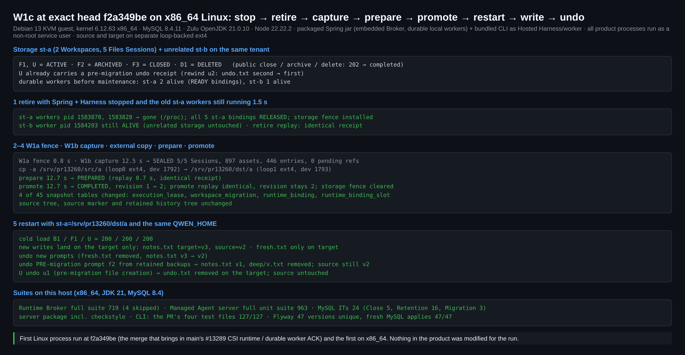
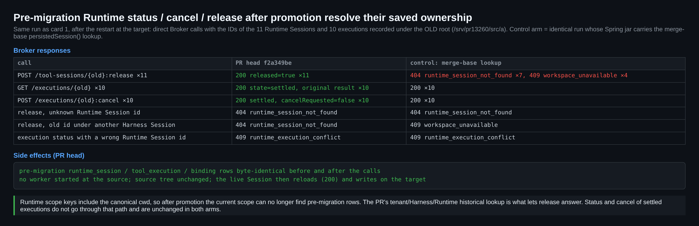
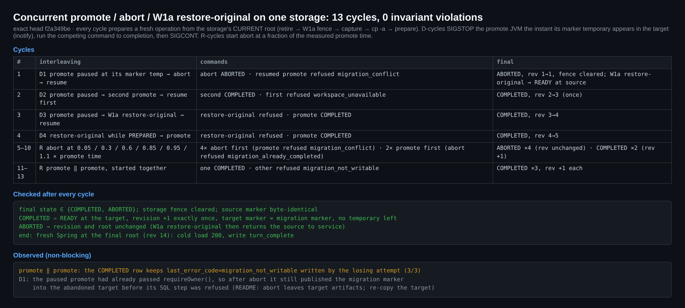
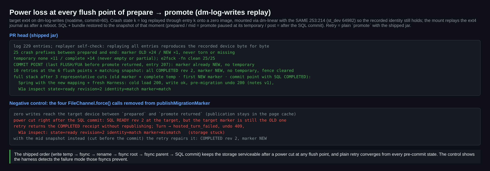

## 维护者真实环境验证 — 第 3 轮 @ `f2a349be`（增量）

**结论：当前 head 没有阻断项。** PR 描述在 `f2a349be` 上仍列为"未验证"的生产项，我在真实 x86_64 Linux 主机上都跑了，全部成立：

- 精确 head 的打包进程全流程；
- prepare → promote 每个 flush 点的断电；
- promote / abort / W1a restore-original 并发；
- 迁移后对迁移前 Runtime 的 status / cancel / release。

剩下两项非阻断的诊断问题：第 1 轮的 N1 仍可复现；N8 是本线程首次报告。

本轮只补 [第 1 轮 @ `c5dde7d5`](https://github.com/QwenLM/qwen-code/pull/13260#issuecomment-5994861788) 和 [第 2 轮 @ `3bba3d879`](https://github.com/QwenLM/qwen-code/pull/13260#issuecomment-5998168167) 没覆盖的部分。

**合并状态：** 我跑完后 head 没有变化，并且已包含当前 main（`69d5db2ff2`）。
- `scripts/check-flyway-migrations.js` 报 47 个版本全部唯一，全新 MySQL 8.4 库应用 47/47。
- `f2a349be` 中手工解决的冲突里，`WorkspaceMigrationAdmission.lockTenant` 与 main 的 `WorkspaceStorageKindGuard.lockDomain` 取的是同一把 `lockPlacementDomain` 锁。只保留 main 的调用不影响 fence 与准入的串行化，两处索引新增也都保留了。

| | |
| :-- | :-- |
| 宿主 | Debian 13 KVM 虚拟机，内核 6.12.63 **x86_64**，16 vCPU / 29 GiB。源与目标是两个独立的 loop ext4 卷；history 和 state 在根 ext4 上。 |
| 栈 | MySQL 8.4.11 · Zulu OpenJDK 21.0.10 · Node 22.22.2。打包的 Spring jar（内嵌 Broker、durable 本地 worker）、作为 Hosted Harness/worker 的 `dist/cli.js`、workspace-bundle / workspace-migration jar 都由 `f2a349be` 构建。所有产品进程以非 root 服务用户运行。假 OpenAI 模型驱动真实的 `write_file` / `read_file` 调用。 |
| 证据 | this directory：4 张卡片、`harness/`（全部脚本、dm-log-writes 回放器、两份反向对照 diff）、`results/`（控制台日志、JSON、每条维护命令的 stdout/stderr、产物 SHA-256） |

### 1. x86_64 上的精确 head 进程全流程（图 r3-01）

- **准备：** st-a 有 5 个 Files Session：2 个 ACTIVE、1 个 ARCHIVED、1 个 CLOSED、1 个 DELETED，均经公共 API 操作。其中一个带迁移前的 undo 回执。无关的 st-b 有自己的存活 worker。
- **retire：** 停掉 st-a 的两个存活 worker，释放全部 5 个绑定。st-b 的 worker 保持存活。
- **capture → 拷贝 → prepare → promote：** 用 `cp -a` 把源拷到另一个 ext4 卷。revision 1 → 2 只发生一次，重放回执完全相同，fence 已清除。45 张快照表中有 4 张变化，源目录树和 history 目录树都不变。
- **用新映射、同一 `QWEN_HOME` 重启后：** 冷加载返回 200，新写入只落在目标上，新 prompt 和迁移前 prompt 都能 undo。
- **本机测试：**
  - Runtime Broker 全量：719 个，跳过 4 个。
  - Managed Agent server 全量单测：963 个。
  - MySQL IT：24 个。
  - CLI（PR 改动的 4 个测试文件）：127/127。
  - server 打包 checkstyle：通过。
  - 全部没有失败。

这是 `f2a349be`（已合入 main #13289：CSI runtime、durable worker ACK）上的首次 Linux 进程级运行。

### 2. 迁移后对迁移前 Runtime 的调用（图 r3-02）

重启后，我用旧根下记录的 11 个 Runtime Session 和 10 个 execution 的 ID 直接调用 Broker：

| 调用 | 结果 |
| :-- | :-- |
| `:release`（11 个 Runtime Session） | `200 released=true` ×11 |
| execution status（10 个） | `200`、`settled`，带原始结果 |
| `:cancel`（10 个） | `200`、`settled`、`cancelRequested=false` |

- 迁移前的相关行调用后逐字节不变，源上也没有启动 worker。
- 未知 id、挂在其他 Harness Session 下的旧 id、错误的 Runtime id，仍然全部被拒绝。

**反向对照：** 把 `persistedSession()` 还原为合并基线的查找逻辑后重跑。
- release 返回 `404 runtime_session_not_found` ×7、`409 workspace_unavailable` ×4。
- Runtime scope key 包含规范 cwd，所以 promote 之后只有 PR 新增的 tenant/Harness/Runtime 历史查找能找到旧记录。
- status 和 cancel 不走这条路径，两组结果相同。

### 3. 运维命令并发（图 r3-03）

同一存储跑了 13 个周期，每个周期都从存储的当前根目录新建一个操作。交错方式有两类：
- **确定性：** 目标中一出现 marker 临时文件，就用 SIGSTOP 暂停 promote 的 JVM，让竞争命令跑完后再恢复。
- **随机：** 在实测 promote 耗时的 5%–110% 之间启动 abort。

结果：
- promote 暂停时执行 abort → ABORTED，恢复后的 promote 被拒（`migration_conflict`）。
- 第一个 promote 暂停时再执行一个 promote → 只 COMPLETED 一次，第一个被拒。
- 在 PREPARED 阶段或 promote 暂停时执行 W1a restore-original → 被拒，之后 promote 正常完成。
- 随机偏移的 abort：abort 先完成 4 次，promote 先完成 2 次。
- promote ‖ promote 共 3 次：每次恰好一个成功。

每个周期结束后：
- 最终状态是 COMPLETED 或 ABORTED，存储 fence 已清除。
- COMPLETED 时 revision 恰好 +1；ABORTED 时 revision 不变。
- 目标 marker 与 SQL 一致，没有残留临时文件，源 marker 不变。

存储最终停在 revision 14，仍可冷加载和写入。

我此前在 `3bba3d87` 上做过一次未发布的 aarch64 运行，用 InnoDB 锁排队而不是 SIGSTOP 来控制顺序，结果一致：[证据](https://github.com/wenshao/qwen-code/tree/64449eb2b19bde3019f1e3efdbb61ca64a5d2a5b/pr13260/r2)。

### 4. prepare → promote 每个 flush 点的断电（图 r3-04）

**方法：**
- 目标 ext4 放在 dm-log-writes 上，它连同 FLUSH/FUA 标志记录每一次写入。
- 一个崩溃状态，就是把日志回放到某一条为止，写到全零镜像上。
- 每个状态都通过同一 major:minor 的 dm-linear 设备挂载，所以 `st_dev`（身份的一部分）不变。挂载时会回放 ext4 日志，与重启后一样。
- 在每个 flush 点，恢复该时刻的 SQL 与 bundle 快照，再用发布的 jar 直接执行 `promote`。
- 自检：完整回放日志，得到的设备与录制时逐字节一致。

**发布 jar 的结果：**
- **磁盘状态：** prepared 到 end 之间共 25 个崩溃状态。每个状态下 marker 都没有撕裂或缺失，临时文件要么不存在、要么完整（从未出现部分写入），`e2fsck` 全部干净。
- **持久性：** SQL 提交返回前的最后一个 flush 点上，新 marker 已经落盘。
- **重试：** 10 次重试全部收敛到 COMPLETED rev 2，新 marker，无临时文件。
- **全栈：** 选三个有代表性的断电点，Spring 加新 Harness 都能冷加载、写入、undo 迁移前的 prompt，W1a inspect 也一致。

**反向对照：** 删除 `publishMigrationMarker` 中的 4 个 `force()` 调用。
- SQL 提交之前没有任何写入到达设备。
- 提交后立刻断电：SQL 已是 READY rev 2，目标上却还是旧 marker。
- 重试只会重放回执。Turn 失败（`hosted_turn_failed`），undo 返回 409，W1a inspect 报告 `marker=mismatch`。

可见这套装置能检测出这些 fsync 所防范的故障，而发布版的写入顺序确实防住了它。

### 非阻断项

- **N1（第 1 轮）在 `f2a349be` 上仍可复现。**
  - 由单个 Session 做出第一个备份时，`$QWEN_HOME/file-history` 的 birth time 和 mtime 与该 Session 目录完全相同（这里都是 `07:35:08.702836911`）。
  - 之后新建操作会在 retire 之前就被 `migration_history_unverified` 拒绝，`touch` 一下即可。
  - README 仍未说明这一点。
- **N8（本线程首次报告）：COMPLETED 行可能带着过期的错误码。**
  - 两个 promote 并发时，COMPLETED 行保留失败方写入的 `last_error_code = migration_not_writable`（3 次全中），`inspect` 会同时显示 `state=COMPLETED` 和这个错误码。
  - 原因：失败方的 `failed()`（`WorkspaceMigrationMain.java:101`）执行时行还是 PREPARED，而胜出方完成时的 UPDATE（`WorkspaceMigrationStore.java:256`）没有清空错误码。
  - 在该 UPDATE 里清空 `last_error_code` 即可。此前的 aarch64 运行里也出现过同样的现象；与第 1 轮的 N4 属同一类问题。
- **与 README 一致，不算缺陷：**
  - 如果 abort 落在某个 promote 的 `requireOwner()` 之后，该 promote 仍会把 marker 发布到已废弃的目标中，然后才在 SQL 步骤被拒。README 已说明 abort 会留下目标上的产物。
  - 迁移完成后，W1a `fence` / `restore-original` 同样需要规范的 `QWEN_HOME`，缺失时按文档拒绝。

### 未覆盖

- **物理断电与真实块设备。** dm-log-writes 模型按顺序回放已 flush 的前缀，不模拟磁盘丢失或重排已确认 flush 的情况。
- **目标以外的崩溃。** 只对目标文件系统做了断电；MySQL 和 history/state 卷是从提交边界的快照恢复的，没有真正崩溃。
- **MariaDB。** CI 已覆盖。
- **Files profile 以外的场景**（按设计排除）和**跨主机**部署。

当前 head 的 CI：26 个成功、26 个跳过，`review-pr` 仍在运行。GitHub 上仍显示早先几轮 qwen-code-ci-bot 留下的 `CHANGES_REQUESTED`（合并状态为 BLOCKED）。

[English](REPORT.md)
