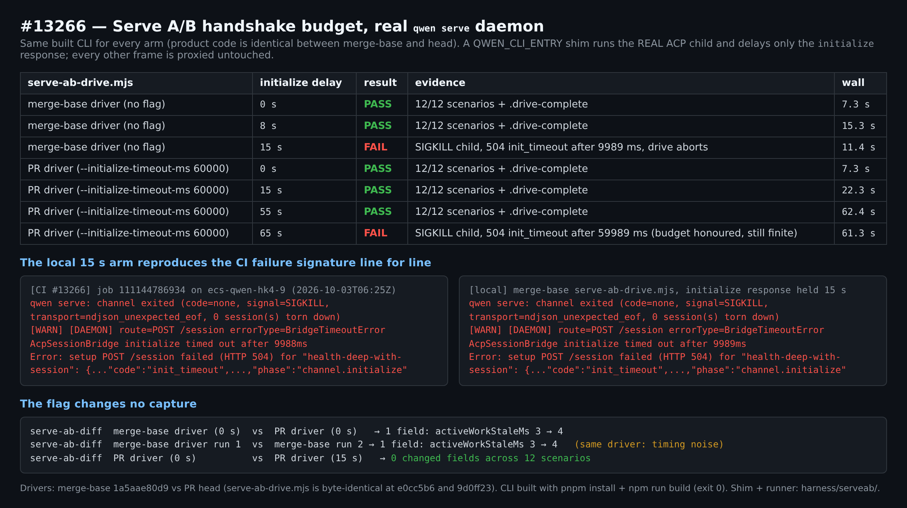
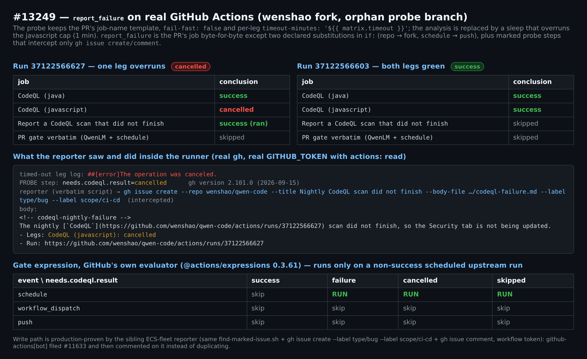
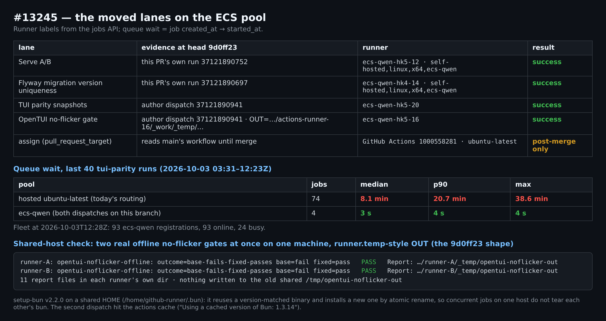
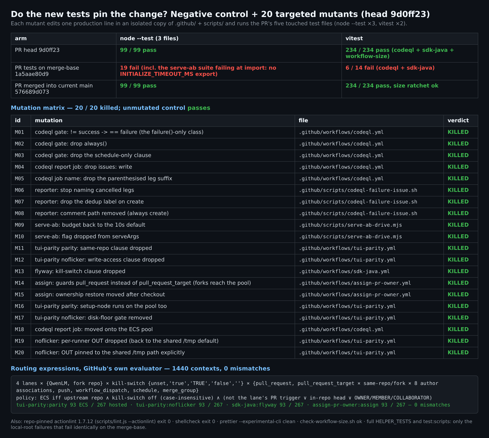

# PR #13270 verification

## Maintainer verification: real-environment run at `9d0ff23`

**Verdict: ready to merge from my side.** I verified all three fixes by running them, not by reading the diff:
- the serve-ab budget against a real `qwen serve` daemon;
- the CodeQL notifier on real GitHub Actions;
- the routing with GitHub's own expression evaluator, plus the pool's live job data.

The new tests fail on the merge-base and kill all 20 targeted mutants. Only one thing can't be observed before merge: `assign` on the pool. Both of its runtime dependencies are already proven on that pool.

Head verified: `9d0ff23f11`, which includes the follow-up that scopes the no-flicker report dir. Six files are byte-identical between `e0cc5b6` and `9d0ff23`: `serve-ab-drive.mjs`, `codeql.yml`, `codeql-failure-issue.sh`, `find-marked-issue.sh`, `sdk-java.yml` and `assign-pr-owner.yml`. So the runs I did on `e0cc5b6` for those files still apply.

### 1. #13266: Serve A/B handshake budget, against a real daemon

- I built the CLI (`pnpm install --frozen-lockfile` + `npm run build`, exit 0). I then drove that one build with both the merge-base `serve-ab-drive.mjs` and the PR's version; the PR changes no product code.
- A `QWEN_CLI_ENTRY` shim runs the **real** ACP child and delays only the `initialize` response. Every other frame passes through untouched.
- **Merge-base driver, 15 s delay:** `channel exited (… signal=SIGKILL …)`, `AcpSessionBridge initialize timed out after 9989ms`, `504 init_timeout`. That matches the #13266 CI log line for line (9988 ms there).
- **PR driver:**
  - It passes with 15 s and 55 s delays.
  - At 65 s it fails with `timed out after 59989ms`. So the flag reaches the daemon, and the budget is still finite.
  - A truly hung child now costs about 60 s per leg instead of 10 s, because the drive stops at the first failed setup step (measured: 61.3 s).
- **Captures:**
  - PR driver with no delay vs a 15 s delay: 0 changed fields across 12 scenarios.
  - Merge-base vs PR driver: only `activeWorkStaleMs` 3→4. Running the same merge-base driver twice gives the same 3→4, so it's timing noise. That field is also the entire serve-ab bot comment on this PR (4→6), so that comment does not show a real response change.

### 2. #13249: CodeQL notifier on real GitHub Actions

- **Probe setup:** an orphan branch on my fork.
  - The `codeql` matrix keeps the PR's job-name template, `fail-fast: false` and the per-leg `timeout-minutes: '${{ matrix.timeout }}'`. A sleep stands in for the analysis and overruns the javascript leg's cap.
  - `report_failure` is the PR's job byte-for-byte except two declared changes in `if:`: the fork repo, and `push` instead of `schedule`.
  - Probe-only steps intercept `gh issue create/comment`; every read stays real.
- **Run where one leg overran:**
  - That leg ends `cancelled` (`##[error]The operation was canceled.`), and `needs.codeql.result` reads `cancelled`.
  - `report_failure` still runs, because of `always()`.
  - With real `gh` 2.101.0 and the job's `actions: read` token, the unmodified script wrote `Legs: CodeQL (javascript): cancelled` and called `gh issue create … --label type/bug --label scope/ci-cd`.
- **Run where both legs passed:** `report_failure` was skipped. A copy of the job with the PR's `if:` unchanged was skipped on both runs.
- **GitHub's evaluator** (`@actions/expressions` 0.3.61) on the PR's exact `if:`: the job runs only for `schedule` × {failure, cancelled, skipped} on `QwenLM/qwen-code`. All 24 contexts match.
- **Issue writing already works in production.** The ECS-fleet reporter uses the same steps with the workflow token: `find-marked-issue.sh`, `gh issue create --label type/bug --label scope/ci-cd`, and `gh issue comment`. `github-actions[bot]` filed #11633 and then commented on it instead of opening duplicates.
- Issues created with `GITHUB_TOKEN` don't trigger `issues`-event workflows, so neither triage nor autofix picks these up.

### 3. #13245: the moved lanes

- **Routing:** I ran GitHub's evaluator on the four exact `runs-on` expressions over 1,440 contexts:
  - upstream or fork repo;
  - five kill-switch values;
  - every trigger;
  - same-repo or fork head;
  - eight author associations.

  All 1,440 match the stated policy, including the value `'TRUE'` (`==` is case-insensitive in expressions) and `pull_request_target` for `assign`.
- **At `9d0ff23`:**
  - `Serve A/B` ran on `ecs-qwen-hk5-12` and `Flyway` on `ecs-qwen-hk4-14`, both green.
  - Your dispatch put the two tui-parity jobs on `ecs-qwen-hk5-20` and `-16`, both green.
  - `assign` still ran on a hosted runner, as expected.
- **Queue wait across the last 40 tui-parity runs (2026-10-03, 03:31–12:23Z):**
  - Hosted (74 jobs): median 8.1 min, p90 20.7 min, max 38.6 min.
  - ECS (4 jobs): 3–4 s.
  - Fleet at 12:28Z: 93 `ecs-qwen` registrations, all online, 24 busy.
- **Shared-host checks:**
  - For `9d0ff23`, I ran the real offline no-flicker gate twice at once on one machine, each with its own runner-temp-style `OUT`. Both reported `base-fails-fixed-passes` / PASS. Each wrote its own 11 report files, and nothing went to `/tmp/opentui-noflicker-out`.
  - `setup-bun` v2.2.0 writes to the shared `/home/github-runner/.bun`. I read its source: it reuses a binary when the version matches and otherwise installs with an atomic `rename`. So two jobs on the same host can't corrupt each other's bun.
  - On a reused workspace, Flyway's `git clean -ffdx` took about 4 s; the whole job took 18 s.

### 4. Do the tests actually pin the change?

- **PR head:** node 99/99; vitest 234/234 (codeql, sdk-java, workflow-size).
- **PR tests copied onto the merge-base:** 19 node failures (one of them is the serve-ab suite failing at import: no `INITIALIZE_TIMEOUT_MS` export) and vitest 6/14 failing.
- **Mutants:** I made 20 one-line changes to the PR's production code. The tests catch all 20, and the unmodified copy passes. The mutants include:
  - reverting the gate to `failure()` only;
  - dropping `always()`;
  - guarding `pull_request` instead of `pull_request_target` for `assign`, which would let forks onto the pool;
  - moving the ownership restore after checkout;
  - reverting the budget to 10 s;
  - both ways of breaking the new `OUT` pin.
- **Other gates:** all pass:
  - repo-pinned actionlint 1.7.12 (`scripts/lint.js --actionlint`);
  - shellcheck;
  - prettier `--experimental-cli`;
  - `check-workflow-size.sh`.
- **Full `HELPER_TESTS` and `test:scripts`:** the only failures also fail on the merge-base. They are permission tests in unrelated suites that can't pass when run as root.
- **Merged into current `main` (`576689d073`):** the merge is clean, and the touched suites and the size ratchet pass.

### Not verified, and notes (none blocking)

- **`assign` on the pool can't be observed before merge,** because `pull_request_target` reads `main`'s workflow.
  - Its routing is covered by the evaluator check above.
  - Its runtime dependencies are proven on the same pool: `node` by the Flyway lane, and `gh` by the Serve A/B merge-base step on `ecs-qwen-hk4-9`.
  - To exercise it before merge, this takes the ECS route and its dry-run path only reads: `gh workflow run assign-pr-owner.yml --ref ci/13245-13249-13266-ci-fixes -f number=13270 -f dry_run=true`.
- Two issues that predate this PR and are outside its scope:
  - The serve-ab comment reports `activeWorkStaleMs` as a change, but it's timing noise. `serve-ab-diff.mjs` could normalise it.
  - Both ECS dispatches printed `QWEN_API_KEY not set — running offline scripted-stream gate`, so CI doesn't currently run the live-model branch of the no-flicker gate.

Evidence (figures, `REPORT.md`, harness, raw logs): this directory

### Reproduce

- `harness/serveab/slow-acp-shim.cjs` + `harness/serveab/run-arm.sh <arm> <serve-ab-drive.mjs> <hold-ms>`: real daemon A/B (needs a built `packages/cli/dist`). Results and logs: `data/serveab/`.
- `harness/probe/gen.py`: regenerates `harness/probe/.github/workflows/*.yml` from the PR's `codeql.yml` text; push them alone on an orphan branch of a fork. Job logs: `data/probe/`.
- `harness/eval-routing.mjs <worktree>`: GitHub's evaluator (`npm i @actions/expressions@0.3`) over the verbatim expressions. Output: `data/eval-routing.out`.
- `harness/mutants.py`: the 20 mutants plus control. Output: `data/mutants-r2.json`.
- `harness/noflicker-two-runners.sh`: two concurrent offline no-flicker gates with runner-scoped `OUT`.
- Queue census: `data/census/`.
