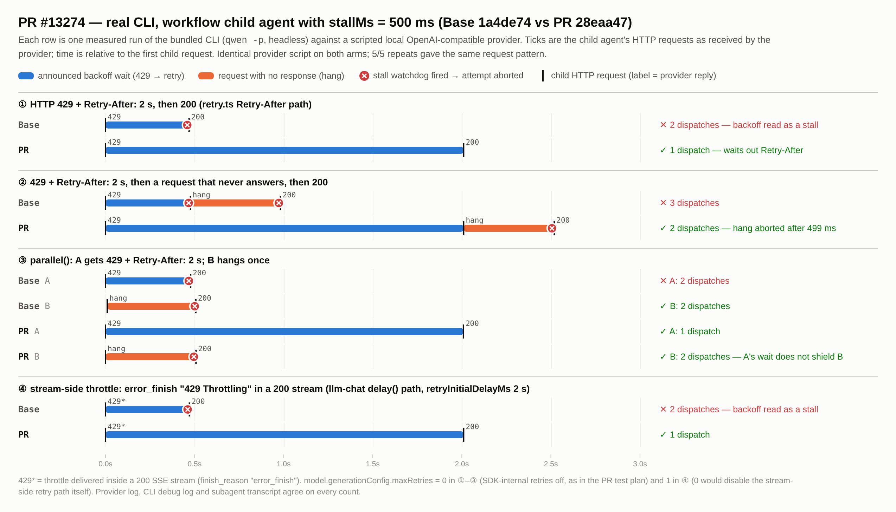
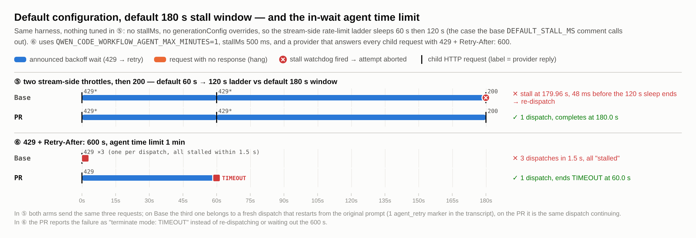
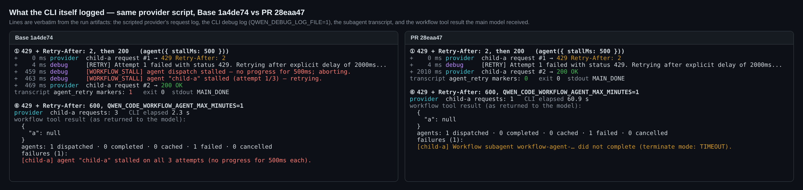

## Maintainer verification: real CLI A/B on a local rig at `28eaa47`

**Verdict: ready to merge.** I rebuilt the merge-base and the PR head and ran the real bundled CLI against the same scripted provider. Every behavior the PR claims reproduces, including the default-config case the PR was written for. The two regressions I looked for (main-session retries and plain `Agent`-tool subagents) don't happen. Reverting the behavior turns exactly 42 of the PR's new tests red. One non-blocking test-gap suggestion is below.

### Rig
- I built two arms from source on Linux with Node 22.22.2 (`npm run build && npm run bundle`). **Base** is the merge-base `1a4de74` and **PR** is `28eaa47`. The PR bundle contains the PR's own strings (`Agent time limit reached during a retry wait.`) and the base bundle doesn't.
- The CLI runs as `node dist/cli.js -p … --approval-mode yolo --auth-type openai` against a hand-rolled local OpenAI-compatible provider. The provider answers each workflow-child request according to a script. It can send HTTP 429 with `Retry-After`, a 200 SSE stream that carries an `error_finish` throttle, a request it never answers, or a normal reply. The main model calls the `workflow` tool with an inline script (`agent(prompt, { stallMs })` / `parallel()`).
- I counted dispatches three independent ways, and the three counts matched in every run:
  - the provider's request log;
  - the CLI's own debug log (`[WORKFLOW_STALL] … stalled (attempt n/3) — retrying.`);
  - the `agent_retry` markers in the subagent transcript.
- That's 64 CLI runs in total. The four core cases ran 6× per arm with identical request patterns.

### Results

| # | Scenario | Base `1a4de74` | PR `28eaa47` |
| :-- | :-- | :-- | :-- |
| ① | 429 + `Retry-After: 2` → 200, `stallMs` 500 | 2 dispatches: re-dispatched 468–476 ms into the 2 s wait | **1 dispatch**, retry at +2010 ms (6/6) |
| ② | 429 + `Retry-After: 2` → a request that never answers → 200 | 3 dispatches | **2 dispatches**, and the hung request is aborted 498–499 ms after it starts (6/6) |
| ③ | `parallel()`: A gets 429 + `Retry-After: 2`, B hangs once | A 2, B 2 | **A 1, B 2**: A's wait doesn't shield B (6/6) |
| ④ | stream-side throttle (`error_finish` "429 Throttling" inside a 200 stream, the `llm-chat` `delay()` path), `retryInitialDelayMs` 2 s | 2 dispatches | **1 dispatch** (6/6) |
| ⑤ | **all defaults**: no `stallMs`, no generation overrides; two stream throttles, so the 60 s → 120 s ladder runs against the 180 s window | watchdog fires at 179.96 s, 48 ms before the 120 s sleep ends, then re-dispatches | **1 dispatch** |
| ⑥ | 429 + `Retry-After: 600`, `QWEN_CODE_WORKFLOW_AGENT_MAX_MINUTES=1` | 3 dispatches, all "stalled", `agent()` returns `null` after 1.5 s | **1 dispatch**, `terminate mode: TIMEOUT` at 60.0 s after a single request (2/2) |
| ⑦ | SIGINT 300 ms into a 30 s `Retry-After` | exit 130 after 38 ms, no further request | exit 130 after 43 ms, no further request |
| ⑧ | SIGINT 3 s into a 30 s `Retry-After` | the run ends before the SIGINT: all 3 attempts stalled within 1.5 s, exit 0 with `agent()` = `null` | exit 130 after 47 ms, 1 request in total |
| ⑨ | regression check: the main session gets 429 + `Retry-After: 2` (no observer installed) | answer after 2.78 s | same (2.79 s) |
| ⑩ | regression check: a plain `Agent`-tool subagent (no opt-in) gets 429 + `Retry-After: 2` | 429, then 200 after +2.0 s | same |
| ⑪ | known gap: default SDK retries (3× 429 + `Retry-After: 2`, `stallMs` 5 s) | 1 stall | 1 stall: same, as the PR's Risk & Scope states |

**Notes**
- ④ and ⑤ cover a path the PR's own end-to-end run couldn't reach. The test plan sets `model.generationConfig.maxRetries: 0`, and in `llm-chat.ts` that field also caps the stream-side rate-limit retries (`maxRateLimitRetries = cgConfig?.maxRetries ?? RATE_LIMIT_RETRY_OPTIONS.maxRetries`). With 0, the 60/120/240/300 s ladder never runs. ⑤ reproduces the motivating case end to end with nothing tuned.
- ⑪ puts a number on the gap the PR already lists as out of scope. With `maxRetries` unset, the OpenAI SDK (`DEFAULT_MAX_RETRIES = 3`) honors a `Retry-After` under 60 s by itself and sleeps without announcing it. Under the default 180 s window, that silent time is at most 3 × <60 s. So it only matters with a small `stallMs`, or with a provider that keeps answering 429 with a `Retry-After` close to 60 s.
- The PR merges cleanly onto current `main` (`09411aa`). The only shared file is `llm-chat.ts`, where `main` added an unrelated guard at the top of `sendMessageStream`.

### Unit tests and mutation
- **The six touched test files pass 1101/1101 on the PR head** (38 s). The broader related suites (`src/agents/runtime`, `baseLlmClient`, `turn`, `tools/workflow`, `utils/retry*`, `llm-chat*`) give 2414 passed, 0 failed, 7 skipped.
- **Negative control:** I reverted the seven behavior files to base and kept `retry-wait.ts`, the new event type, and the PR's tests. Exactly 42 tests fail, all of them new, and the other 1059 stay green.
- **Mutation testing:** 36 targeted single-line mutants. 29 are killed. One of the 29 is "remove the `setTimeout` chunking", which kills by sending `workflow-stall.test.ts` into a 100%-CPU spin instead of failing it. 7 survive:
  - Five are equivalent or purely defensive along every event order that can actually happen:
    - dropping an expired wait in `arm()`;
    - adopting an expired wait as the time base;
    - republishing a duplicate `start`;
    - the early-wake re-check in the deadline timer;
    - the parent-abort check in the deadline timer.

    Every `arm()` call that can follow an expiry either marks activity or adds a wait that expires later. `beginRetryWait` ids are unique, and the watchdog dedupes starts again. The deadline is at most 100 min, so its timer never chunks. When a parent abort settles the wait, the round closes and clears the timer.
  - Removing the `closed` guard in the round observer: the test pins a late *end* but not a late *start*. The guard is defensive, and I found no path that produces a late start.
  - **Measuring the in-wait deadline from the round's start instead of the agent's start.** This is the one gap worth a test. `measures the limit from the original start and shares it across waits` runs a single round, and that round's scope is created at `startTime`, so the test can't tell the two apart. With the mutation, a multi-round agent can overrun its limit by almost the whole limit. I wrote a two-round probe: round 1 spends 50 s and calls a tool, round 2 parks in a 2 h backoff, and the limit is 1 min. It ends at **60.0 s on the PR** and at **110 s under the mutation**.

### Suggestions (non-blocking)
1. Add the two-round time-limit test above. The ready-to-paste snippet is `harness/suggested-test-time-limit-across-rounds.ts.txt` in the assets.
2. In `splits an over-long wait instead of overflowing setTimeout`, assert the delay handed to `setTimeout`, or bound the fake-timer advance. As written, a regression there hangs the unit job instead of failing it.

The triage nits are real but harmless, and I have nothing to add to them: the catch-all mapping to TIMEOUT, the deadline timer that isn't `unref()`'d, and reusing `getRemainingTimeMs`.

### Not verified
- **macOS / Windows.** The changes are platform-independent timer and AsyncLocalStorage logic, and CI ran on Linux.
- **Node 24.** This rig is Node 22, the same as CI, and the author ran Node 24. So AsyncLocalStorage propagation into the lazily iterated stream has now been seen working on both versions.
- **Real provider traffic.**

Evidence: figures, raw per-run data (`data/scenario-runs.jsonl`, `data/mutants.json`, `data/unit-tests.json`) and the full harness are in this directory.
