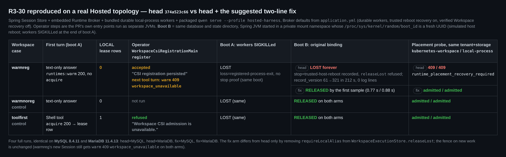
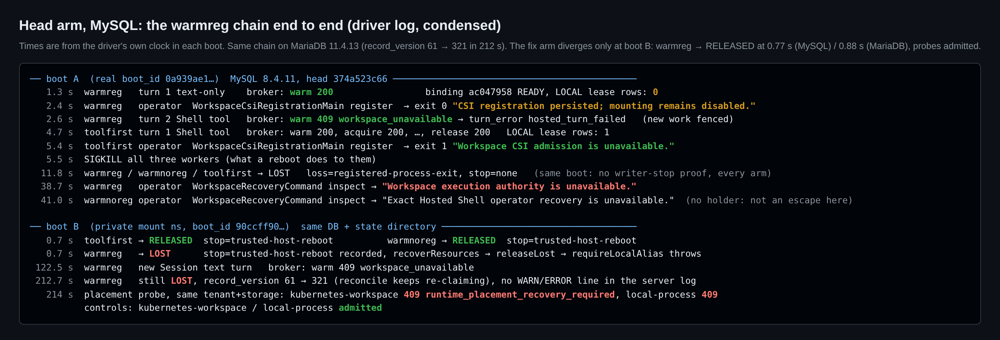
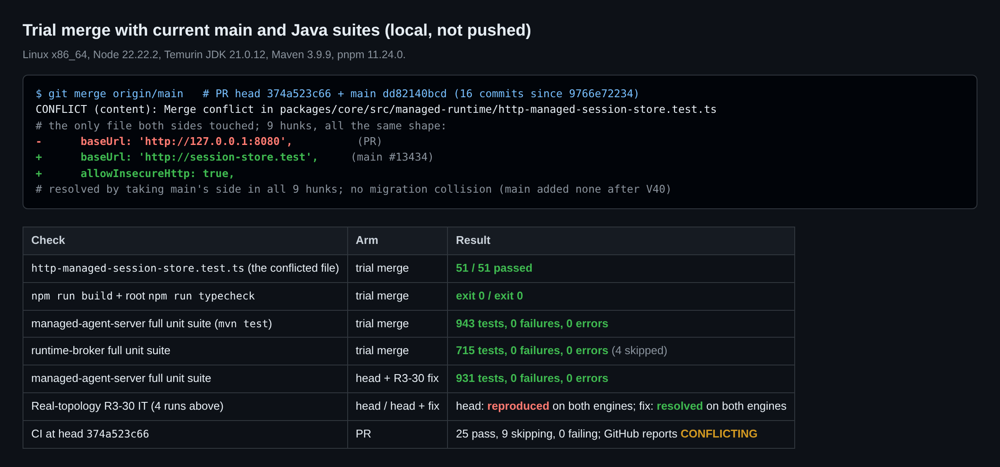

# 真实环境复验（第五轮）— PR #13289 @ `374a523c66`

## 结论

**在 Broker 默认配置下，R3-30 在真实 MySQL 8.4 与 MariaDB 11.4 上端到端复现；两行修复在两个引擎上都能解决，且没有回归。** 自[第四轮](https://github.com/QwenLM/qwen-code/pull/13289#issuecomment-5988780326)以来 head 未变，本轮只覆盖两项新内容：[R3-30](https://github.com/QwenLM/qwen-code/pull/13289#discussion_r4183943611)，以及与当前 main 的合并冲突。

### 默认配置下可达，不需要手写数据库行

- 每个 Hosted turn 都会调用 `runtimes:warm`；只有真正执行工具的 turn 才调用 `tool-sessions:acquire`，也只有它（经 `claim`）会写 LOCAL lease 行。
- 因此，一个 Workspace 只要到目前为止只有纯文本回复，它的 LOCAL binding 就是 READY，但 lease 行为 **0**。此时可信入口 `WorkspaceCsiRegistrationMain register` 会接受同一 tenant 与 storage 的 CSI 别名注册。
- 一旦跑过工具 turn，同样的注册会被拒绝，报错 "Workspace CSI admission is unavailable."。

### 在下一次主机重启时卡死

- 默认是 durable worker。同一次开机内 worker 死亡后，binding 变为 `LOST`，只有 loss 证据（`registered-process-exit`）。这是既有行为，各臂一致。
- 对 local-process worker，writer 已停止的证明只有两个来源：可信重启回收、运维 attestation。
- 运维恢复不适用于从未持有挂载的 binding：`WorkspaceRecoveryCommand inspect` 返回 "Exact Hosted Shell operator recovery is unavailable."。
- 所以退休这类 binding 的唯一路径是可信重启回收，而 `releaseLost` 里的 `requireLocalAlias` 恰好拒绝了这条路径。

### 模拟重启后的表现

- **对照组**：两个对照 binding 在首个采样点（不到 1 秒）即为 `RELEASED`。
- **注册了 CSI 的那个 binding**：已记录 `stop=trusted-host-reboot`，但仍一直停在 `LOST`。
- **新放置被拒**：同一 tenant 与 storage 的新放置被拒为 409 `runtime_placement_recovery_required`，包括运维刚注册的 `kubernetes-workspace`，以及 `local-process`。
- **静默重试**：Broker 不断重新认领该 binding（212 秒内 record_version 从 61 涨到 321），日志里没有任何 WARN/ERROR。
- **无法撤销**：没有任何生产路径会删除 `managed_workspace_csi_registration` 行；`WorkspaceCsiRegistrationMain` 只支持 `register` 和 `inspect`。

### 修复在两个引擎上都有效

修复只删掉 `WorkspaceExecutionStore.releaseLost` 里的两行 `requireLocalAlias`，与作者描述的未推送提交 `271ddbd80` 的生产改动一致。

- 卡住的 binding 分别在 0.77 秒（MySQL）和 0.88 秒（MariaDB）变为 `RELEASED`，两种放置探针都被接纳。
- 该 Workspace 上的新工作仍被拒绝（`warm` 409 `workspace_unavailable`），获取路径上的栅栏不变。
- 带修复的 managed-agent-server 全量测试通过：931 项，0 失败。
- 这在作者的 H2 检查之外，补充了真实 MySQL/MariaDB、Broker、worker 与 `qwen serve` 的覆盖。修复推送后，我会用同一套 A/B 再跑一遍。

### 合并冲突是机械性的

相对 main `dd82140bcd`，双方都改过的只有 `http-managed-session-store.test.ts`：9 处相同形态的 `baseUrl` 片段，对应 #13434。采用 main 一侧后：

- 该文件 51/51 通过；
- build 与 typecheck 均 exit 0；
- managed-agent-server 943 项 0 失败；runtime-broker 715 项 0 失败（4 项跳过）；
- 没有迁移号冲突：main 在 V40 之后没有新增迁移。

### 合并前仍待处理

推送 R3-30 修复、解决冲突、维护者对 F2 的裁决（不变）。

## 复现方法

临时 `HostedVerify13289IT`（不属于本 PR）运行真实拓扑：

- 内嵌 Runtime Broker 的 Spring Session Store；
- bundle 出来的 durable local-process worker；
- 打包的 `qwen serve --profile hosted-harness`，经一个记录代理驱动，配合一个假 OpenAI 模型（要么纯文本回答，要么调用 Shell 工具）。

Broker 使用 `application.yml` 默认值：durable worker 开、可信重启回收开、verified Workspace recovery 关。运维步骤以独立 JVM 运行 PR 自带的 `WorkspaceCsiRegistrationMain` 和 `WorkspaceRecoveryCommand`，连接同一数据库。

三个 Workspace，各自使用独立的 LOCAL storage：

| 用例 | 第一次开机 | 作用 |
| :-- | :-- | :-- |
| `warmreg` | 纯文本 turn → 运维注册 CSI → Shell turn | R3-30 链路 |
| `warmnoreg` | 纯文本 turn，不注册 | 对照：同样状态，无别名 |
| `toolfirst` | Shell turn（写入 lease 行）→ 运维注册 CSI | 对照：守卫拒绝 |

运行顺序：

1. **第一次开机**：结束时 SIGKILL 本次运行的所有 worker（重启对它们的效果就是这样），再观察 30 秒。
2. **第二次开机**：同一数据库、同一 state 目录。Spring JVM 及其 worker 在私有 mount namespace 中启动，`/proc/sys/kernel/random/boot_id` 被 bind-mount 为新 UUID。`LocalRuntimeStore.rebooted()` 比较的正是该文件与登记中的 `bootId`；`machine-id`、pid namespace、time namespace 都不变。**主机本身没有重启。**
3. **第二次开机后的检查**：观察 120 秒，然后每个 Workspace 新建一个 Session，再做放置探针。探针用新的 isolation key、原 scope 与 storage，kind 分别为 `kubernetes-workspace` 和 `local-process`，调用 `JdbcRuntimeBindingRepository.findOrCreate`。

两个臂与运行次数：

- **head** = `374a523c66`；
- **fix** = head 删掉那两行（[patch](harness/r3-30-suggested-fix.patch)）；
- 共 4 次完整运行：head×MySQL 8.4.11、head×MariaDB 11.4.13、fix×MySQL、fix×MariaDB，两个引擎结果一致。

verified Workspace recovery 模式未运行。从代码看，该模式下 `WorkspaceStorageGuard.register` 会预先写入 LOCAL lease 行，因此 CSI 注册会被拒绝；这个窗口只存在于默认值 `false` 的配置下。

## 证据

**R5-01 — head 与 fix、三个用例、两个引擎：**

**R5-02 — head 臂（MySQL）上 `warmreg` 的完整链路：**

**R5-03 — 与 main `dd82140bcd` 的试合并及 Java 测试：**

## 可选加固（不阻塞，可放到 #13395）

- `register` 也可以在该别名仍有非 `RELEASED` 的 LOCAL binding 时拒绝；
- 对反复失败的 `LOST` 回收打一次日志。

## 环境

Linux x86_64、Node 22.22.2、Temurin JDK 21.0.12、Maven 3.9.9、pnpm 11.24.0；MySQL 8.4.11 与 MariaDB 11.4.13 运行在 Docker 中。运行时间 2026-10-05 13:27–13:58 UTC。head 上 CI 为 25 通过、9 跳过、0 失败；GitHub 显示 `CONFLICTING`。
