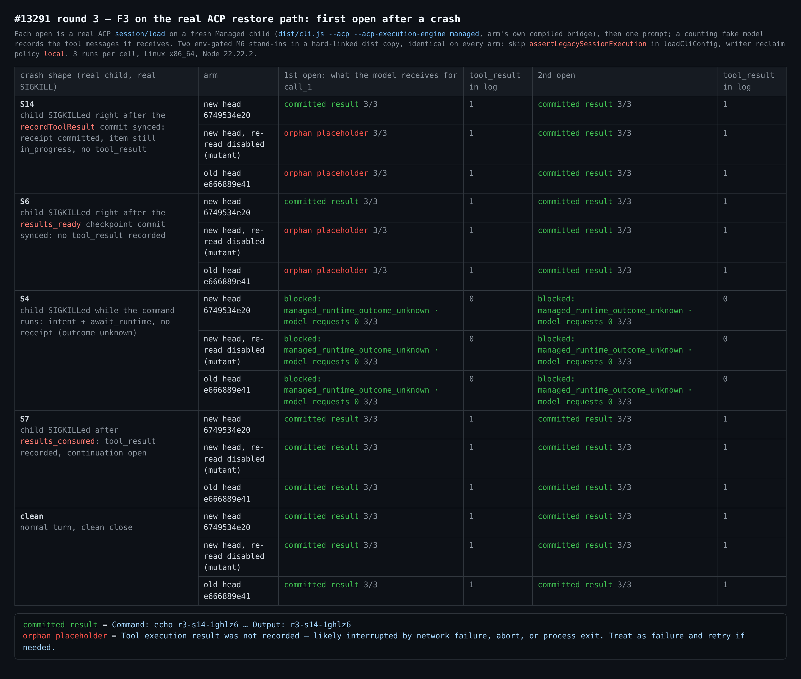
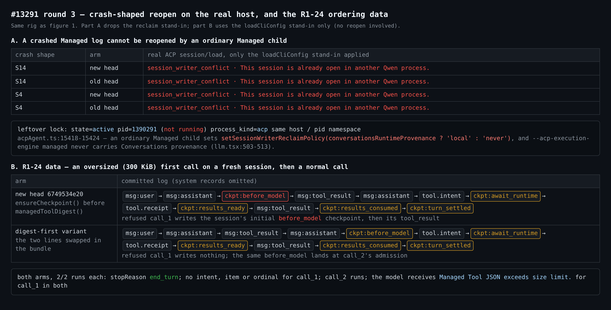
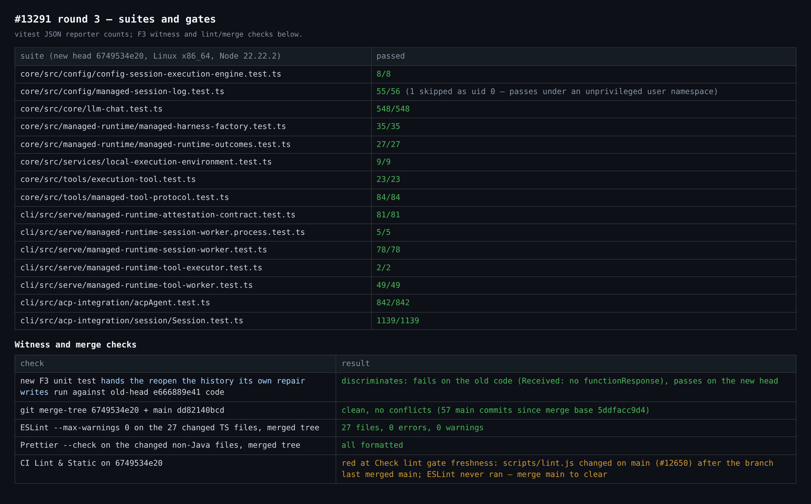

## 真实环境验证第 3 轮 — #13291，head `6749534e20`

承接[第 1 轮](https://github.com/QwenLM/qwen-code/pull/13291#issuecomment-5976679027)（`6661312f9b`）和[第 2 轮](https://github.com/QwenLM/qwen-code/pull/13291#issuecomment-5992012476)（`e666889e41`）。本轮只验证增量：F3、`6749534e20` 中的其他改动，以及 [autofix 总结](https://github.com/QwenLM/qwen-code/pull/13291#issuecomment-5995067025)里升级给维护者的 R1-24 问题。装置是新搭的，运行在 Linux x86_64、Node 22.22.2 上；第 1、2 轮跑在 macOS arm64 上。

**结论：F3 已修复，本轮代码没有引入新缺陷。** 这一结论也覆盖真实的 ACP 恢复路径，PR 自己的测试和第 2 轮都没走到这条路径。**合并前请先合入 `main`：** CI `Lint & Static` 是红的，但卡在新鲜度检查上，不是 lint 错误。下面有两条备注，一条留给 M6，一条是 R1-24 的数据；都不阻塞合并。

- **F3 已修复，经真实 ACP `session/load` 验证。** 崩溃后的日志由一个全新的 Managed 子进程重开，再发一轮提示。
  - S14 和 S6：新 head 在**第一次**打开时就把已提交的结果交给模型（6/6）。
  - 旧 head，以及只关闭了重读的新 head 打包变异体，交给模型的都是孤儿占位文本（12/12）。
  - 所有 arm 的第二次打开都正确；每次打开后该调用的 `tool_result` 恰好 1 条，没有重复补记。
- **所有 arm 上仍然成立：** S4（从未结算）两次打开都以 `managed_runtime_outcome_unknown` 阻塞，模型请求为 0。S7（`results_consumed`）和正常关闭的会话重开都正常。
- **新增单测能抓住这个回归：** `hands the reopen the history its own repair writes` 在旧 head 的代码上失败（`Received:` 中没有 `functionResponse`），在新 head 上通过。
- **R2-12、R2-21/R2-25 不改变行为：**
  - `tryParseHarnessCheckpointV1` 只接受**同时**带有 `in_progress` 条目和 `dispatch` 绑定的 `await_runtime`（`managed-harness-checkpoint.ts:1014-1016、1067-1069`），因此被删的那条文案本来就不可达。
  - `restoreRecordedResults` 的提前返回只是跳过一次结果没人用的扫描。S4 走这个分支，仍然以相同的原因文案阻塞；S14、S6 走完整分支并完成修复。
- **Lint 门禁：** `Check lint gate freshness` 失败，是因为 `main` 在本分支合并基点 `5ddfacc9d4` 之后由 #12650 改了 `scripts/lint.js`，所以 ESLint 在这个 head 上根本没跑。本地检查：
  - `6749534e20` 与 `main` `dd82140bcd` 合并无冲突。
  - 在合并后的树上，27 个改动的 TS 文件 ESLint `--max-warnings 0` 通过（0 错误、0 警告），改动的非 Java 文件 Prettier 通过。
  - 合入 `main` 并推送即可消除这个门禁。

### 1. 真实 ACP 恢复路径上的 F3

**重开的驱动方式：**

- **路由：** 用该 arm 自己编译出的 `createAcpSessionBridge`，`select: () => 'managed'`，把 `session/load` 交给打包产物的全新子进程（`dist/cli.js --acp --acp-execution-engine managed`）。
- **恢复路径：** 子进程走自己真实的 `loadSession` → `Config` 恢复 → ACP `Session` → `GeminiClient`。
- **模型：** 计数假模型记录 load 之后那一轮提示里携带的工具消息。
- **模拟的部分：** 重开 Managed 日志需要两处 M6 替身。两者都在 `dist/` 的硬链接副本中由环境变量门控，所有 arm 完全相同：
  1. 在 `loadCliConfig` 里跳过 `assertLegacySessionExecution`。设计文档的「Risks for later slices」已经把这一项划给 M6。
  2. 把 writer 回收策略从 `never` 改成 `local`（见备注 A）。
- **崩溃状态：** 子进程内的 `--require` 预加载会在指定的提交行 fsync 完成后立即 SIGKILL 自己：`recordToolResult` 得到 S14，`harness:results_ready` 得到 S6，`harness:results_consumed` 得到 S7。S4 在 `sleep` 运行期间杀掉子进程。每种崩溃状态都已在磁盘上核实。

### 2. 备注

**A. 普通 Managed 子进程无法重开崩溃后的 Managed 日志。** 这是 M6 的前置条件，不是回归：回收策略早于本 PR 就存在，合并基点和 `main` 上是同一行，本 PR 也没有改 `acpAgent.ts`、`llm.tsx` 或 writer lease。不加回收替身时，所有崩溃形态的重开都以 `session_writer_conflict`（"This session is already open in another Qwen process."）失败，两个 head 上的 S14、S4 都是如此，见图 2 的 A 部分。

- **原因：** 残留的锁记录的是已死子进程的 pid，同主机、同 pid 命名空间。`acpAgent.ts:15418-15424` 给普通 Managed 子进程的回收策略是 `never`。只有 Conversations 子进程是 `local`，而 `--acp-execution-engine managed` 会拒绝 Conversations provenance（`llm.tsx:503-513`）。
- **影响：** 下面两条表述在 `Config` 层成立（默认策略为 `local`，PR 的测试和第 2 轮都在这一层），但在现有 ACP 宿主上，要等有人回收这把锁之后才能走到：
  - M5b 设计文中的「an open after the child crashed — first repairs what the log already proves」；
  - 验收第 4 条里的「fresh open of a crashed child's log」。
- **对用户的影响：** M6 之前没有任何地方注册 Managed，因此目前不影响用户。
- **建议：** 在「Risks for later slices」里现有 `loadCliConfig` 那条旁边补一条（中英文同步）：M6 宿主必须决定由谁回收崩溃的 Managed 子进程的 writer 锁。这也影响延后的 R3-2 见证：`Config` 层的崩溃测试会通过，而 ACP 宿主会拒绝同样的打开。

**B. R1-24：供决策的数据。** 第 2 轮所写的「F2 现在在写入前就拒绝」不够准确，评审的探测是对的。

- **当前 head：** 在会话的第一个调用上，`ensureCheckpoint()` 会在 `managedToolDigest()` 拒绝之前提交会话初始的 `before_model` checkpoint（图 2 的 B 部分，红框）。
- **这是唯一的写入：** 被拒的调用没有 intent、没有条目、也没有 ordinal。
- **digest 前置变体**（在打包产物中把这两行对调）对被拒的调用不写任何东西；同一个 `before_model` checkpoint 改在下一个调用准入时落盘。
- **可见结果相同：** 两种顺序的提交集合相同，模型看到的消息相同，回合都以 `end_turn` 结束（各 2/2 次）。
- **建议：** 这个选择没有运行时后果。我倾向选项 (a)：收窄注释和测试名。它没有风险，并且被阻塞的日志仍然先报告阻塞、再报告大小错误，正是评审指出的优先级。选项 (b) 在打包产物上也验证可行。两者都不影响合并。

与第 2 轮相同、未改变的一点：被拒的超大调用交给模型的仍是 `Managed Tool JSON exceeds size limit.`，不是「未运行」的形式。

### 3. 测试套件与门禁（新 head）

| 套件 | 结果 |
| --- | --- |
| core `managed-runtime-outcomes` · `managed-session-log` · `managed-tool-protocol` | 27/27 · 55/56（1 项因 uid 0 跳过，在非特权 user namespace 中通过）· 84/84 |
| core `managed-harness-factory` · `config-session-execution-engine` | 35/35 · 8/8 |
| core `llm-chat` · `execution-tool` · `local-execution-environment` | 548/548 · 23/23 · 9/9 |
| cli `managed-runtime-session-worker` · `.process`（真实子进程） | 78/78 · 5/5 |
| cli `managed-runtime-tool-worker` · `tool-executor` · `attestation-contract` | 49/49 · 2/2 · 81/81 |
| cli ACP `Session.test.ts` · `acpAgent.test.ts` | 1139/1139 · 842/842 |

`6749534e20` 上的 CI：`Test (ubuntu-latest)` 和 Java 各车道（ubuntu 11/17/21、macOS、Windows）为绿，Runtime Broker + Managed Agent MariaDB、Real daemon E2E、Integration (no-AK)、Serve A/B、Desktop Shell、TUI parity 也为绿。`Lint & Static` 卡在上面说的新鲜度检查。Java 代码自第 2 轮以来没有改动。

**PR 描述：** 有两处已过时，可以顺手更新。

- 测试计划写 `managed-runtime-outcomes` 有 15 项，现在是 27 项。
- 「Risk & Scope」仍把「已结算但未消费的回合的恢复」列为 M6；设计文档现在只把被阻塞会话的恢复留给 M6。

证据（装置、`harness/m6-standins.md` 中的打包补丁、每次运行的日志、套件 JSON）：本目录。
