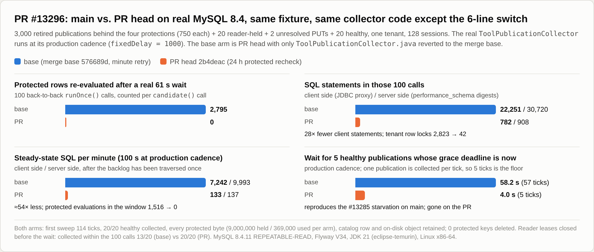
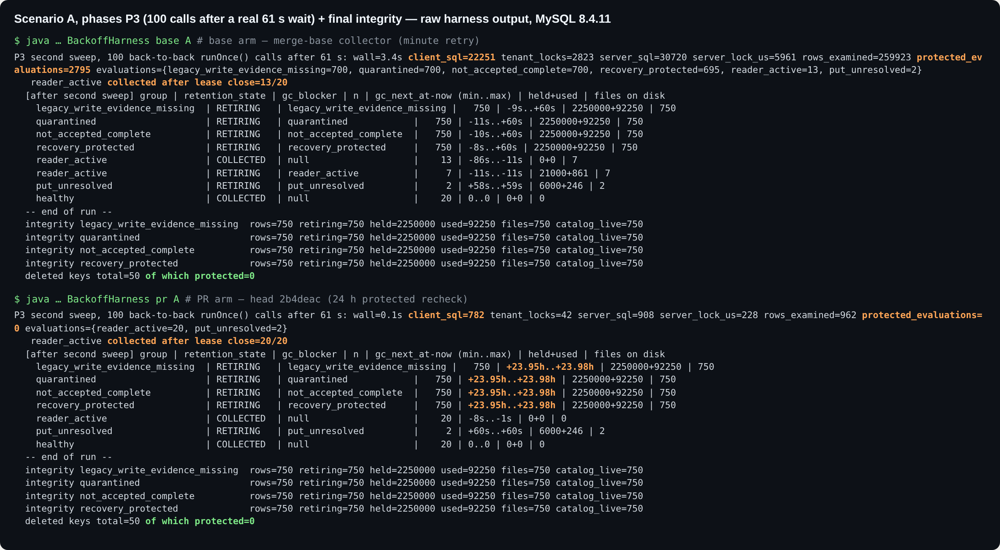
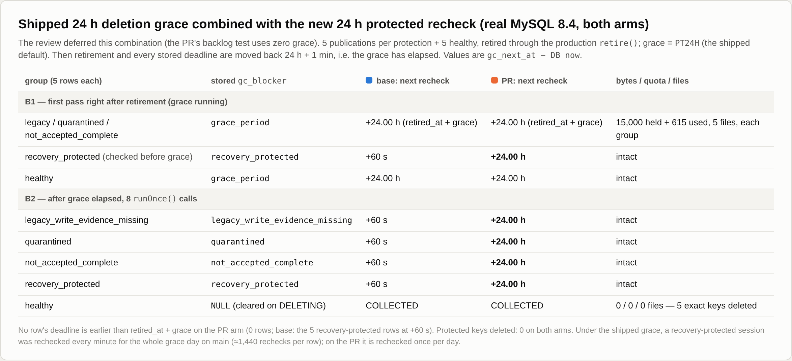
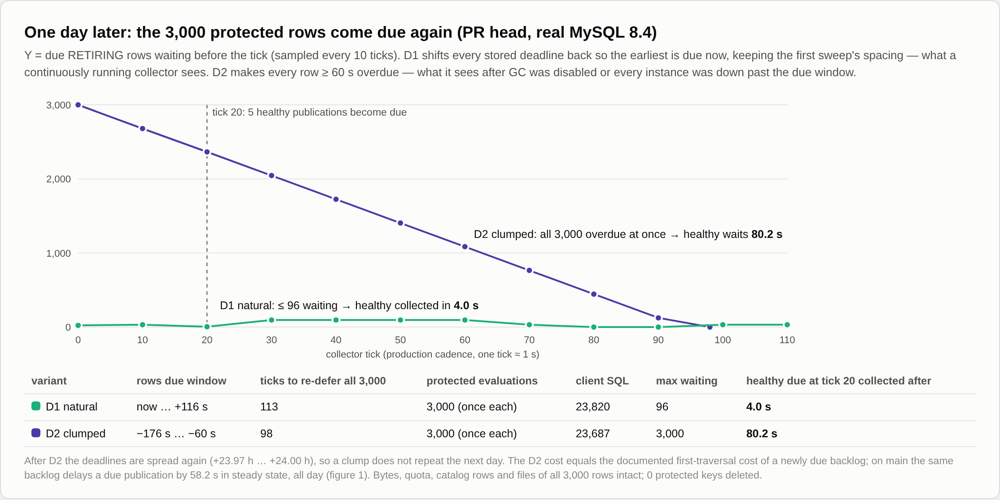
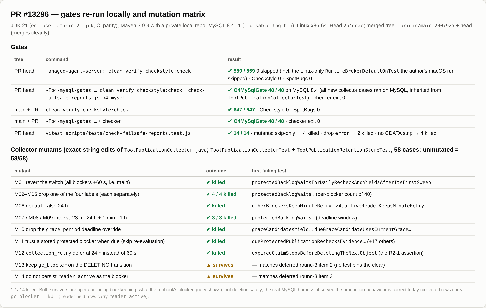

## 维护者验证：PR #13296 @ `2b4deacb7f`（第 1 轮）

**结论：可以合入。** 我在真实 MySQL 8.4 上按生产节拍运行真实 collector，PR 的行为与描述一致。首轮遍历之后，四类稳定保护对应的行要到次日才会再次评估，期间其字节、配额、catalog 行和对象全部保留。其他 blocker 仍按一分钟重试。我还在 `main` 上复现了 #13285 的饥饿现象：刚到期的 publication 排在受保护积压后面，等了 **58.2 秒**；PR 上只等 **4.0 秒**，这已是每 tick 回收一个、共 5 个 publication 的下限。PR head 和合入当前 `main` 后的树上，模块全量测试、O4 MySQL 门禁和报告检查器均通过。没有阻塞问题。文末列出两项可选的测试补充和一句可选的 runbook 补充。

### 测试方式

- **代码树。** 独立 worktree 分别检出 head `2b4deac` 和 merge base `576689d`，另取 `origin/main 2007925` 合入 head，合并无冲突。merge base 之后 `main` 改过 `ToolPublicationStore`（#13217），所以 §5 也测了合并后的树。
- **环境。** JDK 21（`eclipse-temurin:21-jdk`，与 CI 一致），Maven 3.9.9 使用私有本地仓库，MySQL 8.4.11（REPEATABLE-READ，关闭 binlog，tmpfs），Linux x86-64。
- **独立 harness。** `harness/BackoffHarness.java` 放在模块自身的包里，基于构建产物编译，未修改任何 PR 文件。它在全新的 Flyway V34 schema 上驱动真实 `ToolPublicationCollector`，每个 publication 在文件系统对象存储里都有真实文件。
- **造数尽量走生产路径：**
  - legacy 行使用 V30 的 `write_evidence` 默认值；
  - 隔离走 `quarantineResource()`；
  - 恢复保护由 `retire()` 作用于 `BLOCKED_RESOURCE` 的 journal head 产生；
  - reader 持有真实的 `read()` 租约；
  - 未决 PUT 由 `put()` 加响应丢失产生。
- **SQL 双重计数：** 客户端用 JDBC 代理计数，服务端用 `performance_schema` digest 计数。
- **双臂同构建。** base 臂是 head 的构建产物，只把 `ToolPublicationCollector.class` 换成从 merge base 源码重新编译的版本。两份源码 `diff` 后只差那 6 行 switch，其余被测代码逐字节相同。
- **时间平移。** 没有真等 24 小时，而是像 PR 自己的测试那样平移已存储的截止时间。61 秒的等待是真实挂钟时间。

### 1. 修复有效，且 `main` 上确实存在它要解决的饥饿



- **第二轮扫描。** 真实等待 61 秒后，连续调用 100 次 `runOnce()`：
  - 受保护行重评估 **2,795 → 0**；
  - 客户端 SQL **22,251 → 782**（服务端 30,720 → 908）；
  - tenant 行锁 2,823 → 42。
- **稳态**（生产节拍运行 100 秒）：客户端每分钟 SQL **7,242 → 133**（服务端 9,993 → 137）。
- **grace 截止时间恰好到达的健康 publication**（5 个）：从 **58.2 秒 / 57 tick 降到 4.0 秒 / 5 tick** 回收。
- **`main` 上一分钟重试的 blocker 也被拖慢。** 等待前我关闭了 reader 租约。随后的 100 次调用内，`main` 只回收了其中 13/20，PR 回收 20/20。
- **首轮遍历。** 两臂都是 114 个 tick：PR 上受保护评估 3,000 次；`main` 上 3,030 次，因为早评估的行在扫描结束前又到期了。可见 PR 不改变首轮成本，与 PR 描述一致。
- **完整性（两臂）。** 3,000 条受保护行均保持 `RETIRING`，持有 9,000,000 字节 / 已用 369,000 字节，catalog 行仍有效，磁盘文件仍在，受保护 key 删除数为 0。未决 PUT 保持 60 秒重试。



### 2. 出厂 24 小时 grace 与 24 小时复查叠加（第 3 轮评审延后项 1）



- **grace 期间**，三类保护在两臂中都存为 `grace_period`，截止时间为 `retired_at + 24 h`。grace 覆盖逻辑仍然优先。
- **`recovery_protected` 在 `candidate()` 中先于 grace 判断。** 因此在 `main` 上，这类 session 在整个 grace 日内每 60 秒重查一次（每行约 1,440 次）；PR 上每天一次。
- **grace 过后**，四类保护在 PR 上延到 +24 小时，在 `main` 上为 +60 秒；健康行在两臂都正常回收。PR 上没有任何已存截止时间早于 `retired_at + grace`。

### 3. 次日



- **保留首轮间隔时**，重扫速度能跟上到期速度：任一 tick 前最多 96 行在等待，重扫中途到期的健康 publication 4.0 秒即被回收。
- **所有行同时逾期时**，重扫变成一次集中爆发。这发生在 GC 被关闭或所有实例宕机、且持续时间超过原始扫描耗时之后。此时健康 publication 等了 80.2 秒，约等于剩余积压 ÷ 每 tick 32 行。
  - 这与 PR 已文档化的首轮遍历成本相同。
  - 之后截止时间会重新铺开（+23.97 h … +24.00 h），次日不会再次聚集。
  - `main` 上同等代价是持续存在的（§1）。

### 4. 两个 collector 实例

两个 owner 不同的 collector 按生产节拍运行 150 秒，处理 600 条受保护行和 10 条健康行。

- PR 上，每条受保护行在两实例之间**恰好评估一次**（共 600 次）；`main` 上为 1,800 次。
- 两臂 `ER_LOCK_DEADLOCK` 增量均为 0，健康行均回收 10/10。
- PR 上所有延期截止时间都落在 +23.96 小时。

### 5. 门禁与变异



- **PR head。** `clean verify checkstyle:check` 通过 **559/559**，0 跳过，Checkstyle 0 违规，SpotBugs 0 问题。作者在 macOS 上跳过的 Linux 专属 `RuntimeBrokerDefaultOnTest`，在这里实际执行并通过。
  - 该用例需要 `/etc/machine-id`，裸 temurin 容器里没有，我挂载了宿主文件。这是我的验证环境问题，与 PR 无关。
- **PR head，O4 profile。** MySQL 8.4 上 `-Po4-mysql-gates` 通过 **48/48**，`check-failsafe-reports.js o4-mysql` 退出 0。`O4MySqlGate` 继承 `ToolPublicationCollectorTest`，所以新增的 collector 用例也都在真实 MySQL 上执行过。
- **合入 `main` 后。** 模块测试 **647/647**，O4 门禁 **48/48**，检查器退出 0，Checkstyle 和 SpotBugs 均为 0。
- **报告检查器。** `check-failsafe-reports.test.js` 通过 14/14。三个检查器变异体全部被杀死：
  - 只统计 `<skipped>` → 4 个用例失败；
  - 忽略 `<error>` → 2 个失败；
  - 不再剥离 CDATA → 4 个失败。
- **collector 变异体：14 个中杀死 12 个。** 存活的两个正好对应第 3 轮延后项 2 和 3，见下方可选后续。
- **runbook 查询。** 新增的只读查询可在 MySQL 8.4 上执行，并按保护类型显示次日截止时间：

```text
| retention_state | gc_blocker                    | publications | no_delay_publications | earliest_retry_epoch_ms | earliest_retry_db_time   |
| RETIRING        | recovery_protected            |            5 |                     0 |           1791259953724 | 2026-10-06 04:12:33.7240 |
| RETIRING        | quarantined                   |            5 |                     0 |           1791259953655 | 2026-10-06 04:12:33.6550 |
| RETIRING        | legacy_write_evidence_missing |            5 |                     0 |           1791259953642 | 2026-10-06 04:12:33.6420 |
| RETIRING        | not_accepted_complete         |            5 |                     0 |           1791259953668 | 2026-10-06 04:12:33.6680 |
```

（数据库时间 2026-10-05 04:12:33.97；`@@time_zone = SYSTEM`。）

### 6. "这四类保护退役后不会被清除"的前提

我在 head 上阅读了代码，并在合并后的树上复核。

- `write_evidence` 只由 `ToolPublicationStore` 的 `INSERT` 写入。
- `quarantined` 只会被置为 `TRUE`。
- `recovery_protected` 只在 `retire()` 写退役根记录的 `INSERT` 中写入一次。
- `accepted_complete` / `REFERENCED` 唯一的写入方是 `ToolPublicationAdmissionStore`，它在 `lockPublicationWriter` → `requireWriter` 下执行。`requireWriter` 要求 head 为 `ACTIVE`，而 `retire()` 会把 head 置为 `DELETED` 并清空 writer。另外 `acquireWriter` 会调用 `requireLive`。

因此没有生产路径能在退役后清除这些保护。即使将来某条修复路径清除了保护，代价也只是最多 24 小时的发现延迟，绝不会提前删除：每次到期都会在锁内重新执行 `candidate()`，而"改为信任已存 blocker"的变异体会被测试杀死。

### 可选后续（非阻塞）

1. **固定评审延后的两处簿记写入。** 以下变异体能通过 collector 与 retention store 的 58 个用例：
   - 删除 DELETING 转换中的 `gc_blocker = NULL`；
   - 不把 `reader_active` 持久化为 blocker。

   二者只影响 runbook blocker 查询的显示，不影响删除安全。harness 观察到当前行为是正确的：已回收行为 `NULL`，被 reader 持有的行为 `reader_active`。在现有 fixture 中各加一行数据库断言即可固定。
2. **runbook 补一句（可选）。** 例如："GC 关闭或所有实例宕机的时间超过原始遍历耗时后，受保护积压的每日复查会集中爆发一次（约 N/32 个 tick），之后重新铺开。" §3 测量的正是这种情况。

### 未验证

- 真实 OSS，以及完整的 Hosted 前台 Shell / L4 生命周期，与 PR 自述的限制相同。
- 本地未测 Windows 和 macOS。CI 在两个平台上都跑了 Java 任务，该 head 均为绿色。
- 没有真等 24 小时挂钟时间，按上文所述改为平移截止时间。

证据：本目录（`harness/`、`data/`、`render/`）。
