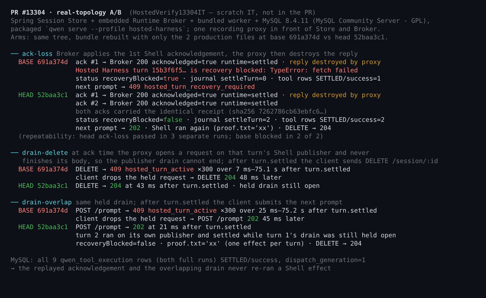
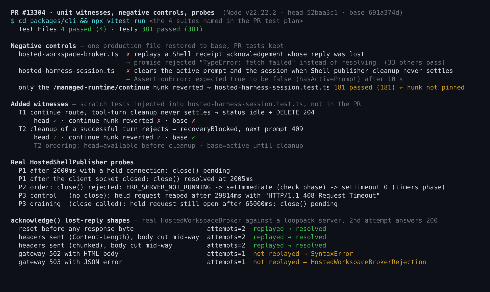

## Maintainer verification: real-topology A/B (post-merge)

**Verdict: both fixes hold end to end, and I found nothing blocking.** I built a real Hosted topology locally and injected each fault. Base `691a374d` reproduces both defects; head `52baa3c1` survives both. Two follow-ups are worth tracking (listed at the end); neither is a regression.

> I verified `52baa3c1`. The PR was squash-merged as `2c591ecc` while my run was in progress. The four touched files are byte-identical on `52baa3c1`, on `2c591ecc` and on current `main`, so everything below applies to what shipped.

### Setup

- Linux, Node 22.22.2, JDK 21, MySQL 8.4.11 (Docker). A real `npm run build && npm run bundle` of the PR head.
- A scratch IT (`HostedVerify13304IT`, published below, not part of the PR) starts the managed-agent-server Spring app: the Session Store plus the embedded Runtime Broker, on MySQL. The Broker spawns the bundled worker.
- A driver runs the packaged `qwen serve --profile hosted-harness` against a fake OpenAI model that issues a real `run_shell_command`. One recording proxy sits in front of both the Store and the Broker.
- The two arms share one tree. The base arm is the same bundle rebuilt with only the two production files restored to `691a374d`.

### Real-topology results

| Fault injected | base `691a374d` | head `52baa3c1` |
| --- | --- | --- |
| **Lost acknowledgement reply.** The Broker applies the first Shell acknowledgement, then the proxy destroys its reply. | Broker and runtime both confirmed the acknowledgement (`200`, `acknowledged: true`, runtime `settled`), yet the harness logs `recovery blocked: TypeError: fetch failed`. The journal never records `settleTurn`, and the next prompt gets `409 hosted_turn_recovery_required`. | The identical receipt is replayed once, and the real Broker and runtime answer `settled` both times. The turn settles, the next prompt gets `202`, and the Shell ran exactly once per turn. |
| **Drain cannot finish, then DELETE.** At acknowledgement time the proxy opens a request on that turn's Shell publisher and never sends the rest of the body. | After `turn.settled`, `DELETE /session/:id` returns `409 hosted_turn_active` 300 times over 75 s. Once the client drops the held request, DELETE returns `204` 48 ms later. | DELETE returns `204` 43 ms after `turn.settled`, while the drain is still held. |
| **Same held drain, then next prompt.** | `409 hosted_turn_active` 300 times over 75 s. The prompt gets `202` 45 ms after the client drops the held request. | `202` 21 ms after `turn.settled`. Turn 2 runs on its own publisher and settles while turn 1's drain is still held open. |

- MySQL: all 9 `qwen_tool_execution` rows from the two full runs are `SETTLED/success` with `dispatch_generation = 1`. Neither the replay nor the overlapping drain re-ran a Shell effect.
- Repeatability: the lost-acknowledgement case passed in 3 separate head runs, and base blocked in 2 of 2.

This settles both items the triage review left for `/verify`:

- A replayed acknowledgement does restore availability against a real Broker.
- The runtime hop below the Broker (`ManagedRuntimeToolExecutor.acknowledgeV3`) deduplicates the identical receipt: it answered `settled` to both attempts.

### Unit tests, negative controls and probes

- **The four suites from the test plan pass: 381/381.**
- **Negative controls.** I restored each production file to base while keeping the PR's tests. Each witness then fails with exactly the error quoted in the PR description.
- **Gap: the `/session/:id/managed-runtime/continue` hunk is not pinned by any test.** With only that hunk reverted, `hosted-harness-session.test.ts` still passes 181/181.
  - I wrote a witness for it: on the continue route, tool-turn cleanup never settles, and the test expects the status to go idle and `DELETE` to return `204`. It passes on head and fails both with the hunk reverted and on base. The source is in `harness/inject-tests.py`.
  - I'd suggest adding it, or an equivalent, in a follow-up.
- **Fail-closed is preserved.** If cleanup after a successful turn rejects, head still reaches `recoveryBlocked: true` and the next prompt gets `409`. The `.catch` keeps admission closed; only the ordering changed (head is available before cleanup finishes, base stays active until it does).

### On the two points in the triage review

1. **"`session.blocked` can be written out of order after a hook recovery".** I believe this is unreachable. I confirmed it by code reading, by a probe, and by an independent reverse audit.
   - `HostedShellPublisher.drain()` can only reject from `server.close()`, which happens only when the publisher never started listening. `Promise.allSettled(operations)` and `ResourceToolResultSegmentStore.close()` never reject.
   - A listen failure happens inside `HostedWorkspaceToolTurn.execute`'s `try`, and that `catch` always throws `HostedToolRecoveryRequiredError`. So the turn is already recovery-blocked by the prompt route.
   - The probe shows the rejection settles before `setImmediate` or `setTimeout(0)` runs. That is the same tick burst as the route's own `catch`/`finally`, which contain no `await`. No HTTP handler, including the hook-operation poll, can run in between. No accept-or-change decision is needed.
2. **A reply truncated mid-body.** This *is* replayed: undici rejects the body read with `TypeError: terminated`. It does not surface as the `SyntaxError` the review assumed. That is the safe direction, since the runtime deduplicates.
   - Not replayed: a gateway's `502` with an HTML body (`SyntaxError`) or a `503` with a JSON body (`HostedWorkspaceBrokerRejection`). That matters only if something sits between the Harness and the Broker.
   - Non-transport `TypeError`s, such as a refused redirect, also get one harmless replay. All of this matches `prepare()` exactly.

### "Unbounded" is accurate, and one residual

- **The pre-fix wait really had no bound.** Node's `http.Server.close()` clears the connections-checking interval, so `requestTimeout` stops being enforced once the drain starts.
  - Probe with the real publisher: a server that is not closing reaps a held request after 29.8 s with `408`. A draining one still has it open after 65 s.
  - So a peer that stops mid-request kept the pre-fix Session unavailable and undeletable indefinitely.
- **Residual on head (non-blocking, not a regression).** The parked drain now waits in the background. In the real topology, the held publisher connection was still open 65 s after a successful `DELETE`, so the publisher server and socket outlive the Session until the peer disconnects.
  - Pre-fix held the same socket; only what waits on it changed.
  - A follow-up could bound the `server.close()` step, for example `closeAllConnections()` after a grace period. In-flight publisher operations are not tied to the socket and would still finish.
  - This is not covered by #13307.

### Not verified

- Windows and macOS: I ran Linux only.
- A stalled Session Store as the cause of the stall. Store requests carry their own 30 s client timeout, so I injected the stall at the publisher connection instead.
- Minor, undisclosed but benign as far as I can tell: the continue route now calls `releaseRecoveredRuntime(session)` before the drain rather than after it. Publisher writes go through the Store writer grant, not the runtime lease.

Other checks: ESLint (`--max-warnings 0`) and Prettier on the four changed files are clean, and `packages/cli` `tsc --noEmit` passes. CI was green at `52baa3c1`.
