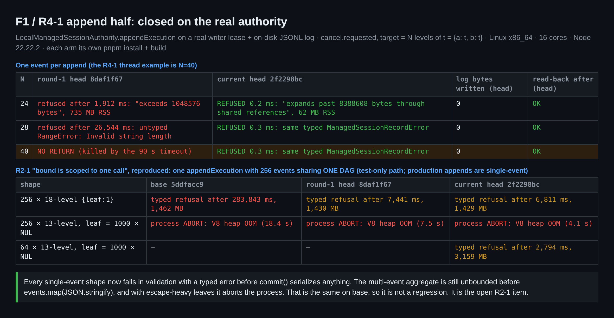
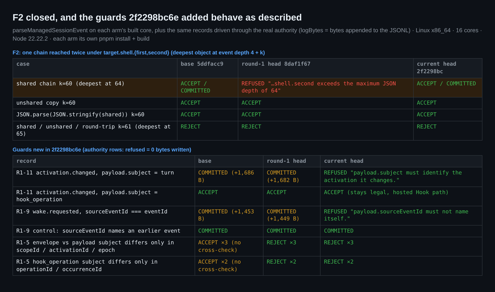
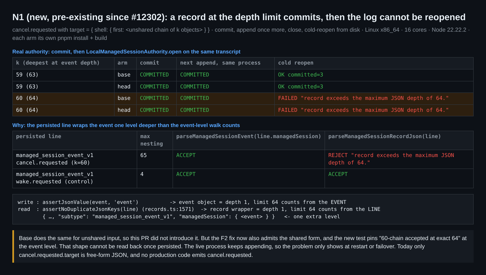
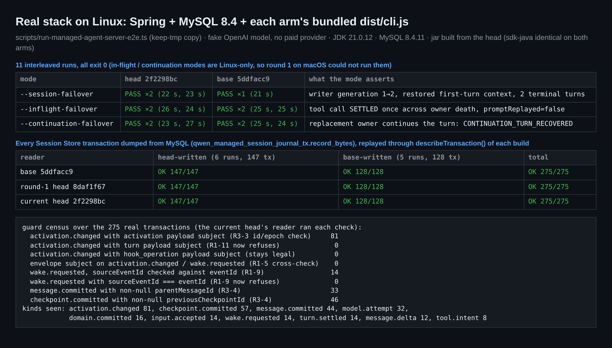
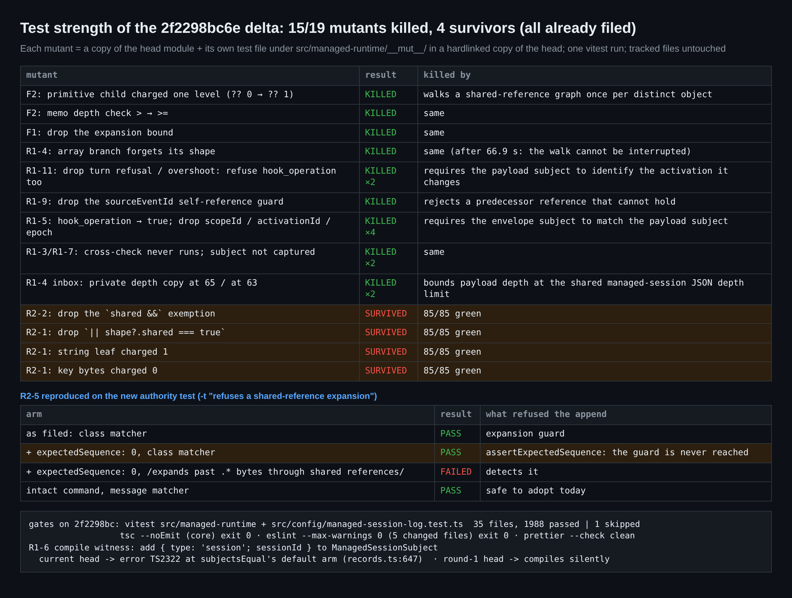
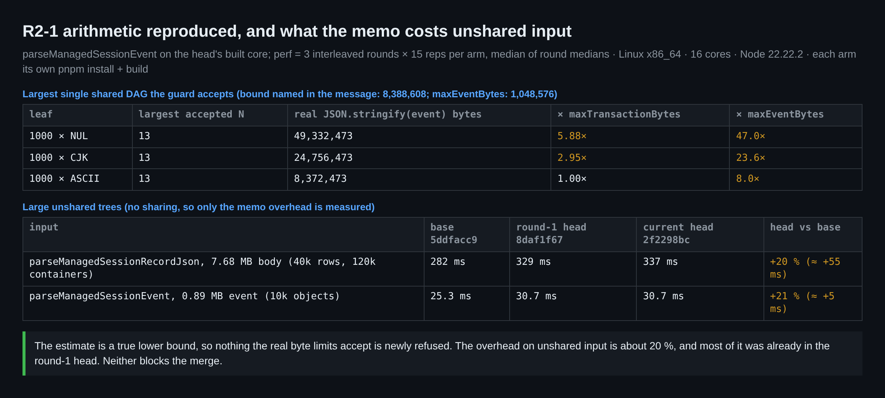

## 本地真实环境验证（第 2 轮）—— #13311 @ `2f2298bc`

本轮只覆盖变化的部分。[第 1 轮](https://github.com/QwenLM/qwen-code/pull/13311#issuecomment-5972400753)在 macOS 上验证了 `8daf1f67`；本轮在 Linux 上验证 `2f2298bc6e`，覆盖：
- 第 1 轮的 F1 与 F2；
- R1-x 各项修复；
- 第 2 轮评审的建议（R2-x）；
- 第 1 轮无法运行的两个 Linux 专属 failover 模式。

**结论：可以合入。** 第 1 轮的 F1 和 F2 在当前 head 上已关闭，每项 R1-x 修复的行为都与对应回复的描述一致。所有遗留项都不阻塞合入：
- 第 2 轮评审的 R2-1、R2-2、R2-5，本轮均已复现；
- **N1**，一个新发现的既有问题（见下文）。建议作为后续跟进，而不是因它卡住本 PR。

| 项目 | `2f2298bc` 上的结果 |
| :-- | :-- |
| F1（R4-1 的追加路径一半） | ✅ **已关闭。** N=24/28/40 都在 0.2–0.3 ms 内被类型化的 `ManagedSessionRecordError` 拒绝，写盘 0 字节，RSS 62 MB，日志可正常回读。第 1 轮 head 在同一探针下：1.9 s 后才拒绝 / 26.5 s 后抛未分类 `RangeError` / 90 s 内不返回（卡片 1） |
| F2（共享链严格一层） | ✅ **已关闭。** 深度正好 64 的共享 60 层链被接受，与其不共享副本及往返副本一致；61 层在三种形式下都被拒绝（卡片 2） |
| R1-11 / R1-9 / R1-5 守卫 | ✅ `turn` 类型的 payload subject、指向自身的 `sourceEventId` 都在写盘前被拒绝；`hook_operation` 保持合法；五种单字段 subject 不一致全部被拒绝（卡片 2） |
| 真实栈（Linux） | ✅ 11/11 轮 exit 0：`--session-failover` ×3、`--inflight-failover` ×4、`--continuation-failover` ×4，head 与 base 交错运行（卡片 4） |
| 更严格的读取器 vs 真实生产者 | ✅ 这些运行产生了 275 个 Session Store 事务（head 写 147、base 写 128），经 base、第 1 轮 head、当前 head 三方回放，825/825 通过。新增的拒绝规则在真实记录上一次都没有触发（卡片 4） |
| 增量的测试强度 | ✅ 19 个变异体杀死 15 个，覆盖了回复中声称的所有 records / inbox 层见证。存活的 4 个恰好是 R2-1 ×3 与 R2-2（卡片 5） |
| R1-6 穷尽性 | ✅ 给 subject 加第 4 种变体，现在会在 `managed-session-records.ts:647` 报 `TS2322`；在第 1 轮 head 上同样的修改会静默通过编译 |
| 门禁 | ✅ `src/managed-runtime` + `src/config/managed-session-log.test.ts`：35 个文件，1988 通过 / 1 跳过。5 个改动文件上 core `tsc --noEmit`、ESLint（`--max-warnings 0`）和 Prettier 均干净。CI 全绿，含 *Hosted process fault gates / MySQL 8.4* |
| R2-1（上限算式、聚合） | ⚠️ **已复现。** 被接受的最大单个 DAG 实际序列化为 49,332,473 字节，是错误信息所写上限的 5.88 倍。一次 256 事件的 `appendExecution` 耗时 6.8 s、占 1.4 GB；叶子换成 NUL 后，同一调用会**因 V8 堆 OOM 直接终止进程**。base 与第 1 轮 head 表现相同，所以不是回归（卡片 1、6） |
| R2-5（弱断言） | ⚠️ **已复现。** 加上 `expectedSequence: 0` 后新的 authority 用例仍然通过；改用信息匹配就能发现这一点，并且在未改动的 head 上是绿的（卡片 5） |
| **N1（新）** 深度写读不对称 | ⚠️ 自 #12302 起就存在：处于深度上限的记录能提交成功，但之后会话日志再也无法冷重开（卡片 3） |
| 对无共享输入的开销 | ℹ️ 大树上约 +20 %：每 7.7 MB 记录体 +55 ms，每 0.9 MB 事件 +5 ms。其中大部分在第 1 轮 head 上就已存在（卡片 6） |

### N1 —— 处于深度上限的记录能提交，之后日志无法重开（新发现，既有问题，非阻塞）

写路径与读路径计算深度的起点不同：
- **写入：** 从**事件**开始计深度——`managed-session-records.ts:1148` 的 `assertJsonValue(value, 'event')`。
- **落盘：** 该事件被包进记录信封——`managed-session-authority.ts:2137` 的 `createRecord(MANAGED_SESSION_EVENT_SUBTYPE, event, …)`，再于 `:2152` 交给 `journal.appendTransaction`。
- **读取：** 两个读取器都按**整行**计深度。`parseManagedSessionRecordJson` → `assertNoDuplicateJsonKeys`（`managed-session-records.ts:1571`），调用方是 `managed-session-storage.ts:210` 与 `http-managed-session-store.ts:1189`。

因此，最深对象正好位于深度 64 的事件，落盘后整行嵌套 65 层，之后每次重开都会失败。

在真实 authority 上复现（base 与 head 表现相同）：
1. `target.shell.first` 下挂一条不共享的 60 层链，`cancel.requested` 提交成功。
2. 同一进程内的下一次追加也提交成功。
3. `close()` 后再 `LocalManagedSessionAuthority.open`，报 `record exceeds the maximum JSON depth of 64.`
4. 换成 59 层链，重开正常。

在线的写入方完全察觉不到，所以日志是被悄悄"毒化"的，会话会在下次重启或 failover 时丢失。

范围：
- **不是本 PR 引入的。** base 对不共享输入同样如此。
- **目前是潜在问题。** 唯一的自由 `json` 字段是 `cancel.requested.target`（`managed-session-records.ts:789`），而生产代码不会发出 `cancel.requested`。
- **与本 PR 的算式相关。** F2 修复后共享形式也会被接受，新测试又在事件层面断言"60 层链在正好 64 时被接受"。这个形状一旦落盘就读不回来。

两种可能的修法（均未测试）：
- (a) 在 `journal.appendTransaction` 之前，对每条记录跑一遍读取器的整行检查，使写入方无法落盘读取器会拒绝的行。
- (b) 事件层遍历从深度 2 开始，把信封那一层算进去。60/61 这一对测试随之改为 59/60。

两种都适合放进后续 issue。我不建议因此卡住本次合入。

### 合入前建议
1. 按 R2-4 更新 PR 描述。描述里仍写着"Sharing stays legal"以及非 activation 的 payload subject 保持合法，也没有提到当前 head 新增的三类拒绝：共享展开上限、`turn` 类型的 payload subject、指向自身的 `sourceEventId`。
2. 可选：采纳 R2-5 的一行匹配修改（`/expands past .* bytes through shared references/`），它在未改动的 head 上通过（卡片 5）。
3. 把 N1 与 R2-1 的聚合问题登记为后续跟进。二者目前都无法从生产追加路径触达。

### 未覆盖
- **没有通过 hosted 路径追加 N1 形状的记录。** 只驱动了本地日志；HTTP 读取器的整行解析器拒绝同一行，是离线演示的。
- **没有跨版本的进程内 failover**（base 作为 owner、head 接替）。跨版本读取只通过离线回放导出的 journal 来检查。
- **没有使用付费模型。** 所有 E2E 模式都用脚本自带的 fake OpenAI 服务。

### 运行内容
- **对照臂：** base `5ddfacc9`、第 1 轮 head `8daf1f67`、当前 head `2f2298bc`。
  - base 与 head 各自 `pnpm install --frozen-lockfile` + 全量构建 + bundle。
  - 第 1 轮 head：依赖从 head 硬链接过来，再对 core 跑 `tsc --build`。
- **Spring jar：** 用独立的 Maven 本地仓库从 head 构建。两臂的 `packages/sdk-java` 完全相同。
- **真实栈：** `scripts/run-managed-agent-server-e2e.ts`（保留临时目录的副本），JDK 21.0.12、MySQL 8.4.11，各臂用自己的 `dist/cli.js`。之后从每个保留的 datadir 导出 `qwen_managed_session_journal_tx.record_bytes`。
- **探针：** 各臂构建产物里的 `LocalManagedSessionAuthority`，配真实 writer lease 和 JSONL journal；以及各臂的 `parseManagedSessionEvent` / `parseManagedSessionRecordJson`。
- **变异：** 在 head 的硬链接副本里，对 `src/managed-runtime/__mut__/` 跑一次 vitest。未改动任何受版本控制的文件。
- **宿主：** Linux x86_64，16 核，Node 22.22.2。

**证据：** 测试装置、原始日志和全部 11 份 E2E 日志见 [本目录](.)（`harness/`、`data/`）。

**卡片 1 —— F1 已关闭；R2-1 聚合**

**卡片 2 —— F2 已关闭；新守卫**

**卡片 3 —— N1 深度写读不对称**

**卡片 4 —— Linux 真实栈与 journal 回放**

**卡片 5 —— 变异矩阵、R2-5、门禁**

**卡片 6 —— R2-1 算式与 memo 开销**

