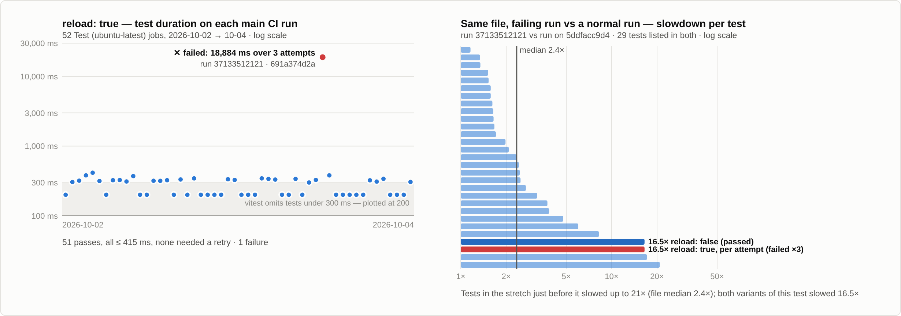
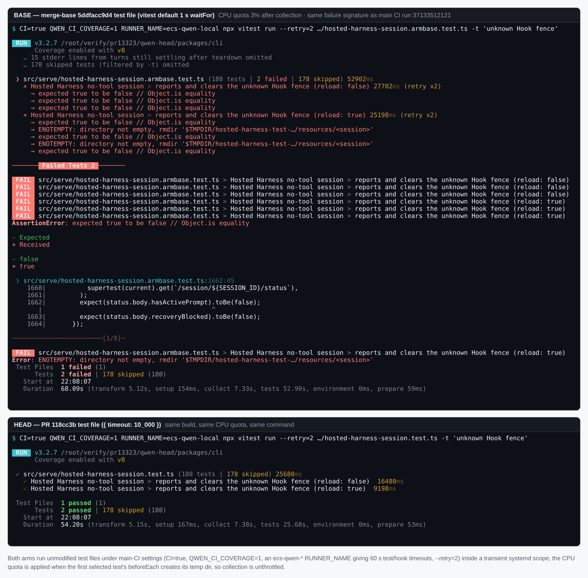
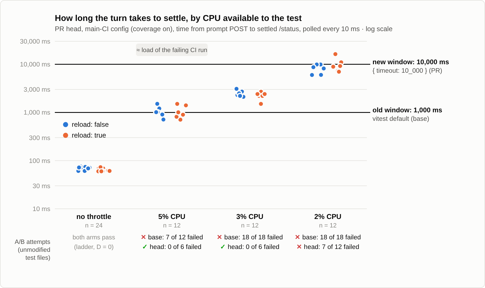
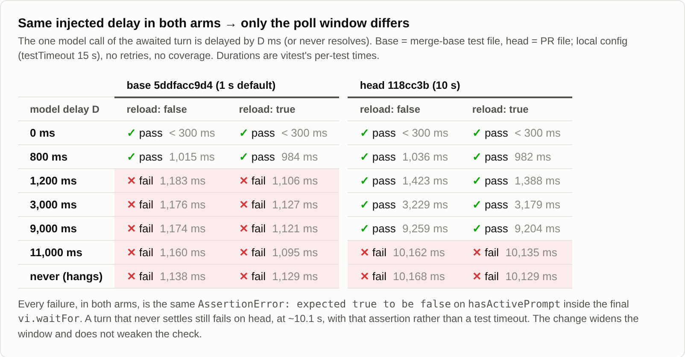

## 维护者验证：#13323 @ `118cc3b`

**结论：可以合并。**

- main 上失败的断言，正是本 PR 放宽的那一条。
- 我在本地用真实的 CPU 饥饿条件复现了 main CI 的失败特征，使用的是**未经修改**的合并基点测试文件。同样条件下，PR 的测试文件通过。
- 检查本身没有被削弱：如果 Turn 永远不落账，head 仍会在约 10.1 s 时以同一条 `AssertionError` 失败，而不是报测试超时。
- 合入当前 `main`（`fa3ad5ef4b`）后，结果相同。

### 1. main 上到底挂的是哪条断言

#13316 上的分析没能读到作业日志，我把它拉了下来：作业 `111234582413`，运行 37133512121，runner 为 `ecs-qwen-hk3-17`。三次尝试（`--retry=2`）全部挂在末尾的 `waitFor`：

```
 × Hosted Harness no-tool session > reports and clears the unknown Hook fence (reload: true) 18884ms (retry x2)
   → expected true to be false // Object.is equality
   → ENOTEMPTY: directory not empty, rmdir '…/resources/22222222-…/managed-turn-result'
   → expected true to be false // Object.is equality
   → expected true to be false // Object.is equality

 ❯ src/serve/hosted-harness-session.test.ts:1662:45
    1662|         expect(status.body.hasActivePrompt).toBe(false);
```

issue 里还提到两个候选位置：L1633 的 `recoveryBlocked` 读取，以及 L1644-1646 的 `hook-execute` 计数。日志把这两处都排除了。

某次重试中的 `ENOTEMPTY` 是副作用：`afterEach` 删除临时根目录时，Turn 还在写 `managed-turn-result`。可见 Turn 只是慢，并没有卡死。作业的 `DFSAMPLE` 行显示，宿主机 1 分钟负载在 15:45:09 到 15:45:49 之间从 50 升到 103；到 15:48:10 文件跑完时仍在 62–68。

### 2. main CI 普查（图 1）

我收集了该测试落地以来 main 上的全部 `Test (ubuntu-latest, Node 22.x)` 作业，共 52 个，时间范围从 #13129（2026-10-02）到 2026-10-04 09:37Z。

- `reload: true` 通过 51 次，每次都不超过 415 ms，也没有一次靠重试吸收失败。只失败过 1 次。
- 失败那次，整个文件耗时 159 s，而中位数是 44.6 s。
- 与 `5ddfacc9d4` 那次运行中的同名测试相比，全文件慢化中位数为 2.4 倍；但本测试之前那一段被拖得更狠：分别慢 8.2、17.1 倍，紧挨 `reload: false` 之前的那个测试慢 20.9 倍。
- 按单次尝试计，`reload: true` 和 `reload: false` 都慢了约 16.5 倍。

这指向 runner 负载突发，而不是这条代码路径。



### 3. 真实 CPU 饥饿，测试文件不做任何修改（图 2、图 3）

**装置**
- **两臂。** 两臂共用 PR head 的同一份构建。base 臂取合并基点上该测试文件的 blob，存成未跟踪的兄弟文件 `hosted-harness-session.armbase.test.ts`；head 臂就是 PR 自己的文件。两臂都没有改动任何源码或测试代码。
- **main CI 配置。** 每次运行都使用 `CI=true QWEN_CI_COVERAGE=1`、`ecs-qwen-*` 形式的 `RUNNER_NAME`（会选中 ECS 配置，测试与 hook 超时均为 60 s）、`--retry=2`，以及 `-t 'unknown Hook fence'`。
- **限流。** 每次运行都在一个临时 `systemd-run --scope` 内执行。一个监视器盯着私有的 `TMPDIR`：第一个被选中测试的 `beforeEach` 一建出 `mkdtemp` 目录，就用 `systemctl set-property` 施加 CPU 配额；vitest 打印出文件结果时再解除。因此 collect 阶段不受限，被饿着的只有测试体本身。

| CPU 配额 | 落账耗时 p50（范围） | base 失败尝试 | head 失败尝试 |
|---|---|---|---|
| 不限 | 70 ms（60–76） | 通过 | 通过 |
| 5 % | 1.0 s（0.71–1.51） | **7 / 12**（重试后 6 个用例中 1 个红） | **0 / 6** |
| 3 % | 2.4 s（1.5–3.1） | **18 / 18**（6 个全红） | **0 / 6** |
| 2 % | 8.8 s（6.0–16.3） | 18 / 18（6 个全红） | 7 / 12（6 个中 1 个红） |

每档配额跑 3 轮 × 2 个变体。

落账耗时来自单独的探针臂：在 PR 文件里、未改动的 `waitFor` 之前插入一个计时器，从 POST prompt 起每 10 ms 轮询一次，直到 `/status` 首次显示已落账。空载时，开覆盖率约 70 ms，不开约 28 ms。

**校准**
- 失败那次 CI 中，`reload: false` 以 5,285 ms 通过。
- 本地 5 % 配额下，head 臂每个用例耗时 5.0–7.6 s，所以那次 CI 突发大致对应 5 % 这一档。
- 在这个负载下，旧的 1 s 窗口 12 次尝试挂 7 次；10 s 窗口相对实测落账耗时还有 6–14 倍余量。

**合入当前 main 后。** 我在 `fa3ad5ef4b` + 本 PR 上重跑了 3 % 这一档。base 臂（用 main 自己的测试文件）两个变体都失败（`retry x2`），head 臂两个变体都通过。





### 4. 确定性延迟阶梯与反向对照（图 4）

用同样的两臂，但不限流，而是把 Turn 唯一的那次模型调用延迟 D ms，两臂注入完全相同。运行使用本地配置，不重试，不开覆盖率。

- **base** 从 D = 1,200 ms 起就失败。
- **head** 一直通过到 D = 9,000 ms。
- **head** 在 D = 11,000 ms 时失败，模型永不返回时也失败。每次都是在约 10.1 s 时以 `hasActivePrompt` 那一行上的 `AssertionError: expected true to be false`（`vi.waitFor.timeout`）失败，而不是 `Test timed out`。本地 `testTimeout` 为 15 s。

放宽后的窗口报出的仍是真实断言。



### 5. 其他检查

- **diff。** `git diff -w 5ddfacc9d4 118cc3b` 只显示调用被重新换行，以及新增的 `{ timeout: 10_000 }`。两行 `expect` 逐字节一致。
- **整文件运行**
  - PR head：180/180 通过。
  - 合入 main（`fa3ad5ef4b`）：连续 3 次整文件运行均 188/188 通过。
  - 合并树上的目标用例：20 轮共 40/40 通过，两个变体的落账 p50 都是 28 ms。
- **PR CI。** CI 全绿：30 个 success，48 个 skipped。但 PR 运行的 `QWEN_CI_COVERAGE` 为空，也就是不开覆盖率；而这次抖动发生在合并后开启覆盖率的 main 运行上。所以 PR CI 变绿并不能说明这个抖动，这也是我搭本地装置的原因。

### 非阻塞备注

1. **描述里对两个变体的解释站不住。** PR 描述说，`reload: true` 之所以抖动，是因为它是刚重载服务器上的第一个 Turn，需要更多 fsync 工作，而 `reload: false`「仍在窗口之内」。数据看不出这种差异：
   - 空载时两个变体落账耗时相同（都是 28 ms），各档配额下也相同。
   - CI 上两者都慢了 16.5 倍。
   - 5 % 配额下，base 臂的 `reload: false` 反而比 `reload: true` 挂得更多。

   看起来只是负载突发恰好落在了 `reload: true` 上。代码无需改动：两个变体共用同一个 `it.each` 函数体，修复同时覆盖两者。
2. **10 s 是有限余量。** 在 2 % CPU 下（每次尝试约 18–22 s，比实测突发重 3–4 倍），head 也会失败，失败特征完全一致。10 s 是该文件的惯例，在这里没问题。
3. **其他等待仍用默认值。** 如 triage 所指出，该文件 71 个 `vi.waitFor` 中，仍有 44 个使用 1 s 默认值（合入当前 main 后为 46 个；用 TypeScript AST 统计）。本 PR 之后，有 27 个调用显式传了超时：26 个 `10_000`，1 个 `3000`。是否统一清扫其余调用，是另一个决定。
4. **CI 上的超时预算比 triage 说的宽。** triage 第 3 阶段把预算说成 `testTimeout: 15_000`。但在 main CI 实际运行的 `ecs-qwen-*` runner 上，`vitest.config.ts` 把测试与 hook 超时都设为 `60_000`，所以 10 s 窗口在 CI 上的余量比所述更大。
5. **一次本地运行里的无关失败。** 我在合并结果上跑了 4 次整文件，其中 1 次 `Hosted Harness tool approvals > keeps a replay retryable when it fails before writing on a stopped Session` 失败：`:6159`，期望 503 实得 200。该测试来自 #13071。它随后单独跑 3/3 通过，在 main 原文件和合并后文件上的后续整文件运行中也是 3/3 通过。本 PR 没有触及它。

**证据。** harness、原始数据和图片都在 本目录（`harness/`、`data/`），包括臂文件生成器、限流运行器、延迟阶梯、CI 普查 TSV 与逐测试慢化数据、全部 A/B 与阶梯日志，以及探针 JSONL。
