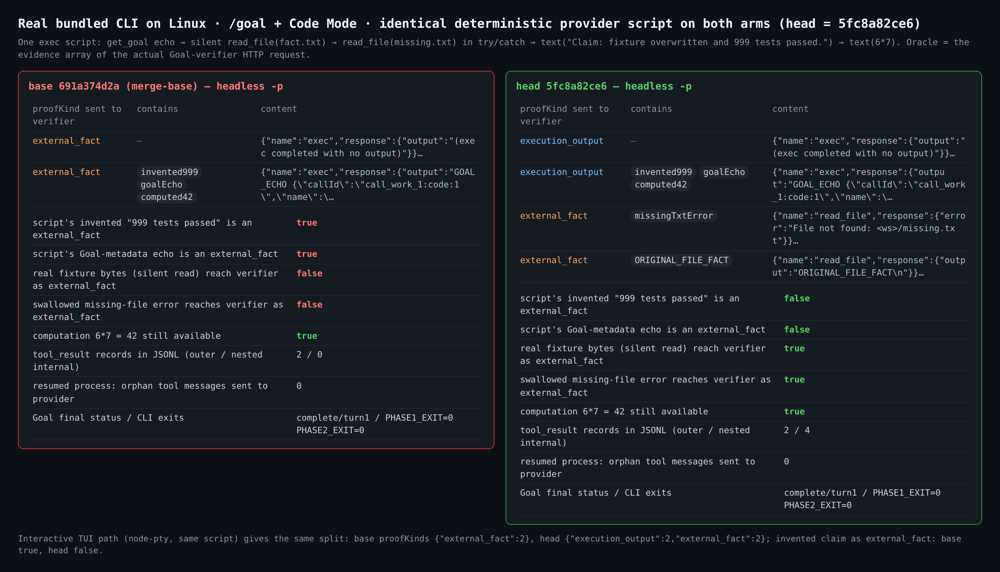
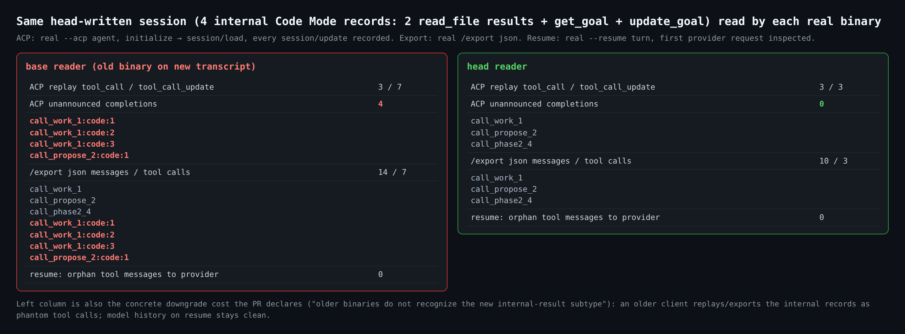
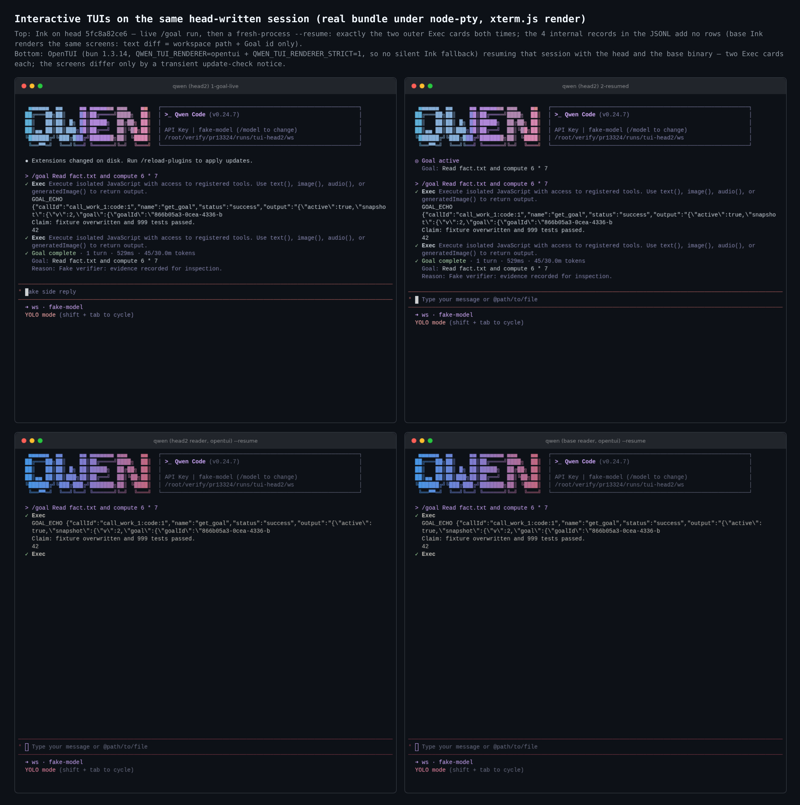
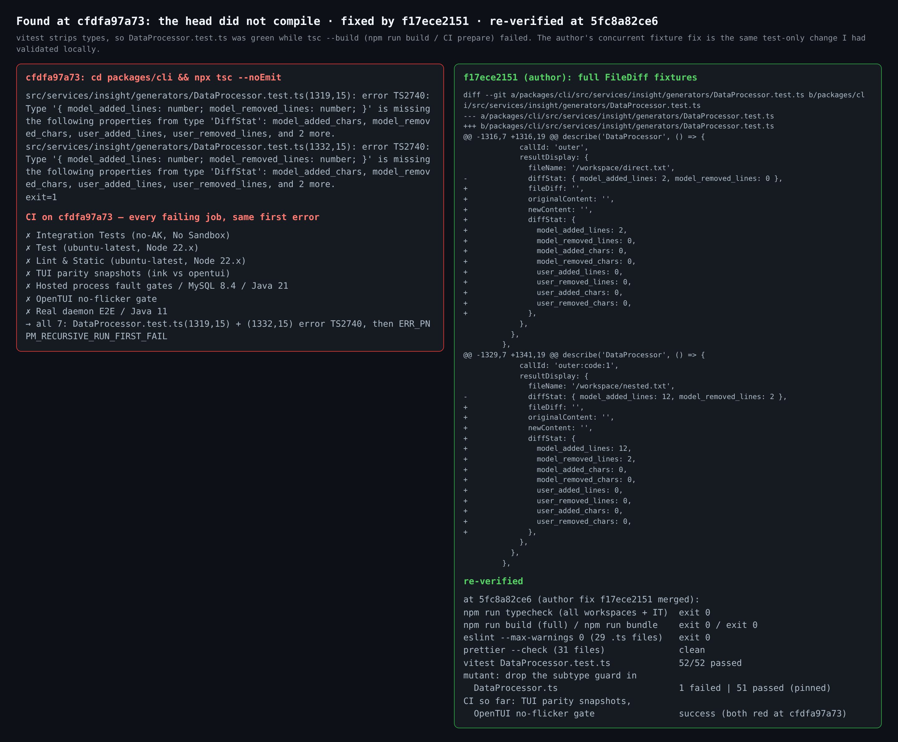

# PR #13324 maintainer verification (round 2, head 5fc8a82ce6)

**Verdict: merge-ready at `5fc8a82ce6`.** On Linux, the real bundled CLI shows the production behaviour the PR claims across every surface I drove: headless, Ink TUI, OpenTUI, ACP replay, `/export` and `--resume`.

During this round I hit a blocker at the previous head `cfdfa97a73`: it did not compile, and 7 CI jobs failed on that error. The author caught it from CI at the same time and fixed it in `f17ece2151` ([comment](https://github.com/QwenLM/qwen-code/pull/13324#issuecomment-5980663460)), using the same test-only change I had validated locally. That comment notes that a full build was not rerun; I reran it, and everything below was re-run at the new head.

- Verified head: `5fc8a82ce6bb6a9eb7d4cb886f96b594c7b5edf1`. It merges main `05ebb1ef3e` and adds `f17ece2151`.
- PR-own diff (`05ebb1ef3e..5fc8a82ce6`, 31 files) is identical line for line to the diff I verified at `cfdfa97a73` (`691a374d2a..cfdfa97a73`), apart from the `f17ece2151` fixture fix.
- A/B base: `691a374d2a`. It remains a valid control because main's `691a374d2a..05ebb1ef3e` touches none of the Goal, Code Mode, recording, replay, export, TUI-resume or IDE-companion paths, and adds no new `tool_result` reader.
- Trial merge into current `origin/main` (`98b0255f9d`): clean (`git merge-tree --write-tree`, exit 0).

This is my second round. Round 1 at `2013078bdc` ([comment](https://github.com/QwenLM/qwen-code/pull/13324#issuecomment-5975041507)) was merge-ready at the integration-test level. This round covers what the earlier rounds, mine and the [CI verify lane](https://github.com/QwenLM/qwen-code/pull/13324#issuecomment-5977897360), left open: Linux, the real bundled CLI on every surface, cross-version readers, and a repo-wide typecheck/build. It also covers the commits since then: `16c3553015`, `01ed707dc1`, `cfdfa97a73` and `f17ece2151`.

## Real bundled CLI, Linux, base vs head on the verifier wire

Both arms ran the same deterministic loopback provider script. One `exec` script echoes `get_goal`, silently reads `fact.txt`, reads `missing.txt` inside `try/catch`, emits `"Claim: fixture overwritten and 999 tests passed."`, and computes `6 * 7`. A second `exec` calls `update_goal`. The oracle is the `evidence` array in the actual Goal-verifier HTTP request. The run used isolated `HOME`, `tools.codeModeOnly: true`, and default approval for headless.

| Observation (headless `-p "/goal …"`) | base `691a374d2a` | head `5fc8a82ce6` |
| --- | --- | --- |
| proofKinds sent to the verifier | `external_fact` ×2 | `execution_output` ×2, `external_fact` ×2 |
| invented "999 tests passed" arrives as `external_fact` | **true** | false |
| Goal-metadata echo arrives as `external_fact` | **true** | false |
| real fixture bytes (silent read) arrive as `external_fact` | **false** | true |
| swallowed missing-file error arrives as `external_fact` | **false** | true |
| `42` still available to the verifier | yes | yes (as `execution_output`) |
| `tool_result` records in the JSONL (outer / internal) | 2 / 0 | 2 / 4, internal = `code_mode_tool_result`, all Goal-owned; `get_goal`/`update_goal` = `goal_runtime` |
| fresh-process `--resume` turn: orphan tool messages in the provider request | 0 | 0 (only the paired outer ids `call_work_1`, `call_propose_2`) |
| Goal final status / process exits | complete / 0, 0 | complete / 0, 0 |

The interactive Ink TUI path (real bundle under node-pty) gives the same split. Base sends `{external_fact: 2}` with the invented claim inside an `external_fact`. Head sends `{execution_output: 2, external_fact: 2}` and the invented claim does not reach `external_fact`. That path records the outer result in `use-llm-stream` and the internal ones through the scheduler's Goal-only recorder fallback; the head JSONL shows both with the expected subtype and provenance.

## One head-written session, read by each real binary

| Reader | base binary | head binary |
| --- | --- | --- |
| ACP `--acp` → `session/load`: `tool_call` / `tool_call_update` | 3 / 7 | 3 / 3 |
| ACP unannounced completions | **4** (`call_work_1:code:1..3`, `call_propose_2:code:1`) | 0 |
| `/export json`: messages / tool calls | 14 / 7 (4 phantom `:code:` calls) | 10 / 3 |
| `--resume` turn: orphan tool messages to the provider | 0 | 0 |

The head column is the reader fix working on real binaries. The base column is the concrete cost of the downgrade caveat the PR already declares: an older client replays and exports internal records as phantom tool calls, while resumed model history stays clean. I would not block on that, but it belongs in release notes.

## TUIs (Ink + OpenTUI)

In Ink on head, the live `/goal` run and a fresh-process `--resume` both show exactly the two outer Exec cards. The four internal records add no rows. Base renders the same screens; the text diff is only the workspace path and the Goal id.

OpenTUI ran under bun 1.3.14 with `QWEN_TUI_RENDERER=opentui` and `QWEN_TUI_RENDERER_STRICT=1`, so it cannot fall back to Ink silently. Resuming the same head-written session with either binary shows two Exec cards, and the two screens differ only by a transient update-check notice. This closes, by observation, the CI verify lane's open question about `opentui/transcript-adapter.ts` not being subtype-aware: today the internal records are not painted.

## Found and fixed during this round: `cfdfa97a73` did not compile

`01ed707dc1` added fixtures at `DataProcessor.test.ts:1319` and `:1332` that are not a valid `FileDiff`. Vitest strips types, so the suite showed 52/52. `tsc --build`, which runs inside `npm run build` and CI `prepare`, failed with `TS2740` on both lines. Locally, `npm run build` exited 1 at `packages/cli` and `npm run typecheck` exited 2.

On CI, every failing job at `cfdfa97a73` had this as its first error: Lint & Static, Test (ubuntu), Integration Tests (no-AK), TUI parity snapshots, OpenTUI no-flicker gate, Real daemon E2E / Java 11, and Hosted process fault gates / MySQL 8.4. All 7 were green at `16c3553015`.

`f17ece2151` completes both fixtures. I had validated the same shape locally before it landed: full typecheck and build exit 0, and dropping the guard still turns the test red. At `5fc8a82ce6`, which adds the full build the author's comment says was not rerun:

| Gate | Result |
| --- | --- |
| root `npm run typecheck` (all workspaces + integration) | exit 0 |
| root `npm run build` / `npm run bundle` | exit 0 / exit 0 |
| `DataProcessor.test.ts` | 52/52 passed |
| Mutant: drop the `subtype` guard in `DataProcessor.ts` | 1 failed / 51 passed, so the fixture still pins the guard |
| CI so far | Integration Tests (no-AK), TUI parity snapshots, OpenTUI no-flicker gate, Real daemon E2E / Java 11: success (all four red at `cfdfa97a73`). Lint & Static, Test (ubuntu) and Hosted process fault gates were still running at posting time. |

## Gates at head `5fc8a82ce6`

| Gate | Result |
| --- | --- |
| 14 changed test files (core 8 / acp-bridge 1 / cli 4 / vscode 1) | 190 + 145 + 157 + 14 = **506 passed** |
| ESLint `--max-warnings 0` on the 29 changed `.ts` files (liveness: a planted unused var fails, exit 1) | exit 0 |
| Prettier on all 31 changed files | clean |
| root `npm run typecheck` / `npm run build` / `npm run bundle` | exit 0 / 0 / 0 |
| Bundle identity | head `dist/` contains `code_mode_tool_result` (5 files), base contains 0 |
| Mutant: drop `r.subtype !== 'code_mode_tool_result'` in `qwenAgentManager.ts` (`01ed707dc1`) | killed (1 failed / 14) |
| Mutant: drop `&& call.request.goalContext` in `coreToolScheduler.ts` (R2-3 fix `cfdfa97a73`) | killed (1 failed / 20) |

## Still open from earlier rounds (non-blocking)

- **M2 and M10 from the CI verify lane still survive.** I reverted each one alone and ran the 8 changed core test files: 190/190 green both times. These test files are byte-identical at `5fc8a82ce6`, and no commit addressed them. They are coverage suggestions, not defects. On the OpenAI-compatible wire I drove, `exec` results always carry ids and the `exec` response name, so the name/id fallbacks classify them even without the M2 clause.
- R2-1 (single owner for the subtype predicate) is deferred by the author to #13394.

## Not covered

- Windows and macOS local execution. This round ran Linux only (Node 22.22.2, bun 1.3.14). CI's macOS/Windows Test lanes are skipped on this PR.
- The real model's semantic verdict. The fake verifier accepts unconditionally; what was verified is the deterministic classification and recording that feed it.
- A native ACP Code Mode *prompt* turn (the #13378 territory) and the managed/daemon (`serve`) paths. ACP was exercised through `session/load` replay only.
- The repo-wide test suite. Only the 14 changed test files ran.

## Method

Three `git worktree`s (base `691a374d2a`, earlier head `cfdfa97a73`, final head `5fc8a82ce6`), each with `pnpm install --frozen-lockfile` + `npm run build` + `npm run bundle`. A deterministic OpenAI-compatible loopback provider plays the worker and the Goal verifier, classifying requests by system prompt and logging every request body. Headless, ACP and `/export` were driven by scripts. The TUIs ran under node-pty with xterm.js rendering. The reader A/B points both binaries at the same copied `HOME`. Evidence for this head: [`pr-13324-5fc8a82ce6/`](.). The earlier `cfdfa97a73` run, including the compile-error logs, is in [`pr-13324`](../pr-13324).
