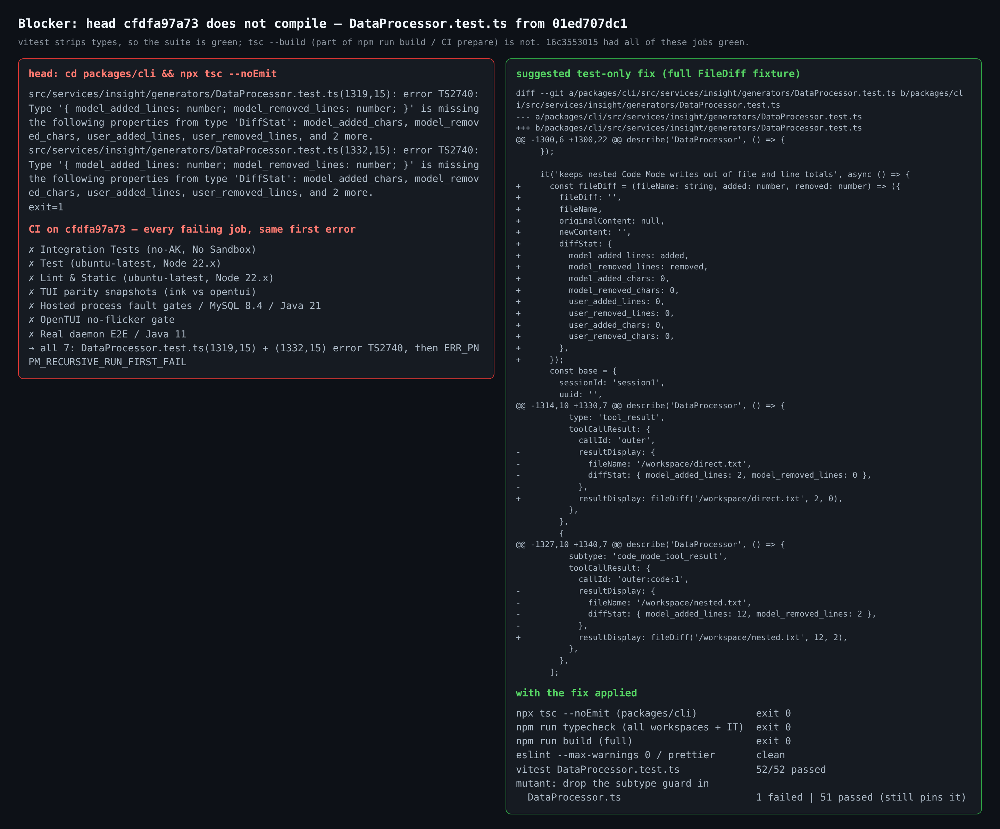
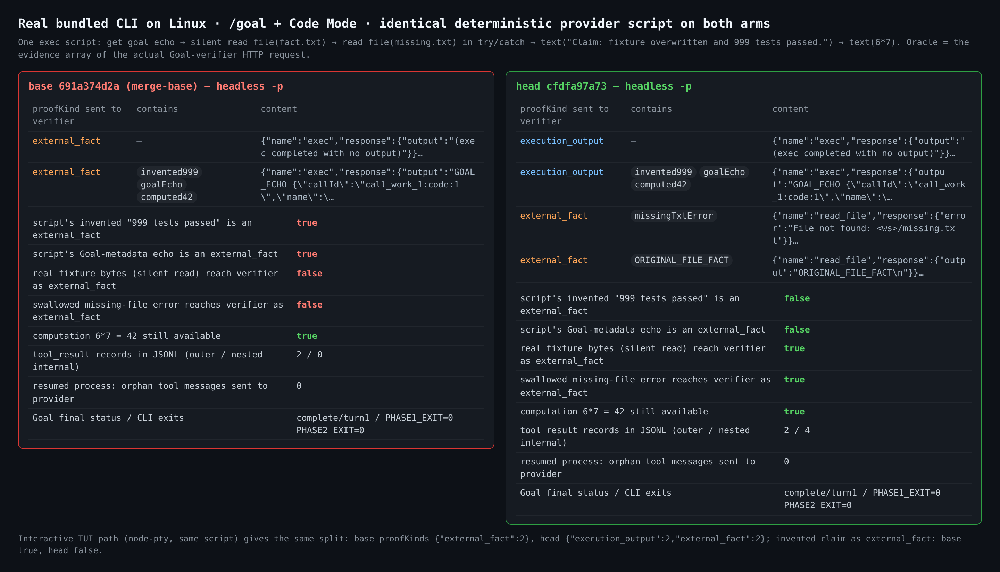
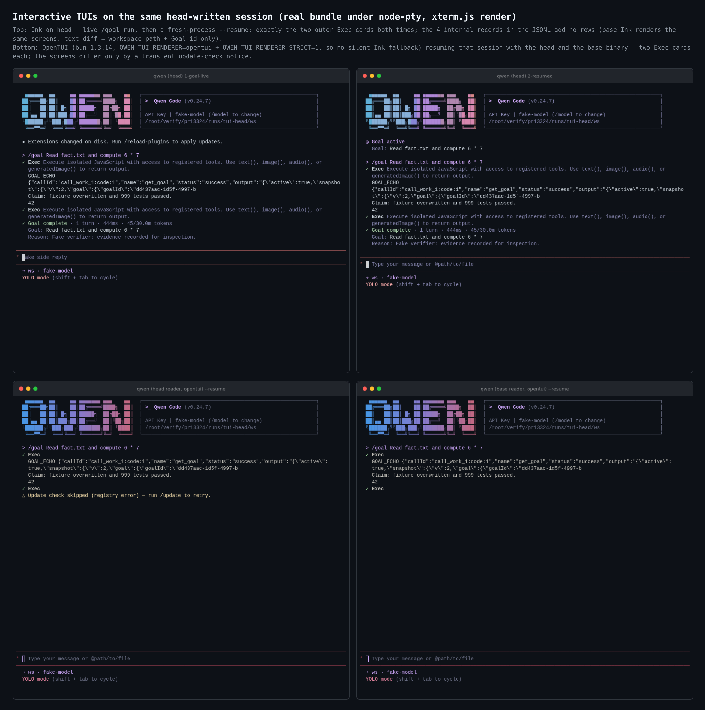

# PR #13324 maintainer verification (round 2)

**Verdict: not merge-ready at `cfdfa97a73`. There is one blocker, and the test-only fix below is verified.** On Linux, the real bundled CLI shows the production behaviour the PR claims across every surface I drove. The blocker is a compile error in the test added by `01ed707dc1`. It turns 7 CI jobs red at this head, and the same jobs were green at `16c3553015`.

Verified head: `cfdfa97a73e2cddb0800433af3441cf52d5852fc` · A/B base: merge-base `691a374d2a` · trial merge into current `origin/main` (`6694f35499`, 19 commits ahead, none of them touching PR files): clean (`git merge-tree --write-tree`, exit 0).

This is my second round. Round 1 at `2013078bdc` ([comment](https://github.com/QwenLM/qwen-code/pull/13324#issuecomment-5975041507)) was merge-ready at the integration-test level. Since then the PR gained `16c3553015` (reader compatibility), `01ed707dc1` (insight + IDE-companion readers) and `cfdfa97a73` (scheduler test positive control). This round targets what the earlier rounds, mine and the [CI verify lane](https://github.com/QwenLM/qwen-code/pull/13324#issuecomment-5977897360), left open: Linux, the real bundled CLI on every surface (headless, Ink TUI, OpenTUI, ACP, `/export`, `--resume`), cross-version readers, and a repo-wide typecheck/build.

## Blocker — head does not compile

`packages/cli/src/services/insight/generators/DataProcessor.test.ts:1319` and `:1332` (new in `01ed707dc1`) build `resultDisplay` as `{ fileName, diffStat: { model_added_lines, model_removed_lines } }`. That is not a `FileDiff`: the `diffStat` is missing 6 required `DiffStat` fields, and the object has no `fileDiff`/`originalContent`/`newContent`. Vitest strips types, so the suite reports 52/52 green. `tsc --build`, which runs inside `npm run build` and CI `prepare`, fails:

```
src/services/insight/generators/DataProcessor.test.ts(1319,15): error TS2740: Type '{ model_added_lines: number; model_removed_lines: number; }' is missing the following properties from type 'DiffStat': model_added_chars, model_removed_chars, user_added_lines, user_removed_lines, and 2 more.
src/services/insight/generators/DataProcessor.test.ts(1332,15): error TS2740: (same)
```

Reproduced locally: root `npm run build` exits 1 at `packages/cli`, and root `npm run typecheck` exits 2 with exactly these two errors. On CI, every failing job at `cfdfa97a73` has this as its first error: Lint & Static, Test (ubuntu), Integration Tests (no-AK), TUI parity snapshots, OpenTUI no-flicker gate, Real daemon E2E / Java 11, and Hosted process fault gates / MySQL 8.4. All 7 were `success` at `16c3553015`.

**Suggested test-only fix (verified):** build a full `FileDiff` fixture in that test.

```ts
const fileDiff = (fileName: string, added: number, removed: number) => ({
  fileDiff: '',
  fileName,
  originalContent: null,
  newContent: '',
  diffStat: {
    model_added_lines: added,
    model_removed_lines: removed,
    model_added_chars: 0,
    model_removed_chars: 0,
    user_added_lines: 0,
    user_removed_lines: 0,
    user_added_chars: 0,
    user_removed_chars: 0,
  },
});
// resultDisplay: fileDiff('/workspace/direct.txt', 2, 0)
// resultDisplay: fileDiff('/workspace/nested.txt', 12, 2)
```

| With the fix applied at `cfdfa97a73` | Result |
| --- | --- |
| `npx tsc --noEmit` (packages/cli) | exit 0 |
| root `npm run typecheck` (all workspaces + integration) | exit 0 |
| root `npm run build` (full) | exit 0 |
| ESLint `--max-warnings 0` / Prettier on the file | clean |
| `DataProcessor.test.ts` | 52/52 passed |
| Mutant: drop the `subtype` guard in `DataProcessor.ts` | 1 failed / 51 passed, so the fixed test still pins the guard |

The full patch is in [`data/suggested-fix.patch`](./data/suggested-fix.patch).



## Real bundled CLI, Linux, base vs head on the verifier wire

Both arms ran the same deterministic loopback provider script. One `exec` script echoes `get_goal`, silently reads `fact.txt`, reads `missing.txt` inside `try/catch`, emits `"Claim: fixture overwritten and 999 tests passed."`, and computes `6 * 7`. A second `exec` calls `update_goal`. The oracle is the `evidence` array in the actual Goal-verifier HTTP request. The run used isolated `HOME`, `tools.codeModeOnly: true`, and default approval for headless.

| Observation (headless `-p "/goal …"`) | base `691a374d2a` | head `cfdfa97a73` |
| --- | --- | --- |
| proofKinds sent to the verifier | `external_fact` ×2 | `execution_output` ×2, `external_fact` ×2 |
| invented "999 tests passed" arrives as `external_fact` | **true** | false |
| Goal-metadata echo arrives as `external_fact` | **true** | false |
| real fixture bytes (silent read) arrive as `external_fact` | **false** | true |
| swallowed missing-file error arrives as `external_fact` | **false** | true |
| `42` still available to the verifier | yes | yes (as `execution_output`) |
| `tool_result` records in the JSONL (outer / internal) | 2 / 0 | 2 / 4, internal = `code_mode_tool_result`, all Goal-owned; `get_goal`/`update_goal` = `goal_runtime` |
| fresh-process `--resume` turn: orphan tool messages in the provider request | 0 | 0 (only the paired outer ids `call_work_1`, `call_propose_2`) |
| Goal final status / process exits | complete / 0, 0 | complete / 0, 0 |

The interactive Ink TUI path (real bundle under node-pty) gives the same split. Base sends `{external_fact: 2}` with the invented claim inside an `external_fact`. Head sends `{execution_output: 2, external_fact: 2}` and the invented claim does not reach `external_fact`. That path records the outer result in `use-llm-stream` and the internal ones through the scheduler's Goal-only recorder fallback; the head JSONL shows both with the expected subtype and provenance.



## One head-written session, read by each real binary

| Reader | base binary | head binary |
| --- | --- | --- |
| ACP `--acp` → `session/load`: `tool_call` / `tool_call_update` | 3 / 7 | 3 / 3 |
| ACP unannounced completions | **4** (`call_work_1:code:1..3`, `call_propose_2:code:1`) | 0 |
| `/export json`: messages / tool calls | 14 / 7 (4 phantom `:code:` calls) | 10 / 3 |
| `--resume` turn: orphan tool messages to the provider | 0 | 0 |

The head column is the reader fix working on real binaries. The base column is the concrete cost of the downgrade caveat the PR already declares: an older client replays and exports internal records as phantom tool calls, while resumed model history stays clean. I would not block on that, but it belongs in release notes.


## TUIs (Ink + OpenTUI)

In Ink on head, the live `/goal` run and a fresh-process `--resume` both show exactly the two outer Exec cards. The four internal records add no rows. Base renders the same screens; the text diff is only the workspace path and the Goal id.

OpenTUI ran under bun 1.3.14 with `QWEN_TUI_RENDERER=opentui` and `QWEN_TUI_RENDERER_STRICT=1`, so it cannot fall back to Ink silently. Resuming the same head-written session with either binary shows two Exec cards, and the two screens differ only by a transient update-check notice. This closes, by observation, the CI verify lane's open question about `opentui/transcript-adapter.ts` not being subtype-aware: today the internal records are not painted.



## Gates at head

| Gate | Result |
| --- | --- |
| 14 changed test files (core 8 / acp-bridge 1 / cli 4 / vscode 1) | 190 + 145 + 157 + 14 = **506 passed** |
| ESLint `--max-warnings 0` on the 29 changed `.ts` files (liveness: a planted unused var fails, exit 1) | exit 0 |
| Prettier on all 31 changed files | clean |
| root `npm run typecheck` / `npm run build` | **exit 2 / exit 1**, the blocker above |
| `npm run bundle` | exit 0. esbuild does not typecheck, so the bundle above is the PR's code |
| Bundle identity | head `dist/` contains `code_mode_tool_result` (5 files), base contains 0 |
| Mutant: drop `r.subtype !== 'code_mode_tool_result'` in `qwenAgentManager.ts` (new in `01ed707dc1`) | killed (1 failed / 13) |
| Mutant: drop `&& call.request.goalContext` in `coreToolScheduler.ts` (R2-3 fix `cfdfa97a73`) | killed (1 failed / 20) |

## Still open from earlier rounds (non-blocking)

- **M2 and M10 from the CI verify lane still survive at `cfdfa97a73`.** I reverted each one alone and ran the 8 changed core test files: 190/190 green both times. No commit since `16c3553015` touched them. They are coverage suggestions, not defects. On the OpenAI-compatible wire I drove, `exec` results always carry ids and the `exec` response name, so the name/id fallbacks classify them even without the M2 clause.
- R2-1 (single owner for the subtype predicate) is deferred by the author to #13394.

## Not covered

- Windows and macOS local execution. This round ran Linux only (Node 22.22.2, bun 1.3.14). CI's macOS/Windows Test lanes were skipped on this head.
- The real model's semantic verdict. The fake verifier accepts unconditionally; what was verified is the deterministic classification and recording that feed it.
- A native ACP Code Mode *prompt* turn (the #13378 territory) and the managed/daemon (`serve`) paths. ACP was exercised through `session/load` replay only.
- The repo-wide test suite. Only the 14 changed test files ran.

## Method

Two `git worktree`s (head, merge-base), each with `pnpm install --frozen-lockfile` + `npm run build` + `npm run bundle`. The base arm built clean. The head arm's build failed only at the blocker, and its bundle completed. A deterministic OpenAI-compatible loopback provider plays the worker and the Goal verifier, classifying requests by system prompt and logging every request body. Headless, ACP and `/export` were driven by scripts. The TUIs ran under node-pty with xterm.js rendering. The reader A/B points both binaries at the same copied `HOME`. Harnesses, summaries, the fix patch and logs: [`pr-13324/`](.).
