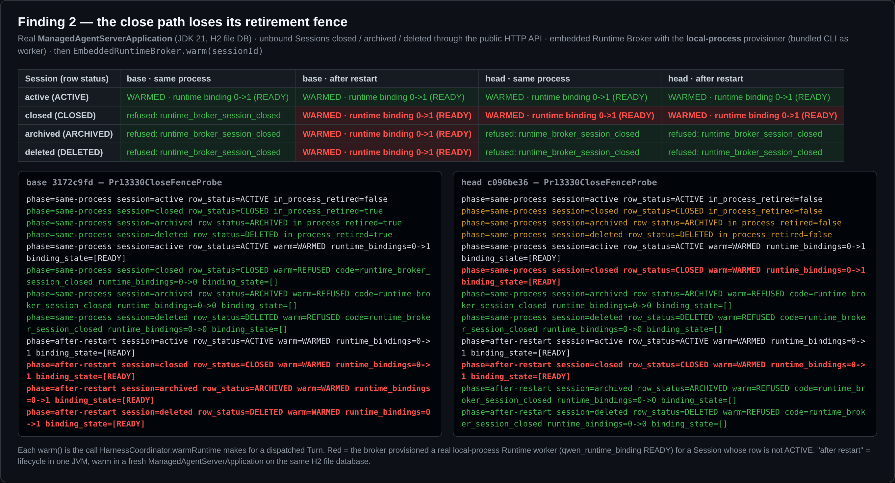
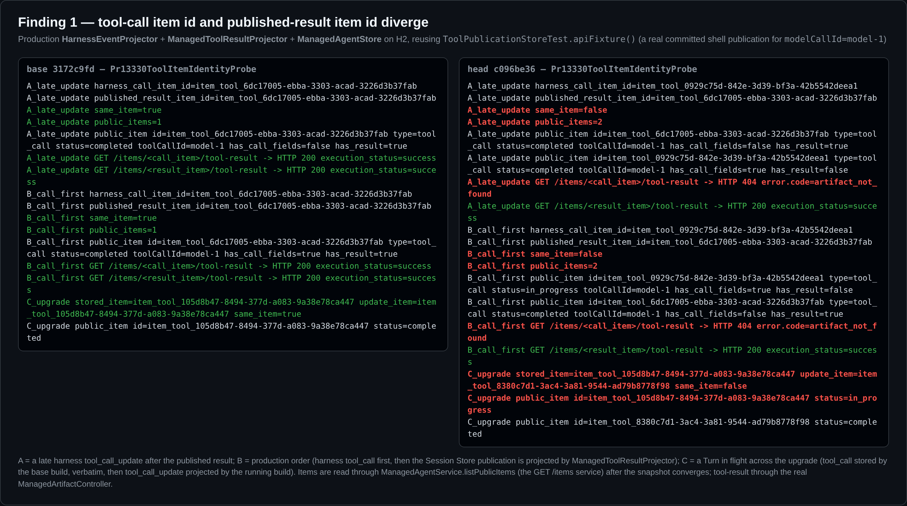
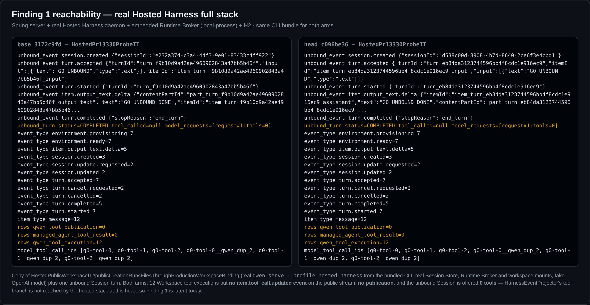
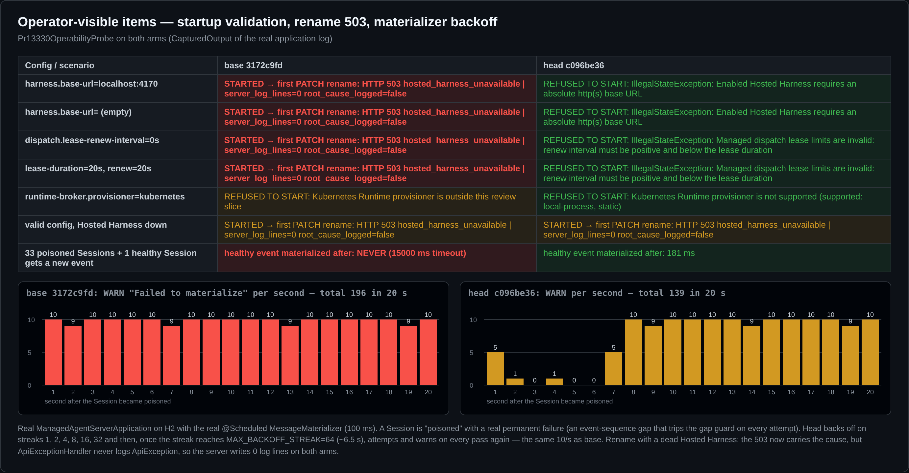

## Maintainer verification — #13330 @ `c096be36` (real-environment run)

**Verdict: not ready to merge as-is.** Several items hold, and I reproduced each improvement against the base: the archive/delete fence (now restart-safe), the connector close race, startup validation for the base URL and the lease/renew pair, the Kubernetes wording, and the starvation half of the backoff. One problem blocks the merge. The close-path fence regression flagged in the Stage-2 triage review reproduces end to end. A second problem should also be fixed in this PR: the identity divergence the triage flagged reproduces with the production classes, though it is latent today. Two items have no runtime effect yet: the rename cause, and the warn-flood half of the backoff. Item 2 is no longer in the diff. Both fixes are small. I applied a two-file candidate patch locally, and it passes every probe and the full suite (details below).

> Note: the takeover rounds never picked up the Stage-2 `request changes` (round 1 resolved a merge conflict, round 2 retried a CI flake, and round 3 reported "no actionable feedback"). Both Criticals are still present at this head.

**Rig.** The base arm is the merge-base `3172c9fd`. Between the two arms the production diff is exactly the PR's 9 files, and the PR merges cleanly into current `main` (`69d5db2f`). Java runs on `eclipse-temurin:21-jdk`, the CI JDK. The databases are H2 and MariaDB `10.11.18`, the same MariaDB image as CI. For the full-stack run I built and bundled the CLI from this head (`pnpm install`, `build`, `bundle`), then ran a real `qwen serve --profile hosted-harness` together with the Spring server, the Session Store and the embedded Runtime Broker. Every probe drives the production classes on the path under test. The only fakes are the model and a few collaborators off that path.

### Results by item

| # | Item | Result | Evidence |
|---|---|---|---|
| 1a | Durable ARCHIVED/DELETED fence | ✅ works, and it **survives a restart**. On base, a restarted server warms archived and deleted Sessions (a real `READY` runtime binding) | Fig. 1 |
| 1b | "Close keeps its in-process retirement" | ❌ **regression vs main.** A CLOSED unbound Session warms a real runtime worker in the same process. `drain()` reads the row while it is still `CLOSING`, so it never retires. This is the triage Stage-2 Critical #2 | Fig. 1 |
| 2 | Attach fetch moved out of `computeIfAbsent` | ⚠️ **No longer in this diff.** It was superseded by #13403 on main during the merge. `loadsOnceAcrossConcurrentFreeAttachCalls` now pins #13403's code and passes on base too. The PR body still describes the old change | diff |
| 3 | Connector close race | ✅ | mutants m03/m04 killed |
| 4 | Schemeless base URL | ✅ The real server refuses to start with a clear message. On base it starts, and the first rename returns 503 with 0 log lines | Fig. 4 |
| 5 | Tool-item identity `:call:` tag | ⚠️ **Latent divergence (triage Critical #1 reproduced with production classes).** Tool calls now land in two items, and `GET /items/{call}/tool-result` returns 404. It is **not reachable in today's hosted stack** (Fig. 3), so I rate it should-fix, not live-broken | Fig. 2, 3 |
| 6 | Lease/renew validation | ✅ The real server refuses to start | Fig. 4 |
| 7 | Rename 503 cause chaining | ⚠️ **No runtime effect.** `ApiExceptionHandler.api()` never logs an `ApiException`, so with a dead Hosted Harness the server writes **0 log lines** on both arms | Fig. 4 |
| 8 | Materializer backoff | ✅ Starvation is fixed: with 33 poisoned Sessions, a healthy event materializes after **181 ms** (base: **never** within 15 s). ⚠️ The warn flood is **not** fixed: once the streak reaches the 64 cap (about 6.5 s), every pass attempts and warns again, at 10/s, the same as base | Fig. 4 |
| 9 | Kubernetes rejection wording | ✅ | Fig. 4 |

### Finding A (blocking): CLOSED unbound Sessions are no longer fenced

I booted the real `ManagedAgentServerApplication` on an H2 file database. Each Session went through `POST /close`, `/archive` or `DELETE` on the public API, and then I called `EmbeddedRuntimeBroker.warm(sessionId)`, which is the call `HarnessCoordinator.warmRuntime` makes when a Turn is dispatched. The provisioner was `local-process`, so a warm that passes the fence starts a real worker (`qwen_runtime_binding` `READY`). The results match the static trace: `deliver()` runs `settle()` → `drain()` *before* `completeOperation()`, the row still reads `CLOSING`, `drain()` retires nothing, and the resolver only fences ARCHIVED/DELETED. `drainStillRetiresAClosedSessionInProcess` stays green only because it mocks the row to `CLOSED`, a state it can never be in at that point.

Reachability is limited: close requires no active Turn, so the regression needs a dispatch/close race. It is still defense-in-depth that main has and this PR removes. It also leaves the restart gap open for closed Sessions, which this item was meant to close.

### Finding B (should fix in this PR): the two copies of the tool-item id rule diverge

This probe drives the production `HarnessEventProjector`, `ManagedToolResultProjector`, `ManagedAgentStore` and `ManagedArtifactController` over a real committed shell publication. Base always produces one merged item. Head splits it in all three orders:

- **A:** a harness update arrives after the published result.
- **B:** the production order, where the call comes first and the published result follows.
- **C:** a Turn is in flight across the upgrade. The `tool_call` was stored by the old build and the `tool_call_update` comes from the new one. This leaves an orphan item stuck `in_progress`.

The triage asked one thing of the author: whether the harness `toolCallId` equals the binding's `modelCallId`. The code says yes. `hosted-workspace-tool-turn.ts` records `modelCallId: request.call.callId`, the model's function-call id, which is the same id the harness streams.

**Reachability today:** none. In the real hosted stack (Fig. 3, both arms identical), Workspace Sessions ran 12 tool executions but put no `item.tool_call.updated` on the public stream and made no publication. The unbound Session was offered 0 tools. So `HarnessEventProjector`'s tool branch is not reached yet, and neither are the collision this item fixes or the split it introduces. That is the reason to take the stable fix now. Leaving the callId branch as `turnId + ":" + callId`, which is `EventIdentity`'s version-1 rule, and moving only the no-id fallback keeps ids wire-stable and needs no projection-version decision.

### Operator-visible items (startup validation, rename 503, backoff)

- **Backoff cap.** With `streak >= MAX_BACKOFF_STREAK`, the `streak < MAX` guard is false, so the target is attempted, and warned about, on every pass. Measured with the real `@Scheduled` materializer, warnings per second went `[5,1,0,1,0,0,5,10,9,10,…]`: 139 in 20 s against 196 on base, and the same 10/s steady state. To keep a gate at the cap, retry every `MAX` passes instead of falling through.
- **Rename cause.** To give on-call the root cause, log at the rename catch, for example `LOG.warn("Hosted Harness rename failed tenant={} session={}", …, error)`, or have `ApiExceptionHandler` log 5xx `ApiException`s that carry a cause.
- `MessageMaterializer.failures` is cleared only on success. I did not measure this one, but it is the same unbounded-map class the triage noted.

### Do the PR's tests catch reversions? (negative control and mutants)

- **Negative control.** I compiled the PR's changed test classes against the base production code. Of 82 tests, exactly the **7 new witnesses** go red: 3 for the connector, 2 for the broker (fence and k8s wording), 1 for the lease and 1 for the identity. `MessageMaterializerTest` cannot compile against base because it uses the new interface method.
- **17 mutants on head, each run against the full unit suite: 13 killed.** The 4 survivors show where the tests are blind:
  - **m06** makes `drain()` retire unconditionally, which is the base behaviour, and it **survives**: no test tells the PR's conditional apart from the always-retire it replaced. Given the real `CLOSING` ordering, always-retire is the behaviour that is actually correct. **m07** makes `drain()` never retire, which is what really happens at head, and it is killed only because `drainStillRetiresAClosedSessionInProcess` mocks the row as `CLOSED`.
  - **m01** drops the rename cause. No test covers it, and it has no observable effect anyway (item 7).
  - **m16 and m17** make the `deferMaterializationTarget` SQL a no-op, or also bump `covered_sequence` (which breaks the gap guard). Nothing pins the store method, because `MessageMaterializerTest` mocks the store. A JDBC-level test asserting that `updated_at` moves and `covered_sequence` does not would cover both.

### Candidate fix (local, not pushed)

The patch touches two files ([diff](data/candidate-fix.diff)):

1. `HarnessEventProjector` keeps the callId branch as `turnId + ":" + callId`, which is `EventIdentity` v1, so the published result and every stored id agree. Only the no-id fallback moves, to `turnId + "#source:" + sourceId`, which no `turnId:callId` can spell. The PR's own collision test stays green.
2. The broker resolver fences `CLOSING`, `CLOSED`, `ARCHIVING`, `ARCHIVED`, `DELETING` and `DELETED` durably, and `drain()` keeps an in-process entry only when the row has vanished.

With the patch applied, every non-ACTIVE cell of Fig. 1 refuses in both phases, all three identity scenarios merge into one item, and the full unit suite is **736/736 green on x86_64 (JDK 21)**. I left the backoff cap and the rename logging to the author.

### CI-parity gates on this head

- `mvn -Pmysql-integration clean verify checkstyle:check` against MariaDB 10.11.18 on x86_64 Linux: **736 unit + 52 MariaDB ITs, 0 failures**, Checkstyle 0, SpotBugs 0 (4 min 36 s).
- Full-stack hosted IT copy (`HostedPublicWorkspaceIT` flow plus an unbound Turn), real `qwen serve`: green on both arms.
- On aarch64 (Orange Pi, JDK 21), a same-load A/B with 4 suites in parallel passes on both arms (base 725/725 twice, head 736/736 twice). During the 3-way mutant sweep, `RuntimeBrokerDefaultOnTest` failed in 13 of the 19 head-based runs, including the unmutated control, whatever the mutant. This is a timing race in that test: the direct `recoverSavedRuntimes()` call returns early while the startup `@Scheduled` scan holds `running`, so the spy sees no call. I can't attribute it to this PR, which does not touch that path, but it is worth a follow-up, for example `verify(timeout(...))` or disabling the scheduler in that test.
- GitHub CI on `c096be36`: every lane green, including `Hosted process fault gates / MySQL 8.4` and `Real daemon E2E`.

**Not verified:** the MySQL `hosted-harness-mysql` lane locally (CI is green on it), Windows and macOS (CI only), and the item-2 attach behaviour (it is #13403's code now).

Evidence (probes, logs, candidate diff, figures): [`asserts@SHA/pr-13330`](.)
