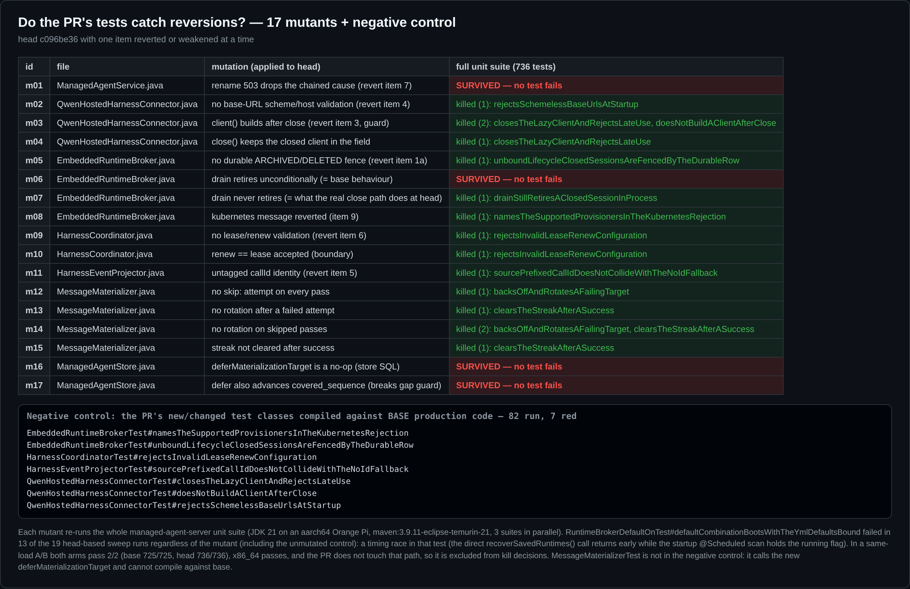
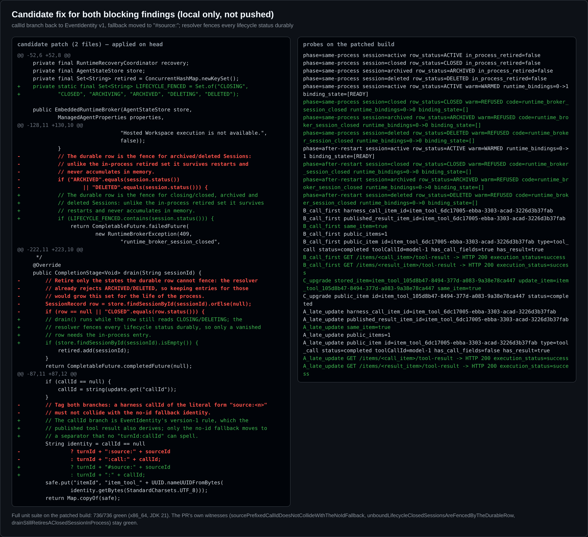

## 维护者验证 —— #13330 @ `c096be36`（真实环境）

**结论：现状不建议合入。** 多项改动成立，且每项改进都对照 base 复现过：归档/删除围栏（现在重启后仍有效）、连接器关闭竞态、base URL 与 lease/renew 的启动校验、kubernetes 文案，以及退避中"防饿死"的那一半。有一处问题阻塞合入：Stage-2 triage 评审指出的 close 路径围栏回归，我端到端复现了。另有一处建议在本 PR 内一并修：triage 指出的 id 分叉，用生产类复现了，只是目前还是潜伏的。还有两项目前没有运行时效果：rename 的 cause，以及退避中"告警洪水"的那一半。第 2 项已不在本 diff 中。两处修复都很小，我在本地打了一个两文件的候选补丁，所有探针和全量测试都通过（见下文）。

> 注：接管的 autofix 三轮都没有处理 Stage-2 的 `request changes`（第 1 轮解决合并冲突，第 2 轮重试 CI flake，第 3 轮报告"无可处理反馈"）。两条 Critical 在当前 head 上仍然存在。

**环境。** base 臂取 merge-base `3172c9fd`，两臂之间的生产代码差异恰好是 PR 的 9 个文件；PR 能干净合入当前 `main`（`69d5db2f`）。Java 跑在 CI 同款 `eclipse-temurin:21-jdk` 上，数据库用 H2 和 MariaDB `10.11.18`（MariaDB 镜像与 CI 相同）。全栈运行时，我用本 head 构建并 bundle 了 CLI（`pnpm install`、`build`、`bundle`），再把真实的 `qwen serve --profile hosted-harness` 与 Spring 服务、Session Store、内嵌 Runtime Broker 一起拉起。每个探针都驱动被测路径上的生产类，唯一的替身是模型，以及少数不在该路径上的协作者。

### 逐项结果

| # | 项 | 结果 | 证据 |
|---|---|---|---|
| 1a | ARCHIVED/DELETED 持久围栏 | ✅ 生效，且**重启后仍生效**。base 重启后会为已归档、已删除的会话 warm 出真实的 `READY` runtime binding | 图 1 |
| 1b | "close 仍保留进程内退休" | ❌ **相对 main 的回归**：同进程内，已关闭的非绑定会话会拉起真实 worker。`drain()` 读行时状态仍是 `CLOSING`，所以从不退休。即 triage Stage-2 Critical #2 | 图 1 |
| 2 | attach 抓取移出 `computeIfAbsent` | ⚠️ **已不在本 diff 中**：合并时被 main 上的 #13403 取代。`loadsOnceAcrossConcurrentFreeAttachCalls` 现在钉的是 #13403 的代码，在 base 上同样通过。PR 描述仍写着旧改动 | diff |
| 3 | 连接器关闭竞态 | ✅ | 变异体 m03/m04 被杀死 |
| 4 | 无 scheme 的 base URL | ✅ 真实服务启动即以清晰信息拒绝。base 能启动，首次 rename 才返回 503，且服务端零日志 | 图 4 |
| 5 | 工具项 id `:call:` 标记 | ⚠️ **潜伏分叉（用生产类复现了 triage Critical #1）**：工具调用被拆成两个 item，`GET /items/{call}/tool-result` 返回 404。但**当前 hosted 栈触达不到**（图 3），因此定为"应修"，而非线上已坏 | 图 2、3 |
| 6 | lease/renew 校验 | ✅ 真实服务启动即拒绝 | 图 4 |
| 7 | rename 503 挂 cause | ⚠️ **没有运行时效果**：`ApiExceptionHandler.api()` 从不记录 `ApiException`，harness 宕机时两臂服务端日志都是 **0 行** | 图 4 |
| 8 | 物化退避 | ✅ 饿死已修：33 个被污染会话时，健康事件 **181 ms** 内物化（base 15 秒内**始终没有**）。⚠️ 告警洪水**没修**：streak 到 64 上限（约 6.5 秒）后每轮都重新尝试并告警，回到 10 次/秒，与 base 相同 | 图 4 |
| 9 | kubernetes 拒绝文案 | ✅ | 图 4 |

### 发现 A（阻塞）：已关闭的非绑定会话不再被围栏拦截

我在 H2 文件库上拉起真实的 `ManagedAgentServerApplication`，每个会话分别走公共 API 的 `POST /close`、`/archive` 或 `DELETE`，然后调用 `EmbeddedRuntimeBroker.warm(sessionId)`——这正是 turn 派发时 `HarnessCoordinator.warmRuntime` 发出的调用。provisioner 用的是 `local-process`，所以一旦 warm 穿过围栏，就会拉起真实 worker（`qwen_runtime_binding` 变为 `READY`）。结果与静态追踪一致：`deliver()` 在 `completeOperation()` **之前**执行 `settle()` → `drain()`，此时行仍是 `CLOSING`，`drain()` 什么都不退休，而 resolver 只拦 ARCHIVED/DELETED。`drainStillRetiresAClosedSessionInProcess` 之所以绿，只是因为它把行 mock 成了 `CLOSED`，而那个时间点上行不可能处于该状态。

可达性有限：close 要求没有活动 turn，所以要触发这个回归需要 dispatch/close 竞态。但它仍是 main 已有、而本 PR 去掉的纵深防御；而且已关闭会话的重启缺口也仍然敞开，而补上这个缺口正是这一项的目的。

### 发现 B（建议在本 PR 内修）：工具项 id 规则的两份实现分叉

这个探针驱动生产类 `HarnessEventProjector`、`ManagedToolResultProjector`、`ManagedAgentStore` 和 `ManagedArtifactController`，作用在一条真实已提交的 shell 发布上。base 始终得到一个合并后的 item；head 在三种顺序下都会拆开：

- **A**：harness 的更新晚于已发布的结果到达。
- **B**：生产顺序，先有调用，后有发布的结果。
- **C**：turn 跨越升级。`tool_call` 由旧版本写入，`tool_call_update` 来自新版本，结果留下一个永远 `in_progress` 的孤儿 item。

triage 只请作者确认一件事：harness 的 `toolCallId` 是否等于发布绑定里的 `modelCallId`。代码给出的答案是相等：`hosted-workspace-tool-turn.ts` 记录的 `modelCallId: request.call.callId` 就是模型的 function-call id，也就是 harness 流出的那个 id。

**当前可达性：** 没有。在真实 hosted 栈里（图 3，两臂一致），Workspace 会话执行了 12 次工具，但公共事件流里没有任何 `item.tool_call.updated`，也没有任何发布；非绑定会话拿到的工具数为 0。所以 `HarnessEventProjector` 的工具分支尚未被触达——本项要修的冲突和它引入的分叉都还没有发生。正因如此，现在采用稳定修法最合适：callId 分支保持 `turnId + ":" + callId`（即 `EventIdentity` 的 v1 规则），只改无 id 的兜底分支。这样 id 在线上保持稳定，也不需要做 projection 版本决策。

### 运维可见项（启动校验、rename 503、退避）

- **退避上限。** 当 `streak >= MAX_BACKOFF_STREAK` 时，`streak < MAX` 不成立，目标在每一轮都会被尝试并告警。用真实 `@Scheduled` 物化器实测，每秒告警数依次为 `[5,1,0,1,0,0,5,10,9,10,…]`：20 秒共 139 次（base 196 次），稳态同为 10 次/秒。要在上限处保留门控，应改为每 `MAX` 轮重试一次，而不是直接放行。
- **rename 根因。** 要让 on-call 看到根因，应在 rename 的 catch 里记日志，例如 `LOG.warn("Hosted Harness rename failed tenant={} session={}", …, error)`；或者让 `ApiExceptionHandler` 记录带 cause 的 5xx `ApiException`。
- `MessageMaterializer.failures` 只在成功时清理。这一点我没有实测，但属于 triage 提到的同一类无界 map 问题。

### PR 的测试能否抓住回退？（负对照与变异）

- **负对照。** 我把 PR 改动的测试类放到 base 生产代码上编译运行。82 个测试中，红的恰好是 **7 个新增见证**：连接器 3 个，broker 2 个（围栏与 k8s 文案），lease 1 个，身份 1 个。`MessageMaterializerTest` 用到了新接口方法，在 base 上无法编译。
- **在 head 上做 17 个变异，每个都跑全量单测：杀死 13 个。** 存活的 4 个暴露了测试的盲区：
  - **m06** 让 `drain()` 无条件退休（即 base 的行为），结果**存活**：没有测试能区分 PR 的条件退休和它所替换的"总是退休"。而结合真实的 `CLOSING` 时序，"总是退休"才是真正正确的行为。**m07** 让 `drain()` 从不退休（这正是 head 上实际发生的情况），它被杀死只是因为 `drainStillRetiresAClosedSessionInProcess` 把行 mock 成了 `CLOSED`。
  - **m01** 去掉 rename 的 cause。没有测试覆盖它，而且它本来就没有可观测效果（第 7 项）。
  - **m16 和 m17** 让 `deferMaterializationTarget` 的 SQL 变成空操作，或额外推进 `covered_sequence`（这会破坏 gap 守卫）。没有任何测试钉住这个 store 方法，因为 `MessageMaterializerTest` mock 了 store。加一个 JDBC 层测试，断言 `updated_at` 变化而 `covered_sequence` 不变，就能同时覆盖这两点。

### 候选修复（本地，未推送）

补丁只涉及两个文件（[diff](data/candidate-fix.diff)）：

1. `HarnessEventProjector` 的 callId 分支保持 `turnId + ":" + callId`，即 `EventIdentity` v1 规则，这样发布的结果与所有已存 id 一致。只有无 id 的兜底分支改为 `turnId + "#source:" + sourceId`，任何 `turnId:callId` 都拼不出这个形式。PR 自带的冲突测试保持绿色。
2. broker 的 resolver 对 `CLOSING`、`CLOSED`、`ARCHIVING`、`ARCHIVED`、`DELETING`、`DELETED` 做持久围栏；`drain()` 只在行已消失时才保留进程内条目。

应用补丁后，图 1 中所有非 ACTIVE 的格子在两种阶段下都拒绝，三种身份场景都合并为一个 item，全量单测 **736/736 green on x86_64 (JDK 21)**。退避上限和 rename 日志留给作者处理。

### 本 head 上的 CI 同款门禁

- x86_64 Linux 上对 MariaDB 10.11.18 执行 `mvn -Pmysql-integration clean verify checkstyle:check`：**736 个单测 + 52 个 MariaDB IT，0 失败**，Checkstyle 0，SpotBugs 0（4 分 36 秒）。
- 全栈 hosted IT 副本（`HostedPublicWorkspaceIT` 流程，外加一个非绑定会话 turn），使用真实 `qwen serve`：两臂均通过。
- aarch64（Orange Pi，JDK 21）上，4 个套件并行的同负载 A/B 中两臂都通过（base 两次 725/725，head 两次 736/736）。在 3 路并行的变异扫描中，`RuntimeBrokerDefaultOnTest` 在 19 次基于 head 的运行里失败了 13 次（包括未变异的对照组），与变异内容无关。这是该测试自身的时序竞态：启动时的 `@Scheduled` 扫描占着 `running` 标志时，测试直接调用的 `recoverSavedRuntimes()` 会提前返回，于是 spy 没有收到任何调用。本 PR 没有改动这条路径，无法归因于它，但值得另行跟进，例如改用 `verify(timeout(...))`，或在该测试中禁用调度器。
- GitHub CI 在 `c096be36` 上全绿，包括 `Hosted process fault gates / MySQL 8.4` 和 `Real daemon E2E`。

**未验证：** 本地未跑 MySQL `hosted-harness-mysql` 车道（CI 上为绿）；Windows、macOS 仅有 CI 覆盖；第 2 项的 attach 行为（现在属于 #13403 的代码）。

证据（探针、日志、候选 diff、截图）：[`asserts@SHA/pr-13330`](.)
