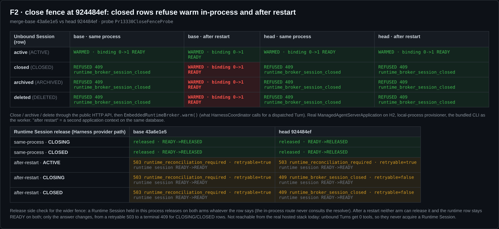
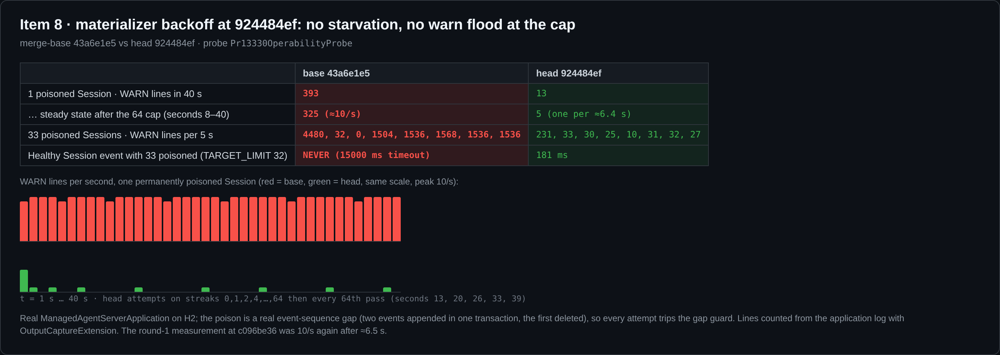
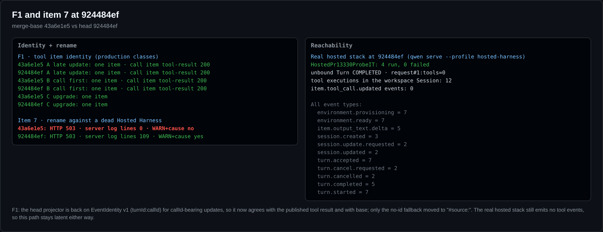
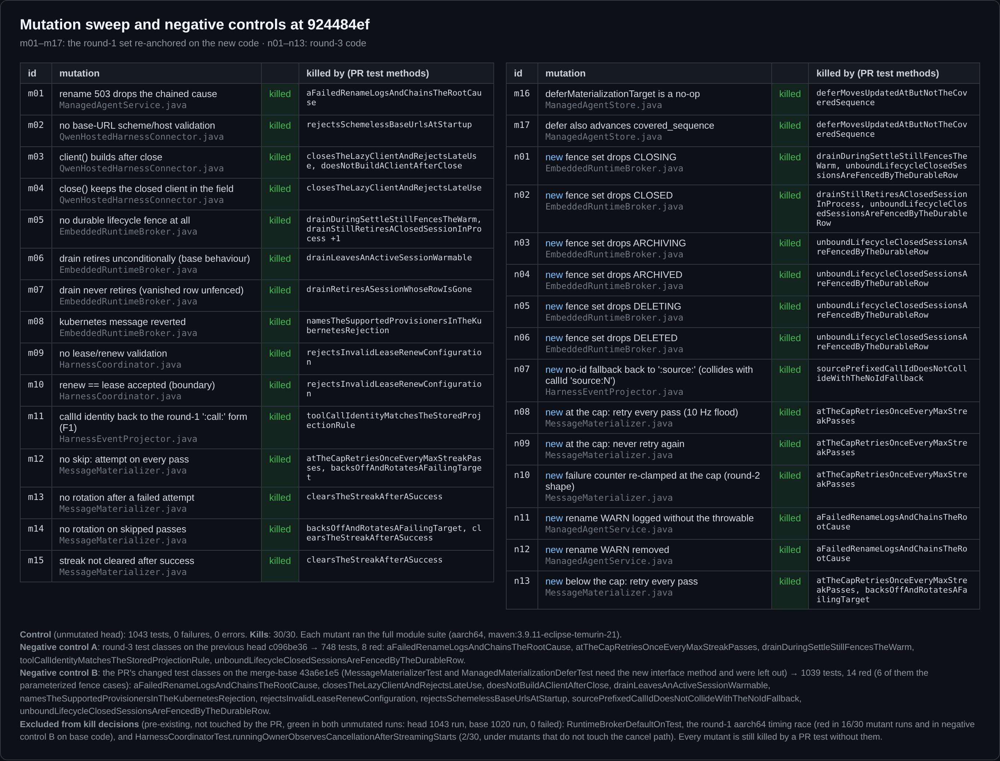

## 维护者验证第 2 轮（仅增量）— #13330 @ `924484ef`

**结论：代码层面可以合入，但合入前需要先修改 PR 描述。** 第 1 轮（[评论](https://github.com/QwenLM/qwen-code/pull/13330#issuecomment-6007415466)，`c096be36`）发现一处阻塞回归和一处应修的分叉。第 3 轮（`0f697026`）原样采用了第 1 轮的候选补丁，同时修复了两处可运维性问题（第 7 项，以及第 8 项的告警洪水部分），并为变异存活体补了测试。第 4 轮（`924484ef`）干净地合入了 `main`。我在新 head 上、以新的 merge-base `43a6e1e5` 为 base，重跑了第 1 轮的全部探针。第 1 轮指出的问题现在都已修复。本报告只写增量。

**环境。** 与第 1 轮相同。探针运行真实的 `ManagedAgentServerApplication`（H2 文件库、local-process provisioner、从本 head 构建并打包的真实 CLI worker），另外跑了一次真实 `qwen serve --profile hosted-harness` 的全栈 IT。base 臂是 merge-base `43a6e1e5`，两臂之间的生产代码差异正好是 PR 的 9 个文件。全量测试（变异扫描、负对照）在 aarch64 上运行（`maven:3.9.11-eclipse-temurin-21`），探针在 x86_64 上运行（`eclipse-temurin:21-jdk`）。

### 第 1 轮问题在 `924484ef` 上的状态

| 第 1 轮问题 | 现状 | 证据 |
|---|---|---|
| **F2（阻塞）：** 已关闭的非绑定会话能在同进程内 warm 出真实 worker | ✅ **已修复。** CLOSED、ARCHIVED、DELETED 在同进程内**以及重启后**都拒绝 `warm`。这比 base 更严：base 重启后这三种都能 warm 起来 | 图 1 |
| **F1（应修）：** 工具调用项与发布的结果项拆成两个 item | ✅ **已修复。** 三种事件顺序下，调用与结果都合并为一个 item，`GET /items/{call}/tool-result` 返回 200，与 base 一致。该路径在真实 hosted 栈中仍然走不到 | 图 3 |
| **第 8 项：** 到 64 上限后告警洪水复现 | ✅ **已修复。** 单个被污染会话 40 秒内 **13** 行 WARN（base：**393**）。到达上限后约每 6.4 秒一行，base 是每秒 10 行。防饿死仍然有效（**181 ms**；base 15 秒内始终未物化） | 图 2 |
| **第 7 项：** rename 返回 503 但没有任何日志 | ✅ **已修复。** Hosted Harness 宕机时，服务端现在会记录 `Hosted Harness rename failed`，并带上 `ConnectException` 根因。base 为 0 行 | 图 3 |
| 变异存活体 m01、m06、m16、m17 | ✅ **全部杀死。** 第 1 轮的 17 个变异体重新锚定到新代码后 17/17 被杀；针对第 3 轮代码的 13 个新变异体也全部被杀 | 图 4 |
| 第 2 项已被 #13403 取代；PR 描述过时 | ⚠️ **仍未处理，而且描述里不准确的地方更多了**（见下文） | — |

**F2。** 完整矩阵见图 1。生命周期变更通过公共 HTTP API 完成，之后调用 `EmbeddedRuntimeBroker.warm()`，这正是 `HarnessCoordinator` 为已派发 turn 做的调用。由于 `drain()` 现在只在行已消失时才退休，进程内集合在任何生命周期路径上都不再增长（三种状态都是 `in_process_retired=false`）。

**对第 1 轮修复本身的检查。** 第 1 轮建议把 `CLOSING`（以及其他所有生命周期状态）加进 resolver 围栏。但 resolver 不只服务于 `warm`：当 Runtime Session 不在本进程内持有时，`acquire`、`release`、`reconcile` 也会解析 scope。所以我加了 `release` 格子，走的是 Harness provider 使用的那条路径（图 1 下表）：

- **同进程：** 无论行是什么状态，两臂都能正常释放，因为这条路由不经过 resolver。
- **重启后：** 两臂都无法释放，runtime 行在两边都停在 `READY`。唯一的区别是返回值：对 `CLOSING`/`CLOSED` 行，base 返回 `503 runtime_reconciliation_required`（可重试），head 返回 `409 runtime_broker_session_closed`（终态）。
- **可达性：** 这条路径今天走不到。真实 hosted 栈中，非绑定 turn 拿到的工具数为 0（图 3），所以永远不会 acquire Runtime Session。

这不算问题。记录在这里，是为了以后不被误当成回归。

### 测试、变异与负对照

- **全量测试：** 未变异的 head 跑 1043 个测试，0 失败（2 个跳过）；merge-base 跑 1020 个，0 失败。两者都在 aarch64 上运行，x86 由 CI 覆盖。
- **负对照 A（只看第 3 轮）。** 我把第 3 轮的测试类放到上一轮 head `c096be36` 的生产代码上编译运行。748 个测试中**恰好 8 个变红**，全部是第 3 轮的见证测试：围栏测试的 `CLOSING`、`CLOSED`、`ARCHIVING`、`DELETING` 四格（`ARCHIVED`/`DELETED` 在 `c096be36` 上本来就拦），以及 `drainDuringSettleStillFencesTheWarm`、`toolCallIdentityMatchesTheStoredProjectionRule`、`atTheCapRetriesOnceEveryMaxStreakPasses`、`aFailedRenameLogsAndChainsTheRootCause`。`ManagedMaterializationDeferTest`、`drainRetiresASessionWhoseRowIsGone`、`drainLeavesAnActiveSessionWarmable` 在那里保持绿色，这是对的：它们钉住的是 `c096be36` 已有的行为，它们的价值体现在变异扫描中（分别对应 m16/m17、m07、m06）。
- **负对照 B（整个 PR）。** 我把 PR 改动的测试类放到 merge-base `43a6e1e5` 上编译运行，去掉了两个需要新接口方法的类。1039 个测试中 **14 个变红**（其中 6 个是参数化的围栏用例），全部是 PR 的见证测试。
- **变异：30/30 全部杀死**，每一个都被 PR 的测试杀死，每个变异体都跑全量测试。
  - 第 1 轮的 4 个存活体现在全部被杀：**m01**（去掉 rename 的 cause）、**m06**（`drain()` 无条件退休）、**m16**（defer SQL 变成空操作）、**m17**（defer SQL 同时推进 `covered_sequence`）。
  - **n01–n06** 各从围栏集合中删掉一个状态，每一个都被抓到。
  - **n08–n10** 覆盖上限门：每轮都重试、永不重试、把计数器重新钳住（第 2 轮的形态）。三者都被 `atTheCapRetriesOnceEveryMaxStreakPasses` 抓到。
- **两个已有测试不计入杀死判定。** `RuntimeBrokerDefaultOnTest` 是第 1 轮记录的 aarch64 时序竞态，在 30 次变异运行中失败 16 次。`HarnessCoordinatorTest.runningOwnerObservesCancellationAfterStreamingStarts` 失败 2 次，报的是 `cancel` 上的 `TooManyActualInvocations`，出现在与该路径无关的变异体下。PR 没有碰这两个测试，二者在未变异的 head 和 base 运行中都通过。即使剔除它们，每个变异体仍然被杀死。

### 与 `main` 的合并（第 4 轮）

- **逻辑 diff 没有变化。** 我分别对比了 PR 相对旧 merge-base（`3172c9fd`→`0f697026`）和相对新 merge-base（`43a6e1e5`→`924484ef`）的 diff。两者都是同样的 17 个文件、+577/−18，改动行逐行相同（595 行），唯一的差别是新增的 `store` 字段旁边一个空行的位置（它与 `main` 的 `workspaces` 字段并排）。
- **`main` 新代码碰不到这个围栏。** 围栏位于 resolver 的 workspace 分支之后，绑定会话永远不会走到它；W2 的 `verifyWorkspaceCwdTarget` 和绑定会话的关闭路径（`closeWorkspace`）都不受它影响。#13289 合入后，Kubernetes 文案仍然准确。那个 PR 加的是实验性 CSI runtime 的组件（CLI worker 和持久化的 worker ACK 存储），内嵌 broker 在启动时仍会用 PR 的文案拒绝 `provisioner=kubernetes`（已在本 head 上重跑确认）。
- **`924484ef` 上 CI 所有车道全绿。** 包括完整的 SDK Java 矩阵、`Runtime Broker and Managed Agent MariaDB`、`Hosted process fault gates / MySQL 8.4`（在 `0f697026` 上是红的，这里是绿的）和 `Real daemon E2E`。只有 `review-pr` 和 `fallback-comment` 失败，二者都属于评审流水线，与本 PR 代码无关。

### 对 triage 沙箱验证的交叉核对（[评论](https://github.com/QwenLM/qwen-code/pull/13330#issuecomment-6016016971)，同一 head）

它的结论是 `findings`（非阻塞），34/34 断言通过，13 个逐 hunk 回退的结果与我的扫描一致。我在真实应用上核对了它的三条发现：

- **发现 1，"`MessageMaterializer.failures` 无界增长"：** 对关闭和删除来说，这个前提不成立。我污染了 4 个会话，然后关闭一个、删除一个、在本物化器之外把一个追平（相当于另一个服务实例做的事）。之后 15 秒内，已关闭和已删除的会话**仍被选中**，仍按上限节奏重试（各 3 行 WARN），条目一直在使用（streak 170）。原因是 `findMaterializationTargets` 不按状态过滤，服务端也没有任何代码物理删除会话行或 progress 行。只有在别处被追平的会话留下了孤儿条目（停在 streak 20，不再被选中）。所以这个 map 只会随"在本实例失败、又被其他实例追平"的会话增长。从代码看，孤儿条目唯一的影响是：如果该会话以后又在本实例成为目标，本实例最多会跳过 63 轮（约 6.3 秒）。按作者的安排延后处理即可。已删除的被污染会话被永远重试是原有行为：base 同样会选中它，同样 15 秒内 base 为它记 146 行 WARN，head 是 3 行。
- **发现 2，"Session Store base URL 仍未校验"：** 在真实启动路径上复现了。`session-store.enabled=true` 时，`localhost:4170` 和 `https://` 在 base 和 head 上都能正常启动。这是已有问题，不在本 PR 范围内，适合作为第 4 项旁边的后续。
- **发现 3，"`:sequence:` 兜底分支存在同形冲突"：** 同意它只是静态推断。这个兜底属于 `EventIdentity` v1，而 v1 决定了已存储 item 的 id，改它应该放进单独的投影版本变更，不在本 PR 里做。
- **它的两条描述勘误**，就是上面清单里的第 1 条和第 3 条。

### 合入前：PR 描述

描述里还在讲已经不在 PR 里的代码。评审者会读它，合入记录也会留下它：

1. **"Attach concurrency … the fetch now happens before `putIfAbsent`"**：不在本 diff 中，已被 #13403 取代。
2. **"`drainStillRetiresAClosedSessionInProcess` pins that close keeps its in-process retirement … drain adds only CLOSED rows"**：现在 resolver 对全部六种生命周期状态做持久围栏，`drain()` 只在行已消失时退休。
3. **风险一节 "Tool item ids for callId-bearing tools change (`:call:` tag)"**：已不成立。带 callId 的 id 没有变化（EventIdentity v1），只有无 id 的兜底分支改为 `#source:`。
4. **"Cause chaining … log-only change"** 和 **"a hard-poisoned single session still warns … bounded by the 64-streak cap"**：现在有带根因的 WARN 日志，到达上限后每 64 轮才重试一次。
5. **"562 tests"**：模块现在有 1043 个单测。

### 本轮未复验

- 本地没有跑 MariaDB/MySQL 车道；CI 在本 head 上为绿。
- 我的全量测试只在 aarch64 上跑过，x86 由 CI 覆盖（ubuntu Java 11/17/21）。
- 第 1 轮记录的 `RuntimeBrokerDefaultOnTest` aarch64 时序竞态，作者已作为本 PR 范围外的问题延后处理（本轮在 30 次变异运行中红了 16 次，在 base 代码上的负对照 B 中也红了，未变异的 head 和 base 运行中都是绿的）。

证据（探针、日志、扫描结果、截图）：this directory
