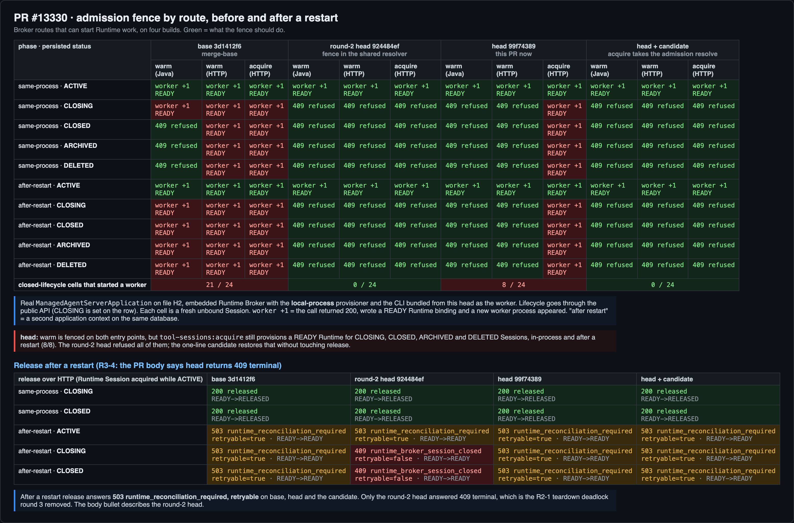
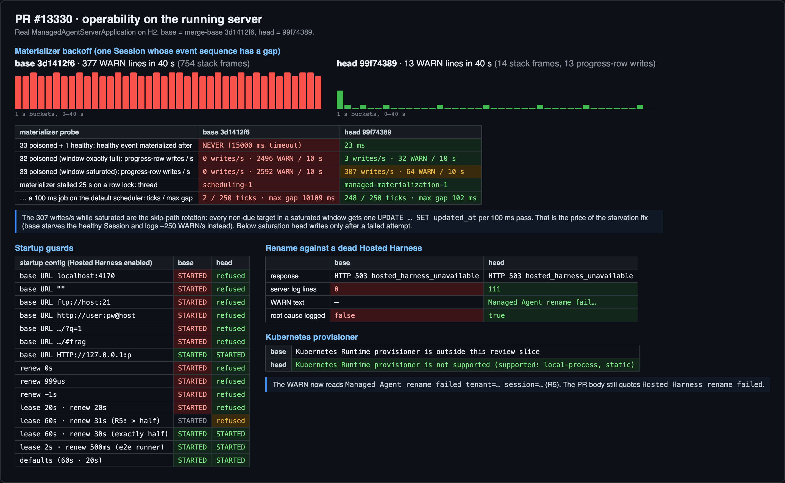
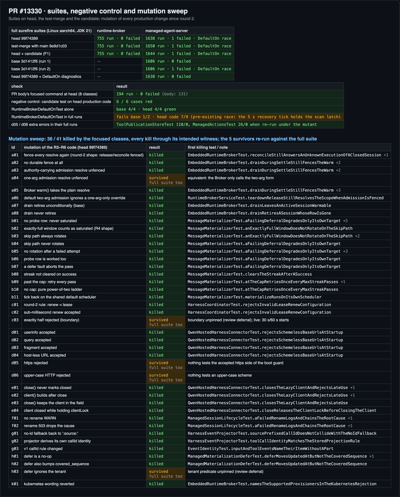

## Maintainer verification, round 3 (delta) — #13330 @ `99f74389`

**Verdict: the code is ready except for one should-fix gap (F1, a one-line fix verified below). The PR body is not ready: it has to be rewritten before merge.** Round 2 ([comment](https://github.com/QwenLM/qwen-code/pull/13330#issuecomment-6017452336), at `517104bb`) found the code ready. Since then, rounds R3–R6 changed production code in five places:

- the admission split (`6a671b32`, merged with `02952ee7`);
- the saturation gate (`64ce1b1d`, `e5940ae4`);
- the five base-URL rules (`e5940ae4`);
- the half-lease rule, the materializer's own scheduler and the new rename WARN text (`c9fd6d04`).

This round re-ran every round-2 probe at `99f74389` and added a probe for each of those changes.

**Rig.**

- **Server:** the real `ManagedAgentServerApplication` on file-backed H2, with the embedded Runtime Broker using the local-process provisioner.
- **Worker:** a real CLI bundled from `99f74389` (`pnpm install --frozen-lockfile`, then build and bundle).
- **Platform:** JDK 21 (`maven:3.9.11-eclipse-temurin-21`) and Node 24 on Linux aarch64.
- **Four builds, all compared in Fig. 1:**
  - base: merge-base `3d1412f6`;
  - the round-2 head `924484ef`;
  - head: `99f74389`;
  - head plus the F1 candidate.
- **Suites:** they also ran on a test-merge with current `main` `9e9d1c03` (clean, tree `eb27de7c`).
- **Restart:** "after a restart" means a second application context opened on the same database.

### F1 — `tool-sessions:acquire` is outside the fence (should fix)



- **What happens.** At head, warm is refused on both entry points for CLOSING, CLOSED, ARCHIVED and DELETED unbound Sessions, in the same process and after a restart (16/16):
  - `EmbeddedRuntimeBroker.warm()`, which `HarnessCoordinator` calls;
  - `POST …/runtimes:warm`.

  But `POST /internal/runtime-broker/v1/tool-sessions:acquire` with a new `runtimeSessionId` returns 200 for all 8 of those cells. Each call writes a READY Runtime binding and starts a worker process.
- **Why.** `6a671b32` moved the fence out of the shared resolver into `resolveAdmission`, and only `warm()` calls it (`RuntimeBrokerService.java:467`). For a Runtime Session this process does not hold, `acquire()` resolves through the plain channel (`:502`) and then calls `acquireNewSession → ensureBinding`, which provisions a Runtime.
  - The round-2 head refused all 8 cells, because its fence sat in the shared resolver.
  - Round 3 produced two fixes for R2-1 in parallel. `02952ee7` split the resolver into a fenced bootstrap channel ("warm, acquire") and a permissive teardown channel. `6a671b32` fenced warm only. The merge kept `6a671b32`.
- **Reach.** The shipped Harness can't reach this today:
  - The only production caller of `tool-sessions:acquire` is `hosted-workspace-broker.ts`. It serves workspace-bound Sessions, which resolve before the fence.
  - The unbound client, `BrokerManagedRuntimeProvider`, is constructed only in its own tests.

  So triggering it needs a direct caller that holds the Broker token. Base behaves the same, so this is not a regression against `main`.
- **Why fix it here anyway.** The PR's first bullet says "the Runtime Broker refuses an unbound Session whenever its persisted status is closing, closed, …", and the stated motivation is that closed Sessions could be "warmed back to a ready Runtime". Once the unbound provider is wired, acquire brings that exact bug back.
- **Candidate** (one production line plus a parameterized witness, below):
  - **Real stack:** 0 of 24 closed-lifecycle cells start a worker (last column of Fig. 1).
  - **Release is unchanged:** 200 in the same process; `503 runtime_reconciliation_required`, retryable, after a restart.
  - **Negative control:** the new test fails 6/6 on head's production code and passes with the fix.
  - **Full suites:** runtime-broker 755/0. Managed-agent-server ran 1644 tests (head's 1638 plus the 6 new cases). Its only failure was the pre-existing `RuntimeBrokerDefaultOnTest` race (see the last section).

  If acquire is meant to stay open, the alternative is to narrow the body to "refuses warm" and leave a comment at `RuntimeBrokerService.java:502` explaining why.

<details>
<summary>Candidate patch (verified)</summary>

```diff
--- a/packages/sdk-java/runtime-broker/src/main/java/com/alibaba/qwen/code/runtimebroker/RuntimeBrokerService.java
+++ b/packages/sdk-java/runtime-broker/src/main/java/com/alibaba/qwen/code/runtimebroker/RuntimeBrokerService.java
@@ -499,7 +499,10 @@ public final class RuntimeBrokerService implements AutoCloseable {
                 }
             });
         }
-        return resolveScope(harnessId, authority).thenCompose(scope -> {
+        // A Runtime Session this process does not hold yet admits new work
+        // (ensureBinding can provision a Runtime), so it takes the admission
+        // resolve like warm; release and reconcile stay off the fence.
+        return resolveScope(harnessId, true, authority).thenCompose(scope -> {
             RuntimeSession session = new RuntimeSession(harnessId,
                     runtimeId, turnKind, scope);
             return acquireSession(session);
--- a/packages/sdk-java/managed-agent-server/src/test/java/com/alibaba/qwen/code/managedagent/EmbeddedRuntimeBrokerTest.java
+++ b/packages/sdk-java/managed-agent-server/src/test/java/com/alibaba/qwen/code/managedagent/EmbeddedRuntimeBrokerTest.java
@@ -309,6 +309,41 @@ class EmbeddedRuntimeBrokerTest {
+    @org.junit.jupiter.params.ParameterizedTest
+    @org.junit.jupiter.params.provider.ValueSource(strings = {"CLOSING",
+            "CLOSED", "ARCHIVING", "ARCHIVED", "DELETING", "DELETED"})
+    void acquireOfANewRuntimeSessionIsFencedLikeWarm(String status)
+            throws Exception {
+        ManagedAgentStore store = mock(ManagedAgentStore.class);
+        when(store.findSessionById(SESSION_ID)).thenReturn(
+                Optional.of(new SessionRecord("tenant-a", SESSION_ID,
+                        "qwen-code", null, status, null, null, 0, 0, 1,
+                        1, null, 0)));
+        try (EmbeddedRuntimeBroker broker = broker(store, properties())) {
+            // A Runtime Session this process does not hold would provision a
+            // Runtime, which is new work on a closed Session.
+            HttpURLConnection connection = (HttpURLConnection) broker
+                    .getBaseUri().resolve("/internal/runtime-broker/v1/"
+                            + "tool-sessions:acquire")
+                    .toURL().openConnection();
+            connection.setRequestMethod("POST");
+            connection.setRequestProperty("Authorization",
+                    "Bearer broker-token");
+            connection.setDoOutput(true);
+            connection.getOutputStream().write(("{\"protocolVersion\":1,"
+                    + "\"requestId\":\"req-acquire\","
+                    + "\"harnessSessionId\":\"" + SESSION_ID + "\","
+                    + "\"runtimeSessionId\":\"" + RUNTIME_ID + "\","
+                    + "\"turnKind\":\"bootstrap\"}")
+                    .getBytes(java.nio.charset.StandardCharsets.UTF_8));
+            assertThat(connection.getResponseCode()).isEqualTo(409);
+            assertThat(new String(connection.getErrorStream().readAllBytes(),
+                    java.nio.charset.StandardCharsets.UTF_8))
+                    .contains("runtime_broker_session_closed");
+            connection.disconnect();
+        }
+    }
+
```

</details>

### The PR body at `99f74389`

The body still describes `b5bf5b42` and, in places, the round-2 head. Each row below was checked against this head:

| Body says | Head does | Evidence |
|---|---|---|
| **Risk, "Release after a restart":** "now fails with `409 runtime_broker_session_closed` (terminal). Before, `503 runtime_reconciliation_required` (retryable)" (R3-4) | `503 runtime_reconciliation_required`, retryable, the same as base. Only the round-2 head answered 409, and that is the R2-1 deadlock round 3 removed | Fig. 1, lower table |
| "The Runtime Broker refuses an unbound Session whenever its persisted status is …" | Only warm is refused. Acquire is not (F1). The design note and the README already say "admission resolve (warm)" | Fig. 1 |
| Lease: "the renew interval must also be shorter than the lease". The quoted error reads "…must be positive and below the lease duration" | The renew interval must be at least 1 ms and at most half the lease (`c9fd6d04`). The error now reads "…at least one millisecond and at most half the lease duration" | Fig. 2 |
| "Breaking changes: None" | A renew interval above half the lease but below the lease (31 s with a 60 s lease, say) started on `main` and is now refused at startup. The defaults (60 s/20 s) and the e2e runner's 2 s/500 ms still start | Fig. 2 |
| Rename: "logs `Hosted Harness rename failed`" (EN and 中文, and in the Evidence table) | `Managed Agent rename failed tenant=… session=…` (`c9fd6d04`) | Fig. 2 |
| Backoff: "Between retries the Session is moved behind fresher sessions" | That happens only when more than 32 targets are waiting (the 33-row probe). Below that, the materializer writes only after a failed attempt. The tick also moved to its own `managed-materialization` scheduler, which the body never mentions | Fig. 2 |
| Base URL: "absolute http(s) URL with a host" | It also rejects userinfo, a query and a fragment, mirroring `HostedHarnessClient.normalizeBaseUri` | Fig. 2 |
| Test plan: "At `b5bf5b42` this reports `Tests run: 131`" | 194 at this head (EmbeddedRuntimeBroker 28, QwenHostedHarnessConnector 57, HarnessEventProjector 9, EventIdentity 4, HarnessCoordinator 62, ManagedSessionLifecycle 25, MessageMaterializer 7, ManagedMaterializationDefer 2) | Fig. 3 |
| The test list | It omits the witnesses the mutation sweep relies on (Fig. 3): `releaseStillSettlesAnUnboundClosedSession`, `reconcileStillAnswersAnUnknownExecutionOfAClosedSession`, `teardownReleaseStillResolvesTheScopeWhenAdmissionIsFenced`, `anExactlyFullWindowDoesNotRotateOnTheSkipPath`, `materializeRunsOnItsOwnScheduler`, `warnsWithTheStackOnlyDuringTheExponentialPhase` and `aHarnessFaultedRenameLogsAndChainsTheRootCause` | Fig. 3 |
| Evidence: "After is this PR at `b5bf5b42`", and "current `main` differs from [`43a6e1e5`] by one comment line" on every file the PR touches | `43a6e1e5 → main` is now +5165/−413 across 18 of those files. I re-measured both columns at `3d1412f6` / `99f74389`, and the conclusions hold: 377 → 13 WARN lines in 40 s, starvation never → 23 ms. This round's numbers can replace the table | Fig. 2 |
| CI: "Both [MySQL / MariaDB lanes] were cancelled … tracked in #13542" | Both lanes are green at `99f74389`, and #13542 was closed on Oct 7. Every check on this head is green | `gh pr checks` |

The bot's paste-ready replacement for the release bullet ([thread](https://github.com/QwenLM/qwen-code/pull/13330#discussion_r4235998230)) matches what I measured.

### What holds at `99f74389`



- **Warm fence:** both warm entry points refuse all four closed statuses, in the same process and after a restart. Release still settles a Runtime Session held in this process (200), so the R2-1 deadlock stays fixed.
- **Materializer:** one poisoned Session logs 13 WARN lines in 40 s (base: 377) and makes 13 progress-row writes. A healthy Session behind 33 poisoned ones is materialized in 23 ms (base: never within 15 s).
- **Saturation gate (R4):** with exactly 32 poisoned Sessions there is no skip-path rotation (3 writes/s, all after a failed attempt). With 33 the rotation starts.
- **Own scheduler (`c9fd6d04`):** I held a row lock so the materializer blocked for 25 s. On base it blocks `scheduling-1`, and a 100 ms job on the default scheduler ran 2 times out of 250 (max gap 10.1 s). On head it blocks `managed-materialization-1`, and the job ran 248/250 times (max gap 102 ms).
- **Startup guards:** head refuses all 6 bad base-URL shapes and all 5 bad lease settings. It still starts with an upper-case `HTTP://` scheme, with renew at exactly half the lease, and with the defaults and the e2e config.
- **Rename against a dead Harness:** a WARN with the `ConnectException` cause (base: 0 log lines).
- **Kubernetes:** the new wording.
- **Tool item identity:** unchanged on base and head. All 3 orderings give one item, and a `tool_call` stored by the base build still merges with its update after the upgrade.

### Tests and mutation



- **Full suites:**
  - runtime-broker: 755/0 on head, the test-merge and the candidate.
  - managed-agent-server: 1638 on head, 1650 on the test-merge and 1644 on the candidate, each with 0 failures other than the `RuntimeBrokerDefaultOnTest` race. Base ran 1606 tests and hit the same race in one of its two runs.
- **Mutation sweep:** 41 mutants of the R3–R6 code. The focused classes kill 36, every one through the witness meant for it. None of the 5 survivors is killed by the full suite either. Two of those runs picked up extra errors in `ToolPublicationStoreTest` and `ManagedActionsTest`, but both classes pass when re-run on their own under the same mutant.
  - **a04** (the one-arg `resolveAdmission` override unfenced): equivalent. The Broker only calls the two-arg form, and the embedded resolver overrides that one.
  - **c03** (renew equal to half the lease rejected): the boundary is unpinned. This was already deferred by the review. The live probe confirms 30 s with a 60 s lease starts.
  - **d05 / d06** (the boot guard rejects `https`, or an upper-case scheme): nothing tests the guard's accepting side for https. A regression that refused every `https://` Hosted Harness URL, which is the production shape, would ship green. Two accepted cases in `rejectsSchemelessBaseUrlsAtStartup` (`https://harness.example`, `HTTP://127.0.0.1:4170`) would pin it.
  - **h03** (the defer `UPDATE` ignores `tenant_id`): unpinned. This was already deferred by the review.

### Observation, no action needed

While more than 32 Sessions are failing, the skip-path rotation issues about 300 single-row `UPDATE`s per second (307/s measured): one per waiting target per 100 ms pass. That is the price of the starvation fix. Base issues none, but it starves healthy Sessions and logs about 250 WARN lines a second instead.

### Not covered

- I didn't run the MySQL 8.4 or MariaDB lanes locally. CI is green on both at this head.
- Everything ran on Linux aarch64 only. CI covers x86, macOS and Windows for qwencode and runtime-broker.
- I didn't re-run the hosted full-stack IT this round. F1's reachability comes from reading the callers.
- `RuntimeBrokerDefaultOnTest.defaultCombinationBootsWithTheYmlDefaultsBound` is a pre-existing race, not something this PR introduced. In full runs here it failed on base 1 of 2 times and on PR builds 7 of 9. It passes 4/4 alone on both. A diagnostic copy showed the cause: the scheduled 5 s `recoverSavedRuntimes` tick holds the `running` latch when the test calls `scan()`, so the result depends on whether the tick has already reached the query. This PR doesn't touch the test, and rounds 1–2 recorded the same race. CI on x86 is green at this head.

Evidence (probes, logs, mutation results, figures): this directory (`data/`, `harness/`)
