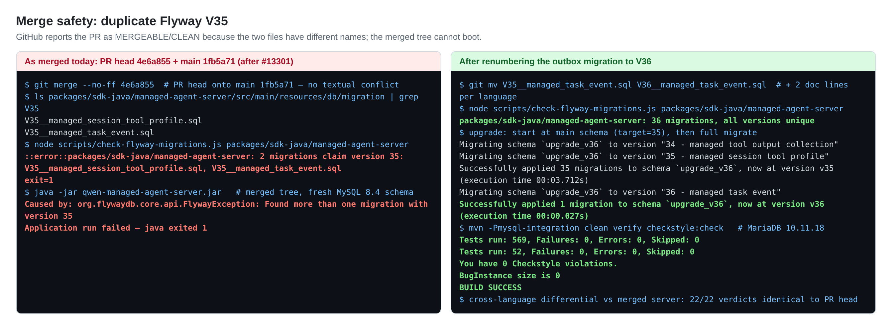
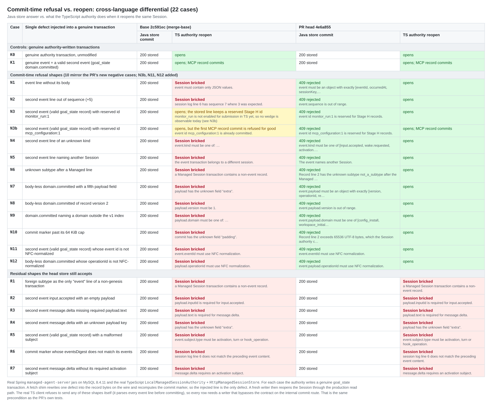
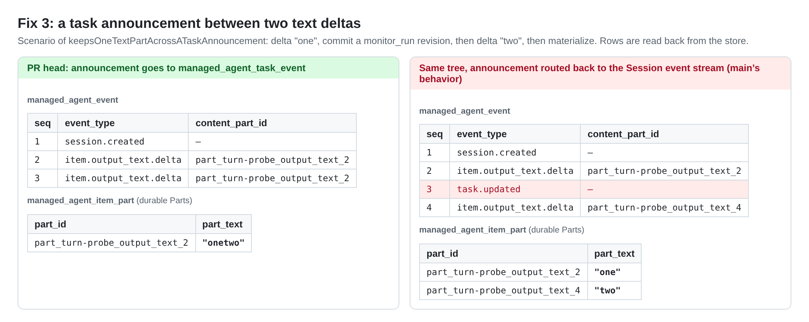
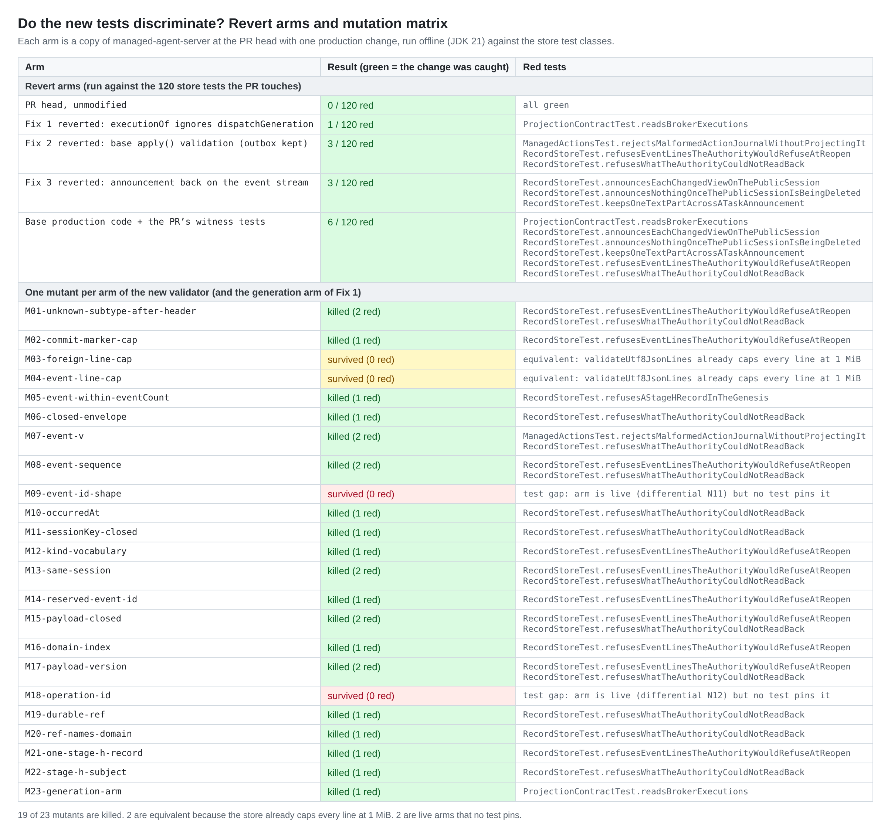

## Maintainer verification: PR #13355 at `4e6a855`

**Verdict:** I verified all three fixes by execution, and the new tests catch each one. **This PR cannot be merged as it is, though.** Since #13301 landed on `main` (05:45Z, `32291910a5`), this PR's `V35__managed_task_event.sql` uses the same Flyway version as `main`'s `V35__managed_session_tool_profile.sql`. GitHub still shows MERGEABLE/CLEAN because the file names differ, and `main` has no required checks. A merge today produces a server that **refuses to start**. Renaming the migration to `V36` (plus two doc lines per language) fixes it, and I verified that result end to end. The remaining findings don't block the merge.

### Before merge
1. **Rename `V35__managed_task_event.sql` to `V36__managed_task_event.sql`.** Then change `V35` to `V36` in `docs/design/2026-09-27-managed-extension-authority.md`: lines 102 and 146, and the same two lines in `.zh-CN.md`. No test pins the number. #13301's migration test migrates to `target("34")`, so it is unaffected.

   I checked the renamed merged tree (main `1fb5a71` + this head) three ways:
   - The Flyway gate passes with 36 unique versions.
   - `mvn -Pmysql-integration clean verify checkstyle:check` on MariaDB 10.11.18 passes: 569/0/0 unit tests, 52/0/0 ITs, 0 checkstyle violations, 0 SpotBugs findings.
   - An upgrade from `main`'s schema (stop at `target=35`, then a full migrate) applies V36 cleanly.

   Your Risk & Scope note (a) predicted this collision. The sibling that landed first was #13301, not the channel lane. Since then `main` has moved to `55b1faf`, and the head still merges with no textual conflict. The only `sdk-java` change since `1fb5a71` is #13365's replay-probe fix, which touches none of this PR's code paths.

### Non-blocking (could ride with the Suggestion groups of #13300)
2. **The new Javadoc claim is still too broad.** It says "a line the authority would refuse at the next open is refused here, so no commit can brick the Session it writes". The triage review flagged one counterexample. I found **7 shapes, each executed end to end**, that the head store still answers `200` and that then brick the Session when the TypeScript authority reopens it:
   - a foreign-subtype line in the event slot of a non-genesis transaction (the triage review's position);
   - an `input.accepted` with an empty payload;
   - a `message.delta` that is missing `payload.text`;
   - a `message.delta` with an unknown payload key;
   - a malformed `subject`;
   - a `message.delta` without its required activation subject;
   - a commit marker whose `eventsDigest` does not match its events. This one is a non-event line and predates this PR.

   The root cause is that the TS reader enforces per-kind payload schemas (`EVENT_SCHEMAS`, `assertPayloadRules`) and subject rules, and the Java store mirrors only the envelope and the vocabularies. Every shape needs a writer that bypasses the contract on the internal commit route; the real `HttpManagedSessionStore` parses each event line before sending. That is the same precondition as this PR's own negative cases. Either narrow the sentence (and the matching PR text) to envelope and vocabulary checks, or mirror the per-kind schemas through the contract fixture in a follow-up.
3. **Reserved event ids are refused by the authority's writer, not by its reopen reader.** On base, a stored `mcp_configuration:1` line reopens fine. The damage shows up later: the Session's first MCP configuration record is refused for good with `event id mcp_configuration:1 is already committed`. On head the line is refused, and the same follow-up commit succeeds. So the code is right, but the PR text ("reserved id namespace … that the reopen reader enforces") and the test comment ("bricks the authority's reader at the next open") are inaccurate for this one case.
4. **Mutation results:** 19 of 23 mutants are killed.
   - `id(eventId)` and `id(operationId)` are live checks; non-NFC ids brick base and get a 409 on head. But no test pins them, so disabling either one leaves every test green.
   - The two new 1 MiB event-line caps are equivalent mutants. `validateUtf8JsonLines` already caps every line at 1 MiB before `apply` runs. Only the 64 KiB commit-marker cap is new behaviour.
5. **I confirmed the triage review's error-code observation by execution.** With base validation, `ManagedActionsTest.rejectsMalformedActionJournalWithoutProjectingIt` gets `managed_session_action_rejected`; with this PR it gets `managed_session_extension_record_rejected`. It is worth one line in Risk & Scope.
6. **Reachability.** Fix 1 has no production caller of `executionOf` yet. Fix 3 is also latent today: `announce` fires only for bodies with a `taskKind` (`monitor_run`). `monitor_run` is not in TS `MANAGED_SESSION_ENABLED_DOMAINS`, and no production TS writer commits it. So the split is reachable today only through the internal commit route, until H3 enables that domain. Fix 2 is reachable at the HTTP trust boundary. The task-event outbox is write-only for now: no reader and no retention, as the PR already says.

### Evidence

**Gates at the PR head, run locally on JDK 21 with the CI commands**

| Lane | Result |
|---|---|
| `managed-agent-server` `-Pmysql-integration clean verify checkstyle:check`, MariaDB 10.11.18 | 553/0/0 surefire, 52/0/0 failsafe (`ManagedAgentMySqlIT` 19/0/0), checkstyle 0, SpotBugs 0 |
| Same, MySQL 8.4.11 | 553/0/0, 52/0/0 (`ManagedAgentMySqlIT` 19/0/0), checkstyle 0, SpotBugs 0 |
| TS `managed-extension-projection` + `managed-session-store-contract` | 170/170 |
| TS full `src/managed-runtime` | 1932/1932. The `hook-scale` 15 s timeout you saw locally did not reproduce here. |
| Merged with main + V36 rename, MariaDB lane | 569/0/0, 52/0/0, checkstyle 0, SpotBugs 0 |
| Merged with main + V36 rename, Hosted fault-gate lane (`-Phosted-harness-mysql`, real `dist/cli.js` + Spring + MySQL 8.4.11) | 569/0/0 surefire, 18/0/0 Hosted ITs across 7 classes (`check-failsafe-reports.js hosted` passes), checkstyle 0, SpotBugs 0. The real authority left 1,679 journal transactions in the database (51 Sessions, 1,770 event lines), and the stricter store accepted every one. The lines cover 12 of the 16 event kinds, and 1,256 of them carry a subject. |

**Cross-language differential (22 cases).** Setup: real Spring jars for base and head on MySQL 8.4.11, driven by the real TS `LocalManagedSessionAuthority` and `HttpManagedSessionStore`. For each case, the authority writes a genuine transaction. A fetch shim injects one defect on the wire and recomputes the commit marker, so the injected line is the only defect. A fresh writer then reopens the Session through the production read path. Results:
- **Base** stores all 13 refusal shapes. 11 brick the Session at reopen, and the reserved-id shape wedges the MCP domain.
- **Head** answers 409 to all 13, and every Session reopens.
- **Both arms** accept the 7 residual shapes, and those Sessions brick.
- **Controls** commit and reopen on both arms. That includes a real authority-written MCP configuration record through the stricter head store.
- **Head merged with main and renamed to V36** gives verdicts identical to head on all 22 cases.

**Fix 3, read back from the store.** On the PR head, the two deltas share one Part with text `"onetwo"`. With the announcement routed back to the event stream (main's behaviour), `task.updated` takes sequence 3. The second delta then opens a new Part, and the message is stored as `"one"` and `"two"`.

**Do the tests discriminate?** I reverted each fix separately at head:
- Reverting Fix 1 turns exactly the `settled-cancelled-unclaimed` row red.
- Reverting Fix 2 turns `refusesEventLinesTheAuthorityWouldRefuseAtReopen`, the `no commit marker` label, and the `ManagedActionsTest` error code red.
- Reverting Fix 3 turns `keepsOneTextPartAcrossATaskAnnouncement` and the two outbox assertions red.

Base production code running the PR's tests turns 6 of 120 red, the union of the three.

**Outbox sequencing under real concurrency (MySQL 8.4.11).** 16 threads × 40 `appendLiveSessionTaskEvent` calls on one Session gave 640/640 rows, sequences 1..640 contiguous, and 0 errors. As a negative control, I removed `FOR UPDATE` from the Session lock: 575/640 calls then failed with `DuplicateKeyException`. So the lock is load-bearing, and the probe can fail.

**Not verified:** MySQL 8.0, and Windows or macOS for the Java lanes (CI covers them). I didn't try a real Hosted turn that commits a `monitor_run` mid-stream, because nothing produces one yet.

Harness: [`harness/`](harness/). Raw results: [`data/`](data/). 中文版：[REPORT.zh-CN.md](REPORT.zh-CN.md)
