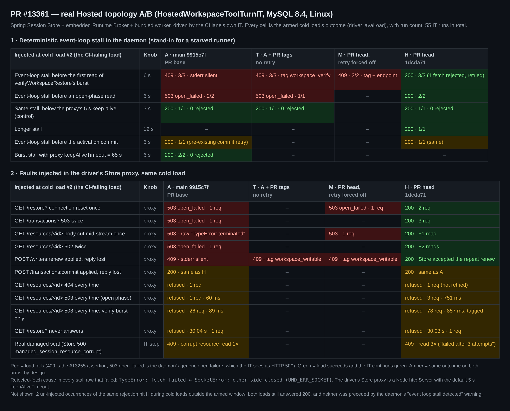
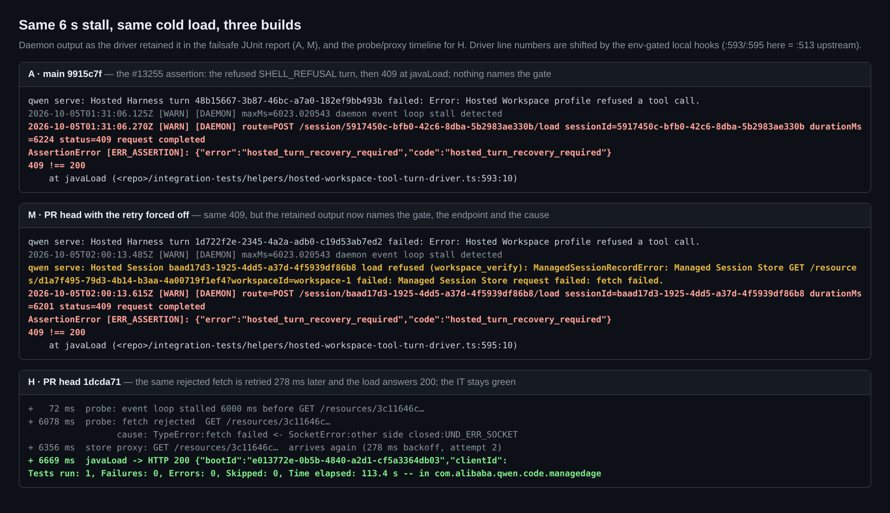

## Maintainer verification: #13361 @ `1dcda71` (real Hosted topology, Linux + MySQL 8.4)

**Verdict: mergeable.** The read retry carries the fix for the exact #13255 failure, and the new refusal tags reach the retained JUnit artifact. I have one non-blocking refinement: the Store returns its corruption verdicts as HTTP 500, so they get retried. I also have one test-side follow-up: the race I reproduced lives in the driver's Store proxy.

This run also executes the mutation proof from today's /review [R2-6](https://github.com/QwenLM/qwen-code/pull/13361#discussion_r4180146607), which asked for a read-fault witness. I used local hooks; the IT case R2-6 asks for still needs to land:
- With the retry forced off, the CI lane's IT fails with the issue's own signature, and the retained output names `workspace_verify`.
- With the PR as it is, the same fault is absorbed and the IT stays green.

### What I ran

- **Test:** the CI lane's own `HostedWorkspaceToolTurnIT#packagedHarnessUsesSavedWorkspacesThroughRealBrokerWorkerAndSqlStore`. It uses the Spring Session Store, the embedded Runtime Broker and the bundled worker.
- **Environment:** MySQL 8.4 in Docker, Linux, Node 22.22.2, JDK 21, 4 lanes in parallel. Java is untouched. The driver and process helpers got env-gated hooks that do nothing when unset.
- **Four bundles:**
  - **A** = main `9915c7f`, the PR base.
  - **T** = A plus this PR's `hosted-harness-session.ts` (tags, no retry).
  - **M** = PR head with `withRetry`'s exit guard forced to `true`. This turns the retry off, which is R2-6's mutation.
  - **H** = PR head `1dcda71`.
- **Fault target:** only one cold load is armed, the one CI fails on. That is the 2nd file-Workspace session, after `SHELL_REFUSAL` → `/title` → `/detach`, at driver `:836`.
- **Fault types:**
  - A daemon preload that blocks the event loop synchronously before the Nth Store resource fetch. This stands in for a starved runner. The preload also logs every rejected Store fetch with its undici cause chain.
  - Faults injected in the driver's existing Store proxy: once, twice or on every matching request.
- **Total:** 55 IT runs.

### Findings

1. **I reproduced the mechanism, with the same assertion signature as CI.**
   - On A, a 6 s stall before the first read of `verifyWorkspaceRestore`'s parallel read burst fails 3/3. Each failure is `409 !== 200` at `javaLoad`, right after the refused `SHELL_REFUSAL` turn. Nothing names the gate, the same as in CI.
   - Each time, the probe shows exactly one rejected fetch: `TypeError: fetch failed ← SocketError: other side closed (UND_ERR_SOCKET)`.
   - The cause: the driver's Store proxy is a Node `http.Server` with the default 5 s `keepAliveTimeout`. It closes the daemon's idle pooled socket during the stall, and the daemon reuses that socket afterwards.
   - A 3 s stall (A, T and H, one run each) fails nothing.
2. **The retry is load-bearing.**
   - H passes 3/3. The rejected read is re-sent 250–280 ms later, and the load answers 200.
   - M, which is H without the retry, fails 2/2 with the same signature.
   - If the stall lands before an open-phase read instead (the 1st or 2nd resource read), A and T fail with `managed_session_open_failed` and H answers 200. That failure is a daemon 503, which the IT sees as HTTP 500 through the Java probe. It is already logged as `Hosted Session open failed:`.
3. **The tags survive into the retained artifact.**
   - The T and M failsafe reports carry `load refused (workspace_verify): … fetch failed.` M also names the endpoint (`GET /resources/<id>… failed:`).
   - A lost `/writers:renew` reply is a second route to the same silent 409 on A. T and M tag it `workspace_writable`, and H recovers.
4. **The retry contract holds against the real Store.**
   - The Store accepted the repeated `/writers:renew`, and the load returned 200.
   - A lost commit reply behaves the same on A and H. The pre-existing 3-attempt loop in [`appendTransaction`](https://github.com/QwenLM/qwen-code/blob/1dcda71cd6550c7524a05bcca961004edd0401a8/packages/core/src/managed-runtime/http-managed-session-store.ts#L583) already absorbs it. A 6 s stall before the activation commit is green on both arms (one run each). That is consistent with the PR body's observation that commit-path failures never show up in CI.
   - A 404 is never retried.
   - A persistent 503 still ends in the same refusal. In the open phase that takes 3 requests and 751 ms, against 1 request and 60 ms on A. In the verify burst it takes 78 requests (26 × 3, all before the 409) and 857 ms, against 26 requests and 89 ms.
   - A wedged `/restore?` takes 30.03 s with one request on H, against 30.04 s with one request on A. The triage's stacked-timeout concern doesn't apply at this head.
5. **The race also happens without injection.**
   - Twice, the same `other side closed` hit H during a cold load I had not armed. Both loads still answered 200 and the IT stayed green. The proxy log didn't cover those windows, but on these arms only the retry recovers a rejected read.
   - Neither was preceded by the daemon's `event loop stall detected` warning, which fires once the loop's max lag reaches 1 s. That warning doesn't appear in the three failing CI jobs cited in #13339 either (0 matches).
   - So a long stall isn't required; it only makes the race deterministic. The CI logs carry no cause chain, so attributing CI's failures to this race is an inference. It is the one mechanism here that produces the same assertion at the same call site.

### Notes (non-blocking)

- **N1: Store corruption verdicts are HTTP 500, so they get retried.**
  - The Java Store answers `managed_session_resource_corrupt`, `managed_session_journal_corrupt` and `managed_session_head_corrupt` with 500 ([`resourceCorrupt`](https://github.com/QwenLM/qwen-code/blob/1dcda71cd6550c7524a05bcca961004edd0401a8/packages/sdk-java/managed-agent-server/src/main/java/com/alibaba/qwen/code/managedagent/store/ManagedSessionStore.java#L1278-L1282), [`journalCorrupt` / `headCorrupt`](https://github.com/QwenLM/qwen-code/blob/1dcda71cd6550c7524a05bcca961004edd0401a8/packages/sdk-java/managed-agent-server/src/main/java/com/alibaba/qwen/code/managedagent/store/ManagedSessionStore.java#L1447-L1457)).
  - Transient server faults come back as 500 `internal_error` ([`ApiExceptionHandler`](https://github.com/QwenLM/qwen-code/blob/1dcda71cd6550c7524a05bcca961004edd0401a8/packages/sdk-java/managed-agent-server/src/main/java/com/alibaba/qwen/code/managedagent/api/ApiExceptionHandler.java#L76-L83)).
  - In the IT's intentional damaged-seal refusal, H reads the corrupt resource 3× against 1× on A. The tag then reads `failed after 3 attempts: The Managed Session resource failed verification.`
  - The outcome doesn't change, and the Risk section already accepts the extra attempts. The wording, though, invites a reader to treat a deterministic verdict as transient.
  - A cheap refinement: don't retry a 5xx whose `remoteCode` ends in `_corrupt`.
- **N2: the race I reproduced lives in the test harness.**
  - I repeated the 6 s stall on A with the driver's Store proxy `keepAliveTimeout` raised to 65 s. It passed 2/2 with 0 rejected fetches.
  - The proxy also copies every upstream header, hop-by-hop ones included ([`Object.fromEntries(response.headers)`](https://github.com/QwenLM/qwen-code/blob/1dcda71cd6550c7524a05bcca961004edd0401a8/integration-tests/helpers/hosted-workspace-tool-turn-driver.ts#L167)).
  - A one-line harness fix should remove the trigger for every Store call through the proxy. That includes the `publicationRequest` legs, which still bypass the retry ([R1-2](https://github.com/QwenLM/qwen-code/pull/13361#discussion_r4178009346), deferred).
  - That fix would complement this PR, not replace it: the daemon-side retry is the right behaviour behind real intermediaries.
  - R2-6's suggested IT case is easy to add on top of this proxy. My hooks are in the evidence directory.

### Also checked

- **Unit tests at head:** the core store suite passes 33/33, and cli `hosted-harness-session` passes 191/191.
- **Negative control:** this PR's tests run against base code fail 11/33 and 9/191. The failures are exactly the new retry cases and tag pins.
- **Landing:** the PR merges cleanly with main `35afa6f`, which touched the same test file. The merged test file passes 191/191.
- **CI at `1dcda71`:** no failing checks (27 success; the rest are skipped, plus 4 cancelled `route` jobs). That includes `Hosted process fault gates / MySQL 8.4 / Java 21`. One green run says nothing about the ~5% flake rate the PR body cites; the A/B above is the evidence.
- **#13276:** it conflicts with this PR in both cli files (`git merge-tree`). Sequencing them is still the open call from triage stage 3.

**Not covered:**
- The `restore_blocked`, `takeover_*` and `unsettled_input` tags in the real topology. They are pinned by unit tests only. `workspace_verify` and `file_history_pending` also fire on the IT's own intended refusals in every passing H run.
- Today's R1-7, R1-13 and R2-x suggestions. I only read them statically and left them to the autofix round.
- macOS and Windows.
- MariaDB.
- A natural-rate A/B. The rates are too low for my run count.

### Reproduce

- **Arms** (the daemon runs `<root>/dist/cli.js`, so every arm needs its own root):
  - A = worktree at `9915c7f`, then `pnpm install --frozen-lockfile`, `npm run build`, `npm run bundle`.
  - T = A plus `git show 1dcda71:packages/cli/src/serve/hosted-harness-session.ts`, then `node esbuild.config.js && node scripts/copy_bundle_assets.js`, in its own root.
  - M = H with `true || // VERIFY MUTANT` inserted above `!retryable ||` in `withRetry`, then core `tsc --build` and a rebundle. The bundle reads `if(true){…`.
  - H = worktree at `1dcda71`, full build.
- **Hooks:** apply `harness/patch-process.py`, `patch-driver.py`, `patch-driver-ka.py` and `patch-driver-burst.py` to each root's `integration-tests/helpers`. All of them are inert unless their `VERIFY_*` variable is set.
- **Runs:**
  - Stall: `STALL_MS=6000 STALL_NTH=4 harness/run-it.sh <label> <A|T|M|H> <lane> VERIFY_FAULT=stall VERIFY_FAULT_AT=2`. Use `STALL_NTH=1|2` for open-phase reads, and `STALL_ON=commit` for the activation commit.
  - Proxy faults: `harness/run-it.sh <label> <arm> <lane> VERIFY_FAULT=<restore-reset|transactions-503x2|resource-midbody|resource-502x2|renew-lost|commit-lost|resource-404-persist|resource-503-persist|resource-503-burst|restore-wedge> VERIFY_FAULT_AT=2`.
  - Keep-alive check: add `VERIFY_PROXY_KA=65000`.
- **Data:** `data/summary.json` holds one row per run. `data/runs-small.tar.gz` holds each run's `result`, `fetch.jsonl` (probe) and `store.jsonl` (proxy). `data/junit-failure-excerpts.txt` holds the retained failure text, and `data/ci-13339-jobs-stall-warning-census.txt` holds the CI log census.
