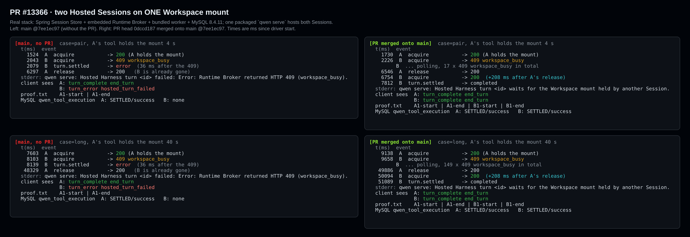
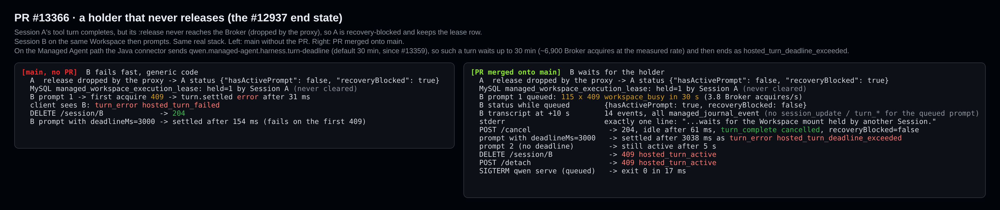
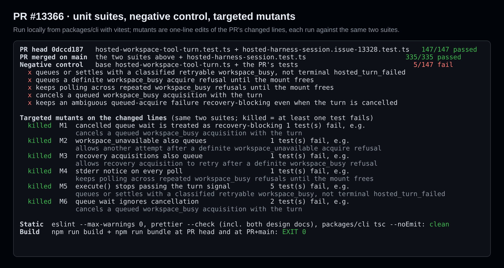

## Maintainer verification: real Broker + MySQL A/B for #13366

**Verdict: the fix works end to end and I found no correctness defect.** I ran it on a real Session Store, Runtime Broker, worker and MySQL stack. Current `main` reproduces #13328 exactly. With the PR merged onto `main`, the second Session's turn queues, runs after the first turn, executes exactly once and completes. The queue also composes with #13359's turn deadline.

One product tradeoff still needs an explicit maintainer decision, either before merge or as a tracked follow-up. The queue has no limit of its own. When the holder never releases the mount, the old ~36 ms generic failure becomes a silent wait of up to 30 min that ends as `hosted_turn_deadline_exceeded` (finding 1). The only red CI lane is `ubuntu-latest / Java 17`. It failed on the runner itself, not because of this PR, and needs a re-run.

This adds the step that the earlier E2E report and the triage review both left open: the real Broker enforcing the actual `managed_workspace_execution_lease` row.

### Setup

- Linux, Node 22.22.2, JDK 21, MySQL 8.4.11 (Docker).
- I built the arms with a real `npm run build && npm run bundle`:
  - `main @7ee1ec97` versus **PR head `0dccd187` merged onto `main @7ee1ec97`**. The merged arm is what will land, and it already contains #13359.
  - I also ran PR head versus its parent `8a1a2efe`. The outcomes match.
- Each comparison uses one tree. The arm without the PR is the same tree with only `hosted-workspace-tool-turn.ts` restored and re-bundled.
- A scratch IT (`HostedVerify13366IT`, published below, not part of the PR) starts the managed-agent-server Spring app with its Session Store and embedded Runtime Broker on MySQL. The Broker spawns the bundled worker.
- Each case gets its own Workspace mount with two Sessions, A and B, both opened in one packaged `qwen serve --profile hosted-harness`. That matches production, where one Harness hosts many Sessions.
- A fake OpenAI model issues a real `run_shell_command`. The command appends `start` and `end` markers to a shared `proof.txt` in the mount.
- One recording proxy sits in front of the Store and the Broker.

### Two Sessions on one mount

| | `main` (no PR) | PR merged onto `main` |
| --- | --- | --- |
| B's outcome as the client sees it | `turn_error` `hosted_turn_failed`, 36 ms after the first 409 | `turn_complete` `end_turn` |
| B's acquires, A holding the mount for 4 s | one, refused `409 workspace_busy` | 17 × 409, then 200 at +208 ms after A's release |
| B's acquires, A holding the mount for 40 s | one, refused 409 | 149 × 409, then 200 at +208 ms after A's release |
| `proof.txt` | `A1-start, A1-end` (B's tool never ran) | `A1-start, A1-end, B1-start, B1-end` (no interleaving) |
| MySQL `qwen_tool_execution` | A: 1 row `SETTLED/success`; B: none | A: 1 row and B: 1 row, both `SETTLED/success` (exactly once each) |
| stderr | `failed: Error: Runtime Broker returned HTTP 409 (workspace_busy).` | one line, `waits for the Workspace mount held by another Session.` |

The 40 s hold is 8× the Store writer lease (5 s). The queued Session kept its activation and committed normally afterwards. A's turn took the same time in both arms.

### A holder that never releases

I dropped A's `:release` at the proxy, so the request never reaches the Broker. A becomes recovery-blocked, and its lease row stays held for the rest of the run, which is the end state #12937 describes.

On `main`, B fails at its first 409 (`hosted_turn_failed`), and `DELETE` succeeds right away.

With the PR merged:

- **Waiting:** B waits. I counted 115 × 409 in 30 s, about 3.8 Broker acquires per second.
  - `GET /status` reports `{hasActivePrompt: true, recoveryBlocked: false}`.
  - At +10 s the transcript holds only `managed_journal_event` records and no turn event for the queued prompt.
  - The only signal is one stderr line.
- **Bounds:**
  - **Cancel:** `POST /cancel` returns 204, and B goes idle 61 ms later with `turn_complete cancelled` and is not recovery-blocked.
  - **Deadline:** a prompt with `deadlineMs: 3000` settles at 3038 ms as `turn_error hosted_turn_deadline_exceeded`.
  - **Shutdown:** `SIGTERM` with a queued turn exits 0 in 17 ms, so the poll does not hold the process up.
- **Blocked session routes:** while a turn is queued, `DELETE /session/:id` and `POST /detach` return `409 hosted_turn_active`.

At PR head alone, before #13359 was merged, a deadline that expires while queued settled as `turn_complete cancelled`. On `main` it is classified as above, and `main` already has #13359, so no action is needed.

### Tests

- **PR head:** the two touched suites pass, 147/147.
- **Merged onto `main`:** those suites plus `hosted-harness-session.test.ts` (changed by #13359) pass, 335/335.
- **Negative control:** with the production file restored to base, 5 of the PR's tests fail, including the issue reproduction. So the new tests do tell the fix apart from the old code.
- **Targeted mutants:** I made six one-line mutants of the changed lines. All six are killed:
  - a cancelled wait treated as blocking
  - `workspace_unavailable` also queues
  - recovery acquisitions also queue
  - the notice printed on every poll
  - no signal passed from `execute()`
  - a wait that ignores cancel
- **Static:** ESLint (`--max-warnings 0`), Prettier (including both design docs) and `packages/cli` `tsc --noEmit` are all clean.

### Findings (none block correctness)

1. **The queue has no limit of its own, and a holder that never releases turns into a long silent wait.** The Managed Agent connector sends `qwen.managed-agent.harness.turn-deadline` (default 30 min, #13359). So a turn queued behind such a holder waits up to 30 min, about 6,900 Broker acquires at the rate I measured, and then fails with a deadline code that never mentions the busy mount. Holders that do not release:
   - **A recovery-blocked Session** (run in the real stack, above). #12937, #12904 and #13182/#13219, which triage listed as preconditions for queueing, are all still open.
   - **MCP-profile and hook-catalog Sessions, by design.** I found this by reading the code and did not run it. These Sessions keep their acquisition across turns and release it only in `close()`:
     - `finish()` skips `release()` for them (`hosted-workspace-tool-turn.ts:2112`).
     - `HostedHookSession.acquire()` is at `hosted-hook-session.ts:310`; it releases in `close()` at `:1518-1527`.
     - `HostedMcpSession.acquireOwner()` is at `hosted-mcp-session.ts:893`; it releases at the end of `close()`, `:871-883` (`close()` starts at `:730`).

     A plain shell or files Session on the same Workspace would wait until that other Session closes.

   Suggested fix, which could be a follow-up: limit the wait to well below the turn deadline, and on expiry settle with a classified `workspace_busy`. That combines the issue's options (a) and (b). Alternatively, expose a "waiting for the Workspace" signal in status or the event stream, so clients and operators can tell a queued turn from a hung one.
2. **A queued turn makes the Session impossible to delete or detach** (`409 hosted_turn_active`) until the client cancels first. The guard already existed, but before this PR it was hit only briefly. It can now apply for up to the full turn deadline.
3. **Polling cost.** Each 250 ms poll runs the Broker's full acquire path: worker attestation, runtime-session admission, and the lease-row `SELECT … FOR UPDATE` transaction. There is no backoff, jitter or FIFO order among waiters; triage noted the ordering too. Adding backoff up to about 2 s would cut this a lot without a noticeable delay.
4. **Design doc wording.** "means another Session's tool turn holds the mount" is not the only case. The holder can also be an MCP or hook Session, or a recovery-blocked Session. It's worth naming those, together with the deadline that bounds the wait.

### CI

`ubuntu-latest / Java 17` failed with `NoClassDefFoundError: org/junit/platform/commons/PreconditionViolationException` inside surefire, on runner `ecs-qwen-hk1-30`. The PR changes no Java. The same job passed on the `main` push run 37179596621 and on neighbouring PRs, so it needs a re-run. Every other completed lane is green.

### Not verified

- Windows and macOS; I ran on Linux only.
- MCP and hook lifetime holders, which come from code reading only.
- The full Managed Agent coordinator path, where Java submits the prompt. My IT drives the Harness HTTP API directly, and the Java deadline wiring comes from reading the code.
- The issue's packaged-stack `--second-workspace-session` runner mode, which is not in the repository.

Evidence: the IT, the driver, the runner scripts and the mutant runner are in `harness/`. Per-run driver results, MySQL dumps and test reports are in `data/`. The `e2e-head`/`e2e-base`/`e2e-head2`/`e2e-base2` runs used earlier revisions of the driver without some of the detach/deadline probes; `e2e-head3`, `e2e-merged` and `e2e-main` used the final one.
