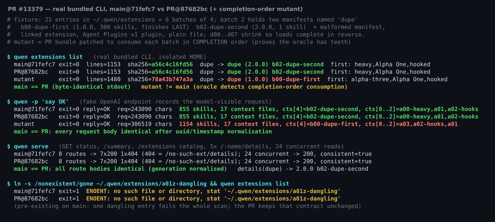
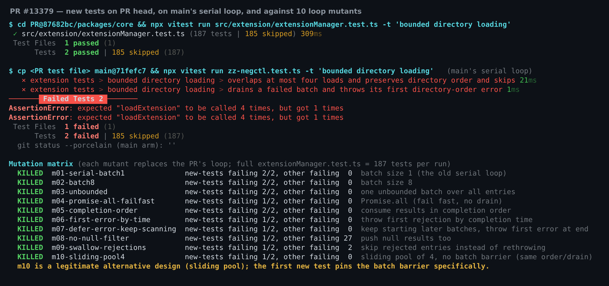
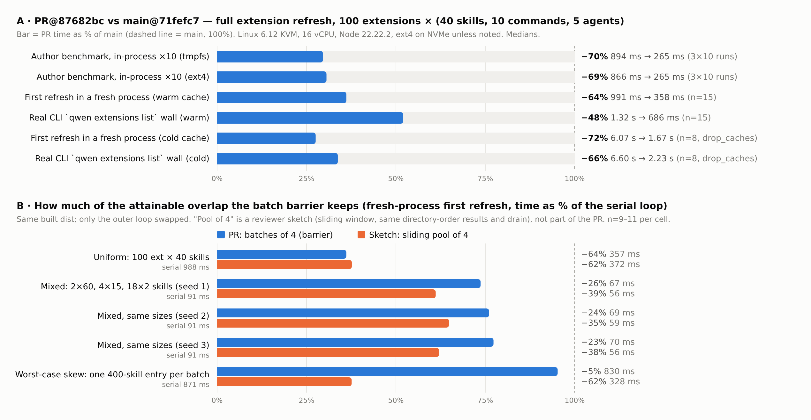

## 维护者验证：Linux 本地真实构建 @ `87682bc`

**结论：可以合入。** 没有发现阻塞问题。我实际跑过的每个真实入口（CLI、headless 模式下发给模型的请求、daemon 路由、错误路径）上，PR 的表现都和 main 完全一致。我尝试的每一种错误循环写法，新增的两个测试都能识别出来。提速在 Linux 上得到复现，幅度比 PR 描述里的 macOS 数据更大。文末有两条非阻塞说明。

这也补上了自动评审留下的两处空缺：triage 评审指出提速数据还没有独立复现；`/review` 那一轮因工具预算用完，没有执行新增的两个测试。

**环境**
- 两个隔离的 worktree：`main@71fefc7`（PR 的 merge base）和 `PR@87682bc`。各自执行 `pnpm install --frozen-lockfile`、全量 `npm run build` 和 `npm run bundle`，均 exit 0。我核对了两个 bundle：main 是串行 `for…of` 循环，PR 是 `batchSize = 4` / `Promise.allSettled` 循环。
- 机器：Linux 6.12（KVM，16 vCPU），Node 22.22.2。除特别注明外，夹具都放在 ext4/NVMe 上。每次运行使用独立的 `HOME`，模型请求发往一个会记录请求的假 OpenAI 端点。
- 与当前 `main`（`f2e0690`）合并无冲突。自 base 以来没有提交改动 `packages/core/src/extension/`，循环本身和它的三个调用方都在这个目录里。

| 检查项 | main@71fefc7 | PR@87682bc |
| --- | --- | --- |
| `extensionManager.test.ts` | 185 / 185 | **187 / 187** |
| PR 新增的两个测试跑在 main 的串行循环上（负对照） | **2 个失败**（`loadExtension` 只被调用 1 次，期望 4 次）；185 个通过 | 不适用 |
| 10 个循环变异体对完整测试文件 | 不适用 | **10 / 10 全部杀死**；仅靠新增的两个测试即可杀死全部 10 个 |
| 真实 `qwen extensions list`，复杂夹具（1153 行） | sha256 `a56c4c16fd56` | **字节一致** |
| 真实 `qwen -p`：模型实际收到的请求（243,090 字符，855 个 skill，17 个上下文文件，顺序一致） | | 归一化 uuid/时间戳后，两次请求**完全一致** |
| 真实 `qwen serve`：status、`/summary`、`/extensions`、5 次 `/:name/details`、24 个并发读 | | **所有响应体一致**；`details(dupe)` → `2.0.0 b02-dupe-second` |
| 扩展目录中有一个悬空符号链接 | exit 1，`ENOENT … stat` | 相同 |
| 改动文件上的 ESLint `--max-warnings 0` 与 Prettier | | 通过 |
| CI | | 14 通过、33 跳过、0 失败 |

### 1. 真实 CLI 端到端

夹具有 21 个条目，正好分成 6 批，每批 4 个。第 2 批里有两个 manifest 的 name 都是 `dupe`：
- `b00-dupe-first`：版本 1.0.0，300 个 skill，所以在本批中最后完成。
- `b02-dupe-second`：版本 2.0.0，1 个 skill。

按串行循环"同名取最后一个"的规则，胜出的是 `b02`。夹具里还有：
- 一个非法 manifest
- 一个 linked 扩展
- 一个 Agent Plugins v1 插件
- 一个普通文件
- 一个带 hooks 的扩展
- `d00`…`d07`，体积依次递减，因此每批都按目录序的逆序完成

为了证明这套对比确实能发现问题，我把 PR 的 bundle 改成"按完成顺序"而不是"按目录顺序"读取每批结果。这个错误版本会选中 `dupe (1.0.0) b00-dupe-first`，发给模型的 skill 从 855 个变成 1154 个，上下文文件的顺序也被打乱。这说明打包后的 CLI 里加载确实是并发重叠的，而按目录顺序读取结果正是输出保持一致的关键。

### 2. 新增测试：负对照与变异矩阵

每个变异体只替换 PR 的外层循环，全部 10 个都被杀死：
- 串行、每批 8 个、不设上限
- `Promise.all` 一失败就立即返回：被"排空"断言抓到，因为扫描在同批仍在进行的任务结束前就返回了
- 按完成顺序读取结果
- 按时间先后抛出第一个错误
- 出错后继续扫描后续批次
- 不过滤 null
- 吞掉错误：另有两个已有的"出错即失败"测试也能抓到
- 4 并发的滑动窗口池

### 3. 性能

对应下图面板 A，数值均为中位数。夹具规模与作者的 benchmark 相同：100 个扩展 ×（40 个 skill、10 个 command、5 个 agent）。

| 场景 | main | PR | 变化 |
| --- | ---: | ---: | ---: |
| 作者的 `bench-extension-load.ts --runs 10`，tmpfs（3 轮，两臂交替） | 894 ms | 265 ms | **−70%** |
| 同一 benchmark，夹具放在 ext4 | 866 ms | 265 ms | **−69%** |
| 新进程中的首次刷新，热缓存（n=15） | 991 ms | 358 ms | **−64%** |
| 真实 CLI `qwen extensions list` 墙钟时间，热缓存（n=15） | 1.32 s | 686 ms | **−48%** |
| 首次刷新，冷缓存（`drop_caches`，n=8） | 6.07 s | 1.67 s | **−72%** |
| 真实 CLI 墙钟时间，冷缓存（n=8） | 6.60 s | 2.23 s | **−66%** |

- **没有额外工作量。** 两臂每次刷新都执行 9,116 次异步 fs 操作。
- **压力有上限。** 同时进行的异步 fs 操作峰值从 2 增加到 4；打开的 fd 峰值从 23 增加到 26（空闲时为 22）；两臂峰值 RSS 都约为 190 MB。
- **继续加大批次收益很小。** 均匀夹具上，每批 4 个耗时 357 ms，8 个耗时 336 ms，16 个耗时 328 ms。上限取 4 是合理的。

### 非阻塞说明

1. **批次屏障能保留多少收益，取决于各扩展的体积分布（面板 B）。** 屏障要等本批最大的条目完成后才启动下一批。我在同一份构建产物里只替换循环，和一个保证相同的 4 并发滑动窗口池对比：结果按目录顺序读取，出现第一个错误后不再启动新的加载，等待进行中的加载结束，再按目录顺序抛出第一个错误。
   - 体积均匀：屏障 −64%，滑动池 −62%。
   - 体积混合（2 个 60-skill、4 个 15-skill、18 个 2-skill，三种洗牌顺序）：屏障 −23% 到 −26%，滑动池 −35% 到 −39%。
   - 最坏情况（每批恰好一个 400-skill 条目）：屏障 −5%，滑动池 −62%。

   设计文档明确接受了这个取舍，所以我不会因此阻塞合入。如果后续改成滑动池，需要同步修改第一个新增测试：它断言"4 个中有 3 个完成后不会启动新的加载"，相当于把屏障本身固定了下来。我的示意实现在 `harness/make-variants.py`。
2. **已有的崩溃，不在本 PR 范围内。** `~/.qwen/extensions/` 里只要有一个悬空符号链接，整个扫描就会失败：`qwen extensions list` exit 1，`qwen -p` 直接报 `An unexpected critical error occurred` 退出。main 与本 PR 表现完全相同，因为设计文档有意保留了"哪些错误会让扫描失败"的原有行为。条目 `stat` 失败时改为跳过并给出警告，值得另开一个 issue。

**未覆盖：** Windows（没有可用机器）、macOS（作者已覆盖）、网络文件系统，以及 daemon 端到端启动耗时。

证据（脚本、夹具、原始数据与终端记录）：本目录（`harness/`、`data/`）。
