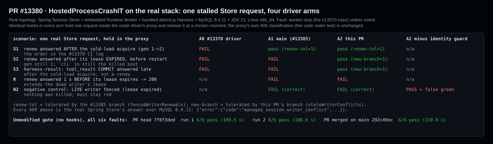
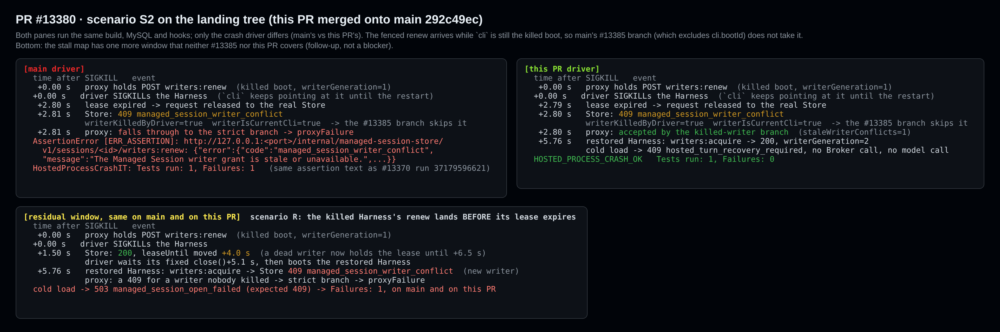
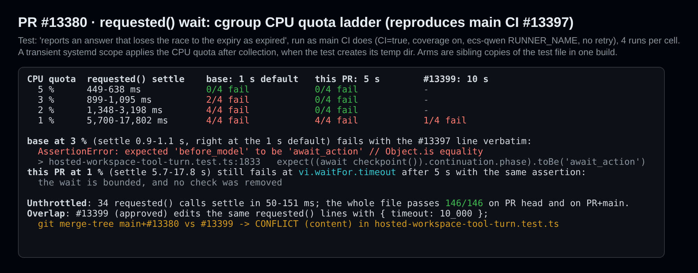

## 维护者验证：`7f0f3ded` 真实环境 A/B（Linux、MySQL 8.4.11、JDK 21）

**结论：两处改动都正确，崩溃驱动的改动值得按现状合入。有两点需要协调：**

1. `requested()` 这一处与已获批准的 #13399 改的是同一段代码，两者只能有一个无冲突地合入。
2. 这处改动修复的是 main CI 失败 #13397，但本 PR 没有关联它。

代码本身没有阻塞问题。另外我发现 #13370 这类偶发失败还剩一个窗口，#13385 和本 PR 都没覆盖，列在下面作为后续跟进。

> main 已包含 #13385（2026-10-04 13:40Z 合入）。它的分支会在恢复后的 Harness 成为 `cli` 之后，容忍被杀 boot 收到的栅栏 `writers:renew`。所以对本 PR 有意义的问题是：它在此之上还新增了什么。下文都是在同一构建上分别运行 main 的驱动和本 PR 的驱动。

### 环境

- **平台：**Linux x86_64、Node 22、JDK 21、MySQL 8.4.11（Docker）。
- **门禁：**真实的 `HostedProcessCrashIT`（`-Phosted-process-crashes`），它会启动 Spring Session Store、内嵌 Runtime Broker，以及由 `npm run build && npm run bundle` 生成的 `dist/cli.js` Harness。
- **两棵树：**PR head `7f0f3ded`，以及把 PR 合并到当前 main `292c49ec` 的树。main 比 PR 的基线多 7 个提交，其中包括 #13217、#13347、#13388 对 Store 和 Broker 的改动。
- **同一构建上的驱动臂：**
  - #13370 失败时的驱动；
  - main 的驱动（#13385）；
  - 本 PR 的驱动；
  - 本 PR 驱动去掉 `killedWriters.has(fields.writerId)` 检查后的变异体。
- **钩子：**所有臂都由同一个补丁脚本（见下文发布内容）注入相同的钩子。钩子在驱动的代理里扣住一个真实的 Store 请求，在选定时刻放行，让真实 Store 延迟应答。这与 #13370 的"传输途中卡住"形态相同。代理的 409 分类逻辑是被测代码，没有改动。

### 驱动改动在 main 之上新增了什么

- **#13370 日志里的顺序在 main 上已经能通过。**在这个顺序里，被杀 boot 的续租在恢复后的 Harness 完成 `writers:acquire` 之后才得到应答。main 由 #13385 的分支容忍它；在本 PR 上也是同一分支处理（`fencedWriterRenewals=1`，`staleWriterConflicts=0`）。吸收那次事故的并不是新分支。
- **续租在租约过期后、重启之前得到应答，main 仍然失败。**失败文本与 #13370 的断言逐字相同。
  - Store 仅因租约过期就对续租执行栅栏拒绝，此时写入者代次仍为 1。
  - 这时 `cli` 仍指向被杀的进程，所以 #13385 的 `fields.writerId !== cli.bootId` 检查把它排除在外。
  - 本 PR 的分支接受了它（`staleWriterConflicts=1`），门禁随后照常检查冷加载。
  - 两棵树合计：main 驱动 2/2 失败，本 PR 驱动 3/3 通过。
- **其他路由上的迟到写入也会让 main 失败。**在 `harness-result` 中，钩子不再丢弃被拦截的 `tool_result` 提交，而是在冷加载 acquire 之后才转发。Store 对 `transactions:commit` 回 `409 managed_session_writer_conflict`。main 失败，因为它只容忍续租；本 PR 通过。
- **负向对照：活写入者被栅栏拒绝时仍然失败。**钩子在任何进程被杀之前，扣住存活 Harness 的续租直到租约过期。
  - main 和本 PR 都失败，这是正确的。
  - 去掉 `killedWriters.has(fields.writerId)` 检查的变异体却通过了，属于假绿。
  - 正是这个检查保证新增的容忍不会掩盖真实的栅栏拒绝。
- **未改动的门禁（不加钩子）六种故障全部通过：**PR head 上两次 6/6（109.5 s、108.6 s），PR+main 上 6/6（110.0 s）。

### 还剩一个窗口（后续跟进，非阻塞）

如果被杀 Harness 的续租在租约**过期前**到达 Store，Store 会回 200 接受它，把死写入者的租约再往后延约 4 秒。驱动仍然只固定等待 `close()` + 5.1 秒。接下来：

- 恢复后的 Harness 的 `writers:acquire` 得到 `409 managed_session_writer_conflict`；
- 冷加载回 `503 managed_session_open_failed`；
- 门禁失败，main 和本 PR 都一样（各 2/2；见上图下半部分）。

对于在 SIGKILL 前一刻发出的续租，本装置观察到的结果如下：

| Store 对被杀 boot 续租的应答时刻 | main | 本 PR |
| --- | --- | --- |
| SIGKILL 后 1.5 秒：200，租约后移 4.0 秒 | 失败 | 失败 |
| SIGKILL 后 2.8 秒：409，租约已过期，`cli` 仍是被杀 boot | 失败 | 通过 |
| SIGKILL 后 5.8 秒：409，在重启的 acquire 之后（#13370 的顺序） | 通过 | 通过 |

按推算，第一行覆盖从 SIGKILL 后约 0.8 秒到租约过期的整段区间（重启 acquire 约在 5.8 秒，减去 5 秒租约）。

一个能关掉所有窗口的修法：重启前，先等被杀 boot 在途的 Store 请求全部落定（代理本来就能看到这些请求），再等到代理为该写入者看到的最新 `leaseUntil` 之后。这样被杀 boot 的任何迟到应答都会落在重启之前：200 只是把等待往后推，409 正是本 PR 分支所接受的情形。

### `requested()` 等待（#13397）

- 这一处修复的是 #13397：`hosted-workspace-tool-turn.test.ts:1833` 处的 `expected 'before_model' to be 'await_action'`。本 PR 没有关联这个 issue。
- **复现方式。**我在测试收集完成后施加 cgroup CPU 配额，并按 main CI 的方式运行：开启覆盖率、使用 `ecs-qwen` 运行器名、不重试。
  - **基线：**3% 配额下 4 次中失败 2 次，断言与 #13397 逐字相同。此时落盘耗时 0.9–1.1 秒，正好卡在默认的 1 秒边界。2% 配额下 4/4 失败。
  - **本 PR 的 5 秒：**在这两档配额下 8/8 通过。
  - **1% 配额下**（落盘 5.7–17.8 秒），它在 `vi.waitFor.timeout` 处以同一断言失败。等待是有界的，也没有删掉任何检查。
- **与 #13399 重叠。**那个 PR 已获批准，关联了 #13397，把同一段代码改成 `{ timeout: 10_000 }` 并加了注释。
  - 用 `git merge-tree` 把 main+#13380 与 #13399 合并，在 `hosted-workspace-tool-turn.test.ts` 报内容冲突。
  - 1% 配额下，10 秒版本 4 次失败 1 次，5 秒版本 4 次全失败。
  - 我倾向于由 #13399 合入这个辅助函数的改动，本 PR 去掉这一处，只保留崩溃栅栏的改动。顺序无所谓，只要两者只合入一个即可。

### 静态检查与 CI

- **PR head 的两个改动文件：**`prettier --check` 与 `eslint --max-warnings 0` 均通过。
- **PR+main：**
  - `tsc -p integration-tests/tsconfig.json --noEmit`：0 个错误。
  - `packages/cli` 的 `tsc --noEmit`：退出码 0。
  - `hosted-workspace-tool-turn.test.ts`：146/146。
- **`7f0f3ded` 上的 CI：**所有已完成的检查都是绿色，包括 `Hosted process fault gates / MySQL 8.4 / Java 21`。

### 建议（非阻塞）

1. 关联 #13397，并在这一处与 #13399 之间只合入一个（见上文）。
2. **改写新分支的注释。**注释说被杀 Harness 的写入"只可能在冷加载的 acquire 提升写入者代次之后得到应答"。但代次提升之后，续租已经被上方 #13385 的分支处理了。这个分支实际新增的是：
   - `cli` 仍是被杀 boot 时、在任何新 acquire 之前、因租约过期被拒的续租；
   - 其他任何 Store 路由，例如迟到的 `transactions:commit`。

   在注释里写明这一点，可以免去下一位读者的困惑。
3. 其他评审者已经指出、在当前 head 上依然成立：`killHarness()` 末尾的 `killedWriters.add(cli.bootId)` 已经冗余；`staleWriterConflicts` 从未被断言。
4. 为上文描述的剩余窗口开一个后续跟进。

### 未验证

- macOS、Windows 和 MariaDB。作者已覆盖 macOS 与 MariaDB。
- 重启后当前 boot 的冲突。冷加载被拒后，恢复后的 Harness 不再续租，所以没有可被栅栏拒绝的存活续租。重启前的活写入者对照覆盖的是同一个守卫。
- 钩子是我加的，不属于 PR。图中所有 409 都是真实 Store 的应答。

证据：[`pr-13380/`](.) 包含图片、中英两份报告、钩子模块与补丁脚本、运行脚本，以及每次运行的事件日志和 Maven 输出。
### 复现步骤

1. 在 `7f0f3ded` 建 worktree，依次执行 `QWEN_SKIP_PREPARE=1 HUSKY=0 corepack pnpm install --frozen-lockfile`、`npm run build`、`npm run bundle`。把 `packages/sdk-java/qwencode` 和 `runtime-broker` 安装到私有 Maven 仓库。
2. `docker run -d -e TZ=UTC -e MYSQL_ROOT_PASSWORD=hosted-fixture -p 33380:3306 mysql:8.4`。
3. 驱动臂：`git show ffc9772423^:integration-tests/helpers/hosted-process-crash-driver.ts`（#13370 时的驱动）、`git show 05ebb1ef3e:…`（main）、`git show 7f0f3ded24:…`（本 PR）。然后对每个臂执行 `python3 harness/instrument.py <arm>.ts <arm>.inst.ts`。活写入者对照用的变异体由 `harness/mutate-noidentity.py` 生成。
4. `harness/run-it.sh <臂文件> <故障|all> <模式|-> <标签>` 会把臂和 `verify13380.ts` 复制到 `integration-tests/helpers/`，新建数据库并运行 `HostedProcessCrashIT`。各模式的说明在 `verify13380.ts` 顶部。`harness/batch*.sh` 列出了矩阵背后的每一次运行。
5. 单测阶梯：`harness/unit-run.sh <配额> <臂> <日志> '<测试名>'`。各臂是测试文件的同目录副本（`armbase` = main，`armpr` = 本 PR，`armten` = #13399，`armsettle` = 本 PR 加落盘耗时探针）。

