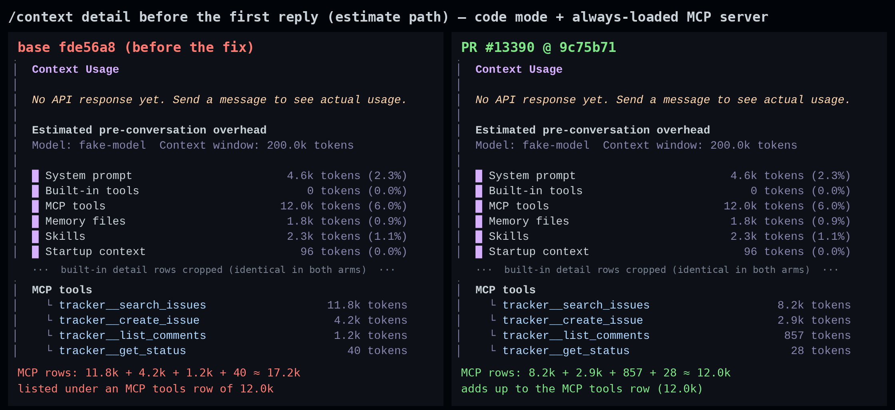
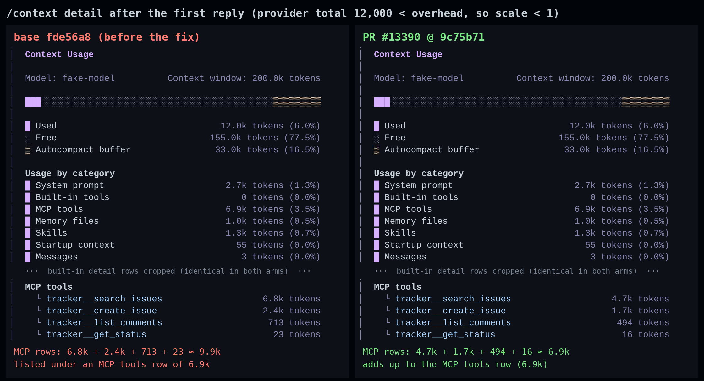

## 维护者验证：真实 CLI + code mode + 真实常驻加载 MCP 服务器（head `9c75b71`）

**结论：可以合入。** 我在 `main`（merge-base `fde56a8`）的真实应用中复现了该问题，并确认本 PR 在渲染 `/context detail` 的三个界面上都修复了它：交互式 TUI、SDK/stream-json 的 `get_context_usage` 控制请求、headless 文本渲染。未触发 clamp 的会话输出逐字节不变。此前 bot 评审提出的两处测试覆盖缺口确实存在，我用变异测试分别确认了；两者都不阻塞合入。文末附一个可直接粘贴、能同时补上这两处缺口的测试。

### 环境

- 从源码构建两个 worktree，`npm run build && npm run bundle` 均 exit 0：**base** = `fde56a8`（merge-base），**PR** = `9c75b71`。运行前先核对了 bundle：base 中是 `detailMcpTools=mcpTools` 与 `scaleDetail(mcpTools)`，PR 中是 `scaleTokens(mcpTools,scale*mcpDetailShare)`。
- PR 针对的场景是 `tools.codeModeOnly: true` 加一个 **真实 stdio MCP 服务器**（`@modelcontextprotocol/sdk`），配置 `alwaysLoadTools: true`。它暴露 4 个工具，input schema 带很长的逐属性描述，和真实的 tracker / GitHub 类服务器一样。code mode 把工具绑定渲染成 TypeScript 签名，丢掉了这些属性描述；而 `/context` 按每个工具的完整 JSON schema 计量。所以服务器足够大时 clamp 就会生效。
- 模型是本地 OpenAI 兼容假服务，最后的 usage chunk 返回指定的 `prompt_tokens`，借此覆盖 provider 计数的两条路径：`scale = 1`（40,000），以及 `scale < 1`（12,000 和 5,000）。
- clamp 需要足够大的服务器才会触发。该服务器在 1× 体量（MCP 3.1k token）时 clamp 不会生效；4×（11.7k）时在 stream-json 下生效。交互式 TUI 声明的工具更多，因此 TUI 用了 6×（17.5k）。

### 结果：交互式 TUI（真实 Ink 渲染，xterm.js 截图）

首次回复前（估算路径）：

首次回复后（provider 总量 12,000，低于实测开销，因此 `scale < 1`）：

图中面板裁剪自真实截图并加了说明文字；中间只裁掉了 built-in 明细行，这部分两边完全一致。完整未裁剪截图：[base 回复前](./full-base-1-before-first-reply.png) · [PR 回复前](./full-head-1-before-first-reply.png) · [base 回复后](./full-base-2-after-first-reply.png) · [PR 回复后](./full-head-2-after-first-reply.png)。

### 结果：精确数值（经 stream-json 发送 `get_context_usage {show_details:true}`，MCP 服务器 4×）

| 路径 | provider 总量 | MCP tools 行 | MCP 明细行之和（base） | MCP 明细行之和（PR） |
| --- | ---: | ---: | ---: | ---: |
| 估算（首次回复前） | — | 9,943 | 11,667（**+1,724**） | 9,942（−1） |
| provider，`scale = 1` | 40,000 | 9,943 | 11,667（**+1,724**） | 9,942（−1） |
| provider，`scale < 1` | 12,000 | 6,357 | 7,460（**+1,103**） | 6,357（0） |
| provider，`scale < 1` | 5,000 | 2,649 | 3,108（**+459**） | 2,649（0） |

PR 是按比例把 clamp 后的行分配到各工具，而不只是让总和对上。估算路径上每一行都等于 `round(raw × 9,943 / 11,667)`：`search_issues` 7,929 → 6,757，`create_issue` 2,854 → 2,432，`list_comments` 844 → 719，`get_status` 40 → 34。用真实 schema 大小重放 PR 的算术，在我核对的三次运行中逐行复现了 CLI 打印的每一个值。

**舍入漂移。** 对这个 4 工具服务器，我把 1 到 18,768（低于开销的全部区间）的每个 provider 总量都代入同一算术。Σ明细 − 行 为 −1 的占 4.2%，0 占 45.8%，+1 占 46.0%，+2 占 4.1%。这与 Risk & Scope 中披露的"一两个 token"一致，而且 ≥ 1k 的值本来就显示为 `x.yk`。

**对照组：clamp 之外行为不变。** 以下每个场景中，base 与 PR 的完整 `get_context_usage` payload 在回复前后都 **逐字节一致**：
- code mode，常驻加载的服务器小到不足以触发 clamp
- code mode，MCP 工具为延迟加载
- direct 模式，服务器常驻加载

headless 文本渲染也体现了同样的修复：`qwen -p "/context -d"` 在 base 上列出 7.9k/2.9k/844/40，挂在 9.5k 的 MCP 行下；在 PR 上列出 6.5k/2.3k/689/33，挂在同一个 9.5k 下。

### 测试与静态检查

- PR 上 `contextCommand.test.ts` 59/59 通过。为确认新断言能抓到这个 bug，我把 PR 的测试文件跑在 base 源码上：恰好只有被扩展的那个用例失败，报 `expected 128 to be 17`（`contextCommand.test.ts:1115`），与作者给出的修复前结果一致。
- CLI 中涉及 `/context` 的 8 个测试文件全部通过，共 2,771/2,771：`contextCommand`、`ContextUsage`、`context-usage-labels`、`item-projection`、`ControlDispatcher`、`acpAgent`、`serve/server`、`acp-http/transport`。
- 两个改动文件的 `eslint --max-warnings 0` 和 `prettier --check` 都干净。

### 测试覆盖缺口，经变异确认（非阻塞）

我在原文件旁放了 `contextCommand.ts` 的变异副本（未跟踪，跑完已删除），逐个用 PR 的测试文件跑：

| 变异 | PR 现有测试 | + 逐行探针用例 |
| --- | --- | --- |
| 第一个 MCP 行独占全部 clamp 后的量，其余为 0（保持总和） | **存活**（59/59） | 杀死 |
| `scaleTokens` 中 `Math.round` → `Math.ceil` | **存活** | 杀死 |
| provider 路径丢掉 `scale`（`scale * mcpDetailShare` → `mcpDetailShare`） | **存活** | 杀死 |
| provider 路径退回 base（只乘 `scale`） | 杀死 | 杀死 |
| 估算路径退回 base（原始行） | 杀死 | 杀死 |

这用实际执行确认了 [R1-1 行内评论](https://github.com/QwenLM/qwen-code/pull/13390#discussion_r4177748406)（各行之间的分配方式没有被钉住），以及 [stage-2 评审](https://github.com/QwenLM/qwen-code/pull/13390#issuecomment-5979325445) 第 2 点（provider 用例只跑在 `scale = 1`）。第三个变异是我最希望补上覆盖的：在上面 12,000 那次运行里，它会在 6,357 的行下列出约 9,942 token 的 MCP 明细，也就是 provider 路径上的同一个 bug，而现有测试依旧全绿。建议的测试代码见上方英文部分（两个 MCP 工具、逐行断言、覆盖两条路径与 `scale < 1`；能杀死全部 5 个变异，在 PR 现状下通过）。

### 既有问题，本 PR 未改变（可作为 #12235 下的后续）

1. **Built-in 分类为 0，下面仍列着明细行。** 同一 clamp 场景下，Built-in tools 行为 `0`，但其明细区仍列出工具：stream-json 下 17 个，共 9,514 token；TUI 下 22 个。这在真实应用中确认了 stage-2 评审第 1 点。base 与 PR 完全一致。
2. **`search_memory` / `manage_memory` 被列出，但从未发送。** direct 模式下，模型实际收到的请求里没有这两个工具，因为 legacy recall 协议下 `getFunctionDeclarations` 会扣下它们。`/context detail` 却仍把它们列为 built-in 行（630 + 138 token），这正好解释了 Built-in 行（8,688）与其明细（9,457）之间 769 token 差额中的 768。`collectContextData` 的逐工具循环缺少 `isMemoryRecallToolDeclared` 过滤。
3. **headless 下 `/context detail` 不输出内容。** `qwen -p "/context detail"` 在 base 和 PR 上都只打印 `Command executed successfully.`，因为 `detail` 子命令调用了 `contextCommand.action!(context, 'detail')` 却没有返回其消息。`/context -d` 正常，交互式 TUI 也不受影响。

### 未覆盖

- 没有在 macOS 和 Windows 上运行。改动是纯算术，不含平台相关代码。
- ACP/serve 的 context-usage 状态（`acpAgent.ts` 中的 `buildSessionContextUsageStatus`）没有单独驱动。它序列化的是同一个 `collectContextData` 结果。
- 没有构建与 main 合并后的版本。`main` 领先 29 个提交，均未触及这两个文件，`git merge-tree` 无冲突；`9c75b71` 上的 PR CI 全绿。

证据：本目录（`harness/`、`data/`）。
