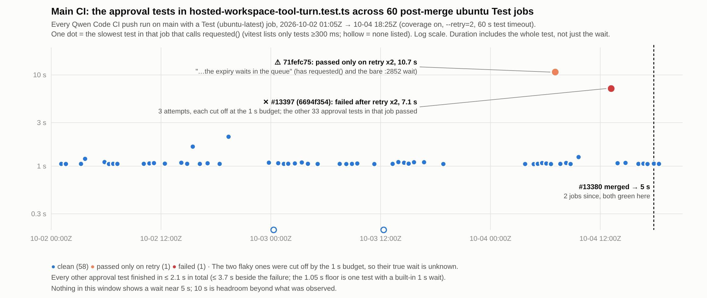
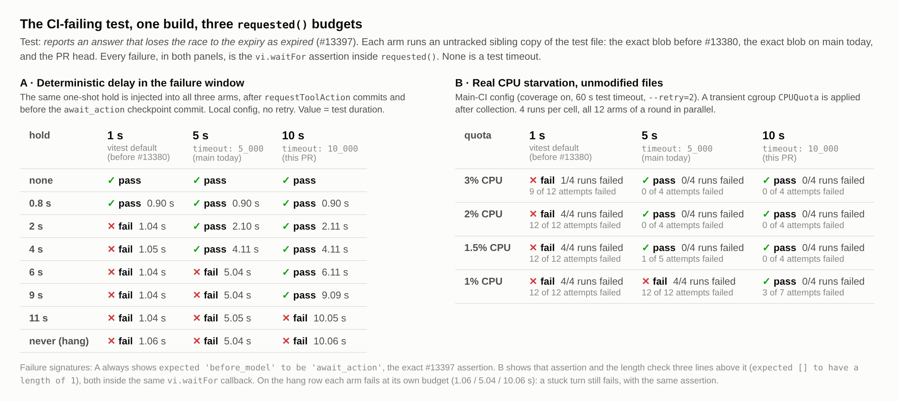
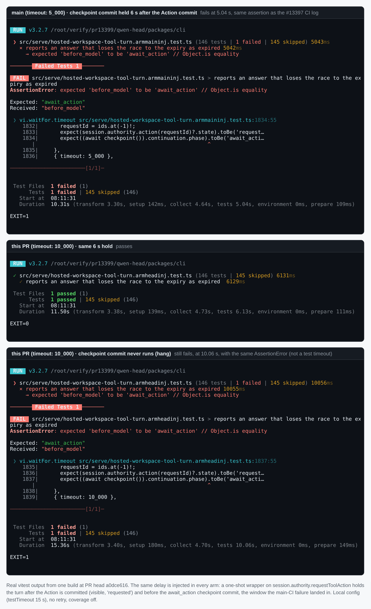
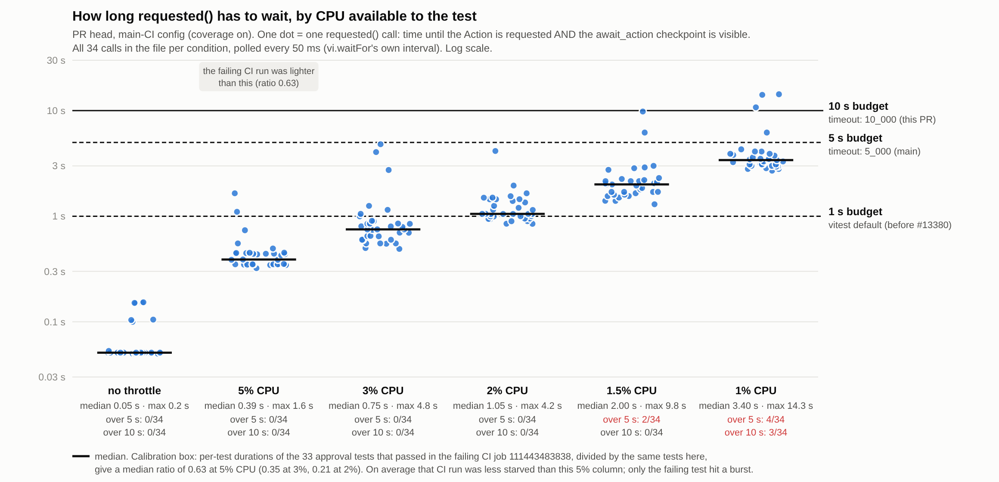

## Maintainer verification: #13399 at `a0dce616`

**Verdict: OK to merge.** It is low risk and its value is modest. Before merging, I'd fix two pieces of wording: the code comment and the PR title/description.

- **What this PR changes today.** #13380 landed on main (`a6a4b0ba`, 2026-10-04 17:51Z) and already gave `requested()` an explicit `{ timeout: 5_000 }`. After the autofix merge, the whole diff of this PR against main is `5_000 → 10_000` plus a three-line comment. That 5 s → 10 s delta is what I verified, not the original 1 s → 10 s change.
- **5 s already covers what main CI has shown.** I surveyed 60 post-merge ubuntu Test jobs:
  - Apart from the two flaky ones, which the old 1 s budget cut off, no approval test took more than 2.1 s in total. The slowest one next to the failure took 3.7 s.
  - On average, the failing run was less starved than my 5 % CPU condition.
- **10 s adds headroom for deeper contention.**
  - At 1 % CPU on the unmodified files, main's 5 s fails 4 of 4 runs (12 of 12 attempts); this PR fails 0 of 4.
  - With a deterministic 6–9 s hold in the exact #13397 window, 5 s fails and 10 s passes.
- **The check is not weakened.** No assertion line changed. A turn that never commits its checkpoint still fails at 10.06 s with the same `AssertionError`, not as a test timeout. That is well inside the 15 s local and 60 s ECS per-test ceilings. Every `requested()` caller uses a 60 s approval expiry, so the longer wait cannot run into an expiry.
- **It matches the convention.** At the PR head, the serve tests have 50 `timeout: 10_000` sites across 10 files, against 2 at `5_000`. #13411, merged 2026-10-05 00:13Z for #13408, also chose `10_000`.
- **Main moved during the verification.** It is now at `35afa6f7`, and the only new commit is #13411, which touches only `hosted-harness-session.test.ts`. `git merge-tree` against this PR is clean, so nothing below needs re-running.

Earlier coordination: my #13380 report suggested landing only one of the two hunks, preferably this one. #13380 landed first with its 5 s, and the autofix round then resolved the conflict in favour of 10 s. The two now stack cleanly instead of conflicting.

### 1. What actually failed on main, and where the new comment points

Job `111443483838` (run 37204740344, `6694f354`, runner `ecs-qwen-hk4-24`) failed all three attempts on the checkpoint assertion, not the length check. While the file ran (13:19:37–13:21:51Z), the job's `DFSAMPLE` lines show the host's 1-minute load climbing from 30 to 37, with `hosttests` at 21–31:

```
 × reports an answer that loses the race to the expiry as expired 7086ms (retry x2)
   → expected 'before_model' to be 'await_action' // Object.is equality   (×3)
 ❯ src/serve/hosted-workspace-tool-turn.test.ts:1833:53
```

`commitDurableWait()` (`packages/core/src/managed-runtime/managed-harness-factory.ts:362`) commits `requestToolAction` first. That makes the Action visible and `requested`. It then commits the `await_action` checkpoint. #13397 landed between those two commits.

The new comment says the fsynced writes happen "before the Action request surfaces". That points the next reader at the wrong window, as triage stage 3 also noted. My delay injection in §3 targets exactly this window and reproduces the CI assertion verbatim.

### 2. Main-CI census (Figure 3)

I covered every `Test (ubuntu-latest, Node 22.x)` job on main from 2026-10-02 01:05Z to 10-04 18:25Z: 60 jobs, all with coverage on and `--retry=2`.

- **58 clean.** In those, the slowest test that calls `requested()` took at most 2.1 s in total. The recurring 1.05 s is one test with a built-in 1 s wait.
- **1 failure**, #13397 above.
- **1 absorbed flake.** At `71fefc75` (10-04 07:05Z), `writes nothing when the Session blocks while the expiry waits in the queue` passed only on `retry x2`, at 10.7 s. That test has both `requested()` and a second, bare `vi.waitFor` (§5), and the log can't say which of the two fired.
- **Since #13380 merged:** 2 jobs, and this file was green in both. The red job at `9915c7ff` was a different file, #13408, now fixed by #13411.

To calibrate, I divided the per-test durations of the 33 approval tests that passed in the failing job by the same tests run locally. The median ratio is 0.63 at 5 % CPU, 0.35 at 3 % and 0.21 at 2 %. In other words, that run was on average lighter than my 5 % condition, and only the failing test caught a burst.



### 3. Deterministic hold in the failure window (Figures 1A and 4)

**Arms.** All arms share one build of the PR head. Each arm is an untracked sibling copy of the test file:

- **1 s:** the exact blob from before #13380 (`a6a4b0ba^`).
- **5 s:** the exact blob on main.
- **10 s:** the PR file.

**Injection.** All three arms get the same one-shot wrapper on `session.authority.requestToolAction`. It awaits the real commit and then holds for D ms before `commitDurableWait` goes on to the checkpoint. The runs use the local config, with no retries and coverage off.

| hold D | 1 s (before #13380) | 5 s (main) | 10 s (this PR) |
|---|---|---|---|
| 0 / 0.8 s | ✓ | ✓ | ✓ |
| 2 s / 4 s | ✕ at 1.04 s | ✓ | ✓ |
| 6 s / 9 s | ✕ | ✕ at 5.04 s | ✓ 6.11 / 9.09 s |
| 11 s | ✕ | ✕ | ✕ at 10.05 s |
| never (hang) | ✕ at 1.06 s | ✕ at 5.04 s | ✕ at 10.06 s |

Every ✕ is `AssertionError: expected 'before_model' to be 'await_action'` from `vi.waitFor.timeout`, the #13397 text. On the 1 s arm it lands at the same `:1833:53` as the CI log. A hung turn still fails promptly on every arm.





### 4. Real CPU starvation with unmodified files (Figures 1B and 2)

**Setup.**
- **Config:** main CI's: `CI=true QWEN_CI_COVERAGE=1`, an `ecs-qwen-*` `RUNNER_NAME` (60 s test and hook timeouts), and `--retry=2`.
- **Throttle:** each run executes inside a transient `systemd-run --scope`. The `CPUQuota` is applied when the first selected test's `beforeEach` creates its `mkdtemp` dir, so collection runs unthrottled. It is lifted when vitest prints the file result.
- **Rounds:** 4 rounds. Each round runs all 12 arm × quota cells in parallel, so host noise hits every arm alike.

| CPU quota | 1 s: runs failed (attempts) | 5 s (main) | 10 s (this PR) |
|---|---|---|---|
| 3 % | 1/4 (9 of 12) | 0/4 (0 of 4) | 0/4 (0 of 4) |
| 2 % | 4/4 (12 of 12) | 0/4 (0 of 4) | 0/4 (0 of 4) |
| 1.5 % | 4/4 (12 of 12) | 0/4 (1 of 5) | 0/4 (0 of 4) |
| 1 % | 4/4 (12 of 12) | **4/4 (12 of 12)** | **0/4 (3 of 7)** |

A probe arm records how long each of the file's 34 `requested()` calls has to wait. It measures until the Action is `requested` **and** the checkpoint reads `await_action`, polling every 50 ms like `vi.waitFor`.

| condition | median wait | max wait | calls over 5 s / 10 s (of 34) |
|---|---|---|---|
| idle | 0.05 s | 0.2 s | 0 / 0 |
| 3 % CPU | 0.75 s | 4.8 s | 0 / 0 |
| 2 % CPU | 1.05 s | 4.2 s | 0 / 0 |
| 1.5 % CPU | 2.0 s | 9.8 s | 2 / 0 |
| 1 % CPU | 3.4 s | 14.3 s | 4 / 3 |

So 5 s starts losing at about 1.5 % CPU. There, the approval tests run about 7× slower than they did in the failing CI job (calibration ratio 0.14, §2). 10 s holds a little further and is finite too: it lost 3 of 34 calls at 1 %.



### 5. Residual in the same file (follow-up, not this PR)

`writes nothing when the Session blocks while the %s waits in the queue` still has a bare `vi.waitFor(() => expect(queued).toHaveBeenCalled())` at `:2852`, with the 1 s default. `resolveHostedAction` reads the options resource and publishes the decision, an fsynced write, before it reaches `authority.resolveAction`.

On the PR head, unmodified and with no retries, I ran 10 executions each at 1 % and 1.5 % CPU, and 4 each at 2 % and 3 %. Results:
- **1 % CPU:** `:2852` failed twice with `expected "resolveAction" to be called at least once`. `requested()` failed twice even with 10 s.
- **1.5 % CPU:** `:2852` never failed; `requested()` failed twice.
- **2 % and 3 % CPU:** nothing failed.

This is the same `it.each` whose `expiry` case shows the absorbed `retry x2` in the census. It only bites at the depth where 10 s itself starts to give way, so it doesn't block this PR. But it is the next candidate, the same mechanism as #13397/#13408/#13316. Triage's suggestion of a CI-wide `vi.waitFor` default in `test-setup.ts` would cover it.

### 6. Other gates

- **Unmodified file:** 146/146 on the PR head, under both the local config and the main-CI config with coverage. The 1 s and 5 s arm copies are also 146/146 under the main-CI config.
- **Lint and format:** `eslint --max-warnings 0` and `prettier --check` are clean on the changed file.
- **PR CI:** green on `a0dce616`, including `Test (ubuntu-latest, Node 22.x)`, `Lint & Static` and `Serve A/B`. PR CI runs without coverage, so it can't show this flake reliably.

### Suggestions before merging (non-blocking)

1. **Reword the comment** to name the window that actually lost the race, for example:
   ```ts
   // The Action request commits first and its await_action checkpoint after
   // it, each behind fsynced durable writes; on the coverage-enabled, shared
   // post-merge CI runners the checkpoint lost vitest's 1s default (#13397).
   ```
2. **Retitle and redescribe.** The title and body still describe replacing the 1 s default, which #13380 already did, so the squash commit would misdescribe the change. A more accurate title would be `test(cli): raise the hosted tool-turn requested() waitFor timeout to 10s (#13397)`, with one line noting that #13380 set 5 s.
3. **Closing #13397.** `Fixes #13397` closes the issue on merge. If this PR is closed as superseded instead, close #13397 by hand.
4. **Follow-up:** the bare `:2852` wait in §5, or the CI-wide default.

**Evidence** (harness, raw data, figures, and the census job list): this directory
