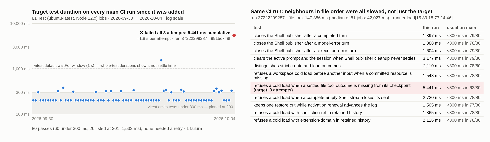
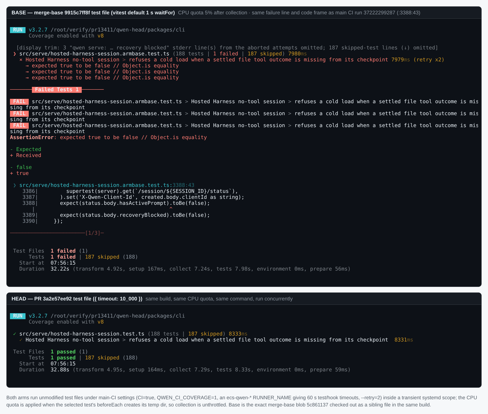
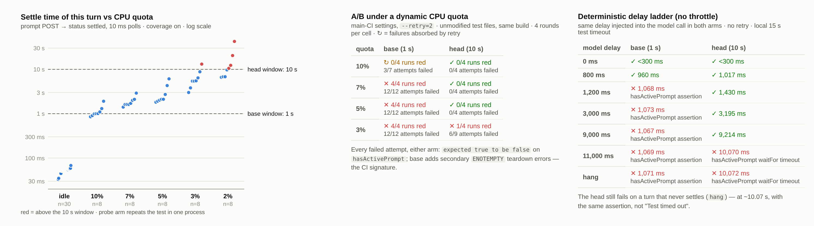
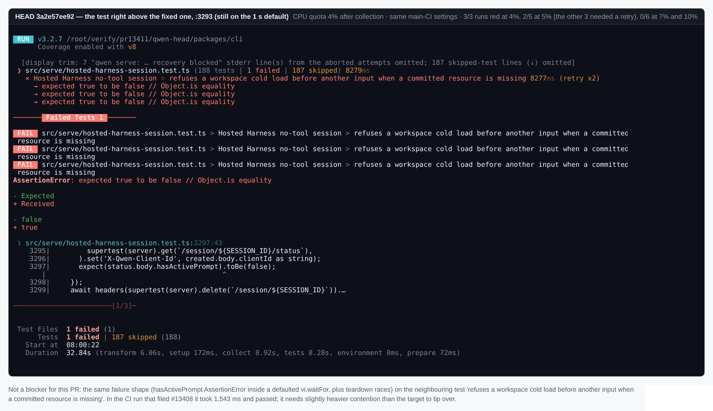

## Maintainer verification: #13411 at `3a2e57e`

**Verdict: ready to merge.**

- The assertion that failed on main (`:3388:43`, `hasActivePrompt`) is inside the one `waitFor` this PR widens, and no other line changes.
- I reproduced the main-CI failure signature locally under real CPU starvation, using the **unmodified** merge-base test file. Under the same conditions the PR's file passes. The starvation levels that cover the CI burst are 10 %, 7 % and 5 % CPU; there, base lost 27 of 31 attempts and head lost 0 of 12.
- The check is not weakened. A turn that never settles still fails on head with the same `AssertionError`, about 10.07 s in, and not as a test timeout.
- `main` is still at `9915c7ff8f`, which is this PR's merge base and the commit whose CI run filed #13408. The head is therefore also the merged tree.

### 1. Which assertion failed on main

Job `111500825774` (run 37222299287, runner `ecs-qwen-hk4-26`, coverage on). All three attempts (`--retry=2`) failed at the `waitFor` this PR changes:

```
 × Hosted Harness no-tool session > refuses a cold load when a settled file tool outcome is missing from its checkpoint 5441ms (retry x2)
   → expected true to be false // Object.is equality
   → ENOTEMPTY: directory not empty, rmdir '…/hosted-harness-test-9sqhKw/resources/22222222-…'
   → expected true to be false // Object.is equality
   → ENOTEMPTY: directory not empty, rmdir '…/hosted-harness-test-NOMYYa/resources/22222222-…/managed-tool-outcome'
   → expected true to be false // Object.is equality

 ❯ src/serve/hosted-harness-session.test.ts:3388:43
    3388|       expect(status.body.hasActivePrompt).toBe(false);
```

The `ENOTEMPTY` lines are a side effect: `afterEach` removed the temp root while the turn was still writing `managed-tool-outcome`. The turn was slow, not stuck. The job's `DFSAMPLE` lines show the host's 1-minute load average climbing from about 10 to 36 while this file ran (18:30:52–18:33:19), and it was still about 30 when the file reported.

### 2. Main-CI census (Figure 1)

I collected every `Test (ubuntu-latest, Node 22.x)` job on main since the test landed in #13088 (`afb911a3c8`, 2026-09-30): 81 jobs, up to the failing run on 2026-10-04.

- The test passed 80 times. 60 of those runs took under 300 ms (vitest doesn't list them), and the other 20 took 301–1,532 ms. No pass needed a retry.
- It failed once: in the run that filed #13408.
- In that run, the file took 147 s; the median over the 81 jobs is 42 s. The ten tests around the target, each under 300 ms in at least 77 of the other 80 runs, took 1.4–3.2 s each. That is a runner-load burst, not this code path.



### 3. Real CPU starvation with unmodified test files (Figures 2 and 3)

**Rig** (same method as my #13323 verification):
- **Arms.** Both arms share one build of the PR head. The base arm is the merge-base blob of the test file (`5c861137`, the pre-image in this PR's diff), saved as the untracked sibling `hosted-harness-session.armbase.test.ts`. The head arm is the PR's own file. No source or test line is edited in either arm.
- **Main-CI settings.** Every run uses `CI=true QWEN_CI_COVERAGE=1`, an `ecs-qwen-*` `RUNNER_NAME` (which gives 60 s test and hook timeouts and `maxWorkers` 25 %), `--retry=2`, and `-t 'settled file tool outcome is missing'`.
- **Throttle.** Each run executes inside a transient `systemd-run --scope`. A watcher on a private `TMPDIR` applies the CPU quota with `systemctl set-property` the moment the test's `beforeEach` creates its `mkdtemp` dir, and lifts it when vitest prints the file result. Collection runs unthrottled; only the test body is starved.

| CPU quota | settle time, p50 (range) | base: failed attempts | head: failed attempts |
|---|---|---|---|
| none | 53 ms (33–68) | pass | pass |
| 10 % | 1.0 s (0.85–1.9) | 3 / 7 (all absorbed by retry, 0 of 4 runs red) | **0 / 4** |
| 7 % | 1.7 s (1.4–2.9) | **12 / 12** (4 of 4 runs red) | **0 / 4** |
| 5 % | 2.1 s (1.8–6.1) | **12 / 12** (4 of 4 runs red) | **0 / 4** |
| 3 % | 5.4 s (3.0–13.1) | 12 / 12 (4 of 4 runs red) | 6 / 9 (1 of 4 runs red) |
| 2 % | 10.1 s (6.6–42.5) | not run | not run |

Each A/B cell is 4 rounds, with base and head running concurrently. Every failed attempt in either arm is `expected true to be false` on the `hasActivePrompt` line. At 5 % and 3 %, base also shows the secondary `ENOTEMPTY` teardown errors. Together that is the CI signature. The settle times come from a separate probe arm: the PR's file with a timer before the unchanged `waitFor`, measuring from the prompt POST to the first settled `/status` at 10 ms polls (n = 30 idle, 8 per quota).

**Calibration against the CI burst.** I ran the same neighbouring tests at 10 %, 7 % and 5 % and compared them with their times in the failing CI run:

| test (single attempt) | CI burst | local 10 % | local 7 % | local 5 % |
|---|---|---|---|---|
| refuses a workspace cold load before another input… | 1,543 ms | 1,389 | 2,300 | red (see note 3) |
| refuses a cold load when a complete empty Shell stream loses its seal | 2,720 ms | 904 | 1,199 | 1,694 |
| distinguishes strict create and load outcomes | 2,110 ms | 610 | 900 | 3,398 |
| closes the Shell publisher after a completed turn | 1,397 ms | 3,350 | 5,422 | 7,882 |

So the CI burst sits in the 10–5 % band. In that band the old 1 s window lost 27 of 31 attempts, and the 10 s window lost none. The slowest settle I measured there was 6.1 s.



### 4. Deterministic delay ladder and negative control (Figure 3, right)

The same two arms, unthrottled. This time the turn's single model call is delayed by D ms, with an identical injection in both arms. Local config: 15 s `testTimeout`, no retry, no coverage.

- **Base** fails from D = 1,200 ms, at about 1.07 s.
- **Head** passes up to D = 9,000 ms.
- **Head** fails at D = 11,000 ms, and also when the model call never resolves (`hang`). Both failures land at about 10.07 s, with `AssertionError: expected true to be false` on the `hasActivePrompt` line (`vi.waitFor.timeout`), not `Test timed out`.

The wider window still reports the real assertion. This also reproduces the author's 1.2 s probe.



### 5. Other checks

- **Diff.** The only changes are the re-wrapped call and `{ timeout: 10_000 }`. Both `expect` lines are byte-identical. In the AST count, defaulted `vi.waitFor` calls go from 46 to 45, and the removed one is `:3384`.
- **Full file on head.** 188/188 passed under the local default config, and 188/188 under main-CI settings (coverage, `--retry=2`, `ecs-qwen-*`).
- **Lint.** `prettier --check` and `eslint --max-warnings 0` on the file are clean.
- **PR CI.** 30 success, 48 skipped, 0 failed (paginated check-runs). PR runs leave `QWEN_CI_COVERAGE` empty, so coverage is off there; a green PR run cannot exercise this flake. That is why I built the local rig.

### Non-blocking notes

1. **Triage's headroom estimate reads a cumulative time as one attempt.** The 5,441 ms in the CI log covers all three attempts: vitest 3.2.7's `runTest` takes `start` before the retry loop and sets `result.duration` after it (`@vitest/runner/dist/chunk-hooks.js`, L1543 and L1649). Each attempt took about 1.8 s, including the 1 s window, so the test reached its `waitFor` in roughly 0.8 s or less, not about 4.4 s. On a 15 s non-ECS runner, a real hang still reports as the assertion at about 11 s. Main CI runs on `ecs-qwen-*`, where the limit is 60 s anyway.
2. **10 s is a finite margin.** At 3 % CPU, which is harsher than the observed burst (settle p50 5.4 s vs 2.1 s at 5 %), head failed 1 of 4 runs (6 of 9 attempts) with the identical signature. This turn settles about 2× slower than the Hook-fence turn from #13323 at the same quota (2.1 s vs 1.0 s p50 at 5 %). 10 s is the file's convention and is fine here.
3. **The next one in line is the test directly above.** `:3293` in `refuses a workspace cold load before another input when a committed resource is missing` has the same shape and is still on the 1 s default. On the head file it failed 3 of 3 runs at 4 % CPU and 2 of 5 at 5 % (the other three needed a retry), and passed 6 of 6 at 7–10 %. The signature is identical: `hasActivePrompt` AssertionError plus teardown races (Figure 4). In the CI run that filed #13408 it took 1,543 ms and passed. Across the `Hosted Harness no-tool session` block, 43 `waitFor` calls are still on the default (file-wide, 45 of 78). The describe-scoped helper that triage pointed to (`Hosted Harness tool approvals`, L5436) would retire them together. That is a separate decision and doesn't need to block this PR.



**Evidence.** The harness, raw data, and figures are at this directory (`harness/`, `data/`; raw A/B, calibration, sibling and full-file logs are in `data/raw-logs.tar.gz`). That covers the arm generator, the throttle runner, the A/B and ladder scripts, the 81-job CI census TSV, every A/B and ladder log, and the probe JSONL.
