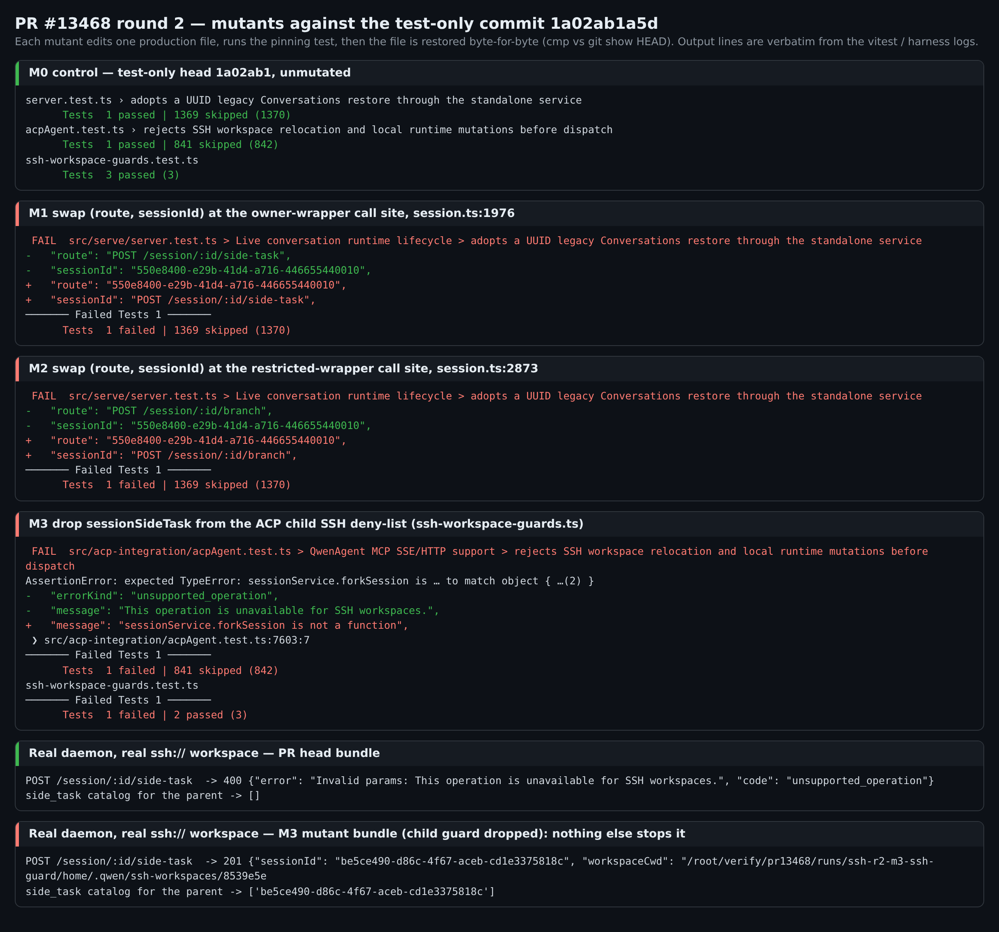
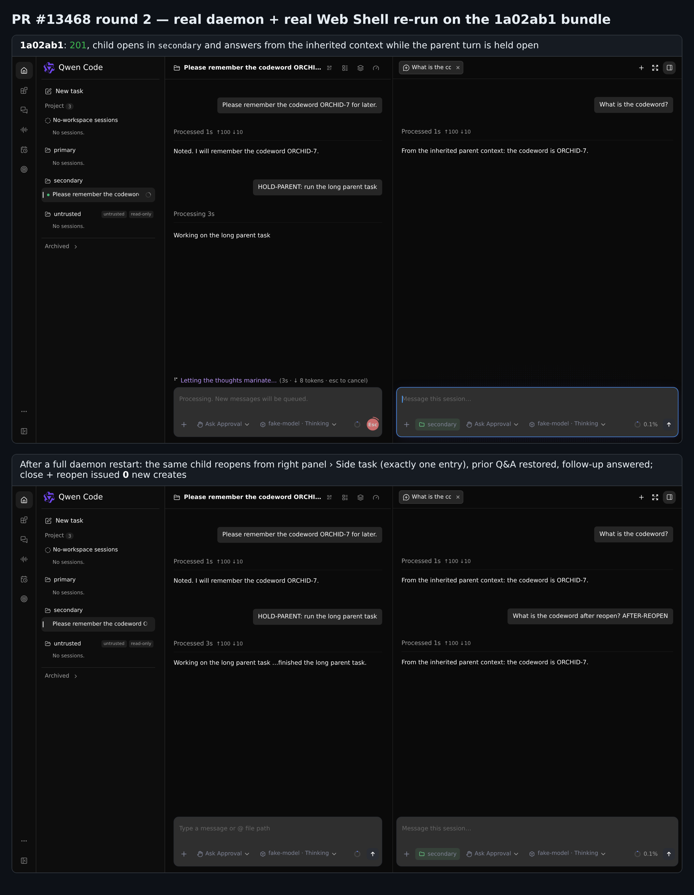

## 维护者验证第 2 轮（增量）— PR #13468 @ `1a02ab1`

**结论：仍可合入。** `1a02ab1a5d` 只改了测试：所有非测试文件都与 `0507359` 逐字节一致，而 `0507359` 已在[第 1 轮](https://github.com/QwenLM/qwen-code/pull/13468#issuecomment-6006819707)做过端到端验证。新增的断言补上了第 1 轮指出的两处测试缺口，我用变异逐一确认，每条断言都能抓到它要防的回退。第 1 轮的说明 2 作者放到单独的后续项处理，我同意：父会话忙碌时把进行中的提示词带进侧任务，这在 `main` 上本来就存在。

### 新测试能否抓到回退？

每个变异只改一个生产文件。跑完对应测试后还原，并用 `cmp` 与 `git show HEAD` 比对，确认逐字节一致。

| 变异 | 结果 |
|---|---|
| M0：不变异（对照） | 三个定向测试全部通过 |
| M1：在 owner 包装器调用点 `session.ts:1976` 对调 `(route, sessionId)` | **被抓到。** side-task 那一轮失败，diff 显示 `route`/`sessionId` 互换 |
| M2：在 restricted 包装器调用点 `session.ts:2873` 做同样的对调 | **被抓到。** branch 那一轮失败 |
| M3：从 ACP 子进程的 SSH deny-list（`ssh-workspace-guards.ts`）删掉 `sessionSideTask` | **被抓到。** 新增的 `acpAgent.test.ts:7603` 断言失败，既有的 `ssh-workspace-guards.test.ts` 谓词测试也失败 |

我还在真实 daemon 上跑了 M3，证明子进程守卫确实是唯一一道防线：

- 用 PR 的 bundle，在真实 `ssh://` 工作区上 `POST /session/:id/side-task` 返回 400 `unsupported_operation`，不会生成子会话。
- 用 M3 的 bundle，同一请求返回 **201**，子会话出现在侧任务列表里。

所以新增的 `acpAgent` 断言守住的正是执行 SSH 排除的唯一位置，第 1 轮说明 1 在防回退层面已经覆盖。作者选择保留现有的 400 `unsupported_operation` 契约，不在路由层加 501。既然这个行为已被测试固定，我没有意见。

### 在 `1a02ab1` 构建上复跑

- **构建产物等价。** 我在 `1a02ab1` 上重新打包，并与第 1 轮的 bundle 比对。把内嵌的 commit 号和按内容哈希命名的 chunk 文件名归一化后，957 个文件全部一致。
- **在新 bundle 上仍复跑了真实 daemon E2E**，结果都与第 1 轮一致：
  - **API 矩阵：** 次要工作区侧任务在父会话空闲和忙碌时都返回 201；子会话继承上下文；父会话和兄弟会话相互隔离；列表按工作区正确隔离；主工作区、未知所有者、branch、fork 的行为不变。
  - **重启恢复：** daemon 重启后 `load` 返回同一个子会话 id，没有重复。
  - **浏览器：** 父会话忙碌时创建侧任务，然后重启 daemon、冷加载重新打开、关闭再打开，全程没有新的创建请求（0 次）。
  - **SSH：** 仍是 400 `unsupported_operation`。
- **`1a02ab1` 上的测试：** `server.test.ts` 1370/1370、`acpAgent.test.ts` 842/842、`multi-workspace-sessions.test.ts` 176/176。
- **合并：** 与 `main`（`69d5db2`，第 1 轮之后没有变化）合并仍无冲突。
- **`1a02ab1` 上的 CI：** 26 成功、37 跳过、0 失败。发帖时只剩 `review-pr` 机器人任务仍在运行。

证据（变异日志、harness、原始 JSON、截图）：本目录（`mutants/`、`harness/`、`data/`、`screens/`）。
