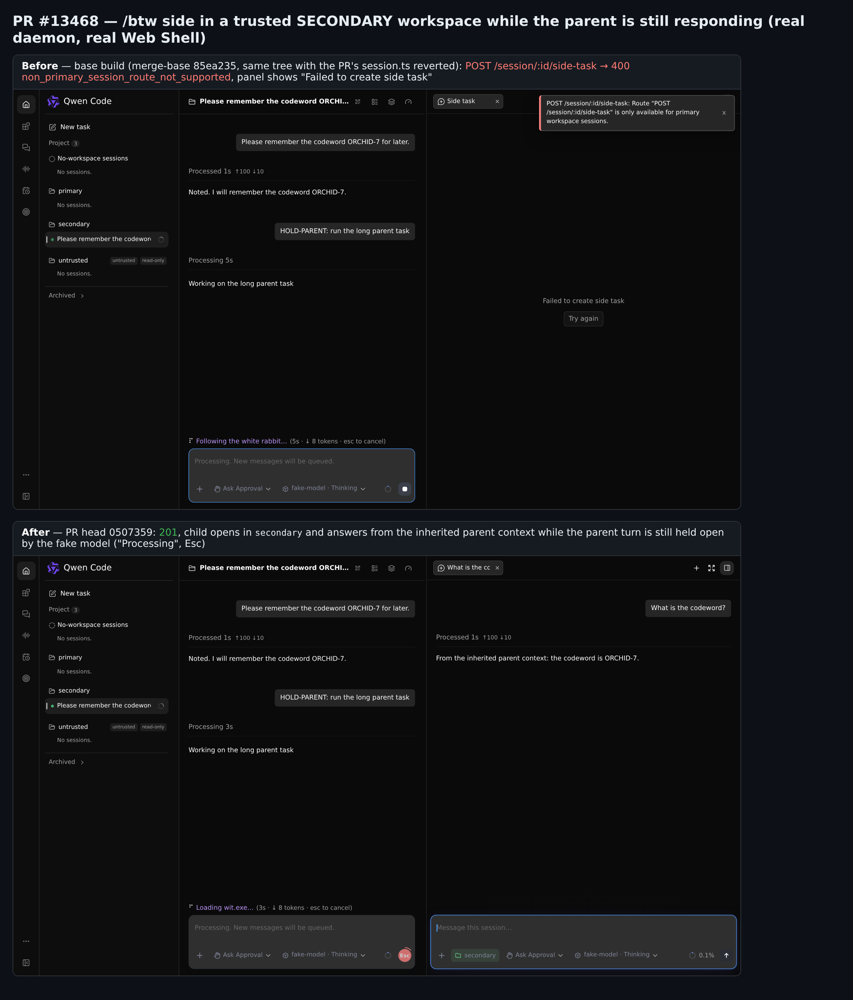
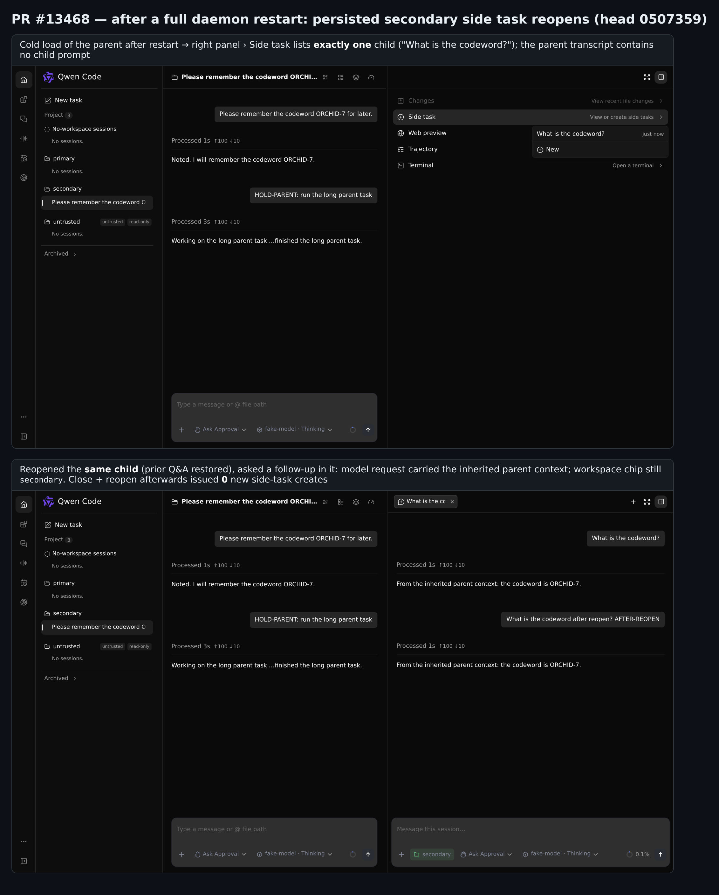
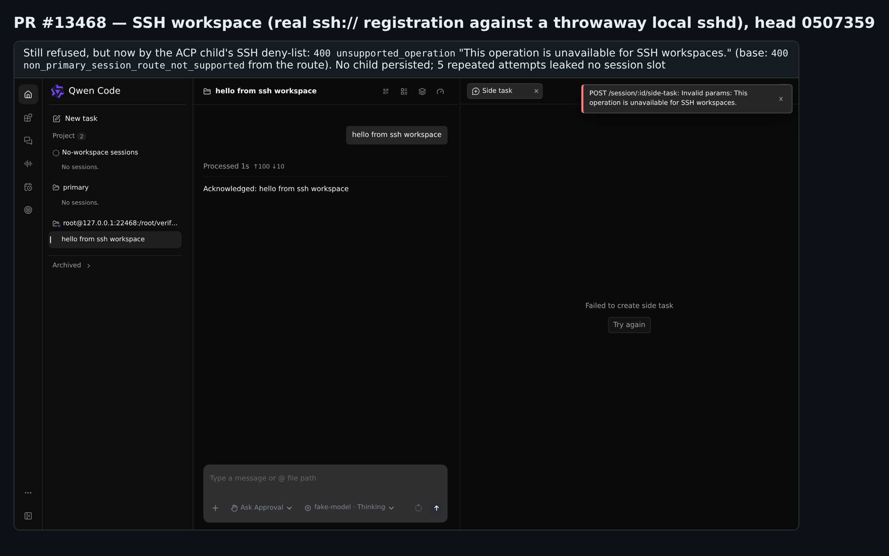

## Maintainer verification — PR #13468 @ `0507359`

**Verdict: ready to merge.** I ran the fix end to end on a real `qwen serve` daemon with real ACP children, and drove the real Web Shell in Chromium. The base build reproduces the bug, and I found no regression. Three non-blocking notes follow below. The second describes behaviour that already exists on `main`, and the third confirms the bot suggestion that is still open.

### How this was tested

- **Platform and build:** Linux x86_64, Node 22.22.2. Real `pnpm install --frozen-lockfile`, `npm run build` and `npm run bundle` of PR head `0507359`.
- **Two bundle arms from one tree:**
  - **base** is the PR head with `packages/cli/src/serve/routes/session.ts` reverted to the merge base `85ea235`. That file is the PR's only production change.
  - **head** is the PR head as pushed.
  - Grepping the bundled chunks confirms the difference: base registers side-task under `withRestrictedMutableSession`, head under `withOwnerMutableSession`.
- **Per-arm setup:**
  - A `qwen serve` daemon with three registered workspaces: primary, a trusted secondary, and an untrusted one.
  - Isolated `HOME`, `QWEN_HOME` and runtime directory.
  - A deterministic local OpenAI-compatible model. It logs every request and can hold a reply open, which keeps the parent busy. No upstream model calls were made.
- **Three ways of driving it:**
  - raw HTTP;
  - Playwright Chromium against the Web Shell served by the daemon;
  - an `ssh://` workspace against a throwaway local `sshd` (its own port and keys, with no change to system or `~/.ssh` config).

### Real daemon A/B over HTTP

| # | Scenario | base | head |
|---|---|---|---|
| 1 | `POST /session/:id/side-task` on an idle parent in the secondary workspace | 400 `non_primary_session_route_not_supported` | **201**: `workspaceCwd` is the secondary workspace, `parentSessionId` and `sourceId` are the parent, `sourceType: side_task` |
| 2 | Same, while the parent's turn is held open by the model | 400 | **201**. The child's prompt reaches `turn_complete` while the parent's turn is still open |
| 3 | Does the child inherit the parent's context? | — | Yes. The child's model request carries the parent's `ORCHID-7` turn, and the reply cites it |
| 4 | Is the parent's history independent of the child? | — | Yes. The parent's next model request contains no child prompt, and a sibling child does not see the first child's prompt |
| 5 | Catalog: `GET /workspace/<cwd>/sessions?sourceType=side_task&sourceId=<parent>` | Secondary lists 0 | Secondary lists exactly the 2 children; primary with the same filter lists 0 |
| 6 | Where the transcripts land | — | The parent and both children are only under the secondary project directory |
| 7 | Daemon restart, then list, `load` and prompt | — | Same 2 ids. `load` returns the same child in the secondary workspace, and the prompt sees both inherited and own history. No duplicates (3 sessions in total), and the primary filter still lists 0 |
| 8 | Primary-workspace control | 201 | 201 |
| 9 | Unknown owner id | 404 `session_not_found` | 404 `session_not_found` |
| 10 | Standalone (no-workspace) session | 400 `unsupported_action` | 400 `unsupported_action` (same body) |
| 11 | `branch` and `fork` on the secondary parent | 400 `non_primary_session_route_not_supported` | Unchanged |
| 12 | Untrusted workspace | `POST /session` returns `untrusted_workspace`, so no parent can exist | Same. The side-task rejection for untrusted owners is covered by the PR's five-state unit test |
| 13 | SSH workspace (real `ssh://` registration) | 400 `non_primary_session_route_not_supported` | 400 `unsupported_operation` from the ACP child guard. No child persisted, and 5 repeated attempts leaked no session slot |

### Real Web Shell (Chromium against the Web Shell served by the daemon)

- **base:** `/btw side` in the secondary session shows the toast `Route "POST /session/:id/side-task" is only available for primary workspace sessions.`, and the pane says "Failed to create side task" (fig. 1, top).
- **head:** the side-task pane opens in `secondary` and answers from the inherited context while the parent still shows "Processing" (fig. 1, bottom).
- **head after a full daemon restart** (fig. 2):
  - The parent cold-loads, and right panel › Side task lists exactly one child.
  - Reopening that child shows its earlier Q&A, and a follow-up question in it works.
  - Closing and reopening the tab made 0 new side-task create calls.

### Tests

- **At head:**
  - `multi-workspace-sessions.test.ts`: 176/176
  - `server.test.ts` (full file): 1370/1370
  - Web Shell `App.test.tsx` + `SideTaskPanel.test.tsx`: 1133/1133
  - acp-bridge side-task tests: 7/7
- **Negative control:** with `session.ts` reverted to the merge base, 4 of the PR's new daemon tests fail and 172 pass. So the new tests do tell the fix apart from the old code.
- **Merge with current `main`:** clean against `69d5db2`. The two newer commits on main touch none of the files on the side-task path.
- **CI on `0507359`:** 25 success, 9 skipped, 0 failed. `review-pr` was still running when I wrote this.

### Notes (non-blocking)

1. **The SSH exclusion is now enforced only inside the ACP child.**
   - Before this PR, the route wrapper rejected every non-primary owner, and that included SSH workspaces.
   - `withOwnerMutableSession` runs its SSH 501 check only for `cwdBound` routes, and side-task is not one. So the request now passes the archive lock, the generation guard and bridge admission, and only then hits the child's SSH deny-list (`acp-integration/ssh-workspace-guards.ts`, `sessionSideTask`).
   - On a real SSH workspace the request is still refused and nothing is persisted (fig. 3), so the design doc's "SSH exclusions remain in effect" holds in practice.
   - However, the error contract changed. It went from `400 non_primary_session_route_not_supported` to `400 unsupported_operation`, not the `501 ssh_workspace_operation_unsupported` that the other SSH-blocked owner routes return. No daemon or bridge test covers side-task on an SSH workspace.
   - Suggestion: reject SSH owners early in the route, or at least add a test that pins the current behaviour.
   - Also, by reading the code (I did not run this case): a Managed-engine parent in a secondary workspace now gets `409 managed_session_branch_unsupported` from the bridge, where it used to get the route's 400.
2. **Already on `main`: a side task created while the parent is busy inherits the parent's unanswered prompt.**
   - The child forks from the parent's recording, which already holds the in-flight user message.
   - So the child's first request sends that message and the side question as two text parts of one `user` message: `[{"text":"HOLD-PARENT: run the long parent task"},{"text":"What is the codeword while the parent is busy?"}]`.
   - Base produces exactly the same shape for a primary parent. This PR only makes the existing behaviour reachable from secondary workspaces too.
   - With a model that uses tools, the child may start acting on the parent's pending instruction in the same workspace. That deserves a deliberate decision or a follow-up, but it is not something this PR changes.
3. **I confirmed the open bot suggestion on `0507359` by running it** (round 2, R1-1, introduced by the round-1 fix).
   - I swapped the two `string` arguments of `sendStandaloneActionUnsupported` at both call sites, and `server.test.ts › adopts a UUID legacy Conversations restore through the standalone service` stays green.
   - No test pins the standalone response body.
   - This is a test-only gap. Asserting the full body in the `genericActions` loop would close it.

### Not covered

- Windows and macOS (I tested on Linux x86_64 only).
- A real model provider (I used a deterministic fixture).
- Side tasks on the Managed engine and in internal workspaces (covered only by unit tests and code reading).

Evidence (harness, raw JSON, per-step screenshots, unit logs): this directory (`harness/`, `data/`, `screens/`).
