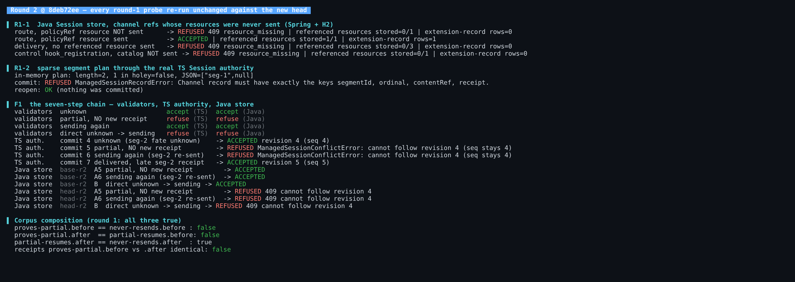
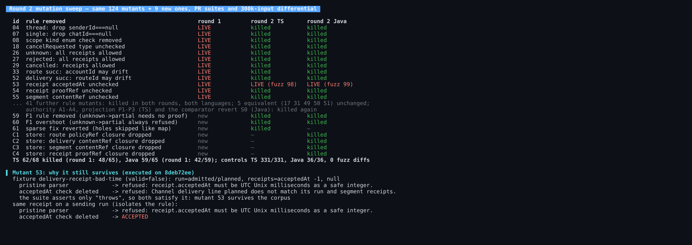
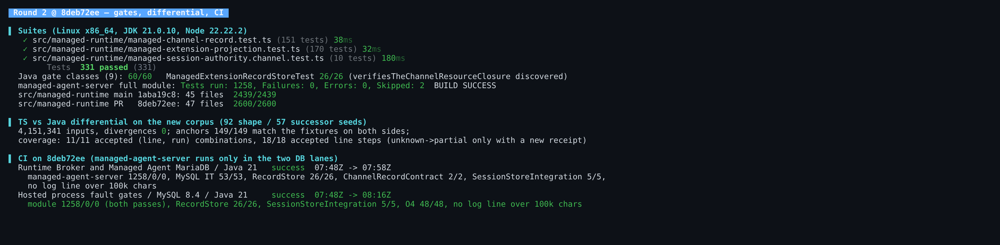

## Maintainer verification, round 2 (delta only): QwenLM/qwen-code#13548 at `8deb72ee`

**Verdict: mergeable.** Every round-1 item is closed at this head. I confirmed each one by re-running the same round-1 probes, unchanged.
- Both CI lanes that run `managed-agent-server` are green on this head (both were cancelled in round 1).
- One residual is non-blocking: mutant 53, below, where my round-1 claim still holds by execution. There is also one cosmetic message nit.

[Round 1](https://github.com/QwenLM/qwen-code/pull/13548#issuecomment-6031765367) has the full matrix. This round ran on head `8deb72ee`, with current `main` `1aba19c8` (the new merge base) as the A/B arm. Environment as before: Linux x86_64, JDK 21.0.10, Node 22.22.2.

### Closed, by execution

- **R1-1, resource closure: closed.** The Java store now refuses (`409 managed_session_resource_missing`, 0 rows) a route whose `policyRef` resource is missing and a delivery with none of its 3 resources. In round 1 both were accepted and indexed.
  - `verifiesTheChannelResourceClosure` is now discovered (store suite 26/26).
  - The four new store mutants, each dropping one closure check (policy, content, segment content, proof), are each killed by that test.
- **R1-2, sparse plan: closed.** The same holey plan is now refused at commit, and the Session reopens.
  - Reverting the index walk is killed by the new sparse regression test.
  - My byte-level differential cannot express holes, so that test plus `delivery-null-segment` is what pins this rule.
- **F1, unknown → partial without proof: closed.** The step is now refused by:
  - both validators;
  - the TS authority (`ManagedSessionConflictError … cannot follow revision 4`, sequence stays 4);
  - the Java store (`409`). `main` still accepts the whole chain unvalidated, because the channel bodies aren't registered there.
  - The late-receipt path `unknown → delivered` still commits, and the corpus no longer composes the bypass.
  - Both directions of the new rule are pinned in both languages. Deleting the rule is killed by `delivery-unknown-partial-without-proof`. Over-tightening it to "never" is killed by `delivery-unknown-proves-partial`.
- **F2, corpus gaps: 11 of 12 closed.** The PR suites now kill those 11 round-1 live mutants in both languages. Kill counts are TS 62/68 and Java 59/65 (round 1: 48/65 and 42/59). The 7 authority/projection mutants and the comparator revert are killed again. The only survivors are the same 5 equivalents and mutant 53.

### Mutant 53 (non-blocking)

Your reply is right that the pristine parser refuses `delivery-receipt-bad-time` with the `acceptedAt` message, since parse order checks the time first. But both replays only assert that parsing throws, not which rule fired.

- **Why it survives.** Delete the `acceptedAt` check and the same fixture is still refused, now by "planned has no receipts", so the suites stay green. T53 and J53 survive the corpus at this head in both languages; the fuzz kills them with 98 and 99 inputs.
- **Fix.** The same receipt on a `sending` run isolates the rule: the pristine parser refuses it and the mutant accepts it. Moving that fixture onto a `sending` run pins it. Asserting the refusal message in both replays would also work.

### Gates, differential, CI

- **TS.** The PR suites pass 331/331 (channel 151, projection 170, authority 10). `src/managed-runtime` passes 2600/2600, against `main` 2439/2439; the difference is 161 = 151 + 10. No `hook-scale` timeout here.
- **Java.** The 9 gate classes pass 60/60. The full `managed-agent-server` module ran 1258 tests: 0 failures, 0 errors, 2 skipped.
- **Differential on the new corpus (92/57).** 4,151,341 inputs, 0 divergences. All 149 corpus anchors match their fixtures on both sides. Coverage is 11/11 (line, run) combinations and 18/18 line steps; `unknown → partial` is accepted only with a new receipt.
- **CI, MariaDB lane** (`Runtime Broker and Managed Agent MariaDB`): **success** at this head, 07:48 → 07:58Z.
  - Module 1258/0/0, MySQL IT 53/53, store 26/26, channel contract 2/2, `ManagedSessionStoreIntegrationTest` 5/5.
  - No log line exceeds 100k characters, so the stale-base stall is gone.
- **CI, Hosted lane** (`Hosted process fault gates / MySQL 8.4`): **success** at this head, 07:48 → 08:16Z.
  - Module 1258/0/0 on both passes, store 26/26, `ManagedSessionStoreIntegrationTest` 5/5, O4 48/48.
  - No log line exceeds 100k characters.

### Nit (cosmetic)

- Channel refs now go through the shared `ManagedExtensionRecordStore.requireReference`, which says "The MCP reference does not match its committed resource."
  - A `policyRef` whose digest differs from the sent resource is correctly refused, but with that MCP wording (executed).
  - A neutral message would read better for operators.

Evidence (screenshots, probes, mutant logs, raw data): `harness/` and `data/` in this directory
