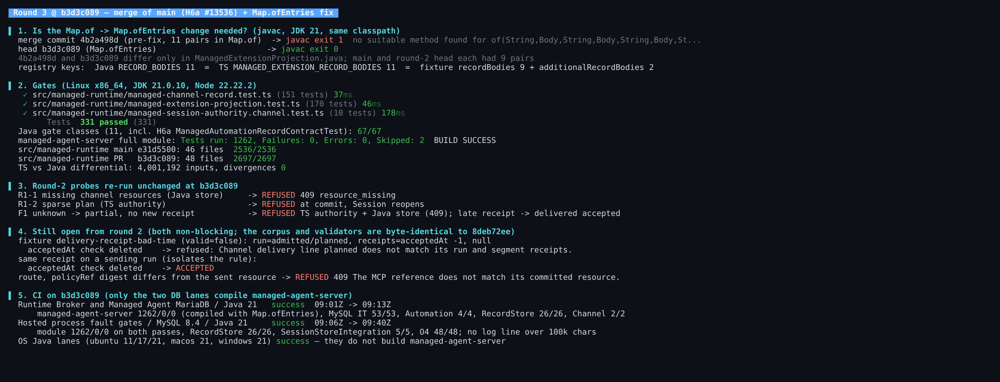

## Maintainer verification, round 3 (delta only): QwenLM/qwen-code#13548 at `b3d3c089`

**Verdict: still mergeable.** This round's production change is the `Map.of` → `Map.ofEntries` switch in `ManagedExtensionProjection.RECORD_BODIES`. That switch is required, it is correct, and nothing else moved: the validators, both corpora, the PR's tests and the store closure are byte-identical to round 2's `8deb72ee`. The only non-PR change is the merge of `main` carrying H6a (#13536). Both CI lanes that compile `managed-agent-server` are green on this head.

[Round 1](https://github.com/QwenLM/qwen-code/pull/13548#issuecomment-6031765367) · [round 2](https://github.com/QwenLM/qwen-code/pull/13548#issuecomment-6033913905). This round ran on head `b3d3c089`, with current `main` `e31d5500` as the A/B arm.

- **The fix is needed.** The pre-fix merge commit `4b2a498d` puts 11 pairs into `Map.of` and fails `javac` with `no suitable method found for of(String,Body,…)`. `4b2a498d` and `b3d3c089` differ only in that one file, and the head compiles.
  - This is exactly the cross-PR break the [08:21Z review](https://github.com/QwenLM/qwen-code/pull/13548#pullrequestreview-5439552330) predicted. `main` and the round-2 head each had 9 pairs.
- **The fix is correct.** The registries match in both languages: Java `RECORD_BODIES` has 11 keys, and TS `MANAGED_EXTENSION_RECORD_BODIES` has the same 11.
  - Both channel bodies still report `taskKind` null in Java.
  - The projection fixture covers all 11 as `recordBodies` (9) plus H6a's `additionalRecordBodies` (2); both languages' parity tests merge the two maps.
- **Gates.**
  - TS: the PR suites pass 331/331. `src/managed-runtime` passes 2697/2697, against `main` 2536/2536; the difference is again exactly 151 + 10.
  - Java: 11 gate classes pass 67/67, including H6a's `ManagedAutomationRecordContractTest`. The full `managed-agent-server` module ran 1262 tests with 0 failures and 0 errors (2 skipped).
  - Differential: 4,001,192 inputs, 0 divergences.
- **Round-2 probes, re-run unchanged.** R1-1 (409 `resource_missing`), R1-2 (refused at commit) and F1 (refused by the TS authority and the Java store) are all still closed.
- **Still open from round 2, both non-blocking.**
  - **Mutant 53.** `delivery-receipt-bad-time` is byte-identical, and with the `acceptedAt` check deleted it is still refused by the planned pin. Moving it onto a `sending` run pins the rule.
  - **The shared "The MCP reference does not match…" message.** It now also applies to channel refs; [yiliang114's P3](https://github.com/QwenLM/qwen-code/pull/13548#discussion_r4204851717) raises the same point.

Mutation sweep: not rerun. Every file it mutates or replays is byte-identical to round 2, so round 2's TS 62/68 and Java 59/65 carry over.

**CI on `b3d3c089`.** The five OS Java lanes are green, but they build only `qwencode` and `runtime-broker`; only the two DB lanes compile `managed-agent-server`, where this fix lives.
- `Runtime Broker and Managed Agent MariaDB / Java 21`: **success**, 09:01 → 09:13Z.
  - Module 1262/0/0, compiled with `Map.ofEntries`.
  - MySQL IT 53/53, `ManagedAutomationRecordContractTest` 4/4, store 26/26, channel contract 2/2.
- `Hosted process fault gates / MySQL 8.4 / Java 21`: **success**, 09:06 → 09:40Z.
  - Module 1262/0/0 on both passes, store 26/26, `ManagedSessionStoreIntegrationTest` 5/5, O4 48/48.
  - No log line exceeds 100k characters.

Evidence (screenshot, negative-control javac output, logs): `harness/` and `data/` in this directory
