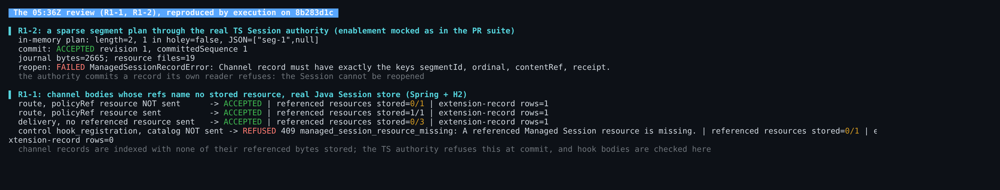
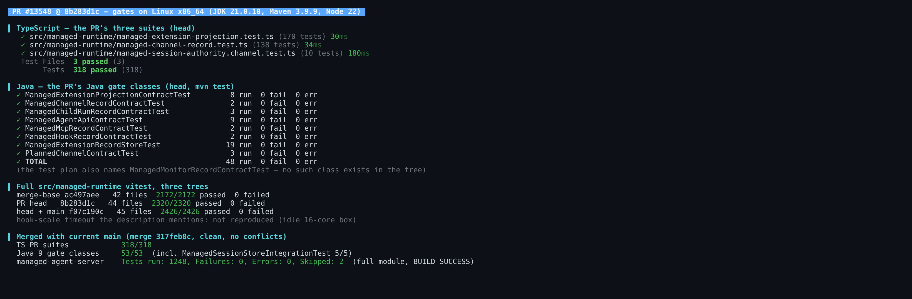
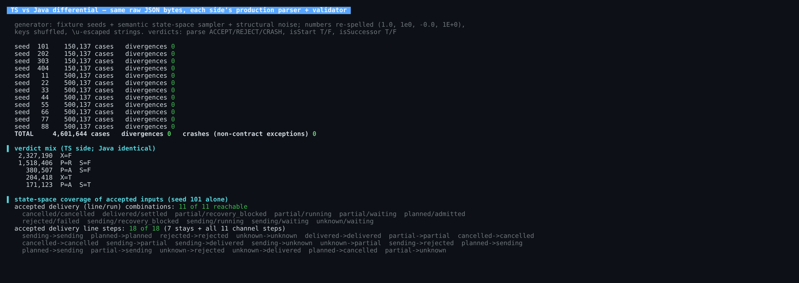
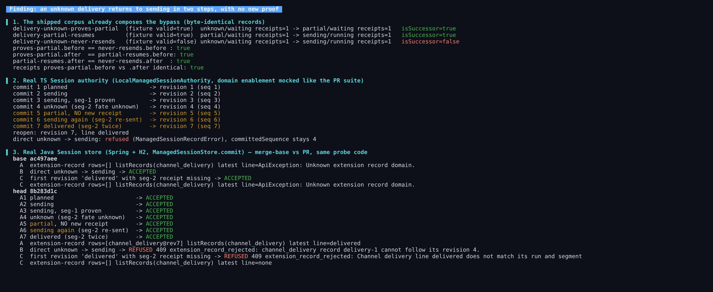
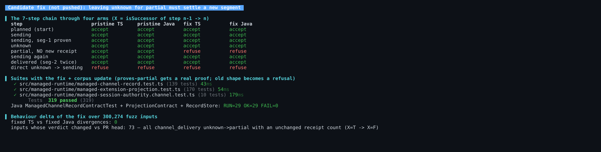
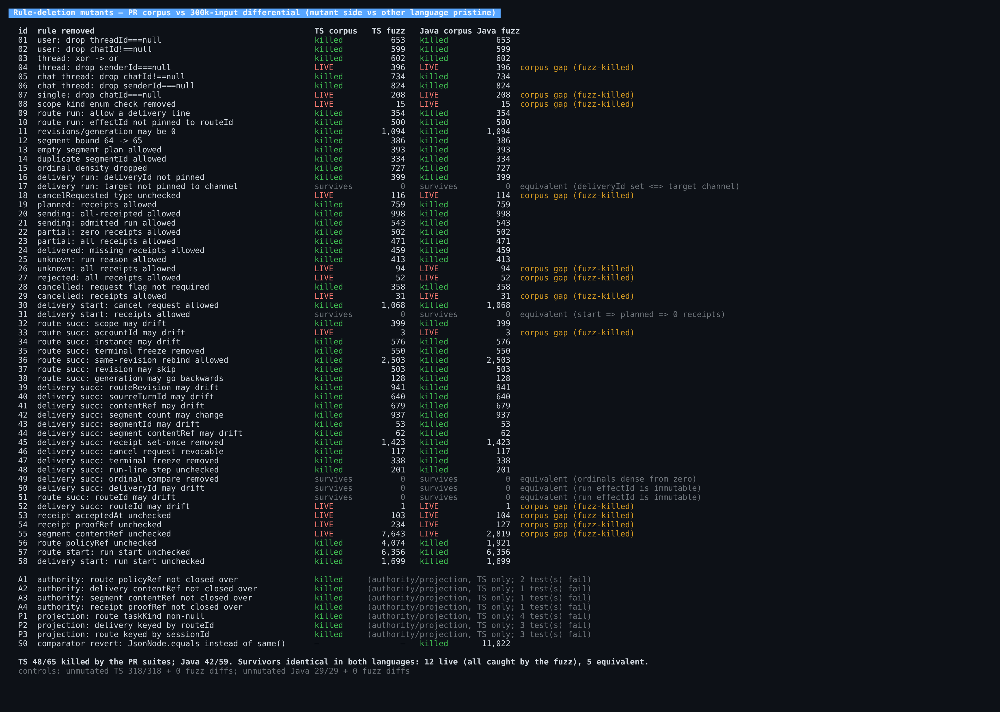
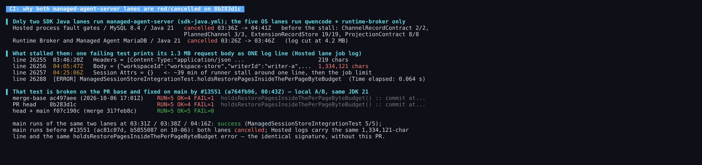

## Maintainer verification: QwenLM/qwen-code#13548 at `8b283d1c` (H5a channel record contract)

**Verdict: one more round before merging.** The two validators agree exactly, and the slice is inert as described. Nothing below has runtime impact today, because both domains stay disabled. Still, this PR freezes the contract and the store support, so these gaps are cheapest to close here:
- the two P2s from the [05:36Z review](https://github.com/QwenLM/qwen-code/pull/13548#pullrequestreview-5438083905), which I reproduced by execution (§0);
- F1, a third gap of the same kind.

After that, update the branch with `main` and I'd merge.

- **R1-1 and R1-2 (05:36Z review), both reproduced.**
  - R1-1: the Java store indexes channel records with none of their referenced resources stored.
  - R1-2: the real TS authority commits a sparse plan, then cannot reopen the Session it wrote.
- **F1 (contract gap, Suggestion).** "An `unknown` delivery never returns to `sending`" is enforced only for the direct step. The shipped corpus itself accepts `unknown → partial` without a new receipt, followed by `partial → sending`. Both the real TS Session authority and the real Java Session store commit that chain (§3).
- **F2 (corpus strength, non-blocking).** Twelve rules are enforced identically by both validators but pinned by no fixture. Two fixtures are refused by a different rule than the one they name (§4).
- **CI.** Both lanes that run `managed-agent-server` are cancelled on this head. The cause is the stale base, not this diff. A test that is broken on the base, and fixed on `main` by #13551, prints a 1.3 MB log line that stalls the runner until the job limit. The head merged with `main` is green locally: 1248 module tests, 0 failures (§5).

### 0. The 05:36Z review, reproduced

- **[R1-2](https://github.com/QwenLM/qwen-code/pull/13548#discussion_r4203448106), sparse segments.** I passed a two-slot plan with a hole at index 1 through the real TS Session authority (enablement mocked as in the PR suite).
  - The plan is accepted and committed as revision 1, and the journal holds `[seg-1, null]`.
  - Reopening that journal fails with `ManagedSessionRecordError: Channel record must have exactly the keys segmentId, ordinal, contentRef, receipt.`
  - So this is worse than a failed round trip: the authority commits a record its own reader refuses, and the Session cannot be reopened.
  - My byte-level differential (§2) cannot express holes, because JSON has none. That is why only an in-process probe sees this.
- **[R1-1](https://github.com/QwenLM/qwen-code/pull/13548#discussion_r4203448098), resource closure.** I committed through the real Java Session store (Spring + H2) with none of the referenced resources sent:
  - a route whose `policyRef` resource is absent;
  - a delivery whose `contentRef` and both segment `contentRef`s are absent.

  Both are accepted and indexed, with 0/1 and 0/3 of the referenced resources stored. The control, a `hook_registration` with the same omission, is refused with `409 managed_session_resource_missing`.

Everything below was executed. **Environment:** Linux x86_64 (16 cores), JDK 21.0.10, Maven 3.9.9, Node 22.22.2. **Trees:** merge-base `ac497aee`, head `8b283d1c`, and head merged with `main` `f07c190c` (merge `317feb8c`, clean, no conflicts).

### 1. Gates

- **PR suites on head.** The PR's TS suites pass 318/318. Its Java gate classes pass 48/48 on JDK 21.
  - The test plan also names `ManagedMonitorRecordContractTest`, but no class by that name exists anywhere in the tree. The other eight classes ran.
- **Full `src/managed-runtime`.** It passes on all three trees: base 2172/2172, head 2320/2320, merged 2426/2426. The `hook-scale` timeout the description mentions did not reproduce here.
- **Merged tree.** The nine Java gate classes pass 53/53, including `ManagedSessionStoreIntegrationTest` 5/5. The full `managed-agent-server` module ran 1248 tests: 0 failures, 0 errors, 2 skipped.

### 2. TS vs Java differential: 4.6M inputs, 0 divergences

**Inputs.** Three generators, each feeding both sides:
- the fixture seeds;
- a semantic sampler over line state × run state × reason × receipts × cancel flag;
- random structural noise.

On top of that, numbers are re-spelled (`1.0`, `1e0`, `-0.0`, `1E+0`), keys shuffled and strings `\u`-escaped.

**Method.** Each side parses the **same raw bytes** with its production parser: `JSON.parse` in TS, and Jackson configured exactly as `ManagedExtensionRecordStore` configures it. Each side then runs its registered body: parse, `isStart` and `isSuccessor`.

**Results.**
- 4,601,644 inputs produced 0 verdict divergences and 0 non-contract exceptions on either side.
- All 11 reachable (delivery line, run state) combinations and all 18 channel line steps (7 stays + 11 transitions) were accepted at least once. So the agreement is not just agreement on refusals.
- The harness does detect real divergence. Reverting the Java comparator to `JsonNode.equals` (the review fix the description mentions) produces 11,022 divergences (mutant S0 in §4).

### 3. F1: `unknown` returns to `sending` in two steps, with no new proof

Decision 5 forbids automatic resend after `unknown`. The record-body section says *"an `unknown` delivery never returns to `sending` (a resend is a new `deliveryId`, decision 5) … late receipts that resolve an `unknown` stay commitable"*. The validators refuse only the **direct** step.

1. **The corpus composes the bypass, byte for byte.**
   - `delivery-unknown-proves-partial` (valid) has identical receipts before and after, so it proves nothing.
   - Its `after` is byte-identical to the `before` of `delivery-partial-resumes` (valid).
   - That fixture's `after` is byte-identical to the `after` of `delivery-unknown-never-resends`, which is pinned **invalid**.
2. **Real TS Session authority.** With domain enablement mocked exactly as the PR's authority suite does, I committed `planned → sending → seg-1 proven → unknown → partial (no new receipt) → sending → delivered` (with a second receipt for seg-2).
   - All seven revisions commit.
   - Reopen rebuilds revision 7 as `delivered`.
   - The direct `unknown → sending` is refused, with nothing committed.
3. **Real Java Session store.** I ran the same probe code against base and head (Spring context on H2, through `ManagedSessionStore.commit`).
   - **Head:** the store now enforces the bodies, which is the intended "store ahead of writer" change. The direct step and a malformed `delivered` body both get `409 managed_session_extension_record_rejected`. On base, both were accepted unvalidated.
   - **Still accepted on head:** the two-step chain, indexed as `channel_delivery@rev7`, `delivered`.

There is no runtime impact today, because no producer exists yet. But H5c's dispatcher is what will rely on this contract to forbid the duplicate. There are two consistent resolutions, and the choice is yours as the author:

- **(a) Require proof to leave `unknown` for `partial`.** I tested a candidate (not pushed; fig. 4, [`candidate-fix.patch`](harness/candidate-fix.patch)).
  - **Rule:** in both validators, `unknown → partial` must settle a segment that `unknown` did not.
  - **Corpus:** `delivery-unknown-proves-partial` gets a third segment and a real new receipt. The old shape becomes the refusal `delivery-unknown-partial-without-proof`.
  - **Results:**
    - TS passes 319/319 and Java 29/29.
    - Fixed TS vs fixed Java: 0 divergences over 300k inputs.
    - Exactly 73 inputs change verdict against head, all of them `unknown → partial` with an unchanged receipt count.
  - **Limit:** this assumes segments are dispatched in order. A receipt for a later segment would still let an earlier unknown one be re-sent.
- **(b) Allow resume after a provider query proves "not sent".** If that should be allowed, the record needs a field to carry that proof, and the doc sentence should be narrowed. Today nothing in the body can tell a proven resume from an automatic one.

### 4. F2: independent mutation sweep, 124 mutants

**The set:**
- 58 rule-deletion mutants, mirrored by id in both languages;
- 4 authority-closure mutants;
- 3 projection mutants;
- the Java comparator revert.

Each mutant ran against the PR's own suites. It also ran through 300k differential inputs against the *other* language's pristine side.

**Kill rates.** The PR suites kill TS 48/65 and Java 42/59, and all 7 authority and projection mutants. The survivors are **identical in both languages**: 12 live mutants (every one caught by the fuzz) and 5 equivalent.

**The 5 equivalent mutants:**
- the target pin (deliveryId is set exactly when the target is channel);
- start receipts (planned pins zero);
- the ordinal compare (ordinals are dense from zero);
- deliveryId drift and routeId drift (`effectId` is set-once).

**Rules no fixture pins.** Each needs a fixture:
- a `thread` scope carrying a `senderId`;
- a `single` scope carrying a `chatId`;
- an unknown scope kind with all-null carriers;
- a non-boolean `cancelRequested`;
- `unknown` with every segment receipted;
- `rejected` with every segment receipted;
- route `accountId` drift;
- delivery `routeId` drift;
- a malformed `proofRef`;
- a malformed segment `contentRef`.

**Two fixtures are refused by a different rule than the one they name:**
- `delivery-cancelled-with-receipt` keeps the template's `cancelRequested: false`. The cancel-flag clause refuses it, so the zero-receipt rule stays unpinned and mutant 29 survives. This corrects the triage review's note that this fixture pins that refusal.
- `delivery-receipt-bad-time` sits on the `planned` template. "Planned has no receipts" refuses it before `acceptedAt` is checked, so mutant 53 survives.

The fix is to set `cancelRequested: true` and move the receipt-shape fixtures onto a `sending` run.

These counts are not comparable with the 22 + 17 in the description. That set was hand-picked; this one deletes every rule clause separately.

### 5. CI on this head

- **Which lanes run the Java mirror.** In `sdk-java.yml`, only `Runtime Broker and Managed Agent MariaDB` and `Hosted process fault gates / MySQL 8.4` run `managed-agent-server`. The five OS lanes run `qwencode` and `runtime-broker` only. So the green OS lanes do not cover the Java mirror, contrary to the triage CI note.
  - The Hosted lane did run these before it stalled: `ManagedChannelRecordContractTest` 2/2, `PlannedChannelContractTest` 3/3, `ManagedExtensionRecordStoreTest` 19/19 and `ManagedExtensionProjectionContractTest` 8/8.
- **What failed.** The Hosted lane's one error is `holdsRestorePagesInsideThePerPageByteBudget`. That test is broken on the PR base `ac497aee` (2026-10-06 17:01Z) and was fixed on `main` by #13551 at 00:43Z.
  - The MariaDB lane's log is cut at 4.2 MB, before that test's output. Its 20-minute cancellation matches what #13551's message describes for that lane on `main`.
- **Why the lanes cancel instead of failing.**
  - The test's MockMvc failure dump is a single 1,334,121-character log line.
  - The Hosted log timestamps around it run 03:46:20 → 04:05:47 → 04:25:06, and then the job limit hits.
  - `main` runs from before #13551 (`ac81c07d`, `b5855087`) show the same line, error and cancellation.
- **Consequence.** The "runner slowdown" attribution earlier in this thread doesn't fit these two lanes: they fail deterministically on this base. Updating the branch with `main` should turn both green, as the merged tree does locally.

### Not verified

- Real MySQL/MariaDB. The store probes ran on H2 in MySQL mode; the PR has no SQL or Flyway change.
- macOS and Windows. TS lanes there are path-filtered.
- Any H5b/H5c runtime, since none exists yet.

Evidence (screenshots, harnesses, raw data, mutant list, candidate patch): `harness/` and `data/` in this directory
