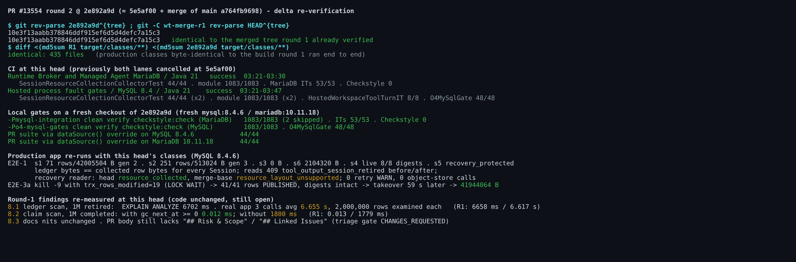

## Maintainer verification, round 2 (delta only): #13554 at `2e892a9d`

**Verdict: unchanged from [round 1](https://github.com/QwenLM/qwen-code/pull/13554#issuecomment-6029915960). No correctness or data-loss defect, and the merge blocker from round 1 is now cleared: both CI lanes that run this module are green at this head.** I'd merge once the PR template sections are filled in (see the last bullet). The round-1 performance follow-up (8.1) and test gap (8.2) are still open and still non-blocking.

**What changed:** `2e892a9d` is `5e5af00` plus a merge of `main` `a764fb9698` (#13551), and nothing else.
- Its tree (`10e3f13a`) is **identical** to the merged tree I verified locally in round 1.
- The production classes built from this head are **byte-identical** to the ones round 1 ran end to end (435 files, md5).

So every round-1 result carries over. I still re-ran the gates and the key scenarios on this exact head.

**CI at this head.** In round 1 both lanes were cancelled.
- `Runtime Broker and Managed Agent MariaDB / Java 21` **succeeded**: `SessionResourceCollectionCollectorTest` 44/44, module 1083/1083, MariaDB ITs 53/53, Checkstyle 0.
- `Hosted process fault gates / MySQL 8.4 / Java 21` **succeeded**: the new suite 44/44 (×2), module 1083/1083 (×2), `HostedWorkspaceToolTurnIT` 8/8, `O4MySqlGate` 48/48.

**Local gates on a fresh checkout of `2e892a9d`**, against fresh `mysql:8.4.6` / `mariadb:10.11.18` containers:

| Gate | Result |
|---|---|
| CI MariaDB-lane command | 1083/1083 (2 skipped), ITs 53/53, Checkstyle 0 |
| `-Po4-mysql-gates` on MySQL 8.4.6 | 48/48 |
| The PR suite through the `dataSource()` override, MySQL 8.4.6 | 44/44 |
| The PR suite through the `dataSource()` override, MariaDB 10.11.18 | 44/44 |

**Production app re-runs with this head's classes:**
- **E2E-1, single instance:** identical to round 1. Every ledger is byte-exact, and the page generations are 2 (s1), 3 (s2), 1 (s6). Reads return `409 tool_output_session_retired` before and after collection. The recovery reader returns `resource_collected` on this head and `resource_layout_unsupported` on the merge-base. There were 0 retry WARNs and 0 object-store calls.
- **E2E-3a, crash inside a page:** `kill -9` hit while the page `UPDATE` had modified 19 rows and was in LOCK WAIT. All 41 rows were still `PUBLISHED` with intact digests. Another instance took over 59 s later and finished at exactly 41,944,064 bytes.

**Round-1 findings re-measured at this head.** The code is unchanged, so they are still open.
- **8.1 (ledger scan at 1M retired Sessions):** EXPLAIN ANALYZE 6,702 ms. In the real app, 3 calls averaged 6.655 s and examined 2,000,000 rows each. Round 1 measured 6,658 ms / 6.617 s.
- **8.2 (claim scan at 1M completed ledgers):** 0.012 ms with `gc_next_at >= 0` and 1,800 ms without it. Round 1 measured 0.013 / 1,779 ms.
- **8.3:** the docs nits are unchanged. The PR body still lacks `## Risk & Scope` and `## Linked Issues`, so the triage template gate's `CHANGES_REQUESTED` stands. Its sandboxed verification, re-triggered at 03:22, was still running when I posted this, so this report doesn't cover it.

Not re-run because the binaries are identical: E2E-2 (three instances), E2E-3b, E2E-4 (upgrade) and the mutation sweep. Their round-1 results apply as-is.

Evidence for this round (screenshot, summaries, harness, md5 list): this directory. Round 1: `../pr-13554/`.
