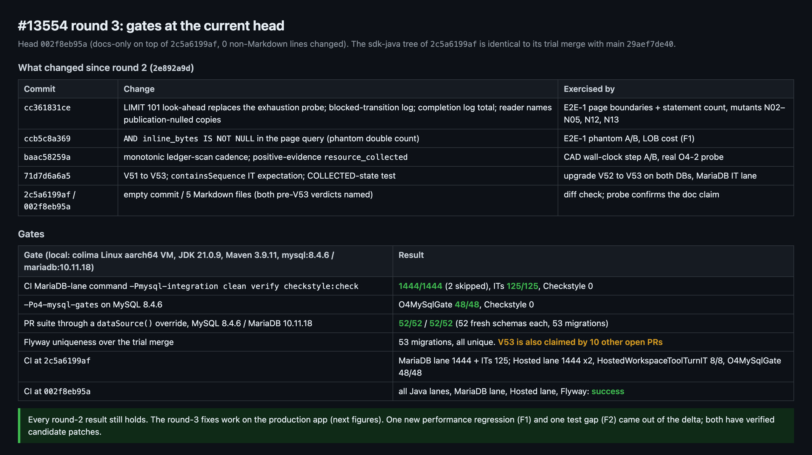
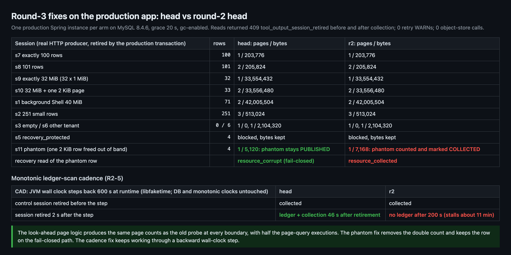
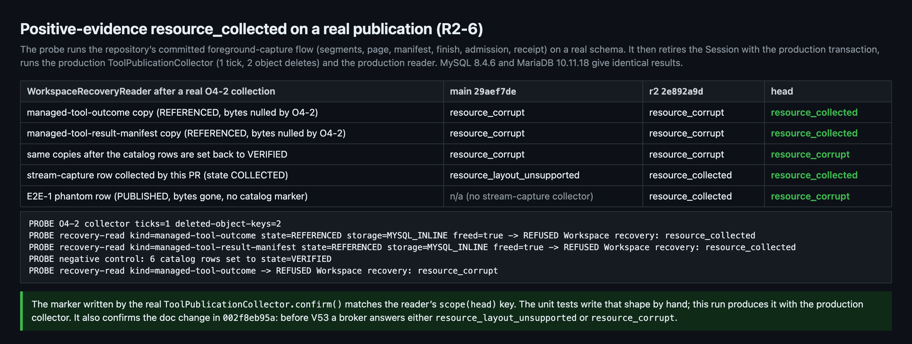
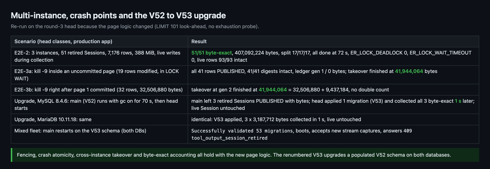
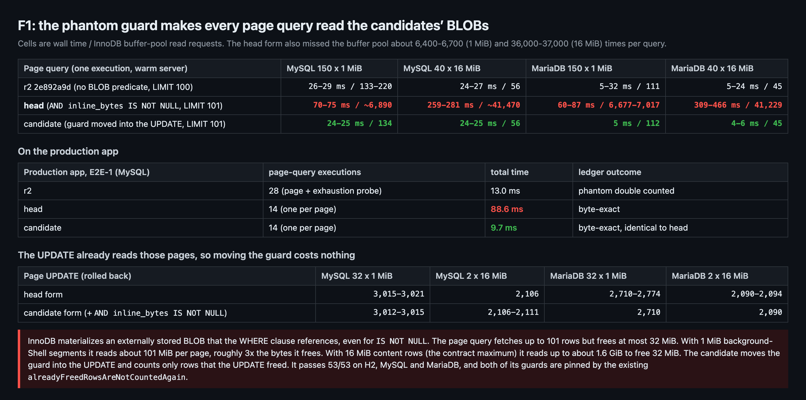
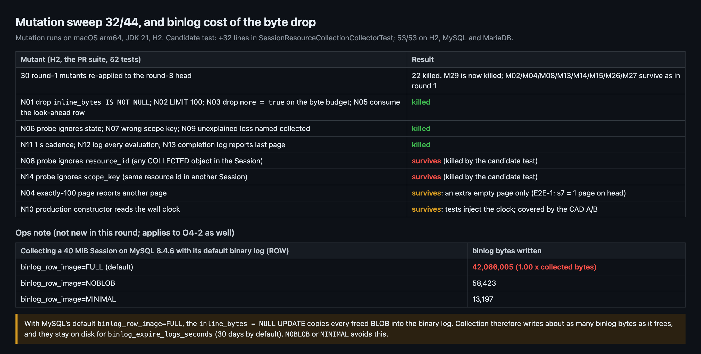

## Maintainer verification, round 3 (delta): #13554 at `002f8eb95a`

**Verdict: no correctness or data-loss defect. The fixes made since round 2 work on the production app. One of them, though, adds a performance regression, so I'd apply a small candidate patch before merging (F1).** Every result from [round 1](https://github.com/QwenLM/qwen-code/pull/13554#issuecomment-6029915960) and [round 2](https://github.com/QwenLM/qwen-code/pull/13554#issuecomment-6030524956) still holds.
- **F1:** the phantom guard added in `ccb5c8a369` makes every page query read the full BLOB of each candidate row. The candidate patch is about 20 lines and is verified on H2, MySQL and MariaDB.
- **F2:** a test gap in the new `resource_collected` probe. I attach a candidate test.
- **Neither blocks merging.** The feature is off by default (`gc-enabled=false`).

**Scope.** Since round 2 (`2e892a9d`), the branch gained:
- four code commits: `cc361831ce`, `ccb5c8a369`, `baac58259a`, `71d7d6a6a5`;
- an empty commit (`2c5a6199af`);
- a docs-only commit (`002f8eb95a`, 5 Markdown files, 0 non-Markdown lines);
- three merges of `main`.

All runs used the classes of `2c5a6199af`. Its `packages/sdk-java` tree is identical to its trial merge with current `main` `29aef7de40`.

**Environment.**
- A dedicated colima Linux aarch64 VM with JDK 21.0.9 and Maven 3.9.11.
- `mysql:8.4.6` and `mariadb:10.11.18`, the CI images, on tmpfs. Binlog was off except in the binlog experiment.
- Every container sat on an internal Docker network with no published ports.
- "Production app" means `ManagedAgentServerApplication` booted from the head's classes with `session-store`, `tool-publication` and `gc-enabled` on. The OSS bean was replaced by a stub that refuses every call, and it saw 0 calls.
- Comparison arms:
  - **r2** = `2e892a9d`, the round-2 head;
  - **main** = `29aef7de40`;
  - **candidate** = head plus the two patches below.

### 1. Gates



| Gate | Result |
|---|---|
| CI MariaDB-lane command (`-Pmysql-integration clean verify checkstyle:check`), MariaDB 10.11.18 | **1444/1444** (2 skipped), ITs **125/125**, Checkstyle 0 |
| `-Po4-mysql-gates` on MySQL 8.4.6 | `O4MySqlGate` **48/48** |
| The PR suite (52 = 34 own + 18 inherited) through a `dataSource()` override | MySQL **52/52**, MariaDB **52/52** |
| CI at `002f8eb95a` | every Java lane, the MariaDB lane, the Hosted lane and Flyway are green |

`V53` is unique on the trial merge. Ten other open PRs also claim `V53`, so whichever lands later renumbers.

### 2. Round-3 fixes on the production app, head vs r2



- **Look-ahead paging (`LIMIT 101`, no exhaustion probe).**
  - The page counts are identical to r2 at every boundary:
    - exactly 100 rows: 1 page;
    - 101 rows: 2 pages;
    - exactly 32 MiB: 1 page;
    - 32 MiB plus one row: 2 pages;
    - 71 rows / 40 MiB: 2 pages;
    - 251 rows: 3 pages.
  - Every ledger is byte-exact.
  - The page query runs 14 times instead of 28.
- **Phantom row** (bytes freed out of band, state left `PUBLISHED`):
  - r2 records 7,168 bytes and marks the row `COLLECTED`. A recovery read then answers `resource_collected`.
  - Head records 5,120 bytes, leaves the row `PUBLISHED`, and the recovery read stays fail-closed with `resource_corrupt`.
- **Monotonic cadence.** I stepped the JVM wall clock back 600 s at runtime with libfaketime; the DB clock and the monotonic clock were untouched.
  - Head created the ledger for a Session retired after the step 46 s later and collected it.
  - r2 created no ledger within 200 s. Its gate stays closed for about 11 minutes.
- Reads of retired Sessions return `409 tool_output_session_retired` before and after collection.

### 3. `resource_collected` after a real O4-2 collection



The unit tests write the post-collection shape by hand, so I produced it with the production code on a real schema instead:

1. Run the repository's own committed foreground-capture flow on a real database (`ToolPublicationStoreTest#publishesImmutableSegmentAndResourceUnderOriginalAuthorization("intact")`).
2. Retire the Session with the production transaction.
3. Run the production `ToolPublicationCollector`: 1 tick, 2 object deletes.
4. Read every inline copy with the production `WorkspaceRecoveryReader`.

Results:
- The O4-2-nulled `managed-tool-outcome` and `managed-tool-result-manifest` copies read **`resource_collected` on head** and `resource_corrupt` on main and r2.
- Setting the catalog rows back to `VERIFIED` turns head's answer back to `resource_corrupt`.
- MySQL and MariaDB give identical results.
- So the marker that `confirm()` writes matches the reader's `scope(head)` key. This also confirms the doc change in `002f8eb95a`: a pre-V53 broker answers either `resource_layout_unsupported` or `resource_corrupt`.

### 4. Multi-instance, crash points, V52 → V53 upgrade (re-run, since the page logic changed)



- **Three instances, 51 retired Sessions, 388 MiB:**
  - 51/51 ledgers byte-exact, 407,092,224 bytes in total;
  - the work split 17/17/17;
  - `ER_LOCK_DEADLOCK` 0 and `ER_LOCK_WAIT_TIMEOUT` 0;
  - live writes made during collection stayed intact (93/93 rows).
- **`kill -9` inside an uncommitted page** (19 rows modified, in LOCK WAIT): all 41 rows stayed `PUBLISHED` with 41/41 digests intact. The takeover finished at exactly 41,944,064 bytes.
- **`kill -9` right after page 1 committed:** the takeover finished at 32,506,880 + 9,437,184 bytes, with no double count.
- **Upgrade on MySQL 8.4.6 and on MariaDB 10.11.18:**
  - Main (V52) ran with gc on for 70 s and left the retired captures `PUBLISHED` with their bytes.
  - Head applied the single V53 migration and collected all three Sessions byte-exact about 1 s later.
  - Main then restarted on the V53 schema. It logged `Successfully validated 53 migrations`, accepted new captures, and answered `tool_output_session_retired`.

### 5. Findings

**F1 [Performance, introduced since round 2]: `AND inline_bytes IS NOT NULL` makes InnoDB read every candidate's BLOB.**



The mechanism: a BLOB column referenced in `WHERE` is materialized even for a `NULL` test. The page query fetches up to 101 rows, but each page frees at most 32 MiB.
- With the 1 MiB background-Shell segments (`SEGMENT_BYTES` in `local-shell-stream-capture.ts`), each page reads about 101 MiB, roughly 3× the bytes it frees.
- With 16 MiB content rows, the contract maximum, a page reads up to about 1.6 GiB to free 32 MiB.

All of this runs on the shared single-thread `managedToolOutputScheduler`.

Measured costs (wall time / buffer-pool read requests per execution):

| Page query | 150 × 1 MiB rows | 40 × 16 MiB rows |
|---|---|---|
| MySQL, r2 | 26–29 ms / 133–220 | 24–27 ms / 56 |
| MySQL, head | 70–75 ms / ~6,890 | 259–281 ms / ~41,470 |
| MariaDB, r2 | 5–32 ms / 111 | 5–24 ms / 45 |
| MariaDB, head | 60–87 ms / 6,677–7,017 | 309–466 ms / 41,229 |

- `EXPLAIN ANALYZE` on MySQL for the 16 MiB case: 274 ms on head vs 0.086 ms on r2.
- On the production app, head's 14 page queries took 88.6 ms in total; r2's 28 took 13.0 ms.

**Candidate patch** ([`candidate-lob-only.diff`](candidate/candidate-lob-only.diff), +14/−8 in `SessionResourceCollectionCollector`):
- Drop the BLOB predicate from the page query.
- Put `AND inline_bytes IS NOT NULL` on the page `UPDATE` instead.
- Add only the `byte_length` of rows that the `UPDATE` actually moved to `COLLECTED`.

What it does:
- The phantom row stays `PUBLISHED` and uncounted, exactly as on head.
- The rolled-back page `UPDATE` touches the same number of pages in both forms on both databases, so the move is free.
- Page queries cost about 25 ms / 56–137 read requests on MySQL and 4–6 ms / 45–112 on MariaDB.
- On the production app, all E2E-1 ledgers are identical to head's, and the 14 page queries take 9.7 ms in total.
- With the F2 test added: 53/53 on H2, MySQL and MariaDB, and Checkstyle is clean.
- Both of its guards are pinned by the existing `alreadyFreedRowsAreNotCountedAgain`: removing either one fails that test.

<details><summary>Candidate patch (collector)</summary>

```diff
@@ ELIGIBLE
             + " AND object_key IS NULL AND object_version_id IS NULL AND encryption_key_id IS NULL"
-            // The byte_length column is metadata that outlives the bytes: a row another writer
-            // already freed has nothing left to collect and must not be counted a second time.
-            + " AND inline_bytes IS NOT NULL"
+            // No predicate on inline_bytes here: referencing a BLOB column makes InnoDB materialize
+            // every candidate's bytes (up to PAGE_ROWS + 1 rows) just to test them for NULL.
             + " AND resource_id > ? AND NOT EXISTS (SELECT 1 FROM qwen_managed_session_resource_ref r"
@@ page()
+        long freed = 0;
         if (!ids.isEmpty()) {
             var args = new java.util.ArrayList<Object>(ids.size() + 1);
             args.add(claim.scope());
             args.addAll(ids);
+            String in = String.join(", ", java.util.Collections.nCopies(ids.size(), "?"));
+            // byte_length is metadata that outlives the bytes: a row another writer already freed
+            // stays PUBLISHED and uncounted; only rows this statement frees are accounted.
             jdbc.update("UPDATE qwen_managed_session_resource SET state = 'COLLECTED', inline_bytes = NULL"
-                    + " WHERE session_scope_key = ? AND resource_id IN ("
-                    + String.join(", ", java.util.Collections.nCopies(ids.size(), "?")) + ")", args.toArray());
+                    + " WHERE session_scope_key = ? AND inline_bytes IS NOT NULL AND resource_id IN (" + in + ")",
+                    args.toArray());
+            freed = jdbc.queryForObject("SELECT COALESCE(SUM(byte_length), 0) FROM qwen_managed_session_resource"
+                    + " WHERE session_scope_key = ? AND state = 'COLLECTED' AND resource_id IN (" + in + ")",
+                    Long.class, args.toArray());
         }
```

The two ledger `UPDATE`s and the completion log then use `freed` in place of `bytes`. `bytes` still drives the 32 MiB page budget.

</details>

**F2 [Test gap, low]: the `scope_key` and `resource_id` halves of the new positive-evidence probe are not pinned.**



I re-ran the 30 round-1 mutants against this head and added 14 that target the round-3 changes. **32 of the 44 are killed.**
- N01–N03, N05–N07, N09 and N11–N13 cover the look-ahead, the phantom guard, the cadence and the logs, and all of them are killed. M29 is now killed too.
- Two mutants survive all 52 tests:
  - **N08** drops `resource_id` from the probe: any `COLLECTED` object in the Session then counts as evidence.
  - **N14** drops `scope_key`: the same resource id in another Session then counts.

  Either one would let an unexplained byte loss be named `resource_collected`. The shipped code is correct; nothing pins it.
- The candidate test [`recoveryReaderIgnoresCollectedMarkersOfOtherResourcesAndOtherSessions`](candidate/candidate-test-only.diff) (+32 lines) kills both mutants and passes on head.
- The other survivors:
  - N04 (an exactly-100 page reports another page) only costs one extra empty page.
  - N10 (the production constructor reads the wall clock) cannot be seen by tests that inject the clock; §2's A/B covers it.
  - The round-1 group behaves as analysed in round 1.

**Ops note (not new in this round, and it applies to O4-2 too).** With MySQL's default binary log (`ROW`, `binlog_row_image=FULL`), the `inline_bytes = NULL` update copies each freed BLOB into the binlog. Collecting a 40 MiB Session wrote:

| `binlog_row_image` | Binlog bytes written |
|---|---|
| `FULL` | 42,066,005 (1.00× the collected bytes) |
| `NOBLOB` | 58,423 |
| `MINIMAL` | 13,197 |

Those bytes stay on disk for `binlog_expire_logs_seconds`, which is 30 days by default. The ops doc already explains that freed bytes are not returned to the filesystem; one sentence on the binlog would complete that picture.

**Docs and PR body.**
- The round-1 doc nits are fixed:
  - the README and the ops paragraph now name `tool-publication.enabled`;
  - the ops doc has the InnoDB free-space sentence.
- **The PR description is stale:**
  - It still says `V48` five times, in both languages. The migration is now `V53`.
  - It still quotes `Tests run: 1083` and `44` tests. Current counts are 1444 module tests and 52 in the suite.

  If the squash commit takes its message from the description, it will name the wrong migration.

**Merge mechanics.** `reviewDecision` is still `CHANGES_REQUESTED`. That decision comes from the bot's review at `cc9680d781` (R5-1, the V51 collision). Round 6 at `2c5a6199af` closed R5-1 with a COMMENTED review. Only a human approval or a dismissal clears it. A `review-pr` run on `002f8eb95a` was still in progress when I posted, so this report does not cover it.

**Round-1/2 items:**
- 8.1, the history-wide ledger scan: the code path is unchanged apart from the clock source, and AutoFix declined it as out of scope. Still open, still non-blocking.
- 8.2, `gc_next_at >= 0`: now documented in a code comment. M26 still survives.
- 8.3: fixed, except the PR body.
- 8.4: declined.

### Not verified

- **Real OSS.** I used the refusing stub; the publication probe used an in-memory store.
- **A Hosted background-Shell run through the CLI worker.** E2E drove the worker's HTTP endpoints directly.
- **The publication probe's realism.** It runs in-process on the store classes. Before retirement it resets two fixture artifacts: the test's deliberate final quarantine of one segment, and the matching publication flag.
- **Round 1's 8.1 measurements.** Not re-measured, because that code path is unchanged.
- **Other platforms.** This round ran on Linux aarch64 only; round 1 covered x86_64. macOS and Windows are covered by CI only.

Evidence (figures, harness, raw outputs, mutant list, candidate diffs): [`pr-13554-round3/`](./).

<details>
<summary>中文版（点击展开）</summary>

## 维护者验证第 3 轮（增量）：#13554 @ `002f8eb95a`

**结论：未发现正确性或数据丢失缺陷。第 2 轮之后的修复在生产应用上都成立。但其中一项引入了性能回退，建议合入前先打一个小的候选补丁（F1）。** [第 1 轮](https://github.com/QwenLM/qwen-code/pull/13554#issuecomment-6029915960)和[第 2 轮](https://github.com/QwenLM/qwen-code/pull/13554#issuecomment-6030524956)的结果全部仍然成立。
- **F1：** `ccb5c8a369` 加入的幻影保护会让每次分页查询读出所有候选行的完整 BLOB。候选补丁约 20 行，已在 H2、MySQL、MariaDB 上验证。
- **F2：** 新的 `resource_collected` 探针有一处测试缺口，附了候选测试。
- **两项都不阻塞合入。** 该功能默认关闭（`gc-enabled=false`）。

**范围**：自第 2 轮（`2e892a9d`）以来，分支新增了：
- 4 个代码提交：`cc361831ce`、`ccb5c8a369`、`baac58259a`、`71d7d6a6a5`；
- 1 个空提交（`2c5a6199af`）；
- 1 个纯文档提交（`002f8eb95a`，改 5 个 Markdown 文件，非 Markdown 差异 0 行）；
- 3 次合并 `main`。

全部运行都用 `2c5a6199af` 的 classes。它的 `packages/sdk-java` 树与它和当前 `main` `29aef7de40` 的试合并完全相同。

**环境**
- 专用 colima Linux aarch64 VM，JDK 21.0.9、Maven 3.9.11。
- `mysql:8.4.6`、`mariadb:10.11.18`（与 CI 同镜像），跑在 tmpfs 上；除 binlog 实验外都关闭 binlog。
- 所有容器在内部 Docker 网络上，不发布任何端口。
- "生产应用"指用 head 的 classes 启动 `ManagedAgentServerApplication`，开启 `session-store`、`tool-publication` 和 `gc-enabled`。OSS bean 换成拒绝任何调用的桩，调用次数为 0。
- 对照臂：
  - **r2** = 第 2 轮的 head `2e892a9d`；
  - **main** = `29aef7de40`；
  - **候选** = head 加下文两个补丁。

### 1. 闸门

| 闸门 | 结果 |
|---|---|
| CI MariaDB 车道命令（`-Pmysql-integration clean verify checkstyle:check`），MariaDB 10.11.18 | **1444/1444**（2 跳过），IT **125/125**，Checkstyle 0 |
| MySQL 8.4.6 上的 `-Po4-mysql-gates` | `O4MySqlGate` **48/48** |
| 经 `dataSource()` 覆盖跑 PR 测试套件（52 = 自有 34 + 继承 18） | MySQL **52/52**、MariaDB **52/52** |
| `002f8eb95a` 上的 CI | 所有 Java 车道、MariaDB 车道、Hosted 车道和 Flyway 检查均通过 |

`V53` 在试合并上唯一。另有 10 个打开的 PR 也占用 `V53`，后合入者需要改号。

### 2. 第 3 轮修复在生产应用上的 A/B（head 对 r2）

- **前瞻分页（`LIMIT 101`，去掉排空探针）**
  - 各边界的页数与 r2 完全一致：
    - 正好 100 行：1 页；
    - 101 行：2 页；
    - 正好 32 MiB：1 页；
    - 32 MiB 加 1 行：2 页；
    - 71 行 / 40 MiB：2 页；
    - 251 行：3 页。
  - 每个账本都逐字节一致。
  - 分页查询执行次数从 28 次降到 14 次。
- **幻影行**（字节在带外被释放，状态仍为 `PUBLISHED`）：
  - r2 记 7,168 字节并把该行标为 `COLLECTED`，恢复读取随后答 `resource_collected`。
  - head 记 5,120 字节，该行保持 `PUBLISHED`，恢复读取仍走 fail-closed，答 `resource_corrupt`。
- **单调时钟节奏**：用 libfaketime 在运行时把 JVM 墙钟回拨 600 秒，数据库时钟和单调时钟不变。
  - head 对回拨之后退休的会话，在 46 秒后建好账本并完成回收。
  - r2 在 200 秒内都没有建账本；它的扫描闸门要关约 11 分钟。
- 已退休会话的读取在回收前后都返回 `409 tool_output_session_retired`。

### 3. 真实 O4-2 回收后的 `resource_collected`

单元测试里回收后的数据形态是手写的，所以我改用生产代码在真实库上造出这个形态：

1. 在真实数据库上跑仓库自带的已提交前台捕获流程（`ToolPublicationStoreTest#publishesImmutableSegmentAndResourceUnderOriginalAuthorization("intact")`）。
2. 用生产事务退休会话。
3. 运行生产 `ToolPublicationCollector`：1 个 tick，删除 2 个对象。
4. 用生产 `WorkspaceRecoveryReader` 读每一份 inline 副本。

结果：
- 被 O4-2 置空的 `managed-tool-outcome` 和 `managed-tool-result-manifest` 副本，**head 答 `resource_collected`**，main 和 r2 都答 `resource_corrupt`。
- 把目录行改回 `VERIFIED` 后，head 回到 `resource_corrupt`。
- MySQL 和 MariaDB 结果完全一致。
- 这说明 `confirm()` 写下的标记与读取器的 `scope(head)` 键吻合，也印证了 `002f8eb95a` 的文档改动：V53 之前的 broker 会答 `resource_layout_unsupported` 或 `resource_corrupt`。

### 4. 多实例、崩溃点、V52 → V53 升级（分页逻辑变了，所以重跑）

- **三实例，51 个已退休会话，388 MiB：**
  - 51/51 个账本逐字节一致，共 407,092,224 字节；
  - 三个实例各完成 17 个；
  - `ER_LOCK_DEADLOCK` 为 0，`ER_LOCK_WAIT_TIMEOUT` 为 0；
  - 回收期间的实时写入完好（93/93 行）。
- **未提交页内 `kill -9`**（已改 19 行、处于 LOCK WAIT）：41 行全部保持 `PUBLISHED`，41/41 个摘要完好；接管后恰好收集 41,944,064 字节。
- **第 1 页提交后立即 `kill -9`：** 接管后完成于 32,506,880 + 9,437,184 字节，无重复计数。
- **升级（MySQL 8.4.6 与 MariaDB 10.11.18 各一遍）：**
  - main（V52）开着 gc 跑 70 秒，已退休的捕获仍是带字节的 `PUBLISHED`。
  - head 只应用 V53 这一个迁移，约 1 秒后逐字节回收全部 3 个会话。
  - main 随后在 V53 schema 上重启：日志为 `Successfully validated 53 migrations`，接受新捕获，并答 `tool_output_session_retired`。

### 5. 发现

**F1【性能，第 2 轮之后引入】`AND inline_bytes IS NOT NULL` 让 InnoDB 读出每个候选行的 BLOB。**

机制：`WHERE` 引用的 BLOB 列即使只做 `NULL` 判断也会被完整读出。分页查询最多取 101 行，而每页最多只释放 32 MiB。
- 按后台 Shell 的 1 MiB 分段（`local-shell-stream-capture.ts` 中的 `SEGMENT_BYTES`），每页要读约 101 MiB，约为释放量的 3 倍。
- 按契约上限 16 MiB 的 content 行，每页最多要读约 1.6 GiB 才释放 32 MiB。

这些都跑在共享的单线程 `managedToolOutputScheduler` 上。

实测代价（每次执行的耗时 / 缓冲池读请求）：

| 分页查询 | 150 × 1 MiB 行 | 40 × 16 MiB 行 |
|---|---|---|
| MySQL，r2 | 26–29 ms / 133–220 | 24–27 ms / 56 |
| MySQL，head | 70–75 ms / 约 6,890 | 259–281 ms / 约 41,470 |
| MariaDB，r2 | 5–32 ms / 111 | 5–24 ms / 45 |
| MariaDB，head | 60–87 ms / 6,677–7,017 | 309–466 ms / 41,229 |

- MySQL 上 16 MiB 场景的 `EXPLAIN ANALYZE`：head 274 ms，r2 0.086 ms。
- 生产应用上，head 的 14 次分页查询共耗时 88.6 ms，r2 的 28 次共 13.0 ms。

**候选补丁**（[`candidate-lob-only.diff`](candidate/candidate-lob-only.diff)，`SessionResourceCollectionCollector` +14/−8）：
- 从分页查询中去掉 BLOB 条件。
- 把 `AND inline_bytes IS NOT NULL` 改放到页 `UPDATE` 上。
- 只累加该 `UPDATE` 实际改成 `COLLECTED` 的行的 `byte_length`。

效果：
- 幻影行仍保持 `PUBLISHED` 且不计数，与 head 一致。
- 回滚测量的页 `UPDATE` 在两种写法下、两种数据库上读取的页数相同，所以挪过去没有额外代价。
- 分页查询代价：MySQL 约 25 ms / 56–137 次读请求，MariaDB 4–6 ms / 45–112 次。
- 生产应用上 E2E-1 的所有账本与 head 完全一致，14 次分页查询共 9.7 ms。
- 加上 F2 的测试后，在 H2、MySQL、MariaDB 上都是 53/53，Checkstyle 通过。
- 它的两处守卫都由现有的 `alreadyFreedRowsAreNotCountedAgain` 钉住，删掉任意一处该测试都会失败。

**F2【测试缺口，低】新的正向证据探针中，`scope_key` 和 `resource_id` 两个条件没有测试钉住。**

把第 1 轮的 30 个变异体重新用在本 head 上，再加 14 个针对第 3 轮改动的变异体。**44 个中杀死 32 个。**
- N01–N03、N05–N07、N09、N11–N13 覆盖前瞻分页、幻影保护、节奏和日志，全部被杀；M29 现在也被杀。
- 有两个变异体在全部 52 个测试下存活：
  - **N08** 去掉探针的 `resource_id`：会话里任意一个 `COLLECTED` 对象都会被当作证据。
  - **N14** 去掉 `scope_key`：其他会话里相同的 resource id 也会被当作证据。

  两者都会把一次无法解释的字节丢失说成 `resource_collected`。现有代码是对的，只是没有测试钉住它。
- 候选测试 [`recoveryReaderIgnoresCollectedMarkersOfOtherResourcesAndOtherSessions`](candidate/candidate-test-only.diff)（+32 行）能杀死这两个变异体，在 head 上通过。
- 其余存活者：
  - N04（正好 100 行的页报告还有下一页）只多一个空页。
  - N10（生产构造器读墙钟）在注入时钟的测试里看不出来，由 §2 的 A/B 覆盖。
  - 第 1 轮那一组的情况与第 1 轮分析相同。

**运维提示（本轮之前就存在，O4-2 也一样）**：在 MySQL 默认的二进制日志配置下（`ROW`、`binlog_row_image=FULL`），`inline_bytes = NULL` 的更新会把每个被释放的 BLOB 写进 binlog。回收一个 40 MiB 会话写入的 binlog：

| `binlog_row_image` | 写入的 binlog 字节 |
|---|---|
| `FULL` | 42,066,005（回收量的 1.00 倍） |
| `NOBLOB` | 58,423 |
| `MINIMAL` | 13,197 |

这些字节会在磁盘上保留 `binlog_expire_logs_seconds`，默认 30 天。运维文档已说明释放的字节不会还给文件系统，再补一句 binlog 就完整了。

**文档与 PR 描述**
- 第 1 轮的文档小问题已修复：
  - README 和运维段落都写明了 `tool-publication.enabled`；
  - 运维文档有了 InnoDB 空闲空间那句话。
- **PR 描述已过期：**
  - 两种语言共 5 处仍写 `V48`，实际迁移已是 `V53`。
  - 仍引用 `Tests run: 1083` 和 `44` 个测试；现在是模块 1444 个、套件 52 个。

  如果 squash 提交信息取自描述，提交信息里的迁移号就是错的。

**合入流程**：`reviewDecision` 仍是 `CHANGES_REQUESTED`，来自 bot 在 `cc9680d781` 上的评审（R5-1，V51 撞号）。第 6 轮在 `2c5a6199af` 上用一条 COMMENTED 评审关闭了 R5-1。只有人工批准或 dismiss 才能清除这个状态。发帖时 `002f8eb95a` 上的 `review-pr` 仍在运行，本报告未覆盖它。

**第 1/2 轮事项**
- 8.1（全历史账本扫描）：除时钟来源外代码路径未变，AutoFix 以超出范围为由未处理；仍未解决，仍不阻塞。
- 8.2（`gc_next_at >= 0`）：现已在代码注释中说明；M26 仍存活。
- 8.3：已修复，PR 描述除外。
- 8.4：未采纳。

### 未验证

- **真实 OSS。** 用的是拒绝调用的桩，发布探针用内存存储。
- **经 CLI worker 的 Hosted 后台 Shell 运行。** E2E 直接驱动 worker 的 HTTP 接口。
- **发布探针的真实性。** 它在进程内直接调用 store 类。退休前重置了两处夹具产物：测试最后故意隔离的一个分段，以及对应的 publication 标志。
- **第 1 轮 8.1 的测量。** 没有重测，因为那条代码路径没变。
- **其他平台。** 本轮只在 Linux aarch64 上跑；第 1 轮覆盖过 x86_64。macOS 和 Windows 只有 CI 覆盖。

证据（图、harness、原始输出、变异体清单、候选 diff）：[`pr-13554-round3/`](./)。

</details>
