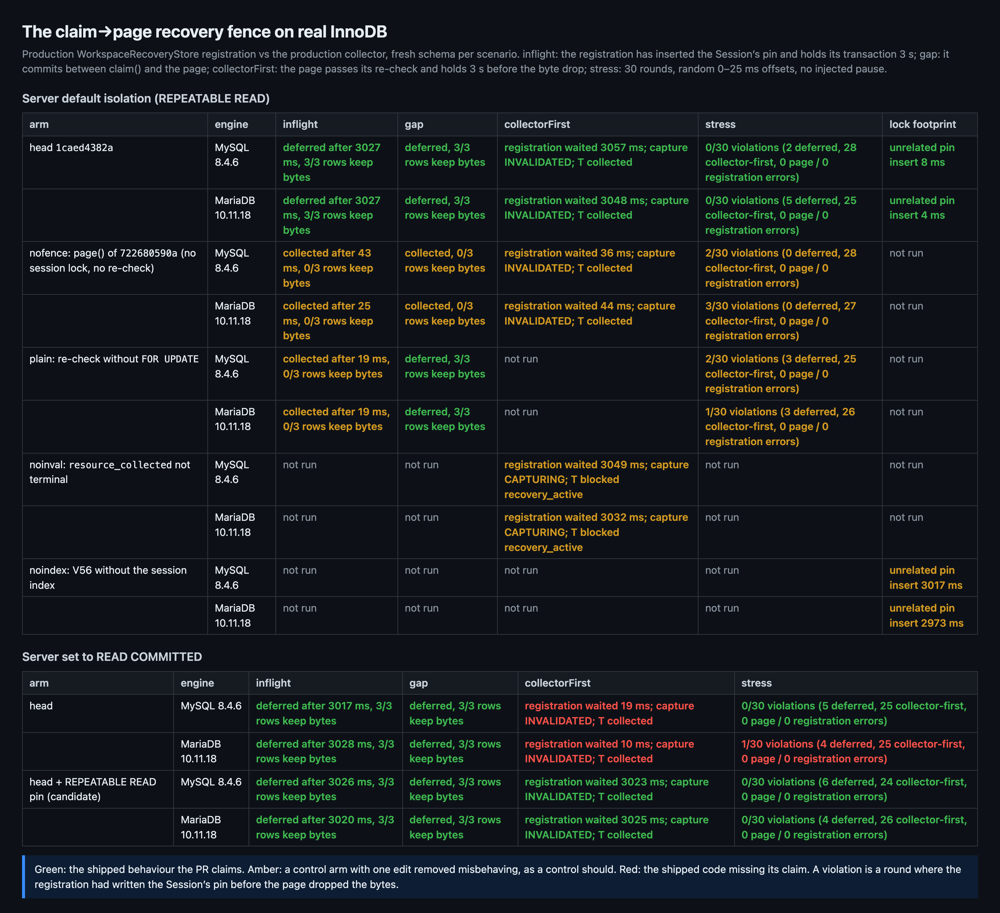
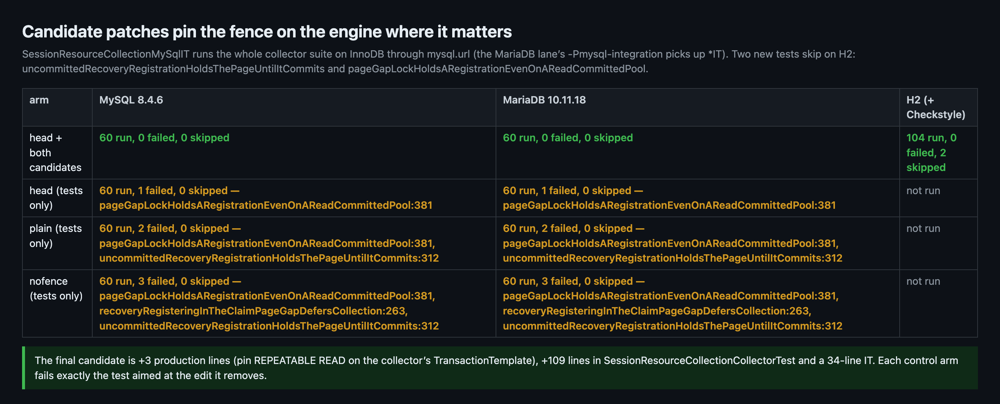
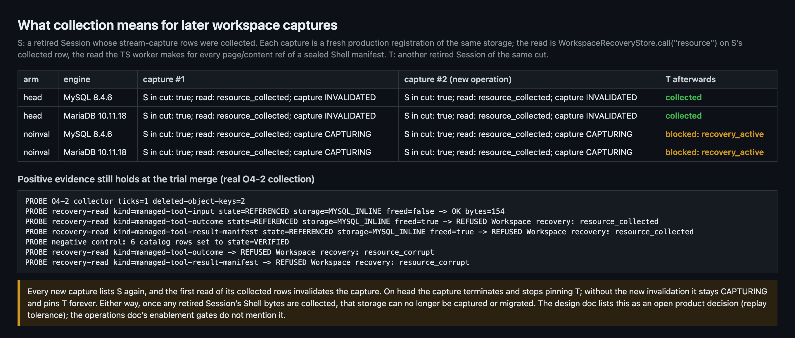
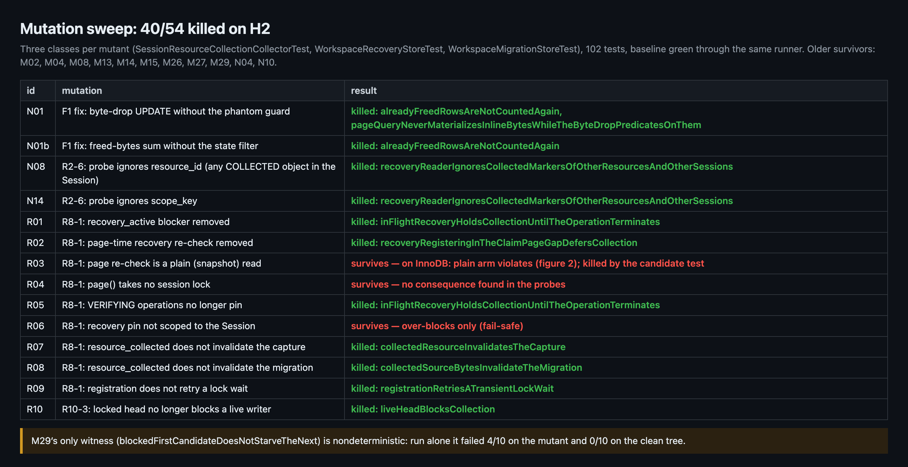
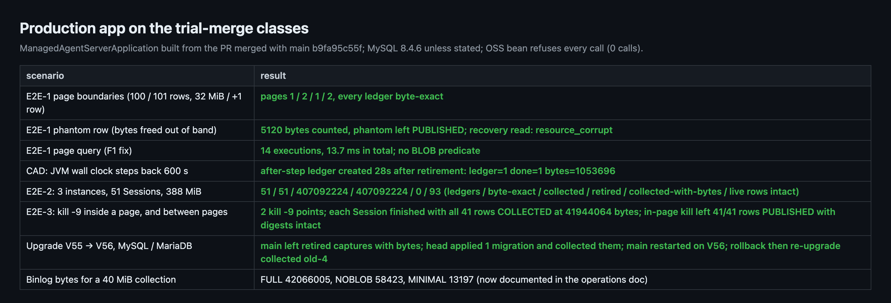
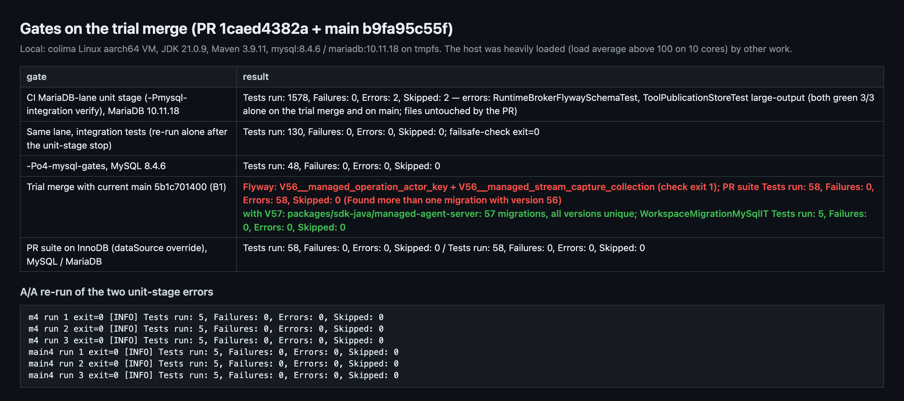

## Maintainer verification, round 4: #13554 at `1caed4382a`

**Verdict: blocked — merge-time only.** The code under test has no correctness or data-loss defect, but the PR cannot merge as it stands.

**B1:** main merged `V56__managed_operation_actor_key.sql` (#13545, 16:18Z), while the PR's ledger migration is also `V56`. On the trial merge with current main `5b1c701400`:
- the Flyway uniqueness script exits 1;
- every one of the PR suite's 58 tests errors in setup with `Found more than one migration with version 56`, so the module cannot migrate or boot.

Renaming to `V57` and adding `"57"` to `WorkspaceMigrationMySqlIT`'s expected list clears it (measured below). Six other open PRs already claim V57, so check the number again at landing.

The round's central fix is the claim→page recovery fence. It holds on real MySQL 8.4.6 and MariaDB 10.11.18 under each server's default REPEATABLE READ: 0/30 violations on both engines in the stress run, against 2/30 and 3/30 for the pre-fix page.

Before merging I'd land a small candidate: 3 production lines, +109 test lines and a 34-line IT. It closes two gaps:
- **F3:** nothing in the test suite or CI pins the `FOR UPDATE` that makes the fence work.
- **F4:** under READ COMMITTED, one interleaving is only contained, not fenced.

One product decision belongs before anyone enables `gc-enabled`:
- **F5:** once a retired Session's Shell bytes are collected, every later workspace capture or migration of that storage is invalidated.

Results ledger: 56 probe results from 7 arms on 2 engines and 2 isolation levels, plus 54 mutants. Every number below comes from `results.json` in the evidence folder.

中文摘要（点击展开）

**结论：阻塞（blocked），仅限合入时机。** 代码本身没有正确性或数据丢失缺陷，但当前状态无法合入。

**B1：** main 在 16:18Z 合入了 `V56__managed_operation_actor_key.sql`（#13545），本 PR 的账本迁移也是 `V56`。在与当前 main `5b1c701400` 的试合并上：
- Flyway 唯一性脚本退出码 1；
- PR 测试套件 58 个测试全部在初始化时报 `Found more than one migration with version 56`，模块无法迁移、无法启动。

改成 `V57`、并在 `WorkspaceMigrationMySqlIT` 的期望列表里加上 `"57"` 即可解决（已实测）。另有 6 个打开的 PR 已占用 V57，合入时需再核对一次。

本轮的核心修复是 claim→page 恢复栅栏。它在真实 MySQL 8.4.6 和 MariaDB 10.11.18 的默认隔离级别 REPEATABLE READ 下成立：压力测试两种库都是 0/30 违规；去掉栅栏的旧版 page 是 2/30、3/30。

除此之外，建议合入前打上一个候选补丁（3 行生产代码、+109 行测试、一个 34 行的 IT），它补两个缺口：
- **F3：** 让栅栏生效的 `FOR UPDATE`，在测试和 CI 里都没有被钉住。
- **F4：** 在 READ COMMITTED 下有一种交错只被兜住、没有被挡住。

另有一项产品决定应在开启 `gc-enabled` 之前做出：
- **F5：** 某个已退休会话的 Shell 字节被回收后，该存储此后的每一次 workspace capture 或迁移都会被作废。

**A/B 结论**（见「The fence on real InnoDB」表）：
- **REPEATABLE READ 下：**
  - 登记已写入 pin 但未提交时，page 一直等到它提交，然后推迟回收；
  - 登记在 claim 与 page 之间提交，page 推迟回收；
  - 回收先拿到锁时，登记被 page 的间隙锁挡住，直到 page 提交；
  - 随机并发压力测试 0 次违规。
- **控制臂：**
  - 去掉 page 防护的旧版、以及把重查改成普通读的版本，都会出现违规；
  - 不把 `resource_collected` 作为终态时，capture 会卡在 CAPTURING，并永久 pin 住同一 cut 的其他会话；
  - 去掉新索引时，无关会话的 pin 插入会被挡约 3 秒。

**发现：**
- **F3：** `FOR UPDATE` 是承重的，但 H2 看不出普通读的变异体（R03），本 PR 的测试和 CI 的 MySQL 车道也都没有钉住它。候选测试在 InnoDB 上能区分。
- **F4：** 服务器为 READ COMMITTED（不少托管 MySQL 的默认值）时没有间隙锁：回收先行时登记会先写入 pin、再被删字节，靠作废兜住。候选补丁把回收器事务固定为 REPEATABLE READ。
- **F5：** 已退休会话一旦被回收，后续每次 capture 都会重新包含它，读到时即被作废，该存储从此无法 capture 或迁移。设计文档把它列为开放问题，运维文档的启用门槛没有提到。
- **F6（低）：** 其余存活变异体；M29 的见证测试有一半左右走不到被测分支。

**自我更正：** 第 3 轮说「M29 现在被杀」是那一次运气好：单独重复 10 次，变异体上只有 4 次失败，干净树 0 次。

**未覆盖：**
- 真实 OSS；
- 经 CLI worker 的完整 capture（F5 是在 store 层实测，worker 遍历 manifest 页的部分是读代码得出的）；
- x86_64、macOS、Windows（只有 CI 覆盖）。

### Correction to my round 3

Round 3 said "M29 is now killed." That was one lucky run. M29's only witness, `blockedFirstCandidateDoesNotStarveTheNext`, depends on random scope-key order (the bot recorded this as D3-2). Run alone 10 times, it failed 4/10 on the M29 mutant and 0/10 on the clean tree. M29 is effectively unpinned.

### Previous findings at the new head

| # | Finding | Status at `1caed4382a` | Evidence (this round) |
|---|---|---|---|
| R3-F1 | The phantom guard made every page query read candidate BLOBs | **fixed** (my candidate, adopted in `722680590a`) | Production app: 14 page queries took 13.7 ms in total with no BLOB predicate. Mutant N01 is killed by `alreadyFreedRowsAreNotCountedAgain` and the new `pageQueryNeverMaterializes…` |
| R3-F2 | `scope_key` / `resource_id` in the `resource_collected` probe were unpinned | **fixed** (my candidate test, adopted) | N08 and N14 are killed |
| R3 ops note | Binlog copies freed BLOBs | **documented** in the operations doc (EN/zh) | Re-measured on 40 MiB: FULL 42,066,005 bytes, NOBLOB 58,423, MINIMAL 13,197 |
| R1-8.1 | The ledger scan is O(retirement history) | **stands**, declined as out of scope; I agree it is non-blocking | Not re-measured. The input closure is unchanged: the `ensureLedgers()` body hashes identically at `2e892a9d` and `1caed4382a` (positive control: `page()` differs), the ledger and retirement DDL are identical, and main's V53–V55 do not touch those tables |
| R1-8.2 | `gc_next_at >= 0` is unpinned | **stands**; now explained by a code comment | M26 still survives |
| R1-8.4 | No Spring boot test of the collector bean | **declined**; agree | — |
| — | PR description is stale | **stands** | It still says `V48` (4 lines) and quotes `Tests run: 1083` / `44`. The migration is `V56` (and needs to be `V57`, see B1), and the suite now runs 58 tests |

### Central claim: the claim→page recovery fence on real InnoDB

How the probe works:
- `RecoveryRaceProbe` drives the **production** `WorkspaceRecoveryStore` capture registration against the **production** collector's `claim()` / `collect()`.
- Each scenario gets a fresh schema with all 56 migrations.
- The arms are `head` plus four controls, each built from head with one edit removed:
  - `nofence`: the `page()` of `722680590a`;
  - `plain`: the re-check without `FOR UPDATE`;
  - `noinval`: `resource_collected` is not terminal;
  - `noindex`: V56 without the new index.

Under REPEATABLE READ, head behaves exactly as claimed in every cell, on both engines:
- An in-flight registration makes the page wait about 3,027 ms, then defer.
- A registration committed in the gap makes the page defer.
- When the collector goes first, its gap lock holds the registration about 3,050 ms. A later capture read invalidates the capture, and T of the same cut is collected.
- The stress run (30 rounds, random 0–25 ms offsets) has 0 violations, 0 deadlocks or lock-wait errors, and 0 registration retries.

The controls fire as expected:
- `nofence` collects while a pin is live, and has 2/30 (MySQL) and 3/30 (MariaDB) stress violations.
- `noinval` leaves the capture `CAPTURING` and pins T with `recovery_active`.
- `noindex` holds an unrelated pin insert for 3,017 / 2,973 ms, against 8 / 4 ms with the index.

### Findings

**B1 [Merge blocker, measured]: V56 collides with main.**

`5b1c701400` (#13545) added `V56__managed_operation_actor_key.sql` after this branch's last merge. The two-way merge is textually clean, which is why nothing flags it until Flyway runs.

On the trial merge:
- `node scripts/check-flyway-migrations.js …` exits 1 with `2 migrations claim version 56`.
- `SessionResourceCollectionCollectorTest` errors 58/58 in setup with `Found more than one migration with version 56`.

The fix is `git mv V56__managed_stream_capture_collection.sql V57__…`, plus `"57"` appended to `WorkspaceMigrationMySqlIT`'s `containsExactly`. With it:
- the script reports `57 migrations, all versions unique`;
- the PR suite passes 58/58;
- `WorkspaceMigrationMySqlIT` passes 5/5 on MariaDB.

The 18 prose `V56` references to this migration (design, operations, README; EN/zh) need to move with it. #13781, #13682, #13654, #13642, #13598 and #13530 also claim V57. Measured patch: [`renumber-v57.diff`](candidate/renumber-v57.diff).

**F3 [Test gap with a measured consequence; fix before merge]: the `FOR UPDATE` that makes the fence work is not pinned anywhere.**

Mutant R03 turns the page re-check into a plain read. It survives all 102 tests of the three touched classes, because H2 neither blocks on nor sees an uncommitted insert. `recoveryRegisteringInTheClaimPageGapDefersCollection` commits before the page starts, so a plain read sees that registration too.

The CI MySQL/MariaDB lanes contain no test of this interleaving. On real InnoDB the `plain` arm collects while an uncommitted registration has already pinned the Session (both engines), and it has 2/30 and 1/30 stress violations.

Candidate:
- `uncommittedRecoveryRegistrationHoldsThePageUntilItCommits`: a second connection inserts the pin without committing; the test asserts the page is still waiting after 1 s and defers once the pin commits. It is skipped on H2.
- `SessionResourceCollectionMySqlIT`, which reruns the whole collector suite on InnoDB through `mysql.url`, so the MariaDB lane's `-Pmysql-integration` runs it.
- Measured cost: 31 s on MariaDB and 120 s on the loaded MySQL locally.

**F4 [Hardening, measured; fix before enabling GC]: under READ COMMITTED the collector-first interleaving is contained, not fenced.**

The triage's stage 3 left this open as "reasoned about, not measured". Measured with the server set to `READ-COMMITTED`:
- **Still fenced:** the in-flight and gap interleavings.
- **Not fenced:** without gap locks, the registration no longer waits for a collector-first page (19 ms on MySQL, 10 ms on MariaDB). It writes its pin before the byte drop, and only the later `resource_collected` invalidation catches it. MariaDB stress shows 1/30 violations.

Many managed MySQL services ship READ COMMITTED, and nothing in the module pins the isolation level; Druid inherits the server's.

The candidate pins REPEATABLE READ on the collector's `TransactionTemplate`, with 3 lines. There is precedent: `WorkspaceCsiCheckpointSnapshotStore` sets it, and `JdbcRuntimeBindingRepository` checks it. With the pin, on READ COMMITTED servers:
- the registration waits 3,023 / 3,025 ms again;
- stress shows 0/30 on both engines.

`pageGapLockHoldsARegistrationEvenOnAReadCommittedPool` pins it by running the collector on a READ COMMITTED pool.

Results across arms:
- The combined candidate passes 60/60 on MySQL and on MariaDB, 104 on H2 (2 skipped), and Checkstyle is clean.
- Each control arm fails exactly the tests aimed at its edit:
  - head without the pin fails the READ COMMITTED test at line 381;
  - `plain` also fails line 312;
  - `nofence` also fails the existing gap test at line 263.

Patch: [`candidate-round4.diff`](candidate/candidate-round4.diff).

**F5 [Product decision before enabling GC]: after collection, a storage can no longer be captured or migrated.**

Measured at the store level on both engines:
1. S's stream-capture rows are collected.
2. Two independent capture registrations of the same storage each list S again (`sessions` RPC).
3. The first read of S's collected row invalidates each of them.

Inferred from code: the TS worker makes that read whenever it walks a sealed Shell manifest. `workspace-recovery-session.ts` reads every `page` / `content` ref of each committed Shell receipt, for every source Session, and `currentSource` admits DELETED Sessions. Those page and content rows are exactly what P1 collects.

So the first collected retired Session with Shell output makes every later capture or W1c migration of its storage fail. The new invalidation is still an improvement: the `noinval` arm shows the old failure mode, a capture wedged in `CAPTURING` that pins the rest of its cut forever.

The design doc names this as an open question (replay tolerance, "no retry can succeed"). The operations doc's enablement gates do not mention workspace recovery or migration. I'd add that gate, or settle the skip-tombstoned-closure decision, before `gc-enabled` goes on anywhere.

**F6 [Low]: mutation survivors.**

40/54 are killed on H2. The new survivors:
- **R03:** covered by F3.
- **R04** (`page()` without the session lock): I found no consequence. The global `ER_LOCK_DEADLOCK` counter was 0 across every probe and E2E run on MySQL.
- **R06** (the pin not scoped to the Session): it only over-blocks. The bot deferred it in round 9.

The older survivors are unchanged from earlier rounds, plus M29 (see the correction above).

### Production app and gates on the trial merge

The production app was built from the PR merged with main `b9fa95c55f`:
- **Page boundaries:** 1 / 2 / 1 / 2 pages; every ledger is byte-exact.
- **Phantom row:** left `PUBLISHED`, and the recovery read answers `resource_corrupt`.
- **Wall-clock step:** the ledger and collection completed 28 s after retirement despite a 600 s backward step.
- **Three instances, 51 Sessions:** byte-exact, split 18/16/17.
- **Crash points:** both `kill -9` points ended byte-exact.
- **Upgrade V55 → V56 on both engines:** main left the retired captures with their bytes; head applied one migration and collected them; main restarted on V56. A **rollback then re-upgrade** cell also passes: main alone produced and retired `old-4` on the V56 schema, and the returning head collected it 1 s after boot.

| Gate on the trial merge | Result |
|---|---|
| MariaDB lane, unit stage | 1578 run, 2 errors. Both errors are environmental: `RuntimeBrokerFlywaySchemaTest` (H2 lock-table timeout) and the `ToolPublicationStoreTest` large-output case (operation expired). They ran while the VM shared a host at load average >100. Each is **green 3/3 alone on both the trial merge and main**, and neither file is touched by the PR |
| MariaDB lane, integration tests (re-run alone after the unit-stage stop) | 130/130; failsafe completeness check passes; Checkstyle 0 |
| `-Po4-mysql-gates`, MySQL 8.4.6 | 48/48 |
| PR suite on InnoDB | 58/58 on MySQL and 58/58 on MariaDB |
| CI at `1caed4382a` | All Java lanes green, including the MariaDB and Hosted MySQL lanes. They ran against an older main, before #13545 |
| Trial merge with current main `5b1c701400` | Flyway uniqueness exits 1; PR suite errors 58/58 (B1). With the V57 rename: 57 unique, PR suite 58/58, `WorkspaceMigrationMySqlIT` 5/5 on MariaDB |

Other state:
- `56 migrations, all versions unique` held against `b9fa95c55f`, where these gates ran. Against current main `5b1c701400` it fails; see B1.
- Triage approved at `1caed4382a`. That cleared the bot's `CHANGES_REQUESTED`; `reviewDecision` is now `REVIEW_REQUIRED`, so a human approval is still needed.

### Not covered

- **Real OSS.** I used the refusing stub; the publication probe used an in-memory store.
- **A capture through the CLI worker.** F5's worker traversal is read from code. The store-level consequence is measured.
- **Fixture resets in the publication probe.** It reuses the repository's committed-capture test flow, and resets that test's own final quarantine before retiring.
- **Isolation levels other than REPEATABLE READ and READ COMMITTED.** Gap-lock behaviour was not tested under SERIALIZABLE.
- **Platforms.** This round ran on Linux aarch64 only; round 1 covered x86_64. macOS and Windows are covered by CI only.

### Methodology

- **Environment:** a dedicated colima VM (6 vCPU), with containers on an internal Docker network and no published ports. The arms were head `1caed4382a`, the trial merge with `b9fa95c55f`, main `b9fa95c55f`, and five single-edit arms built from head. Main moved to `5b1c701400` during the round; B1 was measured on a fresh trial merge with it. Each scenario used a fresh schema. Processes were stopped by PID.
- **Merges in the delta:** `30da82cca1` and `551c89e0b2` are pure merges, because `git merge-tree` equals the commit tree. `a616891569`'s hand-written part (`--remerge-diff`) is only `WorkspaceMigrationMySqlIT`.
- **Isolation level:** RR rows ran against the servers' default `REPEATABLE-READ`, read before and after. RC rows set it globally, record it per result, and restore it afterwards.
- **Rig fault during the round:** one binlog cell (`MINIMAL`) first hit a stale-log race in my harness and was rerun after the fix. That fix is in `start.sh`.
- **Evidence:** figures, `results.json` plus `ledger.py`, probe and harness sources, mutant list, candidate diff, and raw summaries are in [`pr-13554-round4/`](.). Earlier rounds: [round 1](https://github.com/QwenLM/qwen-code/pull/13554#issuecomment-6029915960), [round 2](https://github.com/QwenLM/qwen-code/pull/13554#issuecomment-6030524956), [round 3](https://github.com/QwenLM/qwen-code/pull/13554#issuecomment-6068193403).
