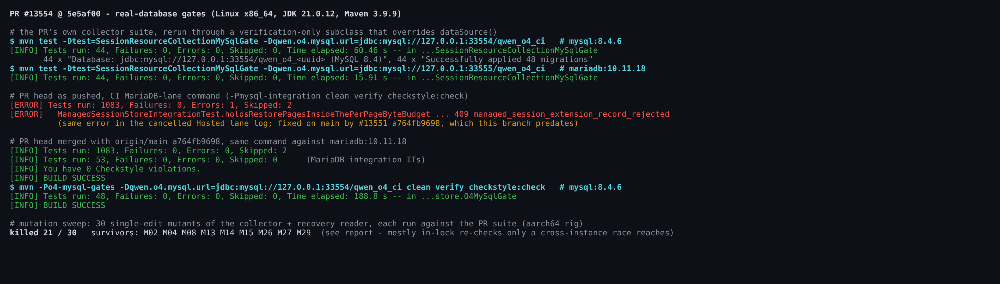
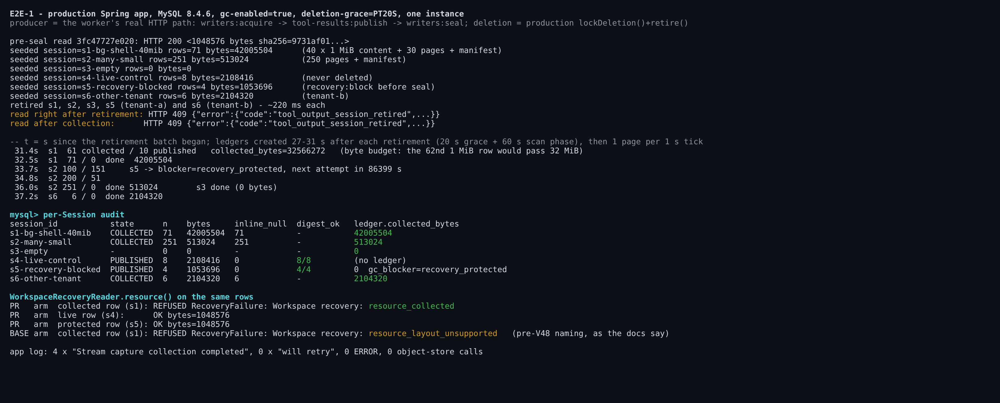
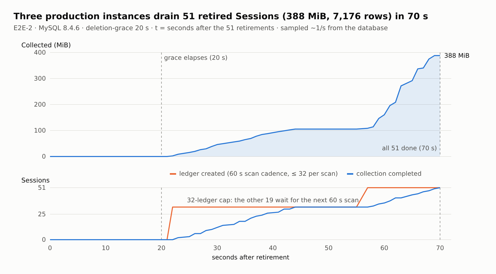
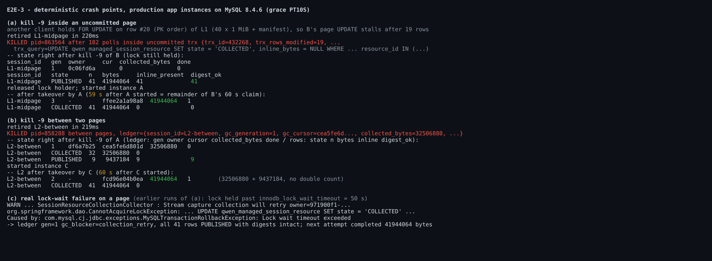
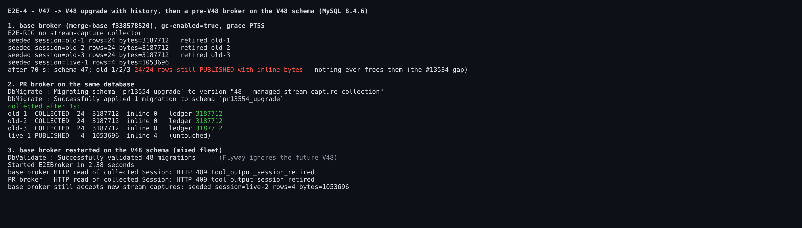
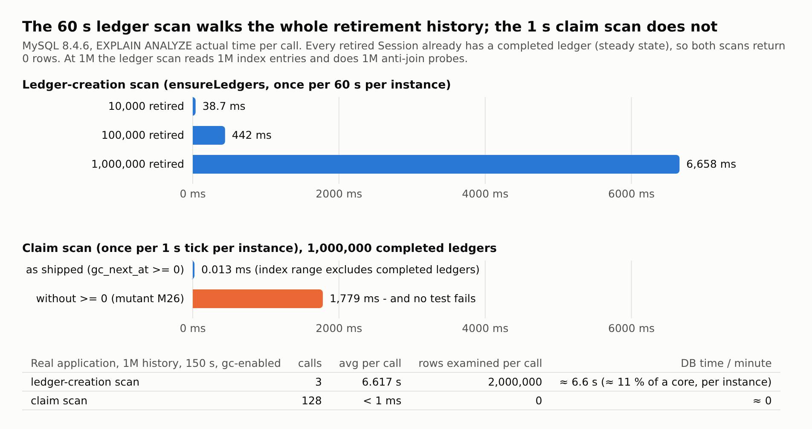

## Maintainer verification: #13554 at `5e5af00` (real MySQL/MariaDB + the production app)

**Verdict: no correctness or data-loss defect found. Mergeable once the branch is updated with `main`** (the two CI lanes that run this module were cancelled on this head, see §7). I exercised every safety property I could reach on real MySQL 8.4.6 and MariaDB 10.11.18 with the production Spring application, and all of them held: byte-exact accounting, the per-row and per-Session fences, crash atomicity at two crash points, cross-instance takeover, the outcome surfaces, and the V47→V48 upgrade.

There is one non-blocking follow-up with measured numbers: the 60-second ledger scan scales linearly with retirement history. At 1M retired Sessions it costs 6.6 s per scan per instance (§8.1).

This builds on the author's H2 report and on @qqqys's approval, which was static by its own statement. Everything below was executed.

**Environment.** Linux x86_64 (16 cores), JDK 21.0.12, Maven 3.9.9. Docker `mysql:8.4.6` and `mariadb:10.11.18` (the CI images) on tmpfs with binlog off. "Production app" means the PR's `target/classes` plus its runtime classpath, booted through `ManagedAgentServerApplication` with `session-store`, `tool-publication` and `gc-enabled` on. I made one substitution: the OSS adapter bean is a stub that throws on any call, and it recorded 0 calls in every run. The mutation sweep ran on aarch64 (Orange Pi, `maven:3.9.11-eclipse-temurin-21`).

### 1. Test gates on real databases

| Gate | Result |
|---|---|
| The PR suite (`SessionResourceCollectionCollectorTest`: 26 own + 18 inherited = 44), run through a verification-only subclass that overrides `dataSource()`, on MySQL 8.4.6 | **44/44**, 44 fresh schemas, 48 migrations each |
| Same, on MariaDB 10.11.18 | **44/44** |
| PR head, CI MariaDB-lane command (`-Pmysql-integration clean verify checkstyle:check`) | 1083 run, 1 error: `holdsRestorePagesInsideThePerPageByteBudget`. This error is pre-existing and was fixed on `main` by #13551. |
| PR head merged with `main` `a764fb9698`, same command | **1083/1083** (2 skipped), **53/53** MariaDB ITs, Checkstyle 0 |
| Merged tree, `-Po4-mysql-gates` on MySQL 8.4.6 | **48/48** |

### 2. Production app, one instance (E2E-1)

Rows were produced through the worker's real HTTP path (`writers:acquire` → `tool-results:publish` → `writers:seal`). Deletion used the production `lockDeletion()` + `retire()` transaction. Settings: grace 20 s, `gc-enabled=true`.

- **s1** (71 rows, 40.06 MiB) took 2 pages because of the 32 MiB byte budget. The 62nd row was 1 MiB and would have passed 32 MiB.
- **s2** (251 rows) took 3 pages of 100, 100 and 51 rows.
- **s3** was empty and completed with 0 bytes.
- **s6** belonged to another tenant and completed independently.
- **s4** was live and untouched, 8/8 digests intact.
- **s5** was `recovery_protected` and kept its bytes. Its next attempt is in 86,399 s.

`collected_bytes` equals the sum of the collected rows for every ledger. Every collected row has `inline_bytes` NULL and keeps its `sha256` and `byte_length`. Ledgers were created 27–31 s after each retirement (20 s grace plus the phase of the 60 s scan cadence). After that, one page ran per 1 s tick.

**Outcome surfaces:**
- An HTTP read of the retired Session returns `409 tool_output_session_retired`, both before and after collection.
- `WorkspaceRecoveryReader.resource()` on a collected row returns **`resource_collected`** on the PR build.
- The merge-base build returns `resource_layout_unsupported` for the same row, which is exactly the pre-V48 naming the docs describe.

### 3. Three instances, 51 Sessions (E2E-2)

Three production instances shared one MySQL. I seeded 51 Sessions totalling 7,176 rows and 388 MiB, and retired all of them at once.

- **51/51 ledgers are byte-exact:** 407,092,224 bytes collected, which equals the sum of the rows. No row was left `PUBLISHED` and no collected row has non-null bytes.
- The work split 17/17/17 across the three instances.
- `ER_LOCK_DEADLOCK` stayed at 0 and `ER_LOCK_WAIT_TIMEOUT` at 0 (performance_schema counters, before and after).
- Live writes ran during collection on the same tenants (3 × 30 MiB) and all succeeded.
- The plateau between 44 and 55 s is the documented cap of 32 ledgers per scan: the other 19 Sessions waited for the next 60 s scan.

### 4. Crash points (E2E-3)

- **(a) `kill -9` inside an uncommitted page.** Another client held `FOR UPDATE` on row #20 of a 41-row Session, so instance B's page `UPDATE` stalled after modifying 19 rows. I killed B at that point (`trx_rows_modified=19` in `INNODB_TRX`). All 41 rows were still `PUBLISHED` with intact digests, and the ledger read gen 1, cursor empty, 0 bytes. Instance A took over once B's 60 s claim lapsed and finished at exactly 41,944,064 bytes.
- **(b) `kill -9` between two pages.** Instance A was killed right after page 1 committed (32 rows, 32,506,880 bytes). Instance C took over at gen 2 and finished at exactly 41,944,064 bytes, which is 32,506,880 + 9,437,184 with no double count.
- **(c) A real page failure.** In earlier runs of (a), the lock outlived `innodb_lock_wait_timeout`. The production log shows `CannotAcquireLockException` → `will retry`, and the ledger went to `collection_retry` with all rows intact. The next attempt completed byte-exact.

### 5. Upgrade and mixed fleet (E2E-4)

1. The merge-base broker ran with `gc-enabled=true` and grace 5 s for 70 s. Its retired stream captures stayed `PUBLISHED` with bytes; this is the #13534 gap.
2. The PR broker started on the same database. Flyway applied V48 on top of the populated schema, and the three pre-upgrade retired Sessions were collected byte-exact about 1 s later. The live Session was untouched.
3. The merge-base broker restarted on the V48 schema. `Successfully validated 48 migrations` (Flyway ignores the future version), it started, it still accepts stream captures, and it answers `tool_output_session_retired` for the collected Session.

### 6. Mutation sweep: 21/30 killed

I made 30 single-edit mutants of the collector and the recovery reader and ran each against the PR suite. The 9 survivors fall into five groups:

- **M08, M27** remove the in-lock re-checks in `claim()` (a live claim held by another owner; not yet due). Only a race between two instances, between the candidate scan and the lock, can reach these checks. Even then, `page()` re-fences on owner and generation, so they cost wasted work, not double collection.
- **M13, M14, M15** remove the generation, claim-expiry and cursor fences in `page()`. These are redundant with the owner check while each process has its own UUID and `runOnce` is `synchronized`.
- **M02** removes `storage_kind = 'MYSQL_INLINE'`. It is equivalent: `TOOL_PUBLICATION` rows always carry an `object_key` and are `REFERENCED`.
- **M04** widens the content bound by 1 byte, and **M29** scans 1 candidate per tick. These are untested boundaries with low impact.
- **M26** drops `gc_next_at >= 0` from the claim scan. This one matters for performance; see §8.2.

### 7. CI on this head

Both lanes that run `managed-agent-server` were **cancelled**, so CI never executed the new test file on Linux:
- The MariaDB lane hit its 15-minute job timeout.
- In the Hosted MySQL lane, Maven reported `BUILD FAILURE` at 00:35:32 on the pre-existing #13551 error, then the step sat until the 60-minute job timeout.

The merged tree is green locally on both databases (§1), so merging `main` and re-running should clear it. Separately, `V48` is also claimed by six other open PRs (#13163, #13219, #13260, #13325, #13354, #13544). Whichever lands second has to renumber; the design doc already calls for this.

### 8. Findings

**8.1 [Follow-up, performance] The ledger scan is O(retirement history).** In steady state, every tombstone already has a completed ledger. `ensureLedgers()` still walks every due `retired_at` index entry and probes the ledger index once per entry, and it returns 0 rows. Measured on MySQL 8.4.6 with EXPLAIN ANALYZE:

| Retired Sessions | Time per scan |
|---|---|
| 10k | 38.7 ms |
| 100k | 442 ms |
| 1M | 6,658 ms |

The real app on the 1M history issued 3 scans in 150 s. Each averaged 6.617 s and examined 2,000,000 rows, which is about 11 % of one database core per instance.

The scan also runs on the single-thread `managedToolOutputScheduler`, which `ToolPublicationCollector` and the retention observer share. So at that size those ticks also stall for about 6.6 s every minute.

Design open question 3 anticipates this. A cheap option needs no cross-instance state: every due tombstone gets a ledger whatever its blockers are, so after one pass that returns fewer than 32 rows, an instance can scan only `retired_at > (last due − slack)`. A restart costs one full pass. I don't consider this blocking: the feature is off by default, and the scan is cheap below about 100k Sessions.

**8.2 [Test gap, low] `gc_next_at >= 0` is load-bearing but not pinned.** This predicate is what keeps the per-second claim scan proportional to unfinished work, as the design doc claims. With 1M completed ledgers the claim scan takes 0.013 ms as shipped and 1,779 ms without the predicate, and all 44 tests still pass without it (M26). A test or a comment would pin it, for example a SQL-shape assertion or a plan check.

**8.3 [Docs nits]**
- **The README and ops paragraph name only `gc-enabled`.** The pass also needs `tool-publication.enabled=true`, which in turn requires the OSS settings and the embedded Runtime Broker. The design doc says this, but these two docs don't. A deployment that stores background-Shell output without running tool publication cannot collect it.
- **Collected bytes become free space inside InnoDB, not reclaimed disk.** After E2E-1 collected about 44.6 MB, `DATA_FREE` was 47 MiB and the `.ibd` file was still 60 MiB. One sentence in the ops doc would set expectations, for example that reclaiming file space needs `OPTIMIZE TABLE` or a rebuild.
- **"44 new collector tests" is 26 new plus 18 inherited** from `ToolPublicationRetentionStoreTest`.

**8.4 [Coverage note]** No Spring test boots `ToolPublicationConfiguration`: no test sets `tool-publication.enabled=true`. The new bean and its `@Scheduled` wiring on `managedToolOutputScheduler` are therefore proven only by this rig, where ticks ran on the `managed-tool-output-1` thread.

### Not verified

- Real OSS.
- A full Hosted background-Shell run through the CLI worker. I drove the worker's HTTP endpoints directly instead.
- The operator workspace-recovery HTTP path. I called `WorkspaceRecoveryReader.resource()` on the real rows instead.
- macOS and Windows. The runs were Linux x86_64, plus aarch64 for the mutation sweep.

Harness, raw data and logs are in this directory (`harness/`, `data/`).
