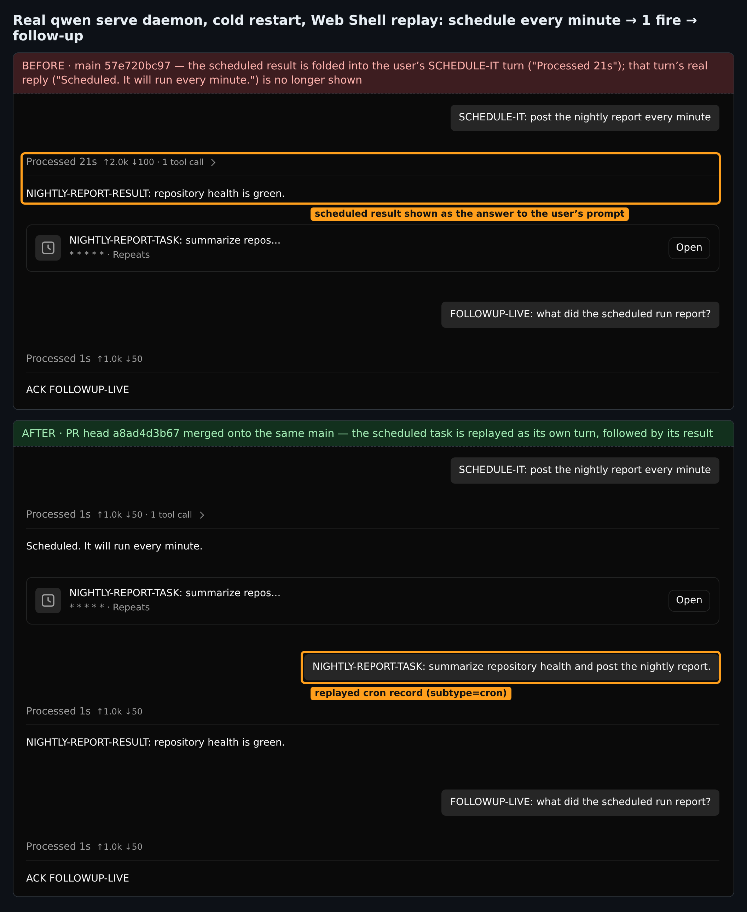
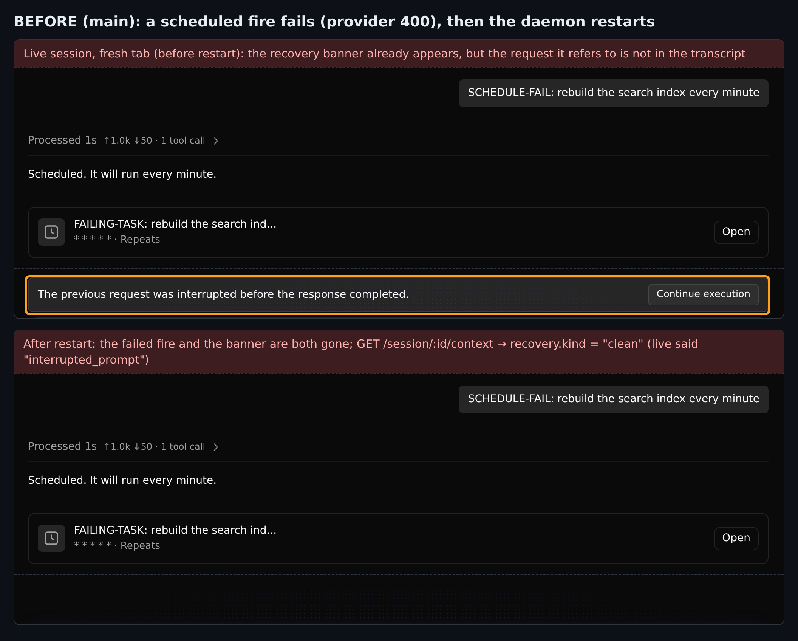
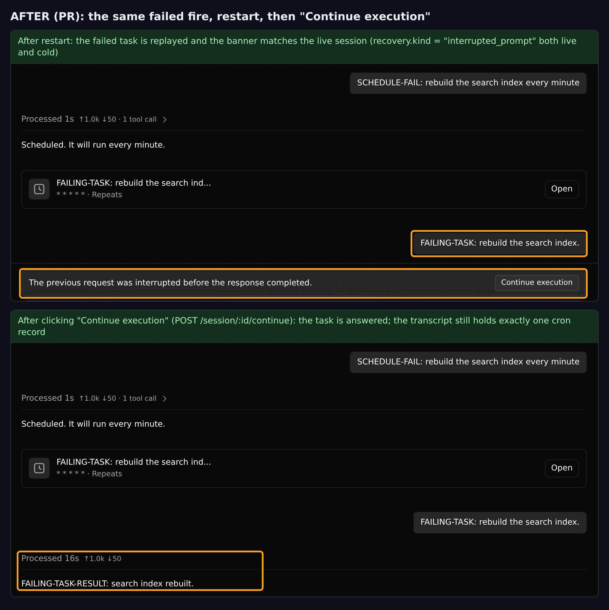

> Posted to https://github.com/QwenLM/qwen-code/pull/8838 · verified tree: PR head `a8ad4d3b67` merged onto `main` `57e720bc97` (2026-09-30)

## 维护者验证第 2 轮（增量）：真实 `qwen serve` daemon + Web Shell，合并到今天的 `main`

**结论：生产代码改动正确，在今天的 `main` 上依然需要；修掉一条测试后我建议合并。** 合并到当前 `main` 后，分支带着**一条红测试**：`Session.test.ts` 为 `1 failed | 1109 passed`。当前 head 上的绿色 CI 已过期：最后一次 `Qwen Code CI` 跑在 2026-08-31，早于 `main` 修改这条断言所钉住的调用。对这一条断言补 4 行即可让该文件变为 `1110 / 1110`，补丁见第 2 节末尾，已在合并树上实测。之后只需重跑 CI。

本轮只覆盖之前没有覆盖的部分：
- 我的第 1 轮（[评论](https://github.com/QwenLM/qwen-code/pull/8838#issuecomment-5468241624)）用的是真实 ACP stdio 子进程和 TUI `--resume`，版本为 `5b539d0d1` + 8 月 30 日的 `main`。
- 沙箱验证（[评论](https://github.com/QwenLM/qwen-code/pull/8838#issuecomment-5884082960)）在进程内运行，留下两个开放问题，并报告了那条红测试。

本轮把 PR head `a8ad4d3b67` 合并到 `main` `57e720bc97`（2026-09-30，距 PR 上次合 main 已有 1187 个提交；合并无冲突，diff 仍然恰好是 2 个文件、`+303/−5`），全部通过真实 `qwen serve` daemon 驱动，并在 Chromium 中打开真实 Web Shell。这正是 PR 描述里列为"未验证"的"已部署 daemon 与浏览器回放"。

**验证环境。** 两个对照臂从同一棵合并树打包，唯一区别是 `packages/cli/src/acp-integration/session/Session.ts`（`main` 版本 vs PR 版本）；两份 bundle 中 `recordCronPrompt(` 调用点分别为 2 个和 3 个。一个按内容分派的假 OpenAI 服务让模型调用真实的 `cron_create` 工具（`* * * * *`，周期任务，仅会话内），由真实调度器在会话内触发。随后停掉 daemon、冷启动，再用 Web Shell 打开该会话。每个场景都使用全新的 `QWEN_HOME`。

---

### 1. 问题在今天的 `main` 上仍可复现，PR 在 Web Shell 中同样修复了它



| 冷重启之后（同一场景，两臂） | `main` | PR |
| --- | --- | --- |
| `chats/<id>.jsonl` 中触发提示词的记录 | ❌ 没有 | ✅ `type=user subtype=cron provenance=system`，`displayText` 为任务文本 |
| Web Shell 回放 | ❌ 定时任务的结果被显示成用户上一条提问的回答。该轮"耗时 21 s"，它真正的回复被折叠进收起的行里（已展开确认）。 | ✅ 定时任务单独成为一轮，后面跟着它的结果 |
| 下一次提问时模型收到的历史 | ❌ 两条 assistant 消息被焊接成一条（见下） | ✅ `user(任务) → assistant(结果)` |

```
# main：重启后第一次提问时恢复出的历史（取自 provider 请求日志）
user       'SCHEDULE-IT: post the nightly report every minute'
assistant  'Scheduled. It will run every minute.NIGHTLY-REPORT-RESULT: repository health is green.'
user       'FOLLOWUP-LIVE: what did the scheduled run report?'
# PR
assistant  'Scheduled. It will run every minute.'
user       'NIGHTLY-REPORT-TASK: summarize repository health and post the nightly report.'
assistant  'NIGHTLY-REPORT-RESULT: repository health is green.'
```

重启之前，两臂 live 会话发出的请求完全相同，都包含任务；`main` 只是在恢复时丢掉了它。PR 冷恢复后的历史与这份 live 历史完全一致。所以这不只是 transcript 展示层的修复，也修复了恢复后的模型上下文。

### 2. 阻塞项（仅测试）：PR 的一条断言在今天的 `main` 上已过期

`persists a non-sentinel cron prompt and keeps the session interactive` 断言 `recordUserMessage` **恰好**以 `('follow-up')` 调用。#11062（2026-09-09）把 `main` 上这个调用点从单参数改成了多参数，现在传 5 个参数。两边各自都是绿的，文本合并也无冲突，所以只有合并后的树是红的：

| PR ⊕ `main 57e720bc97` 上的 `Session.test.ts` | 结果 |
| --- | --- |
| 直接合并 | **1 failed \| 1109 passed (1110)**：`expected "spy" to be called with arguments: [ 'follow-up' ]`，实际收到 `"follow-up", undefined, undefined, "test-session-id########2", undefined` |
| 应用上面的补丁 | **1110 passed (1110)** |
| 负对照：保留补丁，`Session.ts` 回退到 `main` | **7 failed \| 1103 passed**，与第 1 轮相同的 7 个 cron 记录用例（如 `expected "spy" to be called 1 times, but got 0 times`）。测试仍然守住生产改动。 |

补丁沿用该文件已有的 5 参数写法（例如 `inputAnnotations` 相关用例里的 `recordUserMessage` 断言）：

```diff
         expect(mockChatRecordingService.recordUserMessage).toHaveBeenCalledWith(
           'follow-up',
+          undefined,
+          undefined,
+          expect.stringContaining('test-session-id########'),
+          undefined,
         );
```

应用后，`tsc --noEmit -p packages/cli` 退出码为 0，两个变更文件的 `eslint --max-warnings 0` 与 `prettier --check` 均干净。

### 3. 用真实 daemon 回答沙箱验证留下的开放问题

**(a) "cron 轮次到底会不会记录助手输出？" 会。** 真实 daemon 的 JSONL 中，cron 记录后面紧跟着一条带结果的 `assistant_output` 记录（`data/head-ok/transcript.jsonl`）。因此 issue 描述的"只有结果、没有任务"是真实症状（第 1 节）；只有当触发本身失败或被取消时，transcript 才会以 cron 记录结尾。

**(b) cron 结尾会话的"中断"恢复横幅在本 PR 之前就已存在，PR 只是让冷恢复与 live 一致。** 场景：触发时 provider 返回 400，然后 daemon 重启。表中是 `GET /session/:id/context` 的 `recovery`：

| | live（重启前） | 冷恢复（重启后） |
| --- | --- | --- |
| `main` | `interrupted_prompt`，`canContinue: true` | `clean`，`canContinue: false` |
| PR | `interrupted_prompt`，`canContinue: true` | `interrupted_prompt`，`canContinue: true` |

在 `main` 上，对 live 会话新开一个标签页，就已经会显示 "The previous request was interrupted…" 和 **Continue execution**，但它所指的那条请求并不可见；重启之后，那次触发和横幅都消失了：



PR 下横幅有了上下文。在真实 UI 中点击 **Continue execution**（`POST /session/:id/continue`）后任务得到回答，续跑请求中任务文本只出现一次，transcript 中仍然**恰好一条** cron 记录，回答排在它之后：



### 4. 非阻塞：R11-1 不需要压缩竞态也能触发

autofix 轮次是通过在发送准备阶段取消来确认 R11-1 的。一条更常见的路径也能到达同样的分叉：
1. provider 宕机，用户的提问失败。
2. 定时触发也失败。
3. provider 恢复后，用户用 Web Shell **Try again** 发送的同一请求体（`retry: true`）重试。

重试会从 live 历史中剥掉尾部的 user 条目，但 cron 记录仍留在 transcript 中：

```
# 下一次提问时模型看到的 live 历史（两臂相同）
user       'OUTAGE-PROMPT: check the build status.'
assistant  'OUTAGE-PROMPT-RESULT: build is green.'
# PR：冷重启后同一位置；被剥掉的任务重新出现，并合并进被重试的提问
user       'OUTAGE-PROMPT: check the build status.FAILING-TASK: rebuild the search index.'
assistant  'OUTAGE-PROMPT-RESULT: build is green.'
```
`main` 在这里之所以能保持冷恢复与 live 一致，只是因为它根本不持久化 cron 记录。影响仅限于恢复后的上下文里多出一行任务文本，且需要"提问失败 → 触发失败 → 重试"依次发生。作为展示，这样的回放也说得通（那次触发确实发生过）。我同意现有处置：不阻塞本 PR，与其他"自动写入记录 / retry 对齐"的工作一起跟进（deferred-findings 条目，与 #8885 放在一起）。autofix 轮次所说的"`main` 上的 `notification` 记录已有同样行为"，我没有验证。

### 5. 未覆盖

- macOS / Windows（仅 Linux；该 hunk 没有平台相关逻辑）。
- rewind 索引的后续问题（#8885，仍未关闭）本轮未复验。
- `<<loop.md>>` / `@wakeup` tick 与频道投递触发本轮未重跑。前两者由第 1 轮和单测覆盖；`per_run` 任务走 `#dispatchCronToFreshSession`，不经过被修改的代码块。

验证脚本、原始 transcript、provider 请求日志、`/context` 快照和 vitest 汇总在 [`pr-8838-round2/`](.)（`harness/run.sh <base|head> <ok|fail|retry>` 可复现每一格）。
