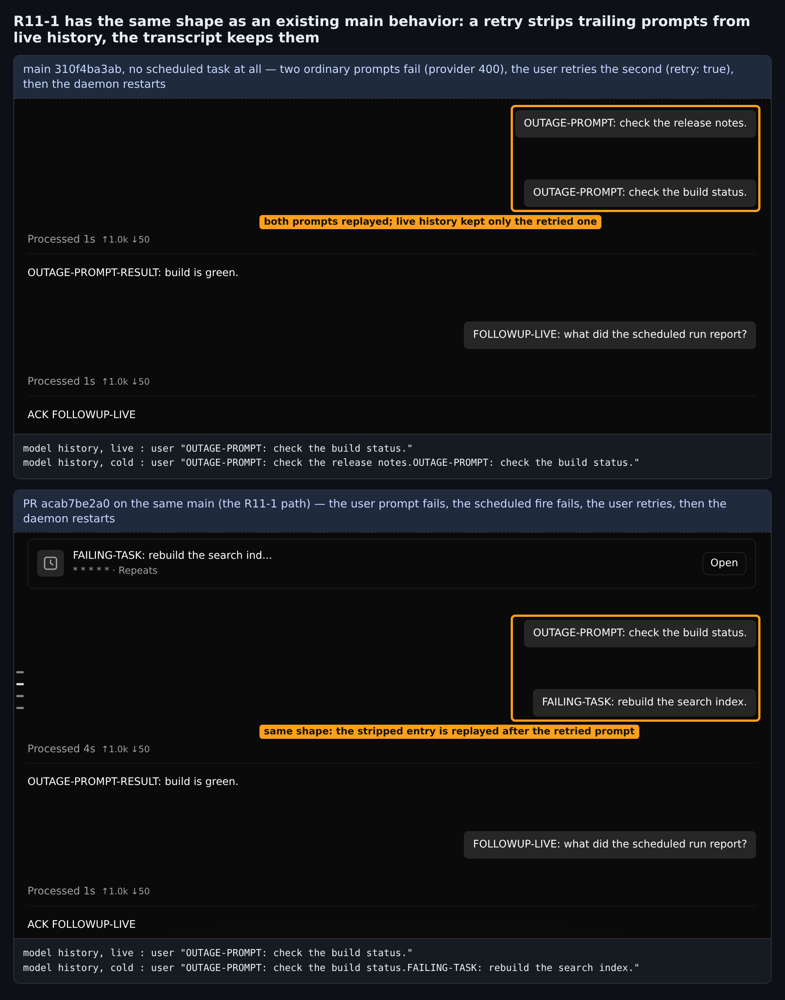

## 维护者验证第 3 轮（增量）：head `acab7be2a0` 合并到今天的 `main`

**结论：我这边认为可以合并。** 第 2 轮的阻塞项已按我贴的补丁原样修复，这个 head 上的 CI 是新跑的且全绿，第 2 轮在真实 daemon 上测到的结果在今天的 `main` 上依然成立。本轮有两个新结果：

1. **可选，仅测试。** 第 12 轮评审延后了一条：`Session.test.ts:27739` 的负向断言。它确实什么也钉不住，过期原因和我第 2 轮修的那条断言相同，我当时漏掉了。第 2 节附 6 行补丁。如果分支还会再推，我建议顺手带上，但不必为它卡合并。
2. **R11-1 不是这个 PR 引入的。** `main` 上不涉及任何定时任务也会出现同样的 live/冷恢复分叉：两条普通提示词失败，用户重试，然后 daemon 重启（第 3 节）。cron 记录的行为与用户提示词记录完全一致。我仍认为它不阻塞，修复应放在 retry 路径上，两种记录一起处理。

---

### 1. 新 head 在今天的 `main` 上重跑

`acab7be2a0` 与我第 2 轮验证的那棵树（`a8ad4d3b67` 合并到 `57e720bc97`）相比，只多了第 2 轮那个补丁，逐字节一致。我把它合并到 `main` `310f4ba3ab`，比上一轮晚 4 个提交，其中没有一个碰会话、记录、cron 或 Web Shell 的生产代码。合并无冲突，PR diff 仍然是同样 2 个文件。

| 检查 | 结果 |
| --- | --- |
| 合并树上的 `Session.test.ts` | **1110 passed (1110)** |
| `tsc --noEmit -p packages/cli`、`eslint --max-warnings 0`、`prettier --check` | 干净 |
| `acab7be2a0` 上的 `Qwen Code CI`（[运行](https://github.com/QwenLM/qwen-code/actions/runs/36791518776)，2026-09-30 23:31 UTC） | 成功：`Lint & Static`、`Test (ubuntu-latest)`、`Integration Tests (no-AK)` 通过。CLI 集成测试和 macOS/Windows 测试作业在这次运行中被跳过。 |

我还用新树重新打包，在真实 `qwen serve` daemon 和真实 Web Shell 上重跑了第 2 轮的全部 6 个场景。两个对照臂只差 `Session.ts`。

| 场景 | `main` | PR |
| --- | --- | --- |
| 触发成功后重启：冷恢复的模型历史是否等于 live？ | ❌ 两条 assistant 消息被焊在一起 | ✅ 相等 |
| 触发失败后重启：`GET /session/:id/context` 的 `recovery`，live → 冷恢复 | `interrupted_prompt` → `clean` | `interrupted_prompt` → `interrupted_prompt` |
| ……再在 Web Shell 中点击 **Continue execution** | 没有横幅 | 任务得到回答；请求中任务文本只出现一次；1 条 cron 记录 |
| 提问失败、触发失败、重试，然后重启 | 冷恢复等于 live | 冷恢复把任务重新拼回（R11-1，见第 3 节） |

**更正第 2 轮的一处数据（结论不变）。** 第 2 轮里 PR 冷恢复的 `interrupted_prompt` 取自界面上渲染出的横幅；而那个目录里的 `data/head-fail/context-cold.json` 是在点击 Continue **之后**抓的，所以显示 `clean`。本轮验证脚本在冷启动的 daemon 上、任何 UI 接触会话之前读取 `GET /context`（`context-cold-before-continue.json`）：
- `main`：`clean`，`canContinue: false`
- PR：`interrupted_prompt`，`canContinue: true`

### 2. 可选（仅测试）：负向 `recordUserMessage` 断言永远不会失败

测试 `persists a non-sentinel cron prompt and keeps the session interactive` 中有：

```ts
expect(
  mockChatRecordingService.recordUserMessage,
).not.toHaveBeenCalledWith('do the normal cron thing');
```

`toHaveBeenCalledWith` 匹配的是完整参数列表。自 #11062 起，两个生产 `recordUserMessage` 调用点都传 5 个参数，单参数的期望因此永远匹配不上，`.not` 也就永远通过。它和我第 2 轮修的那条断言是同一原因，只是不报错、悄悄失效。

为了实测，我做了一个变异：在 `recordCronPrompt` 之后再调用一次 `recordUserMessage(modelText, undefined, undefined, 'cron-mutant', undefined)`，即把 cron 提示词同时记成一条用户消息。合并树上的结果：

| `Session.test.ts` | 结果 |
| --- | --- |
| 变异 + 分支上的原测试 | **1110 passed**：变异在整个文件中存活 |
| 变异 + 修正后的测试 | 1 failed（就是这条用例） |
| 无变异 + 修正后的测试 | 1110 passed |
| `Session.ts` 取 `main` 版本 + 修正后的测试 | 7 failed，与第 2 轮相同的 7 条 |

下面的补丁沿用该文件已有的 `.mock.calls.map(...)` 写法。应用后 `tsc`、`eslint`、`prettier` 均干净。

```diff
         expect(
-          mockChatRecordingService.recordUserMessage,
-        ).not.toHaveBeenCalledWith('do the normal cron thing');
+          mockChatRecordingService.recordUserMessage.mock.calls.map(
+            (args) => args[0],
+          ),
+        ).not.toContain('do the normal cron thing');
```

### 3. R11-1：`main` 在没有任何定时任务时也有同样的 live/冷恢复分叉

第 12 轮评审把 R11-1 重新标为 Critical。为了检验这一点，我加了一个完全不含 cron 的对照场景：
1. provider 故障期间，两条普通提示词都失败。
2. provider 恢复后，用户用 `retry: true`（即 **Try again** 发送的请求）重试第二条。
3. daemon 重启。



```
# main，无 cron：下一次提问前的模型历史（取自 provider 请求日志）
live   user 'OUTAGE-PROMPT: check the build status.'
cold   user 'OUTAGE-PROMPT: check the release notes.OUTAGE-PROMPT: check the build status.'
# PR，R11-1 路径（提问失败、触发失败、重试）
live   user 'OUTAGE-PROMPT: check the build status.'
cold   user 'OUTAGE-PROMPT: check the build status.FAILING-TASK: rebuild the search index.'
```

在不含 cron 的场景下，PR 臂的结果与 `main` 相同。

这是 `main` 上 retry 本来的行为：`Session.ts` 会把 live 历史末尾的 user 条目剥掉，并跳过 `recordUserMessage`，以"避免在 JSONL transcript 中重复记录用户轮次"；但它从不撤回被一并剥掉的其他条目在 transcript 中的记录。PR 的 cron 记录遵循与用户提示词记录相同的规则。这也解释了为什么评审自己的分析得出：唯一真正的修复是跨层的。

后续跟进的建议：retry 剥离条目时写一条相应记录，用户提示词和 cron 记录一并处理，与 #8885 放在一起跟踪。第 12 轮的 `CHANGES_REQUESTED` 评审只基于 R11-1，我不认为它是卡住这个 PR 的理由。

### 4. 未覆盖

- R11-1 的另一个入口（触发在发送准备阶段被取消）没有端到端重跑；其前置条件由评审引用的那条单测覆盖。
- 与第 2 轮相同：仅 Linux；`per_run`、`<<loop.md>>` / `@wakeup` 以及频道投递的触发没有重跑。

验证脚本、原始 transcript、provider 请求日志、`/context` 快照、变异结果和 vitest 汇总都在 [`pr-8838-round3/`](.)。`harness/run.sh <base|head> <ok|fail|retry|uretry>` 可复现每个场景，`harness/mutate.sh` 可复现第 2 节。
