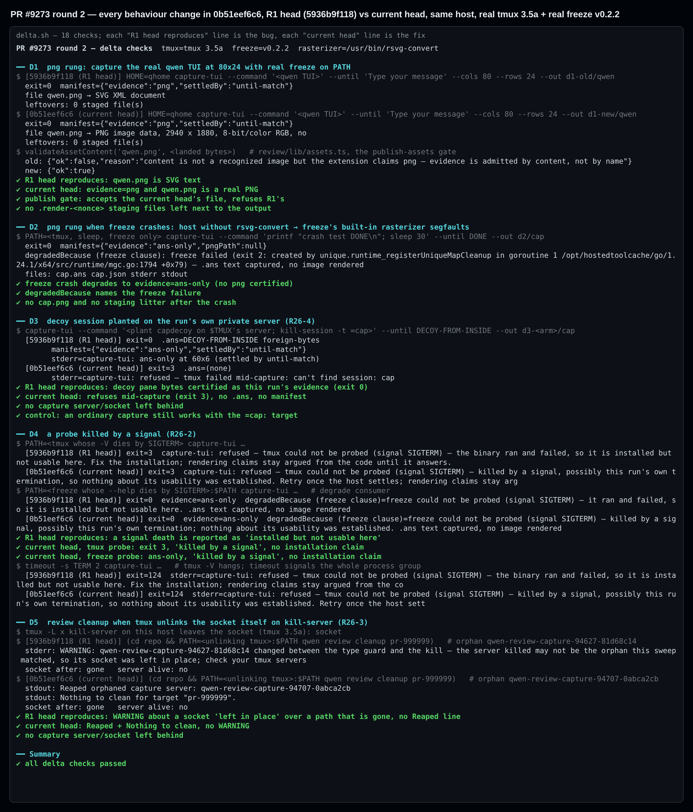
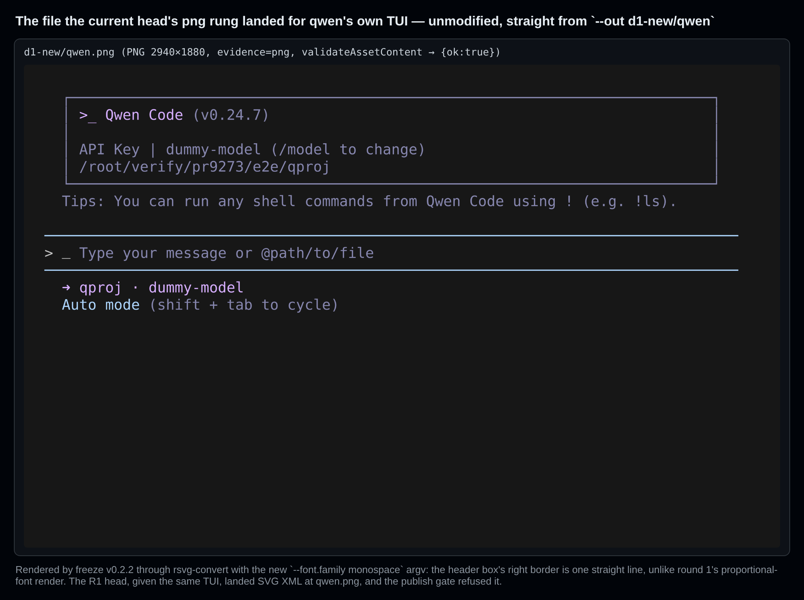
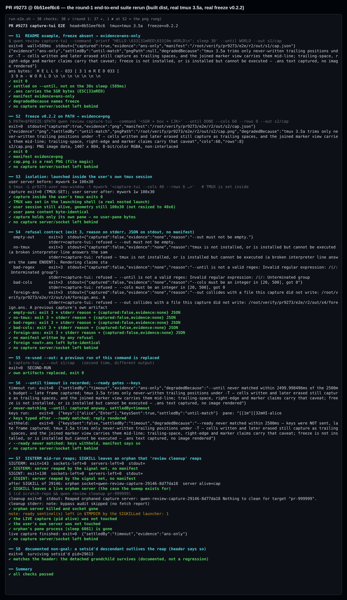
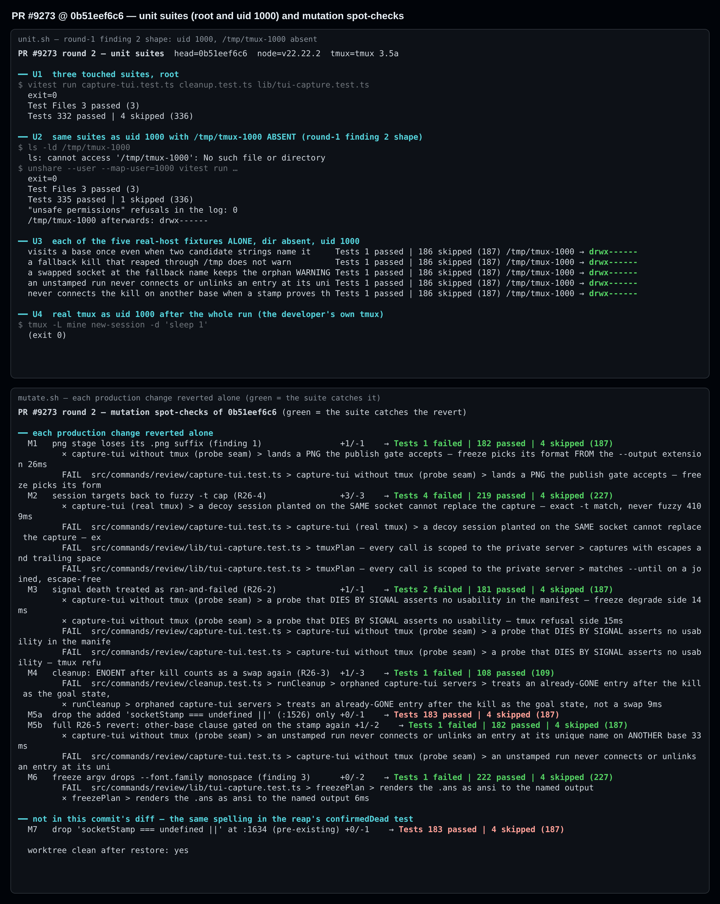

## Maintainer verification, round 2 — PR #9273 @ `0b51eef6c6` (delta from round 1)

**Verdict: nothing blocking is left from my side, so this is OK to merge on verification grounds.**

Round 1 ([comment](https://github.com/QwenLM/qwen-code/pull/9273#issuecomment-5970490274), at `5936b9f118`) found one blocker. At this head the blocker is fixed, and so are the should-fix and the font half of the suggestion:

- I ran each fix through the built CLI against **real tmux 3.5a** and **real freeze v0.2.2**.
- The R1 head, built from the same worktree, is the negative control: on it, every bug reproduces.

The other behaviour changes in `0b51eef6c6` (R26-2, R26-3 and R26-4) are covered the same way: each reproduces its bug on the R1 head and is fixed at this head. R26-5 has a unit pin only, which a mutant shows catches the revert.

Still open, none of it blocking: the deferred sentinel nit, the colour half of the PNG-fidelity point, and three small observations at the end.

### Environment

- PR head `0b51eef6c686af13ff2c6f2ab67c6e6f2d3b48dc`.
- Two builds from one worktree, both with `npm run bundle`: `dist-old/` from `5936b9f118` (the three production files checked out) and `dist-new/` from `0b51eef6c6`. Debian 13, Node 22.22.2, tmux 3.5a, and the freeze v0.2.2 release binary, which rasterizes through `rsvg-convert` on this host.
- Merges cleanly into current `main` `6136786c0c` (`git merge-tree` exit 0). The 29 commits main has gained don't touch `commands/review/`.

### Round-1 findings at this head

| # | Round 1 | At `0b51eef6c6` | Evidence |
| --- | --- | --- | --- |
| 1 | **Blocking:** the `png` rung wrote SVG with a real freeze | ✅ **Closed** | I captured qwen's own TUI (80×24) with both builds. At the R1 head, `qwen.png` is `SVG XML` and `validateAssetContent` returns `{ok:false, "…extension claims png…"}`. At the current head it is `PNG image data, 2940 x 1880`, the gate returns `{ok:true}`, and no `.render-*` file is left behind. Reverting only the suffix reddens the new pin (`lands a PNG the publish gate accepts`). |
| 2 | **Should-fix:** fixtures created the real `/tmp/tmux-<uid>` as 0755 | ✅ **Closed** (five sites) | As uid 1000 in a user namespace, with `/tmp/tmux-1000` absent, the three suites give **335 passed / 1 skipped**. Round 1 got 67 failed / 262 passed. The log has zero "unsafe permissions" refusals. Run alone, each of the five fixtures leaves `drwx------`, and a real `tmux new-session` as uid 1000 still starts afterwards. |
| 3 | Suggestion: the PNG used a proportional font | ✅ **Closed** (font half) | Fig. 2 is the png rung's own unmodified file: the header box's right border is one straight line. Dropping `--font.family monospace` reddens the `freezePlan` argv pin. The colour half (freeze drops SGR 7 and SGR 44) is deliberately left to the brief. That is still true, and not a blocker. |
| 4 | Nit: a SIGKILLed launcher leaves `qwen-capture-ready-*` behind | Deferred by the author; still reproduces | This run left three sentinels, one per SIGKILLed launcher. It's fine as the follow-up slice the author proposed. |

### Other behaviour changes in `0b51eef6c6`: R1 head vs. current head, same host

**R26-4: exact `=cap:` targets.** Setup: the pane command plants `capdecoy` on its own `$TMUX` server, then runs `kill-session -t =cap`.
- R1 head: exits 0 with `.ans` = `DECOY-FROM-INSIDE foreign-bytes` and the manifest says `settledBy: until-match`. The foreign pane is certified as this run's evidence.
- Current head: exits 3 with `refused — tmux failed mid-capture: can't find session: cap`. No `.ans` and no manifest are written. An ordinary capture still works with the new target spelling.

**R26-2: a probe killed by a signal.** Setup: `tmux -V` or `freeze --help` signals itself, plus a real `timeout -s TERM 2` group kill while `tmux -V` hangs.
- R1 head: says `the binary ran and failed, so it is installed but not usable here. Fix the installation`, both in the refusal and in the manifest.
- Current head: says `killed by a signal, possibly this run's own termination … nothing about its usability was established`. On the freeze side it degrades to `ans-only` with the same wording.

**R26-3: `review cleanup` when the socket is already gone after the kill.** tmux 3.5a leaves the socket, so I simulated a tmux build that unlinks it with a wrapper that does exactly that.
- R1 head: prints `WARNING: … its socket was left in place` over a path with nothing at it, with no `Reaped` and no `Nothing to clean`.
- Current head: prints `Reaped orphaned capture server: …` and `Nothing to clean`, with no WARNING.

**R26-5: planted-guard 2×2 (no stamp × other base).** Not end-to-end tested here. The full revert reddens `an unstamped run never connects or unlinks an entry at its unique name on ANOTHER base`.

**Additional check, not a delta: freeze crashing.** On a host without `rsvg-convert`, freeze v0.2.2 falls back to its built-in rasterizer, which segfaults on this host every time. That is a freeze bug, unrelated to this PR. capture-tui handles it correctly:
- exit 0, with `evidence: "ans-only"`;
- `freeze failed (exit 2: …)` in `degradedBecause`;
- no `cap.png` and no staging litter.

### Round-1 E2E rerun, suites, mutation, CI

- **Round-1 E2E (`run-e2e.sh`, S1–S8):** **38 / 38** at this head. Round 1 got 37 / 38, with the one failure at S2, the png rung (Fig. 3).
- **Three touched suites, as root:** **332 passed / 4 skipped (336)**, matching the author's count. As uid 1000: 335 / 1.
- **Mutation:** I reverted each production change on its own (Fig. 4). Every revert is caught:

  | Mutant | Reverted change | Failing tests |
  | --- | --- | --- |
  | M1 | png suffix | 1 |
  | M2 | fuzzy `-t cap` | 4, including the real-tmux decoy test |
  | M3 | signal death | 2 |
  | M4 | ENOENT treated as a swap | 1 |
  | M5b | full R26-5 revert | 1 |
  | M6 | font argv | 1 |

- **CI on `0b51eef6c6`:** these lanes passed: Test (ubuntu), Lint & Static, Integration (no-AK), web-shell E2E smoke, TUI parity and Desktop Shell. The macOS and Windows Test lanes are skipped by routing, and I only ran Linux, so the `=cap:` spelling and the 0700 fixtures are **unverified on macOS**.

### Non-blocking observations

1. **Redundant clause.** `capture-tui.ts:1526`, `socketStamp === undefined ||`, is already implied by the two clauses after it: `isStampedSocket` is false without a stamp, and the other-base clause is now unconditional. Deleting it alone keeps all 187 tests green (M5a). That makes it an equivalent mutant, not a test gap. The real behaviour change is removing `socketStamp !== undefined &&` from the other-base clause (M5b). Keeping it for its comment or dropping it are both fine.
2. **Possibly unpinned arm (pre-existing, not in this diff).** The same spelling at `capture-tui.ts:1634`, in the reap's `confirmedDead` arms, can also be deleted with all 187 green (M7). The arm is either unpinned or only reachable through tmux's `/tmp` fallback. I didn't work out which; it's worth a look in the follow-up batch.
3. **Uninformative freeze error text.** `freeze failed (…)` quotes the **last** two stderr lines (`capture-tui.ts:2408`). For a Go panic, that is the bottom of the goroutine dump (`created by unique.runtime_registerUniqueMapCleanup … mgc.go:1794`), which says nothing. The first line (`SIGSEGV: segmentation violation` / `unexpected fault address`) is the useful one. Cosmetic.

### Not verified

- macOS and Windows: both CI lanes are skipped, and I only ran Linux.
- freeze's built-in rasterizer (no `rsvg-convert`; the likely macOS path): it crashes on this host, so the `--font.family monospace` effect is verified only through `rsvg-convert`.
- R26-5 end to end. It is covered only by its unit pin and the M5b mutant.

### Reproduction

The harness, transcripts and the unmodified `qwen.png` (`data/current-head-qwen.png`) are in this directory:

- `harness/delta.sh`: D1–D5, A/B between `dist-old` and `dist-new`.
- `harness/run-e2e.sh`: the round-1 S1–S8 suite.
- `harness/unit.sh`: the suites as root and as uid 1000.
- `harness/mutate.sh`: the mutation spot-checks.
- `harness/render.cjs`: renders the figures.
