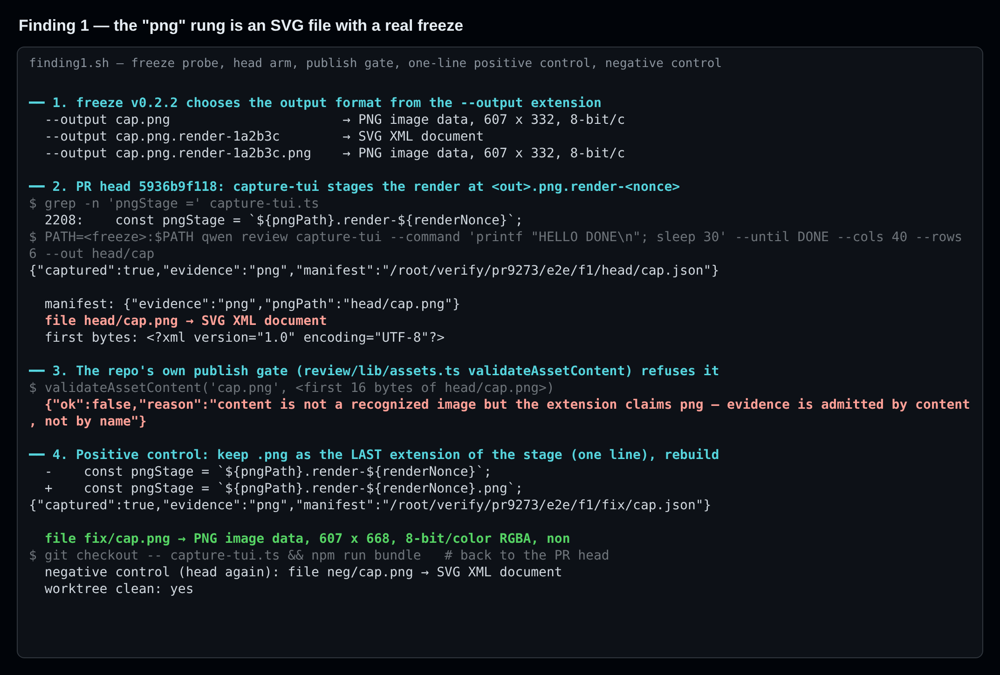
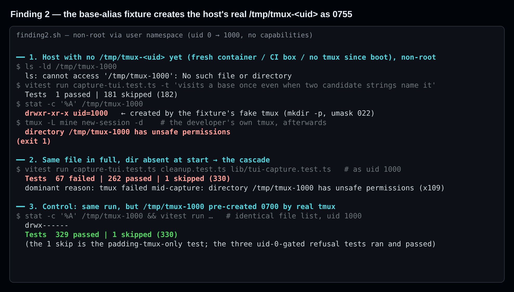
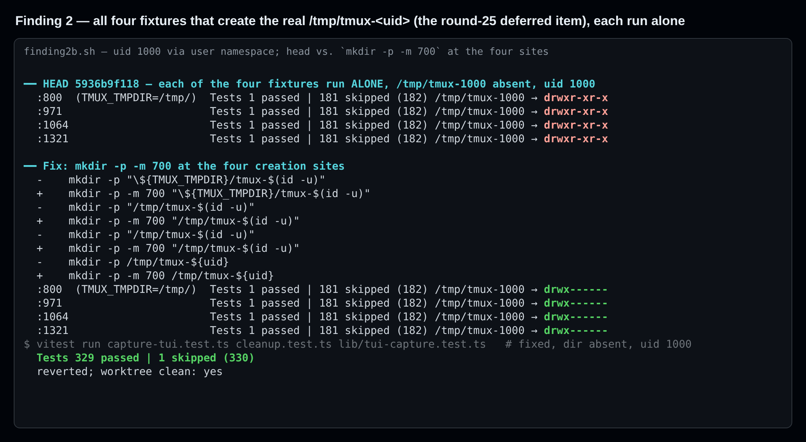
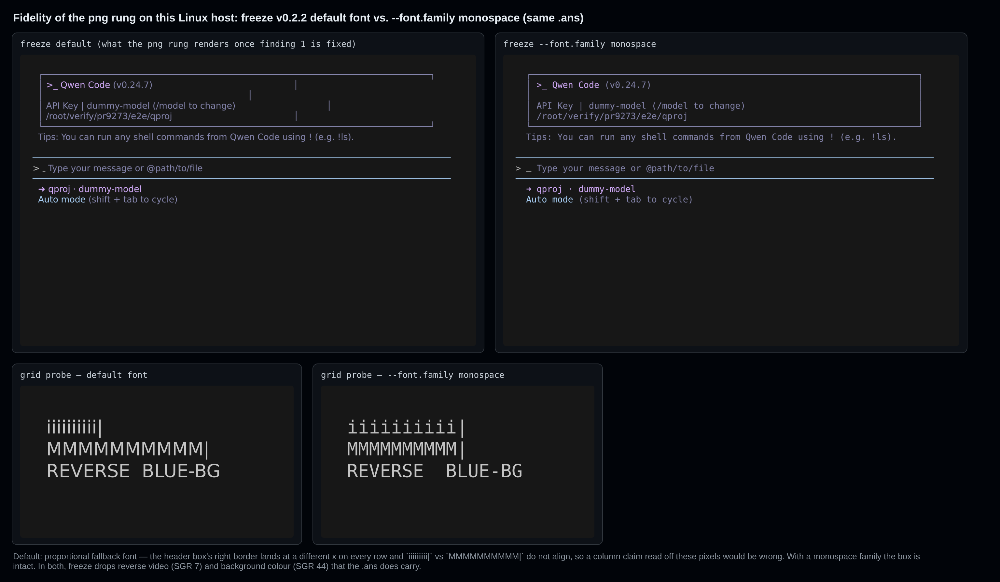
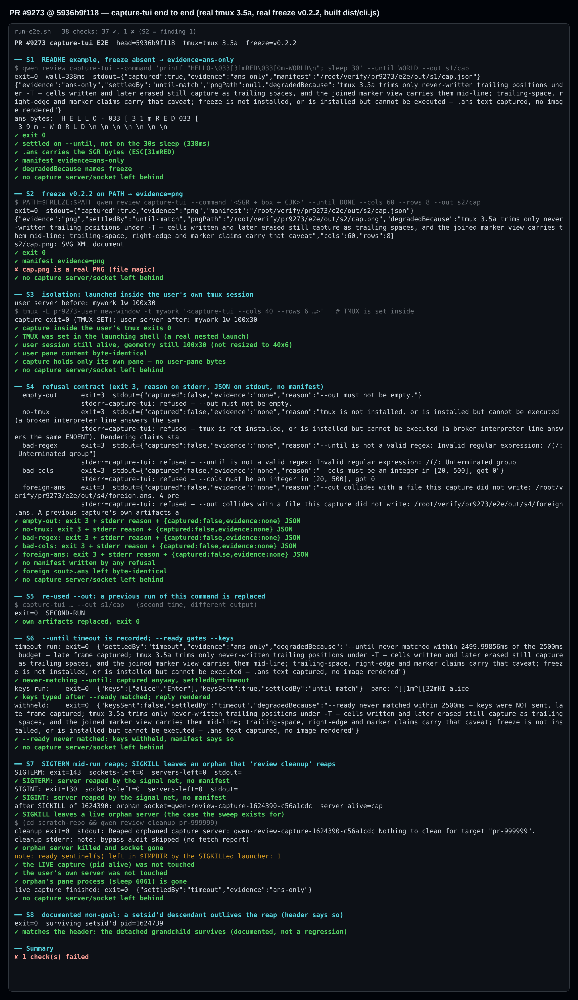
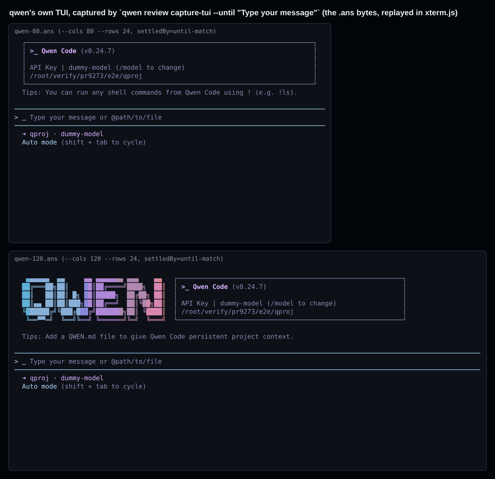

## 维护者验证 — PR #9273 @ `5936b9f118`（真实 tmux + 真实 freeze，构建产物 CLI）

**结论：暂不宜按现状合入。有一个阻断缺陷，它的一行修复我已验证。** 只要装了真实的 `freeze`，`png` 证据档位实际写出的就是 **SVG** 文件。其余我端到端跑过的行为都与文件头契约一致：tmux 隔离、拒绝契约、`--until`/`--ready`/`--keys`、信号回收，以及 `review cleanup` 的孤儿清扫。另外建议合入前修一处测试卫生问题：有四个测试夹具会以不安全权限创建宿主真实的 tmux socket 目录。第 25 轮把它按 fails-closed 延后了，但它实际会让真实 tmux 不可用。

### 环境

- PR head `5936b9f1185319be5ac9213fffb4fccb1ecc09c2`，全新 worktree。`pnpm install --frozen-lockfile`、`npm run build`、`npm run bundle` 均 exit 0，所有运行都用构建出的 `dist/cli.js`。
- Debian 13（Linux 6.12），Node 22.22.2，**tmux 3.5a**，以及 **freeze v0.2.2** 官方发布二进制（即 PR 描述里写的版本）。
- 与当前 `main` `eb0b79c5b8` 可干净合并（`git merge-tree`；main 新增的 9 个提交与本 PR 无文件重叠）。
- 本 head 的 CI：跑了的 lane 全绿；macOS、Windows 测试 lane 被**跳过**。

### 发现

| # | 级别 | 内容 | 修复已验证？ |
| --- | --- | --- | --- |
| 1 | **阻断** | 用真实 `freeze` 时，manifest 写着 `evidence: "png"`，`<out>.png` 实为 **SVG XML**，而且会被仓库自己的发布闸门拒收 | ✅ 一行；`capture-tui` 套件结果不变（178 ✔ / 4 skip） |
| 2 | 建议合入前修（仅测试） | 四个夹具以 0755 创建宿主**真实**的 `/tmp/tmux-<uid>`。之后真实 tmux（包括开发者自己的）会拒绝该目录，并连锁导致后续 67 个测试失败。第 25 轮把它按 *fails-closed* 延后了，但实测并非如此 | ✅ 四处 `mkdir -p -m 700`；329 过 / 1 跳 |
| 3 | 建议 | 本 Linux 主机上 freeze 默认字体是比例字体，PNG 里的列对不齐；freeze 还会丢掉反色和背景色 | ✅ `--font.family monospace` 恢复对齐 |
| 4 | 细节 | 被 SIGKILL 的启动进程会在 `$TMPDIR` 留下零字节的 `qwen-capture-ready-<pid>-<nonce>`，`review cleanup` 不清它 | — |

既有报告核对：我对照了全部 447 条行内评论、281 个 review 和 34 条 issue 评论，也包括本次验证进行中于 14:56 UTC 发布的第 25 轮 `/review`。

- **第 1、3、4 条：** 没有找到既有报告。第 25 轮延后列表省略了 14 条，所以我只能对可见条目负责。
- **第 2 条**就是第 25 轮延后项 `capture-tui.test.ts:1317`（"Four new probe-seam fixtures create the host's **real**…"），也是 takeover 评论风险表里的 "base-alias test fixture" 一行。两处都评为 fails-closed。**这里新增的是执行证据：它并非 fails-closed**，并附上四处都已验证的修复。

---

#### 1. 阻断：用真实 freeze 时，`png` 档位产出的是 SVG 文件



- **根因。** freeze v0.2.2 **按 `--output` 扩展名选择输出格式**（`freeze --help`："Output location for .svg, .png, or .webp"），其他扩展名一律输出 SVG。自 `d2a57afb82`（2026-08-18，修 R5-2 符号链接竞态的"暂存渲染"提交）起，`capture-tui.ts:2208` 渲染到 `` `${pngPath}.render-${renderNonce}` ``。它的扩展名是 `.render-<hex>`，于是 freeze 写出 SVG；随后这个 SVG 被 `rename()` 到 `<out>.png`，并被记为 `png` 档位。
- **影响。**
  - 只要主机装了 freeze，每一次采集都会这样；格式选择与平台无关。
  - manifest 对自身证据档位的陈述是错的，而这恰恰是本 PR 要保证的性质。
  - 文档描述的流水线在下一步就断了：`review/lib/assets.ts` 的 `validateAssetContent('cap.png', …)` 返回 `{"ok":false,"reason":"content is not a recognized image but the extension claims png — evidence is admitted by content, not by name"}`，也就是 `publish-assets` 会拒收 `capture-tui` 刚认证过的文件。
  - PR 描述 "Tested on" 表里 macOS + freeze 0.2.2 的结果最初写于 2026-08-16，比 `d2a57afb82` 早两天。
- **为什么测试套件看不到。** 所有假 freeze 都是 `printf 'PNG-BYTES' > "$5"`，不看扩展名。打上修复后套件仍是 `178 passed | 4 skipped`，与 head 相同，说明没有任何测试钉住输出格式。
- **修复（已验证）。**

  ```diff
  -    const pngStage = `${pngPath}.render-${renderNonce}`;
  +    const pngStage = `${pngPath}.render-${renderNonce}.png`;
  ```

  重新构建后 `file cap.png` 显示 `PNG image data, …`；改回 head 又复现 `SVG XML document`（负对照）。之后 worktree 是干净的。
- **建议加钉。** 两种做法，任一都能让回归变红：
  - 让某个假 freeze 按扩展名行事（仅当 `$5` 以 `.png` 结尾时才写 PNG 魔数）。
  - 在记档前用现有的 `sniffImageFormat` 嗅探渲染结果，不是 `png` 就降级为 `ans-only`。这样也能防住 freeze 将来的行为变化。

#### 2. 建议合入前修（仅测试）：四个夹具以 0755 创建真实的 `/tmp/tmux-<uid>`——实际并非 fails-closed



- **位置。** 四个假 tmux 脚本用默认 umask 对**真实** socket 目录执行 `mkdir -p`：
  - `capture-tui.test.ts:800`：`"${TMUX_TMPDIR}/tmux-$(id -u)"`，并在 `:822` 设置 `TMUX_TMPDIR='/tmp/'`（"visits a base once…"）。
  - `:971` 与 `:1064`：`"/tmp/tmux-$(id -u)"`。
  - `:1321`：`/tmp/tmux-${uid}`。
- **后果。** 在该目录尚不存在的主机上（全新容器、CI 机器，或开机后还没用过 tmux），**四个夹具中任一个单独运行**，都会把**真实**的 socket 目录建成 `drwxr-xr-x`。此后该 uid 的所有真实 tmux 都会报 `directory /tmp/tmux-1000 has unsafe permissions`（exit 1）。这也包括开发者本地跑完测试后自己的 `tmux`，直到手动删除或 chmod 该目录。
- **以非 root 实测。** 我用 user namespace（uid 0 → 1000，无 capability）运行，这同时也解除了三个 uid-0 门控的跳过。
  - 开始时目录不存在、跑整个文件：**67 failed | 262 passed | 1 skipped**，全部是这个"不安全权限"拒绝。按文件顺序，第一个建目录的夹具（`:800`）之前 0 个失败，之后 67 个。
  - 目录由真实 tmux 预先以 0700 创建：**329 passed | 1 skipped**。
  - CI 是绿的，推测是因为在 CI 上跑到这个测试时目录已经存在；"目录不存在"这种情形从未被覆盖到。
- **修复（已验证）。** 四处都改为 `mkdir -p -m 700 …`。
  - 每个夹具单独运行后，目录都是 `drwx------`。
  - 三个套件在"开始时目录不存在"的条件下跑出 **329 passed | 1 skipped**。
  - mkdtemp 目录下的同类写法（`:883`、`:1156`、`:1412`、`:1622`）没有危害。
  - 候选 diff 见 `harness/candidate-fix-f2.diff`。



#### 3. 建议：本 Linux 主机上 PNG 档位的列位置不可信



- **字体。** freeze 在 SVG 里嵌了 JetBrains Mono，但在本主机上光栅化出的 PNG 用的是**比例字体**。我在 80 列采集的 qwen 自身 TUI 上实测：头部框的右边框在每一行的 x 坐标都不同。如果照 brief 里"右边框在第 83 列"那种方式从这张图"引用像素"下结论，就会报出一个 `.ans` 里根本不存在的布局 bug。
  - 加上 `--font.family monospace`（通用字体族，不需要字体文件）即可恢复对齐，我在同一份 `.ans` 上验证过。
  - 在 `freezePlan` 里加这个参数成本很低。
- **颜色。** 两种渲染里 freeze 都丢掉了反色（SGR 7）和背景色（SGR 44），尽管 `.ans` 里都有。Ink 用反色表示光标和选中项，所以涉及高亮的结论无法靠 PNG 判定。这条注意事项最好写进 `degradedBecause` 或 brief。

#### 4. 细节：SIGKILL 后遗留 ready 哨兵文件

对启动进程 `kill -9` 之后，`review cleanup` 能正确回收孤儿 server、socket 和 pane 进程，但 `$TMPDIR` 里零字节的 `qwen-capture-ready-<pid>-<nonce>` 会留下。清扫时可以顺手删掉 `qwen-capture-ready-<已死pid>-*`。

---

### 验证通过的部分



共 38 项检查，37 ✔；唯一的 ✘ 是 S2，即发现 1。

| 场景 | 结果 |
| --- | --- |
| **S1** PR 描述自带示例，无 freeze | 约 340 ms 内 exit 0（按 `--until` 收敛，而不是等 `sleep 30`）。`.ans` 含 `ESC[31mRED`；manifest 为 `ans-only`，`degradedBecause` 点名 freeze。无 server/socket 残留 |
| **S3** 隔离：**在用户自己的 tmux 会话内**启动（`$TMUX` 已设置） | 用户会话仍存活，尺寸仍是 100x30（没被改成 40x6），pane 字节完全一致；采集结果只有自己的 pane |
| **S4** 拒绝契约 | `--out ''`、PATH 上无 tmux、`--until '('`、`--cols 0`、已存在他人的 `<out>.ans`，都是 exit 3 + stderr 原因 + `{"captured":false,"evidence":"none",…}`，且不写 manifest；他人的文件之后字节不变 |
| **S5** 复用 `--out` | 替换上一次本命令自己的产物，exit 0 |
| **S6** `--until` 超时；`--ready` + `--keys` | 超时：照样采集，`settledBy:"timeout"` 并记录原因。按键：只在 `NAME?` 渲染出来后才输入，采到了 `HI-alice` 回显。`--ready` 一直不匹配时 `keysSent:false`，按键被扣下 |
| **S7** 信号与孤儿 | SIGTERM 得 exit 143、SIGINT 得 exit 130，各自都回收了 server 且不写 manifest。SIGKILL 后留下存活的孤儿；`review cleanup pr-…` 打印 "Reaped orphaned capture server: …"，server pid、pane 进程和 socket 都没了。同时**存活**的另一采集和用户自己的 server 均未受影响，第二次 `cleanup` 无事可做 |
| **S8** 文档声明的非目标 | `setsid` 出去的孙进程在回收后仍存活，与文件头说明一致 |

真实产品采集：用 `--until "Type your message"` 在 80 列和 120 列下采集了 qwen 自身的 TUI（`node dist/cli.js`，假 key，隔离 HOME）。两次都以 `until-match` 收敛，没有遗留 server。`.ans` 在 xterm.js 中能如实重放：



**单元测试（本地，head）。**

- root 下，PR 改动的 6 个 CLI 套件为 **775 passed | 4 skipped**。其中 3 个跳过是 uid-0 门控，1 个需要会补齐空格的 tmux（3.1–3.2）。
- 非 root、socket 目录已存在时，`capture-tui` + `cleanup` + `tui-capture` 为 **329 passed | 1 skipped**，三个 uid-0 门控的拒绝测试都跑了并通过。
- CI 的 Linux Test lane 确实跑了真实 tmux 用例（`capture-tui.test.ts 181 ✅ 1 ⚪`），这回答了 stage-3 triage 的疑问。

### 未验证

- macOS 和 Windows：CI 这两个测试 lane 被跳过，我也只测了 Linux。
- tmux 3.1–3.2 补空格分支：本机是 tmux 3.5a。
- 同 uid 主动对手模型：这是文件头声明的非目标。

### 复现

harness 脚本、记录和候选 diff 都在 assets 分支的 [`pr-9273/`](.) 目录：

- `harness/run-e2e.sh` 跑 S1–S8。
- `harness/finding1.sh`、`harness/finding2.sh`、`harness/finding2b.sh` 复现各条发现。
- `harness/render.cjs` 渲染图片。
