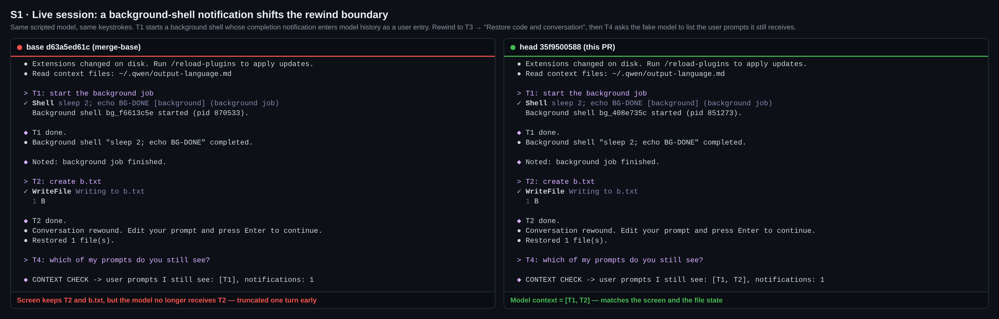
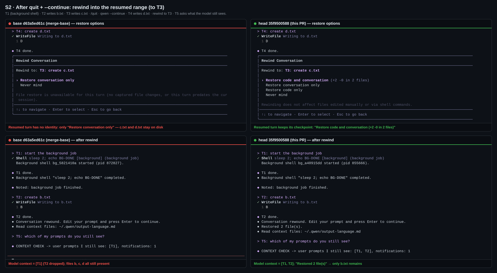
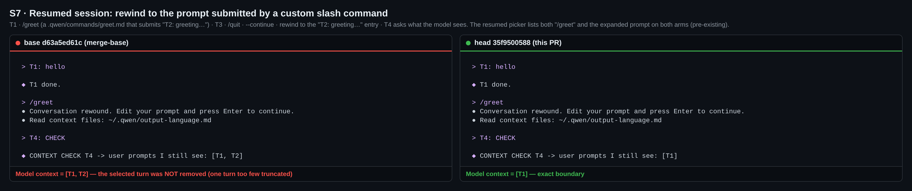
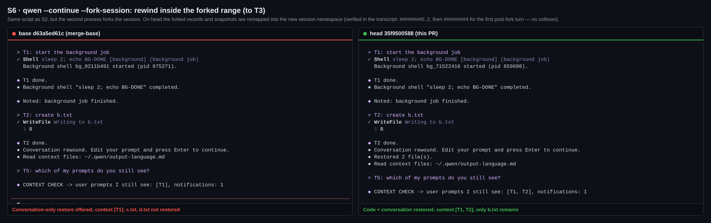
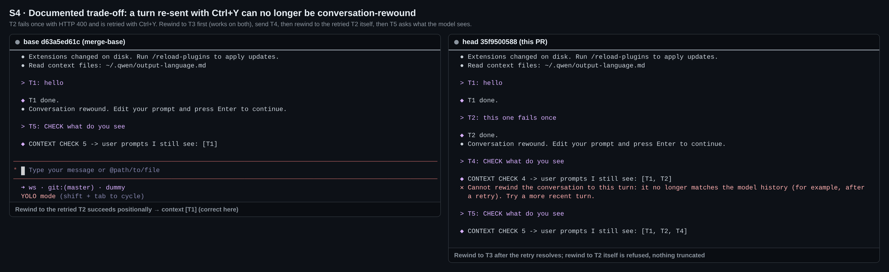
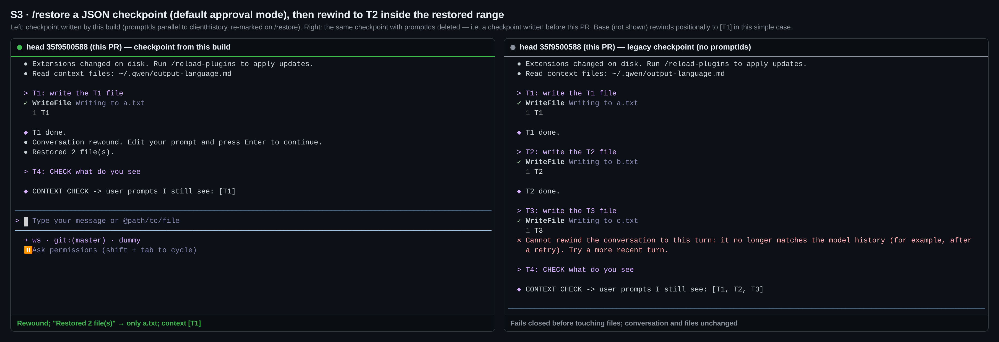

## Maintainer verification (round 2) — real TUI A/B on Linux at `35f9500588`

**Verdict: merge-ready from my side.** On a real terminal, head fixes four user-visible rewind defects on `main`. I found no regression in the paths it touches. The two behaviour changes the PR already documents (a Ctrl+Y-retried turn, and checkpoints written before this PR) both fail closed before touching anything. I measured both below so the sign-off the triage deferral asked for can be made on data. One optional test-only patch (+62/−1) closes three coverage holes the mutation pass found. None of them is a production defect.

<sub>Round 1 (2026-08-24, head `2755034d`, [comment](https://github.com/QwenLM/qwen-code/pull/9466#issuecomment-5394148067)) is superseded. That head is gone, and this round rebuilds everything at the current head and on a local merge with today's `main`.</sub>

### What I ran

- **Two arms built from source**: base = merge-base `d63a5ed61c`, head = `35f9500588`. Each arm ran `pnpm install --frozen-lockfile`, `npm run build` and `npm run bundle`, all exit 0. A third arm is a local merge of head with current `main` `2f5a62e6ab` (35 commits ahead).
- **Real TUI**: `dist/cli.js` runs under node-pty inside headless-Chromium xterm.js (the repo's `integration-tests/terminal-capture`), with an isolated `HOME` per run and identical keystrokes on both arms. Double-`Esc` opens the real rewind picker.
- **Scripted OpenAI-compatible model** that records every request. The `CONTEXT CHECK` line on screen is computed by the fake from the request body it actually received after the rewind. So it shows the **model-facing history**, not a UI rendering.
- Every A/B cell in S1–S6 ran **twice** (2/2 identical), and S7 ran twice too. S1, S2 and S4 were re-run on the **PR + `main` merge** build with identical results.

### Scenario matrix

| # | Scenario (same script on both arms) | base `d63a5ed61c` | head `35f9500588` |
|---|---|---|---|
| S1 | Live: T1 starts a background shell (its `<task-notification>` enters model history as a `user` entry) · T2 writes `b.txt` · T3 writes `c.txt` · rewind to T3 → *Restore code and conversation* | ❌ files correct, but model context = **`[T1]`**. T2 is silently dropped while the screen still shows it | ✅ `[T1, T2]` |
| S2 | Same, then `/quit` → `qwen --continue` → T4 writes `d.txt` → rewind to T3 (inside the resumed range) | ❌ only *Restore conversation only* is offered, so `c.txt`/`d.txt` stay on disk. Context `[T1]` | ✅ *Restore code and conversation (+2 −0 in 2 files)*. Only `b.txt` remains. `[T1, T2]` |
| S6 | Same as S2 via `qwen --continue --fork-session` | ❌ same as base S2 | ✅ same as head S2. Forked records/snapshots were remapped to `<new>########0..2`, and the first post-fork turn minted `########4` (no collision; snapshot keys match record ids) |
| S7 | Resumed session: rewind to the prompt a custom command (`.qwen/commands/greet.md`) submitted | ❌ context `[T1, T2]`: the selected turn is **not** removed | ✅ `[T1]` |
| S7L | Live session, same custom command, rewind to `/greet` | ✅ `[T1]` | ✅ `[T1]` (no false refusal) |
| S8 | Resumed `@README.md` turn → rewind to it | ✅ `[T1]` | ✅ `[T1]` |
| S5 | `/compress` (summarizing) between T2 and T3 · rewind to T1 · rewind to T4 · quit · resume · rewind to T5 | ✅ "compressed" refusal · `[summary, T3]` · `[summary, T3]` | ✅ identical, and the refusal text still says "compressed" |
| S11 | Soft-tier auto-compaction fires while T3 is sent · quit · resume | ✅ T3's question survives resume | ✅ identical. The compression record now also carries `promptIds: [null, null, …########2]` |
| S3 | Default approval mode, `/restore` the T3 JSON checkpoint → rewind to T2 | ✅ `[T1]`, only `a.txt` | ✅ `[T1]`, only `a.txt`. The checkpoint JSON carries `promptIds` (11 entries, parallel to `clientHistory`; ids at the three user-prompt slots 1/5/9) |
| S3′ | Same checkpoint with `promptIds` deleted (= written before this PR) | — | ⚠️ `/restore` still restores files. Conversation rewind is **refused before any file is touched**, and conversation and files stay unchanged (documented) |
| S4 | T2 fails once (HTTP 400) → Ctrl+Y → T3 · rewind to T3 · then rewind to the retried T2 | ✅ `[T1, T2]` · ✅ `[T1]` | ✅ `[T1, T2]` · ⚠️ T2 **refused** ("no longer matches the model history (for example, after a retry)"), nothing truncated (documented) |
| S10 | Session **written by base**, resumed by head, rewind to T3 | — | Behaves exactly like base (conversation-only, `[T1]`) |

S10 is the data point for the open R49-1 ruling. Turns without a persisted identity keep `main`'s positional behaviour **unchanged**; head does not make them worse, and new turns in such a session get identities. So the residual risk is "pre-upgrade sessions are not retro-fixed", which is what deferring to #9437 means. It is not a regression.

### Evidence







<details>
<summary>More figures: S6 fork-session, S4 retry trade-off, S3 checkpoint trade-off</summary>







</details>

### The two documented trade-offs, measured

1. **Ctrl+Y-retried turn (S4).** Only the retried turn itself is affected. Turns after it resolve normally, and the refusal truncates nothing. Base handled this case correctly. The cause is that `SendMessageType.Retry` is deliberately sent unmarked (`client.ts`), while the UI item keeps its id. **Possible follow-up (non-blocking):** carry the failed turn's identity into the retry send. The failed attempt's entry is already stripped before the retry (the model history held exactly one T2 afterwards), so a re-marked entry would still be unique.
2. **Checkpoints written before this PR (S3′).** `/restore` file restore still works. Only conversation rewind *inside the restored range* is refused, and only for checkpoints created before upgrading. Nit: the refusal text says "for example, after a retry", which is slightly misleading for this cause, but it is not blocking.

### Mutation check (31 hand mutants over the production diff)

- **27/31 killed by the existing suites.** M28 (API-side duplicate mark resolves to the first match) is killed only **cross-package**: the cli `historyMapping` duplicate-identity test catches it once core `dist` is rebuilt with the mutant. I restored core `dist` afterwards and it is byte-identical by sha256.
- 4 survivors:

| Mutant | Surviving change | Status |
|---|---|---|
| M07 | checkpoint writer (`use-llm-stream.ts`) stops emitting `promptIds` | No unit test (disclosed in the PR). Covered end-to-end: S3 inspects the written JSON, and S3′ is exactly the runtime effect of this mutant |
| M09 | resumed `@`-command turn loses `promptId` (`resumeHistoryUtils.ts`, at-command branch) | Killed by the patch below |
| M15 | stacked-skill invocation item not stamped (`slashCommandProcessor.ts`, first `updateItem` site) | Killed by the patch below |
| M27 | resume from a compression snapshot no longer re-marks from `promptIds` (`session-api-history.ts`) | Killed by the patch below. **The existing llm-chat "round-trip" test is vacuous for this line.** It hands the live Symbol-marked objects to `buildApiHistoryFromConversation`, and `copyContentForApiHistory` spreads `{...content}`, which copies own Symbol keys. The real JSONL boundary drops them. The fix is to pass the payload through `JSON.parse(JSON.stringify(…))` |

<details>
<summary>Optional test-only patch (+62/−1, 3 files) — each test passes on head and fails on its mutant; prettier + eslint clean</summary>

Full patch: [`pin-tests.patch`](data/pin-tests.patch). Head: cli 198/198 and core 535/535 on the touched files. With the mutants: M09 1 fail, M15 1 fail, M27 1 fail.

```diff
--- a/packages/core/src/core/llm-chat.test.ts
+++ b/packages/core/src/core/llm-chat.test.ts
-            systemPayload: { ...recordPayload, promptIds },
+            // Persisted records cross JSON, which drops the Symbol-keyed
+            // mark; the resume builder must re-mark from promptIds.
+            systemPayload: JSON.parse(
+              JSON.stringify({ ...recordPayload, promptIds }),
+            ),
```

The patch also adds `resumeHistoryUtils.test.ts › attaches the recorded prompt identity to an @-command turn` (an `at_command` record followed by a user record carrying `promptId: 's########4'`) and `slashCommandProcessor.test.ts › echoes the minted prompt id onto a stacked-skill invocation item`.

</details>

### Gates

- Head, the 20 test files this PR touches: **3527/3527** (core 8 files, 1567; cli 12 files, 1960). PR + `main` merge: **3545/3545**.
- `npm run typecheck` exit 0 on head and on the merge. `eslint --max-warnings 0` on all 48 changed files: 0. `prettier --check`: clean.
- The merge with `main` is textually clean. 7 files overlap with main's new commits. I checked the positional `recordUserMessage(…, promptPayload, promptId, daemonPromptId)` insertion in the merged tree, and all three non-test callers pass the arguments in the right order.

### Not covered

macOS and Windows. ACP/IDE rewind end-to-end (unit only: `Session.test.ts` 1072 tests; M16 is killed by 25 of them). OpenTUI (no rewind surface in this PR). Hard-tier auto-compaction end-to-end: with synthetic usage both arms fail compression as inflated, so this change is pinned only by M18's unit kill. A real provider: the fake is sufficient here because the behaviour under test is the client's own history bookkeeping, and the fake reports exactly what the client sends.

### Pre-existing, out of scope (same on both arms)

- `/branch` in the interactive TUI is always refused with "Cannot branch while a response or tool call is in progress…", even in an idle one-turn session. The PR notes it as unchanged, and I found no tracking issue. That is why the fork path above was driven through `--fork-session`.
- After resume, the rewind picker lists a custom command twice: `/greet` and its expanded prompt.

Evidence (scripts, per-run `result.json`, mutation results, patch): this directory (`harness/`, `data/`)
